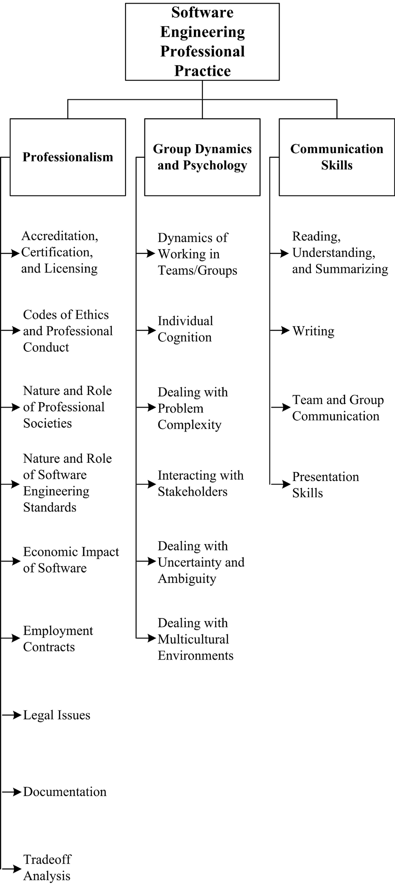

## Chapter 11: Software Engineering: Professional Practice

**Acronyms**

- ACM Association for Computing Machinery
- BCS British Computer Society
- CSDA Certified Software Development Associate
- CSDP Certified Software Development Professional
- IEC International Electrotechnical Commission IEEE CS IEEE Computer
  SocietyIFIP International. Federation for Information Processing IP
  Intellectual Property
- ISO International Organization for Standardization N DA Non-Disclosure
  Agreement
- WIPO World Intellectual Property Organization
- WTO World Trade Organization

**Introduction**

The Software Engineering Professional Practice knowledge area (KA) is
concerned with the knowledge, skills, and attitudes that software engineers
must possess to practice software engineering in a professional, responsible,
and ethical manner. Because of the widespread applications of software
products in social and personal life, the quality of software products can have
profound impact on our personal well-being and societal harmony. Software
engineers must handle unique engineering problems, producing software with
known characteristics and reliability. This requirement calls for software
engineers who possess a proper set of knowledge, skills, training, and
experience in professional practice.

The term “professional practice” refers to a way of conducting services so as
to achieve certain standards or criteria in both the process of performing a
service and the end product resulting from the service. These standards and
criteria can include both technical and nontechnical aspects. The concept of
professional practice can be viewed as being more applicable within those
professions that have a generally accepted body of knowledge; codes of ethics
and professional conduct with penalties for violations; accepted processes for
accreditation, certification, and licensing; and professional societies to
provide and administer all of these. Admission to these professional societies
is often predicated on a prescribed combination of education and experience.

A software engineer maintains a professional practice by performing all work in
accordance with generally accepted practices, standards, and guidelines notably
set forth by the applicable pro- fessional society. For example, the
Association for Computing Machinery (ACM) and IEEE Computer Society (IEEE CS)
have established a Software Engineering Code of Ethics and Professional
Practice. Both the British Computer Society (BCS) and the International
Federation for Information Processing (IFIP) have established similar
professional practice standards. ISO/IEC and IEEE have further provided
internationally accepted software engineering standards (see Appendix B of this
Guide ). IEEE CS has established two international certification programs
(CSDA, CSDP) and a corresponding Guide to the Software Engineering Body of
Knowledge ( SWEBOK Guide ). All of these are elements that lay the foundation
for of the professional practice of software engineering.

**Breakdown Of Topics For Software Engineering Professional Practice**

The Software Engineering Professional Practice KA’s breakdown of topics is
shown in Figure 11.1. The subareas presented in this KA are professionalism,
group dynamics and psychology, and communication skills.

### 1. Professionalism

A software engineer displays professionalism notably through adherence to codes
of ethics and professional conduct and to standards and practices that are
established by the engineer’s professional community.

The professional community is often represented by one or more professional
societies; those societies publish codes of ethics and professional conduct
as well as criteria for admittance to the community. Those criteria form the
basis for accreditation and licensing activities and may be used as a measure
to determine engineering competence or negligence.

#### 1.1. Accreditation, Certification, and Licensing

<!-- [1*, c1s4.1, c1s5.1–c1s5.4] -->

##### 1.1.1. Accreditation

Accreditation is a process to certify the competency, authority, or
credibility of an organization. Accredited schools or programs are assured to
adhere to particular standards and maintain certain qualities. In many
countries, the basic means by which engineers acquire knowledge is through
completion of an accredited course of study. Often, engineering accreditation
is performed by a government organization, such as the ministry of education.
Such countries with government accreditations include China, France, Germany,
Israel, Italy, and Russia.

In other countries, however, the accreditation process is independent of
government and performed by private membership associations. For example, in
the United States, engineering accreditation is performed by an organiza-
tion known as ABET. An organization known as CSAB serving as a participating
body of ABET is the lead society within ABET for the accreditation of degree
programs in software engineering.

While the process of accreditation may be different for each country and
jurisdiction, the general meaning is the same. For an institution’s course of
study to be accredited means that “the accreditation body recognizes an
educational institution as maintaining standards that qualify the graduates for
admission to higher or more specialized institutions or for professional
practice” [2].

##### 1.1.2. Certification

Certification refers to the confirmation of a person’s particular
characteristics. A common type of certification is professional certification,
where a person is certified as being able to complete an activity in a certain
discipline at a stated level of competency. Professional certification also can
also verify the holder’s ability to meet professional standards and to apply
professional judgment in solving or addressing problems. Professional
certification can also involve the verification of prescribed knowledge, the
mastering of best practice and proven methodologies, and the amount of
professional experience.

An engineer usually obtains certification by passing an examination in
conjunction with other experience-based criteria. These examinations are often
administered by nongovernmental organizations, such as professional societies.

In software engineering, certification testifies to one’s qualification as a
software engineer. For example, the IEEE CS has enacted two certification
programs (CSDA and CSDP) designed to confirm a software engineer’s knowledge of
standard software engineering practices and to advance one’s career. A lack of
certification does not exclude the individual from working as a software
engineer. Currently certification in software engineering is completely
voluntary. In fact, most software engineers are not certified under any
program.

##### 1.1.3. Licensing

“Licensing” is the action of giving a person the authorization to perform
certain kinds of activities and take responsibility for resultant engineer-
ing products. The noun “license” refers to both that authorization and the
document recording that authorization. Governmental authorities or statutory
bodies usually issue licenses.

Obtaining a license to practice requires not only that an individual meets a
certain standard, but also that they do so with a certain ability to practice
or operate. Sometimes there is an entry-level requirement which sets the
minimum skills and capabilities to practice, but as the professional moves
through his or her career, the required skills and capabilities change and
evolve.

In general, engineers are licensed as a means of protecting the public from
unqualified individuals. In some countries, no one can practice as a pro-
fessional engineer unless licensed; or further, no company may offer
“engineering services” unless at least one licensed engineer is employed there.

#### 1.2. Codes of Ethics and Professional Conduct

<!-- [1*, c1s6–c1s9] [3*, c8] [4*, c1s2] [5*, c33] [6] -->

Codes of ethics and professional conduct comprise the values and behavior
that an engineer’s professional practice and decisions should embody.

The professional community establishes codes of ethics and professional
conduct. They exist in the context of, and are adjusted to agree with, societal
norms and local laws. Therefore, codes of ethics and professional conduct
present guidance in the face of conflicting imperatives.

Once established, codes of ethics and professional conduct are enforced by the
profession, as represented by professional societies or by a statutory body.

Violations may be acts of commission, such as concealing inadequate work,
disclosing confidential information, falsifying information, or
misrepresenting one’s abilities. They may also occur through omission,
including failure to disclose risks or to provide important information,
failure to give proper credit or to acknowledge references, and failure to
represent client interests. Violations of codes of ethics and professional
conduct may result in penalties and possible expulsion from professional
status.

A code of ethics and professional conduct for software engineering was approved
by the ACM Council and the IEEE CS Board of Governors in 1999 [6]. According to
the short version of this code:

> Software engineers shall commit themselves to making the analysis,
> specification, design, development, testing and maintenance of software a
> beneficial and respected profession. In accordance with their commitment to
> the health, safety and welfare of the public, software engineers shall adhere
> to the eight principles concerning the public, client and employer, product,
> judgment, management, profession, colleagues, and self, respectively.

Since standards and codes of ethics and professional conduct may be
introduced, modified, or replaced at any time, individual software engineers
bear the responsibility for their own continuing study to stay current in
their professional practice.

#### 1.3. Nature and Role of Professional Societies

<!-- [1*, c1s1–c1s2] [4*, c1s2] [5*, c35s1] -->

Professional societies are comprised of a mix of practitioners and academics.
These societies serve to define, advance, and regulate their corresponding
professions. Professional societies help to establish professional standards as
well as codes of ethics and professional conduct. For this reason, they also
engage in related activities, which include

- establishing and promulgating a body of generally accepted knowledge;
- accrediting, certifying, and licensing;
- dispensing disciplinary actions;
- advancing the profession through conferences, training, and publications.

Participation in professional societies assists the individual engineer in
maintaining and sharpening their professional knowledge and relevancy and in
expanding and maintaining their professional network.

#### 1.4. Nature and Role of Software Engineering Standards

<!-- [1*, c5s3.2, c10s2.1] [5*, c32s6] [7*, c1s2] -->

Software engineering standards cover a remarkable variety of topics. They
provide guidelines for the practice of software engineering and processes to be
used during development, maintenance, and support of software. By establishing
a consensual body of knowledge and experience, software engineering standards
establish a basis upon which further guidelines may be developed. Appendix B
of this Guide provides guidance on IEEE and ISO/ IEC software engineering
standards that support the knowledge areas of this Guide.

The benefits of software engineering standards are many and include improving
software quality, helping avoid errors, protecting both software producers and
users, increasing professional discipline, and helping technology transition.

#### 1.5. Economic Impact of Software

[3*, c10s8] [4*, c1s1.1] [8*, c1]

Software has economic effects at the individual, business, and societal levels.
Software “success” may be determined by the suitability of a product for a
recognized problem as well as by its effectiveness when applied to that
problem.

At the individual level, an engineer’s continuing employment may depend on
their ability and willingness to interpret and execute tasks in meeting
customers’ or employers’ needs and expectations. The customer or employer’s
financial situation may in turn be positively or negatively affected by the
purchase of software.

At the business level, software properly applied to a problem can eliminate
months of work and translate to elevated profits or more effective
organizations. Moreover, organizations that acquire or provide successful
software may be a boon to the society in which they operate by pro- viding both
employment and improved services. However, the development or acquisition costs
of software can also equate to those of any major acquisition.

At the societal level, direct impacts of software success or failure include or
exclude accidents, interruptions, and loss of service. Indirect impacts include
the success or failure of the organization that acquired or produced the
software, increased or decreased societal productivity, harmonious or
disruptive social order, and even the saving or loss of property and life.

#### 1.6. Employment Contracts

<!-- [1*, c7] -->

Software engineering services may be provided under a variety of
client-engineer relationships. The software engineering work may be solicited
as company-to-customer supplier, engineer-to-customer consultancy, direct hire,
or even volunteering. In all of these situations, the customer and supplier
agree that a product or service will be provided in return for some sort of
consideration. Here, we are most concerned with the engineer-to-customer
arrangement and its attendant agreements or contracts, whether they are of the
direct-hire or consultant variety, and the issues they typically address.

A common concern in software engineering contracts is confidentiality.
Employers derive commercial advantage from intellectual property, so they
strive to protect that property from disclosure. Therefore, software
engineers are often required to sign non-disclosure (NDA) or intellectual
property (IP) agreements as a precondition to work. These agreements
typically apply to information the software engineer could only gain through
association with the customer. The terms of these agreements may extend past
termination of the association.

Another concern is IP ownership. Rights to software engineering
assets-products, innovations, inventions, discoveries, and ideas - may reside
with the employer or customer, either under explicit contract terms or relevant
laws, if those assets are obtained during the term of the software engineer’s
relationship with that employer or customer. Contracts differ in the ownership
of assets created using non-employer-owned equipment or information.

Finally, contracts can also specify among other elements the location at which
work is to be performed; standards to which that work will be held; the system
configuration to be used for development; limitations of the software engi-
neer’s and employer’s liability; a communication matrix and/or escalation plan;
and administrative details such as rates, frequency of compensation, working
hours, and working conditions.

#### 1.7. Legal Issues

<!-- [1*, c6, c11] [3*, c5s3–c5s4] [9*, c1s10] -->

Legal issues surrounding software engineering professional practice notably
include matters related to standards, trademarks, patents, copyrights, trade
secrets, professional liability, legal requirements, trade compliance, and
cybercrime. It is therefore beneficial to possess knowledge of these issues and
their applicability.

Legal issues are jurisdictionally based; software engineers must consult
attorneys who specialize in the type and jurisdiction of any identified legal
issues.

##### 1.7.1. Standards

Software engineering standards establish guidelines for generally accepted
practices and minimum requirements for products and services provided by a
software engineer. Appendix B of this _Guide_ provides guidance on software
engineering standards that are applicable to each KA.

Standards are valuable sources of requirements and assistance during the
everyday conduct of software engineering activities. Adherence to standards
facilitates discipline by enumerating minimal characteristics of products and
practice. That discipline helps to mitigate subconscious assumptions or
overconfidence in a design. For these reasons, organizations performing
software engineering activities often include conformance to standards as part
of their organizational policies. Further, adherence to standards is a major
component of defense from legal action or from allegations of malpractice.

##### 1.7.2. Trademarks

A trademark relates to any word, name, symbol, or device that is used in
business transactions. It is used “to indicate the source or origin of the
goods” [2].

Trademark protection protects names, logos, images, and packaging. However, if
a name, image, or other trademarked asset becomes a generic term, then
trademark protection is nullified.

The World Intellectual Property Organization (WIPO) is the authority that
frames the rules and regulations on trademarks. WIPO is the United Nations
agency dedicated to the use of intellectual property as a means of stimulating
innovation and creativity.

##### 1.7.3. Patents

Patents protect an inventor’s right to manufacture and sell an idea. A patent
consists of a set of exclusive rights granted by a sovereign government to an
individual, group of individuals, or organization for a limited period of time.
Patents are an old form of idea-ownership protection and
date back to the 15th century.

Application for a patent entails careful records of the process that led to the
invention. Patent attorneys are helpful in writing patent disclosure claims in
a manner most likely to protect the software engineer’s rights.

Note that, if inventions are made during the course of a software engineering
contract, ownership may belong to the employer or customer or be jointly held,
rather than belong to the software engineer.

There are rules concerning what is and is not patentable. In many countries,
software code is not patentable, although software algorithms may be. Existing
and filed patent applications can be searched at WIPO.

##### 1.7.4. Copyrights

Most governments in the world give exclusive rights of an original work to its
creator, usually for a limited time, enacted as a copyright. Copyrights
protect the way an idea is presented—not the idea itself. For example, they may
protect the particular wording of an account of an historical event, whereas
the event itself is not protected. Copyrights are long-term and renewable; they
date back to the 17th century.

##### 1.7.5. Trade Secrets

In many countries, an intellectual asset such as a formula, algorithm, process,
design, method, pattern, instrument, or compilation of information may be
considered a “trade secret,” provided that these assets are not generally known
and may provide a business some economic advantage.

The designation of “trade secret” provides legal protection if the asset is
stolen. This protection is not subject to a time limit. However, if another
party derives or discovers the same asset legally, then the asset is no longer
protected and the other party will also possess all rights to use it.

##### 1.7.6. Professional Liability

It is common for software engineers to be concerned with matters of
professional liability. As an individual provides services to a client or
employer, it is vital to adhere to standards and generally accepted practices,
thereby protecting against allegations or proceedings of or related to
malpractice, negligence, or incompetence.

For engineers, including software engineers, professional liability is related
to product liability. Under the laws and rules governing in their jurisdiction,
engineers may be held to account for failing to fully and conscientiously
follow recommended practice; this is known as “negligence.” They may also be
subject to laws governing “strict liability” and either implied or express
warranty, where, by selling the product, the engineer is held to warrant that
the product is both suitable and safe for use. In some countries (for example,
in the US), “privity” (the idea that one could only sue the person selling the
product) is no longer a defense against liability actions.

Legal suits for liability can be brought under tort law in the US allowing
anyone who is harmed to recover their loss even if no guarantees were made.
Because it is difficult to measure the suitability or safety of software,
failure to take due care can be used to prove negligence on the part of
software engineers. A defense against such an allegation is to show that
standards and generally accepted practices were followed in the development of
the product.

##### 1.7.7. Legal Requirements

Software engineers must operate within the confines of local, national, and
international legal frameworks. Therefore, software engineers must be aware of
legal requirements for

- registration and licensing - including examination, education, experience,
  and training requirements;
- contractual agreements;
- noncontractual legalities, such as those governing liability;
- Basic information on the international legal framework can be accessed from
  the World Trade Organization (WTO).

##### 1.7.8. Trade Compliance

All software professionals must be aware of legal restrictions on import,
export, or reexport of goods, services, and technology in the jurisdictions
in which they work. The considerations include export controls and
classification, transfer of goods, acquisition of necessary governmental
licenses for foreign use of hardware and software, services and technology by
sanctioned nation, enterprise or individual entities, and import restrictions
and duties. Trade experts should be consulted for detailed compliance guidance.

##### 1.7.9. Cybercrime

Cybercrime refers to any crime that involves a computer, computer software,
computer networks, or embedded software controlling a system. The computer
or software may have been used in the commission of a crime or it may have been
the target. This category of crime includes fraud, unauthorized access, spam,
obscene or offensive content, threats, harassment, theft of sensitive personal
data or trade secrets, and use of one computer to damage or infiltrate other
networked computers and automated system controls.

Computer and software users commit fraud by altering electronic data to
facilitate illegal activity. Forms of unauthorized access include hacking,
eavesdropping, and using computer systems in a way that is concealed from their
owners.

Many countries have separate laws to cover cybercrimes, but it has sometimes
been difficult to prosecute cybercrimes due to a lack of precisely framed
statutes. The software engineer has a professional obligation to consider the
threat of cybercrime and to understand how the software system will protect or
endanger software and user information from accidental or malicious access,
use, modification, destruction, or disclosure.

#### 1.8. Documentation

<!-- [1*, c10s5.8] [3*, c1s5] [5*, c32] -->

Providing clear, thorough, and accurate documentation is the responsibility
of each software engineer. The adequacy of documentation is judged by different
criteria based on the needs of the various stakeholder audiences.

Good documentation complies with accepted standards and guidelines. In
particular, software engineers should document

- relevant facts,
- significant risks and tradeoffs, and
- warnings of undesirable or dangerous consequences from use or misuse of the
  software.

Software engineers should avoid

- certifying or approving unacceptable products,
- disclosing confidential information, or
- falsifying facts or data.

In addition, software engineers and their managers should notably provide the
following documentation for use by other elements of the software
development organization:

- software requirements specifications, software design documents, details on
  the software engineering tools used, software test specifications and
  results, and details on the adopted software engineering methods;
- problems encountered during the development process.

For external stakeholders (customer, users, others) software documentation
should notably provide

- information needed to determine if the software is likely to meet the
  customer’s and users’ needs,
- description of the safe, and unsafe, use of the software,
- description of the protection of sensitive information created by or stored
  using the software, and
- clear identification of warnings and critical procedures.

Use of software may include installation, operation, administration, and
performance of other functions by various groups of users and support
personnel. If the customer will acquire ownership of the software source code
or the right to modify the code, the software engineer should provide
documentation of the functional specifications, the software design, the test
suite, and the necessary operating environment for the software. The minimum
length of time documents should be kept is the duration of the software
products’ life cycle or the time required by relevant organizational or
regulatory requirements.

#### 1.9. Tradeoff Analysis

<!-- [3*, c1s2, c10] [9*, c9s5.10] -->

Within the practice of software engineering, a software engineer often has to
choose between alternative problem solutions. The outcome of these choices is
determined by the software engineer’s professional evaluation of the risks,
costs, and benefits of alternatives, in cooperation with stakeholders. The
software engineer’s evaluation is called “tradeoff analysis.” Tradeoff analysis
notably enables the identification of competing and complementary software
requirements in order to prioritize the final set of requirements defining
the software to be constructed (see Requirements Negotiation in the Software
Requirements KA and Determination and Negotiation of Requirements in the
Software Engineering Management KA).

In the case of an ongoing software development project that is late or over
budget, tradeoff analysis is often conducted to decide which software
requirements can be relaxed or dropped given the effects thereof.

A first step in a tradeoff analysis is establishing design goals (see
Engineering Design in the Engineering Foundations KA) and setting the relative
importance of those goals. This permits identification of the solution that
most nearly meets those goals; this means that the way the goals are stated is
critically important.

Design goals may include minimization of monetary cost and maximization of
reliability, performance, or some other criteria on a wide range of dimensions.
However, it is difficult to formulate a tradeoff analysis of cost against risk,
especially where primary production and secondary risk-based costs must be
traded against each other.

A software engineer must conduct a tradeoff analysis in an ethical manner -
notably by being objective and impartial when selecting criteria for comparison
of alternative problem solutions and when assigning weights or importance to
these criteria. Any conflict of interest must be disclosed up front.

### 2. Group Dynamics and Psychology

Engineering work is very often conducted in the context of teamwork. A software
engineer must be able to interact cooperatively and constructively with
others to first determine and then meet both needs and expectations. Knowledge
of group dynamics and psychology is an asset when interacting with customers,
coworkers, suppliers, and subordinates to solve software engineering problems.

#### 2.1. Dynamics of Working in Teams/Groups

<!-- [3*, c1s6] [9*, c1s3.5, c10] -->

Software engineers must work with others. On one hand, they work internally in
engineering teams; on the other hand, they work with customers, members of
the public, regulators, and other stakeholders. Performing teams those that
demonstrate consistent quality of work and progress toward goals are cohesive
and possess a cooperative, honest, and focused atmosphere. Individual and team
goals are aligned so that the members naturally commit to and feel ownership of
shared outcomes.

Team members facilitate this atmosphere by being intellectually honest, making
use of group thinking, admitting ignorance, and acknowledging mistakes. They
share responsibility, rewards, and workload fairly. They take care to
communicate clearly, directly to each other and in documents, as well as in
source code, so that information is accessible to everyone. Peer reviews about
work products are framed in a constructive and nonpersonal way (see Reviews and
Audits in the Software Quality KA). This allows all the members to pursue a
cycle of continuous improvement and growth without personal risk. In general,
members of cohesive teams demonstrate respect for each other and their leader.

One point to emphasize is that software engineers must be able to work in
multidisciplinary environments and in varied application domains. Since today
software is everywhere, from a phone to a car, software is impacting people’s
lives far beyond the more traditional concept of software made for information
management in a business environment.

#### 2.2. Individual Cognition

<!-- [3*, c1s6.5] [5*, c33] -->

Engineers desire to solve problems. The ability to solve problems effectively
and efficiently is what every engineer strives for. However, the limits and
processes of individual cognition affect problem solving. In software
engineering, notably due to the highly abstract nature of software itself,
individual cognition plays a very prominent role in problem solving.

In general, an individual’s (in particular, a software engineer’s) ability to
decompose a problem and creatively develop a solution can be inhibited by

- need for more knowledge,
- subconscious assumptions,
- volume of data,
- fear of failure or consequence of failure,
- culture, either application domain or organizational,
- lack of ability to express the problem,
- perceived working atmosphere, and
- emotional status of the individual.

The impact of these inhibiting factors can be reduced by cultivating good
problem solving habits that minimize the impact of misleading assumptions. The
ability to focus is vital, as is intellectual humility: both allow a software
engineer to suspend personal considerations and consult with others freely,
which is especially important when working in teams.

There is a set of basic methods engineers use to facilitate problem solving
(see Problem Solving Techniques in the Computing Foundations KA). Breaking
down problems and solving them one piece at a time reduces cognitive overload.
Taking advantage of professional curiosity and pursuing continuous professional
development through training and study add skills and knowledge to the
software engineer’s portfolio; reading, networking, and experimenting with new
tools, techniques, and methods are all valid means of professional development.

#### 2.3. Dealing with Problem Complexity

<!-- [3*, c3s2] [5*, c33] -->

Many, if not most, software engineering problems are too complex and
difficult to address as a whole or to be tackled by individual software
engineers. When such circumstances arise, the usual means to adopt is teamwork
and problem decomposition (see Problem Solving Techniques in the Computing
Foundations KA).

Teams work together to deal with complex and large problems by sharing burdens
and drawing upon each other’s knowledge and creativity. When software
engineers work in teams, different views and abilities of the individual
engineers complement each other and help build a solution that is otherwise
difficult to come by. Some specific teamwork examples to software engineering
are pair programming (see Agile Methods in the Software Engineering Models and
Methods KA) and code review (see Reviews and Audits in the Software Quality
KA).

#### 2.4. Interacting with Stakeholders

<!-- [9*, c2s3.1] -->

Success of a software engineering endeavor depends upon positive interactions
with stakeholders. They should provide support, information, and feedback
at all stages of the software life cycle process. For example, during the early
stages, it is critical to identify all stakeholders and discover how the
product will affect them, so that sufficient definition of the stakeholder
requirements can be properly and completely captured.

During development, stakeholders may provide feedback on specifications and/or
early versions of the software, change of priority, as well as clarification of
detailed or new software requirements. Last, during software maintenance and
until the end of product life, stakeholders provide feedback on evolving or new
requirements as well problem reports so that the software may be extended and
improved.

Therefore, it is vital to maintain open and productive communication with
stakeholders for the duration of the software product’s lifetime.

#### 2.5. Dealing with Uncertainty and Ambiguity

<!-- [4*, c24s4, c26s2] [9*, c9s4] -->

As with engineers of other fields, software engineers must often deal with
and resolve uncertainty and ambiguities while providing services and
developing products. The software engineer must attack and reduce or eliminate
any lack of clarity that is an obstacle to performing work.

Often, uncertainty is simply a reflection of lack of knowledge. In this case,
investigation through recourse to formal sources such as textbooks and
professional journals, interviews with stakeholders, or consultation with
teammates and peers can overcome it.

When uncertainty or ambiguity cannot be overcome easily, software engineers
or organizations may choose to regard it as a project risk. In this case, work
estimates or pricing are adjusted to mitigate the anticipated cost of
addressing it (see Risk Management in the Software Engineering Management KA).

#### 2.6. Dealing with Multicultural Environments

<!-- [9*, c10s7]-->

Multicultural environments can have an impact on the dynamics of a group. This
is especially true when the group is geographically separated or communication
is infrequent, since such separation elevates the importance of each contact.
Intercultural communication is even more difficult if the difference in time
zones make oral communication less frequent.

Multicultural environments are quite prevalent in software engineering, perhaps
more than in other fields of engineering, due to the strong trend of
international outsourcing and the easy shipment of software components
instantaneously across the globe. For example, it is rather common for a
software project to be divided into pieces across national and cultural
borders, and it is also quite common for a software project team to consist of
people from diverse cultural backgrounds.

For a software project to be a success, team members must achieve a level of
tolerance, acknowledging that some rules depend on societal norms and that
not all societies derive the same solutions and expectations.

This tolerance and accompanying understanding can be facilitated by the
support of leadership and management. More frequent communication, including
face-to-face meetings, can help to mitigate geographical and cultural
divisions, promote cohesiveness, and raise productivity. Also, being able to
communicate with teammates in their native language could be very beneficial.

### 3. Communication Skills

It is vital that a software engineer communicate well, both orally and in
reading and writing. Successful attainment of software requirements and
deadlines depends on developing clear understanding between the software
engineer and customers, supervisors, coworkers, and suppliers. Optimal
problem solving is made possible through the ability to investigate,
comprehend, and summarize information. Customer product acceptance and safe
product usage depend on the provision of relevant training and documentation.
It follows that the software engineer’s own career success is affected by the
ability to consistently provide oral and written communication effectively
and on time.

#### 3.1. Reading, Understanding, and Summarizing

<!-- [5*, c33s3] -->

Software engineers are able to read and understand technical material.
Technical material includes reference books, manuals, research papers, and
program source code.

Reading is not only a primary way of improving skills, but also a way of
gathering information necessary for the completion of engineering goals. A
software engineer sifts through accumulated information, filtering out the
pieces that will be most helpful. Customers may request that a software
engineer summarize the results of such information gathering for them,
simplifying or explaining it so that they may make the final choice between
competing solutions.

Reading and comprehending source code is also a component of information
gathering and problem solving. When modifying, extending, or rewriting
software, it is critical to understand both its implementation directly derived
from the presented code and its design, which must often be inferred.

#### 3.2. Writing

<!-- [3*, c1s5] -->

Software engineers are able to produce written products as required by customer
requests or generally accepted practice. These written products may include
source code, software project plans, software requirement documents, risk
analyses, software design documents, software test plans, user manuals,
technical reports and evaluations, justifications, diagrams and charts, and so
forth.

Writing clearly and concisely is very important because often it is the primary
method of communication among relevant parties. In all cases, written software
engineering products must be written so that they are accessible,
understandable and relevant for their intended audience(s).

#### 3.3. Team and Group Communication

<!-- [3*, c1s6.8] [4*, c22s3] [5*, c27s1] [9*, c10s4] -->

Effective communication among team and group members is essential to a
collaborative software engineering effort. Stakeholders must be consulted,
decisions must be made, and plans must be generated. The greater the number of
team and group members, the greater the need to communicate.

The number of communication paths, however, grows quadratically with the
addition of each team member. Further, team members are unlikely to communicate
with anyone perceived to be removed from them by more than two degrees
(levels). This problem can be more serious when software engineering endeavors
or organizations are spread across national and continental borders.

Some communication can be accomplished in writing. Software documentation is a
common substitute for direct interaction. Email is another but, although it is
useful, it is not always enough; also, if one sends too many messages, it
becomes difficult to identify the important information. Increasingly,
organizations are using enterprise collaboration tools to share information. In
addition, the use of electronic information stores, accessible to all team
members, for organizational policies, standards, common engineering
procedures, and project-specific information, can be most beneficial.

Some software engineering teams focus on face-to-face interaction and promote
such interaction by office space arrangement. Although private offices
improve individual productivity, colocating team members in physical or virtual
forms and providing communal work areas is important to collaborative efforts.

#### 3.4. Presentation Skills

<!-- [3*, c1s5] [4*, c22] [9*, c10s7–c10s8] -->

Software engineers rely on their presentation skills during software life cycle
processes. For example, during the software requirements phase, software
engineers may walk customers and teammates through software requirements and
conduct formal requirements reviews (see Requirement Reviews in the Software
Requirements KA). During and after software design, software construction,
and software maintenance, software engineers lead reviews, product walk-
throughs (see Review and Audits in the Software Quality KA), and training. All
of these require the ability to present technical information to groups and
solicit ideas or feedback.

The software engineer’s ability to convey concepts effectively in a
presentation therefore influences product acceptance, management, and customer
support; it also influences the ability of stakeholders to comprehend and
assist in the product effort. This knowledge needs to be archived in the form
of slides, knowledge writeup, technical whitepapers, and any other material
utilized for knowledge creation.

### Matrix Of Topics vs. Reference Material

Bott et al. 2000 [1]
Voland 2003 [3]
Sommerville 2011 [4]
McConnell 2004 [5]
IEEE-CS/ACM 1999 [6]
Moore 2006 [7]
Tockey 2004 [8]
Fairley 2009 [9]

**1. Professionalism**
    1.1. Accreditation, Certification, and Licensing c1s4.1, c1s5.1– c1s5.4
    1.2. Codes of Ethics and Professional Conduct c1s6– c1s9 c8 c1s2 c33 *
    1.3. Nature and Role of Professional Societies c1s1– c1s2 c1s2 c35s1
    1.4. Nature and Role of Software Engineering Standards c5s3.2, c10 s2.1 c32s6 c1s2
    1.5. Economic Impact of Software c10 s8 c1s1.1 c1
    1.6. Employment Contracts c7
    1.7. Legal Issues c6, c11 c5s3– c5s4 c1s10
    1.8. Documentation c10s5.8 c1s5 c32
    1.9. Tradeoff Analysis c1s2, c10 c9s5.10
**2. Group Dynamics and Psychology**
    2.1. Dynamics of Working in Teams/ Groups c1s6 c1s3.5, c10
    2.2. Individual Cognition c1s6.5 c33
    2.3. 2.3 Dealing with Problem Complexity c3s2 c33
    2.4. Interacting with Stakeholders c2s3.1

Bott et al. 2000 [1]
Voland 2003 [3]
Sommerville 2011 [4]
McConnell 2004 [5]
IEEE-CS/ACM 1999 [6]
Moore 2006 [7]
Tockey 2004 [8]
Fairley 2009 [9]

2.5. Dealing with Uncertainty and Ambiguity c24s4, c26s2 c9s4
2.6. Dealing with Multicultural Environments c10s7

**3. Communication Skills**
    3.1. Reading, Understanding, and Summarizing c33s3 
3.2. Writing c1s5
3.3. Team and Group Communication c1s6.8 c22s3 c27s1 c10s4
3.4. Presentation Skills c1s5 c22 c10s7– c10 s8

**Further Readings**

Gerald M. Weinberg, _The Psychology of Computer Programming_ [10].

This was the first major book to address programming as an individual and
team effort and became a classic in the field.

Kinney and Lange, P.A., _Intellectual Property Law for Business Lawyers_ [11].

This book covers IP laws in the US. It not only talks about what the IP law is;
it also explains why it looks the way it does.

**References**

[1] F. Bott et al., Professional Issues in Software Engineering, 3rd ed.,
Taylor & Francis, 2000.

[2] Merriam-Webster’s Collegiate Dictionary, 11th ed., 2003.

[3] G. Voland, Engineering by Design, 2nd ed., Prentice Hall, 2003.

[4] I. Sommerville, Software Engineering, 9th ed., Addison-Wesley, 2011.

[5] S. McConnell, Code Complete, 2nd ed., Microsoft Press, 2004.

[6] IEEE CS/ACM Joint Task Force on Software Engineering Ethics and
Professional Practices, “Software Engineering Code of Ethics and Professional
Practice (Version 5.2),” 1999; http://www.acm.org/serving/se/code.htm.

[7] J.W. Moore, The Road Map to Software Engineering: A Standards-Based Guide,
Wiley-IEEE Computer Society Press, 2006.

[8] S. Tockey, Return on Software: Maximizing the Return on Your Software
Investment, Addison-Wesley, 2004.

[9] R.E. Fairley, Managing and Leading Software Projects, Wiley-IEEE Computer
Society Press, 2009.

[10] G.M. Weinberg, The Psychology of Computer Programming: Silver Anniversary
Edition, Dorset House, 1998.

[11] Kinney and Lange, P.A., Intellectual Property Law for Business Lawyers,
Thomson West, 2013.
