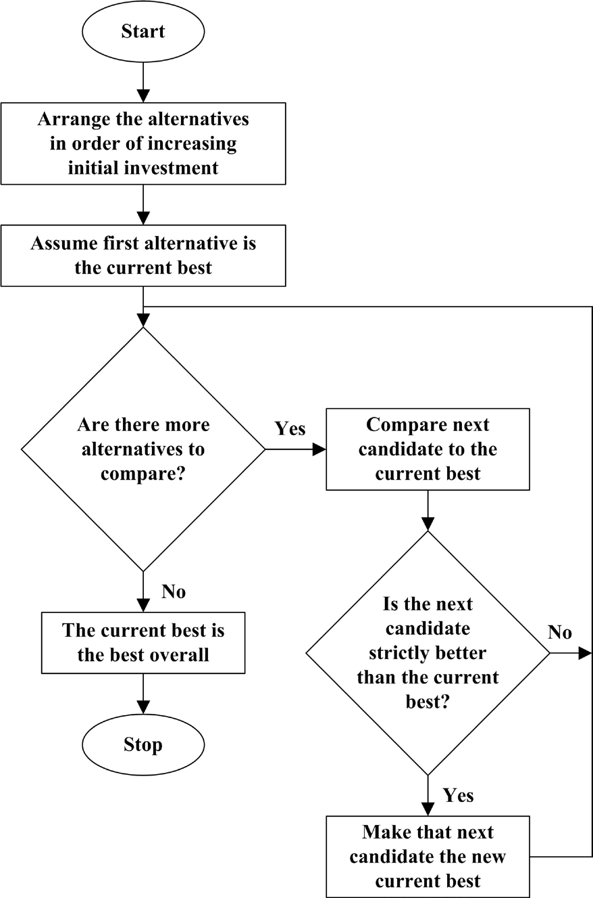

## Chapter 12: Software Engineering Economics

**Acronyms**

- EVM Earned Value Management
- IRR Internal Rate of Return
- MARR Minimum Acceptable Rate of Return
- SDLC Software Development Life Cycle
- SPLC Software Product Life Cycle
- ROI Return on Investment
- ROCE Return on Capital Employed
- TCO Total Cost of Ownership

**Introduction**

Software engineering economics is about making decisions related to software
engineering in a business context. The success of a software product,
service, and solution depends on good business management. Yet, in many
companies and organizations, software business relationships to software
development and engineering remain vague. This knowledge area (KA) provides an
overview on software engineering economics.

Economics is the study of value, costs, resources, and their relationship in a
given context or situation. In the discipline of software engineering,
activities have costs, but the resulting software itself has economic
attributes as well.

Software engineering economics provides a way to study the attributes of
software and software processes in a systematic way that relates them to
economic measures. These economic measures can be weighed and analyzed when
making decisions that are within the scope of a software organization and those
within the integrated scope of an entire producing or acquiring business.
Software engineering economics is concerned with aligning software technical
decisions with the business goals of the organization. In all types of
organizations—be it “for-profit,” “not-for-profit,” or governmental - this
translates into sustainably staying in business. In “for-profit” organizations
this additionally relates to achieving a tangible return on the invested
capital - both assets and capital employed. This KA has been formulated in a
way to address all types of organizations independent of focus, product and
service portfolio, or capital ownership and taxation restrictions.

Decisions like “Should we use a specific component?” may look easy from a
technical perspective, but can have serious implications on the business
viability of a software project and the resulting product. Often engineers
wonder whether such concerns apply at all, as they are “only engineers.”
Economic analysis and decision-making are important engineering considerations
because engineers are capable of evaluating decisions both technically and from
a business perspective. The contents of this knowledge area are important top-
ics for software engineers to be aware of even if they are never actually
involved in concrete business decisions; they will have a well-rounded view
of business issues and the role technical considerations play in making
business decisions. Many engineering proposals and decisions, such as make
versus buy, have deep intrinsic economic impacts that should be considered
explicitly.

This KA first covers the foundations, key terminology, basic concepts, and
common practices of software engineering economics to indicate how
decision-making in software engineering includes, or should include a business
perspective. It then provides a life cycle perspective, highlights risk and
uncertainty management, and shows how economic analysis methods are used. Some
practical considerations finalize the knowledge area.

**Breakdown Of Topics For Software Engineering Economics**

The breakdown of topics for the Software Engineering Economics KA is shown in
Figure 12.1.

### 1. Software Engineering Economics Fundamentals

#### 1.1. Finance

<!-- [1*, c2] -->

Finance is the branch of economics concerned with issues such as allocation,
management, acquisition, and investment of resources. Finance is an element of
every organization, including software engineering organizations.

The field of finance deals with the concepts of time, money, risk, and how they
are interrelated. It also deals with how money is spent and budgeted.
Corporate finance is concerned with providing the funds for an organization’s
activities. Generally, this involves balancing risk and profitability, while
attempting to maximize an organization’s wealth and the value of its stock.
This holds primarily for “for-profit” organizations, but also applies to
“not-for-profit” organizations. The latter needs finances to ensure
sustainability, while not targeting tangible profit. To do this, an
organization must

- identify organizational goals, time horizons, risk factors, tax
  considerations, and financial constraints;
- identify and implement the appropriate business strategy, such as which
  portfolio and investment decisions to take, how to manage cash flow, and
  where to get the funding;
- measure financial performance, such as cash flow and ROI (see section 4.3,
  Return on Investment), and take corrective actions in case of deviation from
  objectives and strategy.

#### 1.2. Accounting

<!-- [1*, c15] -->

Accounting is part of finance. It allows people whose money is being used to
run an organization to know the results of their investment: did they get the
profit they were expecting? In “for-profit” organizations, this relates to the
tangible ROI (see section 4.3, Return on Investment), while in “not-for-profit”
and governmental organizations as well as “for-profit” organizations, it
translates into sustainably staying in business. The primary role of accounting
is to measure the organization’s actual financial performance and to com-
municate financial information about a business entity to stakeholders, such as
shareholders, financial auditors, and investors. Communication is generally in
the form of financial statements that show in money terms the economic
resources to be controlled. It is important to select the right information
that is both relevant and reliable to the user. Information and its timing are
partially governed by risk management and governance policies. Accounting
systems are also a rich source of historical data for estimating.

#### 1.3. Controlling

<!-- [1*, c15] -->

Controlling is an element of finance and accounting. Controlling involves
measuring and correcting the performance of finance and accounting. It
ensures that an organization’s objectives and plans are accomplished.
Controlling cost is a specialized branch of controlling used to detect vari-
ances of actual costs from planned costs.

#### 1.4. Cash Flow

<!-- [1*, c3] -->

Cash flow is the movement of money into or out of a business, project, or
financial product over a given period. The concepts of cash flow instances and
cash flow streams are used to describe the business perspective of a proposal.
To make a meaningful business decision about any specific proposal, that
proposal will need to be evaluated from a business perspective. In a proposal
to develop and launch product X, the payment for new software licenses is an
example of an outgoing cash flow instance. Money would need to be spent to
carry out that proposal. The sales income from product X in the 11th month
after market launch is an example of an incoming cash flow instance. Money
would be coming in because of carrying out the proposal.

The term _cash flow stream_ refers to the set of cash flow instances over time
that are caused by carrying out some given proposal. The cash flow stream is,
in effect, the complete financial picture of that proposal. How much money goes
out? When does it go out? How much money comes in? When does it come in?
Simply, if the cash flow stream for Proposal A is more desirable than the cash
flow stream for Proposal B, then - all other things being equal - the organization
is better off carrying out Proposal A than Proposal B. Thus, the cash flow
stream is an important input for investment decision-making. A cash flow
instance is a specific amount of money flowing into or out of the organization
at a specific time as a direct result of some activity.

A cash flow diagram is a picture of a cash flow stream. It gives the reader a
quick overview of the financial picture of the subject organization or project.
Figure 12.2 shows an example of a cash flow diagram for a proposal.

#### 1.5. Decision-Making Process

<!-- [1*, c2, c4] -->

If we assume that candidate solutions solve a given technical problem equally
well, why should the organization care which one is chosen? The answer is that
there is usually a large difference in the costs and incomes from the
different solutions. A commercial, off-the-shelf, object-request broker
product might cost a few thousand dollars, but the effort to develop a
homegrown service that gives the same functionality could easily cost several
hundred times that amount.

If the candidate solutions all adequately solve the problem from a technical
perspective, then the selection of the most appropriate alternative should be
based on commercial factors such as optimizing total cost of ownership (TCO) or
maximizing the short-term return on investment (ROI). Life cycle costs such as
defect correction, field service, and support duration are also relevant
considerations. These costs need to be factored in when selecting among
acceptable technical approaches, as they are part of the lifetime ROI (see
section 4.3, Return on Investment).

A systematic process for making decisions will achieve transparency and allow
later justification. Governance criteria in many organizations demand selection
from at least two alternatives. A systematic process is shown in Figure 12.3.
It starts with a business challenge at hand and describes the steps to identify
alternative solutions, define selection criteria, evaluate the solutions,
implement one selected solution, and monitor the performance of that solution.

Figure 12.3 shows the process as mostly stepwise and serial. The real process
is more fluid. Sometimes the steps can be done in a different order and often
several of the steps can be done in parallel. The important thing is to be sure
that

none of the steps are skipped or curtailed. It’s also important to understand
that this same process applies at all levels of decision making: from a
decision as big as determining whether a software project should be done at
all, to a deciding on an algorithm or data structure to use in a software
module. The difference is how financially significant the decision is and,
therefore, how much effort should be invested in making that decision. The
project-level decision is financially significant and probably warrants a
relatively high level of effort to make the decision. Selecting an algorithm is
often much less financially significant and warrants a much lower level of
effort to make the decision, even though the same basic decision-making process
is being used.

More often than not, an organization could carry out more than one proposal if
it wanted to, and usually there are important relationships among proposals.
Maybe Proposal Y can only be carried out if Proposal X is also carried out. Or
maybe Proposal P cannot be carried out if Proposal Q is carried out, nor
could Q be carried out if P were. Choices are much easier to make when there
are mutually exclusive paths - for example, either A or B or C or whatever is
chosen. In preparing decisions, it is recommended to turn any given set of
proposals, along with their various interrelationships, into a set of mutually
exclusive alternatives. The choice can then be made among these alternatives.

#### 1.6. Valuation

<!-- [1*, c5, c8] -->

In an abstract sense, the decision-making process - be it financial decision
making or other - is about maximizing value. The alternative that maximizes
total value should always be chosen. A financial basis for value-based
comparison is comparing two or more cash flows. Several bases of comparison are
available, including

- present worth
- future worth
- annual equivalent
- internal rate of return
- (discounted) payback period.

Based on the time-value of money, two or more cash flows are equivalent only
when they equal the same amount of money at a common point in time. Comparing
cash flows only makes sense when they are expressed in the same time frame.

Note that value can’t always be expressed in terms of money. For example,
whether an item is a brand name or not can significantly affect its perceived
value. Relevant values that can’t be expressed in terms of money still need to
be expressed in similar terms so that they can be evaluated objectively.

#### 1.7. Inflation

<!-- [1*, c13] -->

Inflation describes long-term trends in prices. Inflation means that the same
things cost more than they did before. If the planning horizon of a business
decision is longer than a few years, or if the inflation rate is over a couple
of percentage points annually, it can cause noticeable changes in the value of
a proposal. The present time value therefore needs to be adjusted for inflation
rates and also for exchange rate fluctuations.

#### 1.8. Depreciation

<!-- [1*, c14] -->

Depreciation involves spreading the cost of a tangible asset across a number of
time periods; it is used to determine how investments in capitalized assets
are charged against income over several years. Depreciation is an important
part of determining after-tax cash flow, which is critical for accurately
addressing profit and taxes. If a software product is to be sold after the
development costs are incurred, those costs should be capitalized and
depreciated over subsequent time periods. The depreciation expense for each
time period is the capitalized cost of developing the software divided across
the number of periods in which the software will be sold. A software project
proposal may be compared to other software and nonsoftware proposals or to
alternative investment options, so it is important to determine how those
other proposals would be depreciated and how profits would be estimated.

#### 1.9. Taxation

<!-- [1*, c16, c17] -->

Governments charge taxes in order to finance expenses that society needs but
that no single organization would invest in. Companies have to pay income
taxes, which can take a substantial portion of a corporation’s gross profit. A
decision analysis that does not account for taxation can lead to the wrong
choice. A proposal with a high pretax profit won’t look nearly as profitable in
posttax terms. Not accounting for taxation can also lead to unrealistically
high expectations about how profitable a proposed product might be.

#### 1.10. Time-Value of Money

<!-- [1*, c5, c11] -->

One of the most fundamental concepts in finance - and therefore, in business
decisions - is that money has time-value: its value changes over time. A
specific amount of money right now almost always has a different value than the
same amount of money at some other time. This concept has been around since
the earliest recorded human history and is commonly known as time-value. In
order to compare proposals or portfolio elements, they should be normalized
in cost, value, and risk to the net present value. Currency exchange variations
over time need to be taken into account based on historical data. This is
particularly important in cross-border developments of all kinds.

#### 1.11. Efficiency

<!-- [2*, c1] -->

Economic efficiency of a process, activity, or task is the ratio of resources
actually consumed to resources expected to be consumed or desired to be
consumed in accomplishing the process, activity, or task. Efficiency means
“doing things right.” An efficient behavior, like an effective behavior,
delivers results - but keeps the necessary effort to a minimum. Factors that may
affect efficiency in software engineering include product complexity, quality
requirements, time pressure, process capability, team distribution, interrupts,
feature churn, tools, and programming language.

#### 1.12. Effectiveness

<!-- [2*, c1] -->

Effectiveness is about having impact. It is the relationship between achieved
objectives to defined objectives. Effectiveness means “doing the right things.”
Effectiveness looks only at whether defined objectives are reached—not at how
they are reached.

#### 1.13. Productivity

<!-- [2*, c23] -->

Productivity is the ratio of output over input from an economic perspective.
Output is the value delivered. Input covers all resources (e.g., effort) spent
to generate the output. Productivity combines efficiency and effectiveness
from a valueoriented perspective: maximizing productivity is about generating
highest value with lowest resource consumption.

### 2. Life Cycle Economics

#### 2.1. Product

<!-- [2*, c22] [3*, c6] -->

A product is an economic good (or output) that is created in a process that
transforms product factors (or inputs) to an output. When sold, a product
is a deliverable that creates both a value and an experience for its users. A
product can be a combination of systems, solutions, materials, and services
delivered internally (e.g., in-house IT solution) or externally (e.g., software
application), either as-is or as a component for another product (e.g.,
embedded software).

#### 2.2. Project

<!-- [2*, c22] [3*, c1] -->

A project is “a temporary endeavor undertaken to create a unique product,
service, or result”.^1 In software engineering, different project types are
distinguished (e.g., product development, outsourced services, software
maintenance, service creation, and so on). During its life cycle, a software
product may require many projects. For example, during the product conception
phase, a project might be conducted to determine the customer need and market
requirements; during maintenance, a project might be conducted to produce a
next version of a product.

#### 2.3. Program

A program is “a group of related projects, subprograms, and program
activities managed in a coordinated way to obtain benefits not available

<!-- FIXME: footnote -->
1 Project Management Institute, Inc., _PMI Lexicon of Project Management
Terms,_ 2012, [http://www.pmi.org/](http://www.pmi.org/)
PMBOK-Guide-and-Standards/~/media/Registered/ PMI_Lexicon_Final.ashx.

from managing them individually.”^2 Programs are often used to identify and
manage different deliveries to a single customer or market over a time horizon
of several years.

#### 2.4. Portfolio

Portfolios are “projects, programs, subportfolios, and operations managed as a
group to achieve strategic objectives.”^3 Portfolios are used to group and then
manage simultaneously all assets within a business line or organization.
Looking to an entire portfolio makes sure that impacts of decisions are
considered, such as resource allocation to a specific project - which means
that the same resources are not available for other projects.

#### 2.5. Product Life Cycle

<!-- [2*, c2] [3*, c2] -->

A software product life cycle (SPLC) includes all activities needed to define,
build, operate, maintain, and retire a software product or service and its
variants. The SPLC activities of “operate,” “maintain,” and “retire”
typically occur in a much longer time frame than initial software development
(the software development life cycle - SDLC - see Software Life Cycle Models in
the Software Engineering Process KA). Also the operate-maintain-retire
activities of an SPLC typically consume more total effort and other resources
than the SDLC activities (see Majority of Maintenance Costs in the Software
Maintenance KA). The value contributed by a software product or associated
services can be objectively determined during the “operate and maintain” time
frame. Software engineering economics should be concerned with all SPLC
activities, including the activities after initial product release.

#### 2.6. Project Life Cycle

<!-- [2*, c2] [3*, c2] -->

Project life cycle activities typically involve five process groups—Initiating,
Planning, Executing, Monitoring and Controlling, and Closing [4]

<!-- FIXME: footnote -->
2 Ibid.
3 Ibid.

(see the Software Engineering Management KA). The activities within a software
project life cycle are often interleaved, overlapped, and iterated in various
ways [3*, c2] [5] (see the Software Engineering Process KA). For instance,
agile product development within an SPLC involves multiple iterations that
produce increments of deliverable software. An SPLC should include risk
management and synchronization with different suppliers (if any), while
providing auditable decision-making information (e.g., complying with
product liability needs or governance regulations). The software project life
cycle and the software product life cycle are interrelated; an SPLC may include
several SDLCs.

#### 2.7. Proposals

<!-- [1*, c3] -->

Making a business decision begins with the notion of a _proposal_. Proposals
relate to reaching a business objective - at the project, product, or portfolio
level. A proposal is a single, separate option that is being considered, like
carrying out a particular software development project or not. Another proposal
could be to enhance an existing software component, and still another might
be to redevelop that same software from scratch. Each proposal represents a
unit of choice - either you can choose to carry out that proposal or you can
choose not to. The whole purpose of business decision-making is to figure out,
given the current business circumstances, which proposals should be carried out
and which shouldn’t.

#### 2.8. Investment Decisions

<!-- [1*, c4] -->

Investors make investment decisions to spend money and resources on achieving a
target objective. Investors are either inside (e.g., finance, board) or
outside (e.g., banks) the organization. The target relates to some economic
criteria, such as achieving a high return on the investment, strengthening the
capabilities of the organization, or improving the value of the company.
Intangible aspects such as goodwill, culture, and competences should be
considered.

#### 2.9. Planning Horizon

<!-- [1*, c11] -->

When an organization chooses to invest in a particular proposal, money gets
tied up in that proposal - so-called “frozen assets.” The economic impact of
frozen assets tends to start high and decreases over time. On the other hand,
operating and maintenance costs of elements associated with the proposal tend
to start low but increase over time. The total cost of the proposal—that is,
owning and operating a product—is the sum of those two costs. Early on, frozen
asset costs dominate; later, the operating and maintenance costs dominate.
There is a point in time where the sum of the costs is minimized; this is
called the minimum cost lifetime.

To properly compare a proposal with a four-year life span to a proposal with a
six-year life span, the economic effects of either cutting the six-year
proposal by two years or investing the profits from the four-year proposal for
another two years need to be addressed. The planning horizon, sometimes known
as the study period, is the consistent time frame over which proposals are
considered. Effects such as software lifetime will need to be factored into
establishing a planning horizon. Once the planning horizon is established,
several techniques are available for putting proposals with different life
spans into that planning horizon.

#### 2.10. Price and Pricing

<!-- [1*, c13] -->

A price is what is paid in exchange for a good or service. Price is a
fundamental aspect of financial modeling and is one of the four Ps of the
marketing mix. The other three Ps are product, promotion, and place. Price is
the only revenue-generating element amongst the four Ps; the rest are costs.

Pricing is an element of finance and marketing. It is the process of
determining what a company will receive in exchange for its products. Pricing
factors include manufacturing cost, market placement, competition, market
condition, and quality of product. Pricing applies prices to products and
services based on factors such as fixed amount, quantity break, promotion or
sales campaign, specific vendor quote, shipment or invoice date, combination of
multiple orders, service offerings, and many others. The needs of the consumer
can be converted into demand only if the consumer has the willingness and
capacity to buy the product. Thus, pricing is very important in marketing.
Pricing is initially done during the project initiation phase and is a part
of “go” decision making.

#### 2.11. Cost and Costing

<!-- [1*, c15] -->

A cost is the value of money that has been used up to produce something and,
hence, is not available for use anymore. In economics, a cost is an alter-
native that is given up as a result of a decision.

A sunk cost is the expenses before a certain time, typically used to abstract
decisions from expenses in the past, which can cause emotional hurdles in
looking forward. From a traditional economics point of view, sunk costs should
not be considered in decision making. Opportunity cost is the cost of an
alternative that must be for-gone in order to pursue another alternative.

Costing is part of finance and product management. It is the process to
determine the cost based on expenses (e.g., production, software
engineering, distribution, rework) and on the target cost to be competitive
and successful in a market. The target cost can be below the actual
estimated cost. The planning and controlling of these costs (called _cost
management_ ) is important and should always be included in costing.

An important concept in costing is the total cost of ownership (TCO). This
holds especially for software, because there are many not-so-obvious costs
related to SPLC activities after initial product development. TCO for a
software product is defined as the total cost for acquiring, activating, and
keeping that product running. These costs can be grouped as direct and indirect
costs. TCO is an accounting method that is crucial in making sound economic
decisions.

#### 2.12. Performance Measurement

<!-- [3*, c7, c8] -->

Performance measurement is the process whereby an organization establishes and
measures the parameters used to determine whether programs, investments, and
acquisitions are achieving the desired results. It is used to evaluate whether
performance objectives are actually achieved; to control budgets, resources,
progress, and decisions; and to improve performance.

#### 2.13. Earned Value Management

<!-- [3*, c8] -->

Earned value management (EVM) is a project management technique for measuring
progress based on created value. At a given moment, the results achieved to
date in a project are compared with the projected budget and the planned
schedule progress for that date. Progress relates already-consumed resources
and achieved results at a given point in time with the respective planned
values for the same date. It helps to identify possible performance problems at
an early stage. A key principle in EVM is tracking cost and schedule variances
via comparison of planned versus actual schedule and budget versus actual cost.
EVM tracking gives much earlier visibility to deviations and thus permits
corrections earlier than classic cost and schedule tracking that only looks at
delivered documents and products.

#### 2.14. Termination Decisions

<!-- [1*, c11, c12] [2*, c9] -->

Termination means to end a project or product. Termination can be preplanned
for the end of a long product lifetime (e.g., when foreseeing that a product
will reach its lifetime) or can come rather spontaneously during product
development (e.g., when project performance targets are not achieved). In
both cases, the decision should be carefully prepared, considering always
the alternatives of continuing versus terminating. Costs of different
alternatives must be estimated - covering topics such as replacement,
information collection, suppliers, alternatives, assets, and utilizing
resources for other opportunities. Sunk costs should not be considered in
such decision making because they have been spent and will not reappear
as a value.

#### 2.15. Replacement and Retirement Decisions

<!-- [1*, c12] [2*, c9] -->

A replacement decision is made when an organization already has a particular
asset and they are considering replacing it with something else; for example,
deciding between maintaining and supporting a legacy software product or
redeveloping it from the ground up. Replacement decisions use the same business
decision process as described above, but there are additional challenges: sunk
cost and salvage value. Retirement decisions are also about getting out of an
activity altogether, such as when a software company considers not selling a
software product anymore or a hardware manufacturer considers not building and
selling a particular model of computer any longer. Retirement decision can be
influenced by lock-in factors such as technology dependency and high exit
costs.

### 3. Risk and Uncertainty

#### 3.1. Goals, Estimates, and Plans

<!-- [3*, c6] -->

Goals in software engineering economics are mostly business goals (or business
objectives).

A business goal relates business needs (such as increasing profitability) to
investing resources (such as starting a project or launching a product with a
given budget, content, and timing). Goals apply to operational planning (for
instance, to reach a certain milestone at a given date or to extend software
testing by some time to achieve a desired quality level—see Key Issues in the
Software Testing KA) and to the strategic level (such as reaching a certain
profitability or market share in a stated time period).

An estimate is a well-founded evaluation of resources and time that will be
needed to achieve stated goals (see Effort, Schedule, and Cost Estimation in
the Software Engineering Management KA and Maintenance Cost Estimation in the
Software Maintenance KA). A software estimate is used to determine whether
the project goals can be achieved within the constraints on schedule, budget,
features, and quality attributes. Estimates are typically internally generated
and are not necessarily visible externally. Estimates should not be driven
exclusively by the project goals because this could make an estimate overly
optimistic. Estimation is a periodic activity; estimates should be
continually revised during a project.

A plan describes the activities and milestones that are necessary in order to
reach the goals of

a project (see Software Project Planning in the Software Engineering Management
KA). The plan should be in line with the goal and the estimate, which is not
necessarily easy and obvious - such as when a software project with given
requirements would take longer than the target date foreseen by the client. In
such cases, plans demand a review of initial goals as well as estimates and
the underlying uncertainties and inaccuracies. Creative solutions with the
underlying rationale of achieving a win-win position are applied to resolve
conflicts.

To be of value, planning should involve consideration of the project
constraints and commitments to stakeholders. Figure 12.4 shows how goals are
initially defined. Estimates are done based on the initial goals. The plan
tries to match the goals and the estimates. This is an iterative process,
because an initial estimate typically does not meet the initial goals.

#### 3.2. Estimation Techniques

<!-- [3*, c6] -->

Estimations are used to analyze and forecast the resources or time necessary to
implement requirements (see Effort, Schedule, and Cost Estimation in the
Software Engineering Management KA and Maintenance Cost Estimation in the
Software Maintenance KA). Five families of estimation techniques exist:

- Expert judgment
- Analogy
- Estimation by parts
- Parametric methods
- Statistical methods.

No single estimation technique is perfect, so using multiple estimation
technique is useful. Convergence among the estimates produced by different
techniques indicates that the estimates are probably accurate. Spread among the
estimates indicates that certain factors might have been overlooked. Finding
the factors that caused the spread and then reestimating again to produce
results that converge could lead to a better estimate.

#### 3.3. Addressing Uncertainty

<!-- [3*, c6] -->

Because of the many unknown factors during project initiation and planning,
estimates are inherently uncertain; that uncertainty should be addressed in
business decisions. Techniques for addressing uncertainty include

- consider ranges of estimates
- analyze sensitivity to changes of assumptions
- delay final decisions.

#### 3.4. Prioritization

<!-- [3*, c6] -->

Prioritization involves ranking alternatives based on common criteria to
deliver the best possible value. In software engineering projects, software
requirements are often prioritized in order to deliver the most value to the
client within constraints of schedule, budget, resources, and technology,
or to provide for building product increments, where the first increments
provide the highest value to the customer (see Requirements Classification and
Requirements Negotiation in the Software Requirements KA and Software Life
Cycle Models in the Software Engineering Process KA).

#### 3.5. Decisions under Risk

<!-- [1*, c24] [3*, c9] -->

Decisions under risk techniques are used when the decision maker can assign
probabilities to the different possible outcomes (see Risk Management in the
Software Engineering Management KA). The specific techniques include

- expected value decision making
- expectation variance and decision making
- Monte Carlo analysis
- decision trees
- expected value of perfect information.

#### 3.6. Decisions under Uncertainty

<!-- [1*, c25] [3*, c9] -->

Decisions under uncertainty techniques are used when the decision maker cannot
assign probabilities to the different possible outcomes because needed
information is not available (see Risk Management in the Software Engineering
Management KA). Specific techniques include

- Laplace Rule
- Maximin Rule
- Maximax Rule
- Hurwicz Rule
- Minimax Regret Rule.

### 4. Economic Analysis Methods

#### 4.1. For-Profit Decision Analysis

<!-- [1*, c10] -->

Figure 12.5 describes a process for identifying the best alternative from a set
of mutually exclusive alternatives. Decision criteria depend on the business
objectives and typically include ROI (see section 4.3, Return on Investment) or
Return on Capital Employed (ROCE) (see section 4.4, Return on Capital
Employed).

For-profit decision techniques don’t apply for government and nonprofit
organizations. In these cases, organizations have different goals—which means
that a different set of decision techniques are needed, such as cost-benefit or
cost-effectiveness analysis.

#### 4.2. Minimum Acceptable Rate of Return

<!-- [1*, c10] -->

The minimum acceptable rate of return (MARR) is the lowest internal rate of
return the organization would consider to be a good investment. Generally
speaking, it wouldn’t be smart to invest in an activity with a return of 10%
when there’s another activity that’s known to return 20%. The MARR is a
statement that an organization is confident it can achieve at least that rate
of return. The MARR represents the organization’s opportunity cost for
investments. By choosing to invest in some activity, the organization is
explicitly deciding to not invest that same money somewhere else. If the
organization is already confident it can get some known rate of return, other
alternatives should be chosen only if their rate of return is at least that
high. A simple way to account for that opportunity cost is to use the MARR as
the interest rate in business decisions. An alternative’s present worth
evaluated at the MARR shows how much more or less (in present-day cash terms)
that alternative is worth than investing at the MARR.

#### 4.3. Return on Investment

<!-- [1*, c10] -->

Return on investment (ROI) is a measure of the profitability of a company or
business unit. It is defined as the ratio of money gained or lost (whether
realized or unrealized) on an investment relative to the amount of money
invested. The purpose of ROI varies and includes, for instance, providing a
rationale for future investments and acquisition decisions.

#### 4.4. Return on Capital Employed

The return on capital employed (ROCE) is a measure of the profitability of a
company or business unit. It is defined as the ratio of a gross profit before
taxes and interest (EBIT) to the total assets minus current liabilities. It
describes the return on the used capital.

#### 4.5. Cost-Benefit Analysis

<!-- [1*, c18] -->

Cost-benefit analysis is one of the most widely used methods for evaluating
individual proposals. Any proposal with a benefit-cost ratio of less than 1.0
can usually be rejected without further analysis because it would cost more
than the benefit. Proposals with a higher ratio need to consider the
associated risk of an investment and compare the benefits with the option of
investing the money at a guaranteed interest rate (see section 4.2, Minimum
Acceptable Rate of Return).

#### 4.6. Cost-Effectiveness Analysis

<!-- [1*, c18] -->

Cost-effectiveness analysis is similar to costbenefit analysis. There are two
versions of cost-effectiveness analysis: the fixed-cost version maximizes the
benefit given some upper bound on cost; the fixed-effectiveness version
minimizes the cost needed to achieve a fixed goal.

#### 4.7. Break-Even Analysis

<!-- [1*, c19] -->

Break-even analysis identifies the point where the costs of developing a
product and the revenue to be generated are equal. Such an analysis can be used
to choose between different proposals at different estimated costs and revenue.
Given estimated costs and revenue of two or more proposals, break-even
analysis helps in choosing among them.

#### 4.8. Business Case

<!-- [1*, c3] -->

The business case is the consolidated information summarizing and explaining a
business proposal from different perspectives for a decision maker (cost,
benefit, risk, and so on). It is often used to assess the potential value of a
product, which can be used as a basis in the investment decision-making
process. As opposed to a mere profit-loss calculation, the business case is a
“case” of plans and analyses that is owned by the product manager and used in
support of achieving the business objectives.

#### 4.9. Multiple Attribute Evaluation

<!-- [1*, c26] -->

The topics discussed so far are used to make decisions based on a single
decision criterion: money. The alternative with the best present worth, the
best ROI, and so forth is the one selected. Aside from technical feasibility,
money is almost always the most important decision criterion, but it’s not
always the only one. Quite often there are other criteria, other “attributes,”
that need to be considered, and those attributes can’t be cast in terms of
money. Multiple attribute decision techniques allow other, nonfinancial
criteria to be factored into the decision.

There are two families of multiple attribute decision techniques that differ in
how they use the attributes in the decision. One family is the “compensatory,”
or single-dimensioned, techniques. This family collapses all of the
attributes onto a single figure of merit. The family is called compensatory
because, for any given alternative, a lower score in one attribute can be
compensated by - or traded off against - a higher score in other attributes. The
compensatory techniques include

- nondimensional scaling
- additive weighting
- analytic hierarchy process.

In contrast, the other family is the “noncompensatory,” or fully dimensioned,
techniques. This family does not allow tradeoffs among the attributes. Each
attribute is treated as a separate entity in the decision process. The
noncompensatory techniques include

- dominance
- satisficing
- lexicography.

#### 4.10. Optimization Analysis

<!-- [1*, c20] -->

The typical use of optimization analysis is to study a cost function over a
range of values to find the point where overall performance is best. Software’s
classic space-time tradeoff is an example of optimization; an algorithm that
runs faster will often use more memory. Optimization balances the value of the
faster runtime against the cost of the additional memory.

Real options analysis can be used to quantify the value of project choices,
including the value of delaying a decision. Such options are difficult to
compute with precision. However, awareness that choices have a monetary value
provides insight in the timing of decisions such as increasing project staff
or lengthening time to market to improve quality.

### 5. Practical Considerations

#### 5.1. The “Good Enough” Principle

<!-- [1*, c21] -->

Often software engineering projects and products are not precise about the
targets that should be achieved. Software requirements are stated, but the
marginal value of adding a bit more functionality cannot be measured. The
result could be late delivery or too-high cost. The “good enough” principle
relates marginal value to marginal cost and provides guidance to determine
criteria when a deliverable is “good enough” to be delivered. These criteria
depend on business objectives and on prioritization of different alternatives,
such as ranking software requirements, measurable quality attributes, or
relating schedule to product content and cost.

The RACE principle (reduce accidents and control essence) is a popular rule
towards good enough software. Accidents imply unnecessary overheads such as
gold-plating and rework due to late defect removal or too many requirements
changes. Essence is what customers pay for. Software engineering economics
provides the mechanisms to define criteria that determine when a deliverable
is “good enough” to be delivered. It also highlights that both words are
relevant: “good” and “enough.” Insufficient quality or insufficient quantity is
not good enough. Agile methods are examples of “good enough” that try to
optimize value by reducing the overhead of delayed rework and the gold
plating that results from adding features that have low marginal value for
the users (see Agile Methods in the Software Engineering Models and Methods KA
and Software Life Cycle Models in the Software Engineering Process KA). In
agile methods, detailed planning and lengthy development phases are replaced
by incremental planning and frequent delivery of small increments of a deliv-
erable product that is tested and evaluated by user representatives.

#### 5.2. Friction-Free Economy

Economic friction is everything that keeps markets from having perfect
competition. It involves distance, cost of delivery, restrictive regulations,
and/or imperfect information. In high-friction markets, customers don’t have
many suppliers from which to choose. Having been in a business for a while or
owning a store in a good location determines the economic position. It’s hard
for new competitors to start business and compete. The marketplace moves slowly
and predictably. Friction-free markets are just the reverse. New
competitors emerge and customers are quick to respond. The marketplace is
anything but predictable. Theoretically, software and IT are friction-
free. New companies can easily create products and often do so at a much
lower cost than established companies, since they need not consider any
legacies. Marketing and sales can be done via the Internet and social
networks, and basically free distribution mechanisms can enable a ramp up
to a global business. Software engineering economics aims to provide
foundations to judge how a software business performs and how friction-free
a market actually is. For instance, competition among software app
developers is inhibited when apps must be sold through an app store and
comply with that store’s rules.

#### 5.3. Ecosystems

An ecosystem is an environment consisting of all the mutually dependent
stakeholders, business units, and companies working in a particular area.

In a typical ecosystem, there are producers and consumers, where the consumers
add value to the consumed resources. Note that a consumer is not the end user
but an organization that uses the product to enhance it. A software ecosystem
is, for instance, a supplier of an application working with companies doing the
installation and support in different regions. Neither one could exist
without the other. Ecosystems can be permanent or temporary. Software
engineering economics provides the mechanisms to evaluate alternatives in
establishing or extending an ecosystem - for instance, assessing whether to work
with a specific distributor or have the distribution done by a company doing
service in an area.

#### 5.4. Offshoring and Outsourcing

Offshoring means executing a business activity beyond sales and marketing
outside the home country of an enterprise. Enterprises typically either have
their offshoring branches in low-cost countries or they ask specialized
companies abroad to execute the respective activity. Offshoring should
therefore not be confused with outsourcing. Offshoring within a company is
called captive offshoring. Outsourcing is the result-oriented relationship
with a supplier who executes business activities for an enterprise when, tra-
ditionally, those activities were executed inside the enterprise. Outsourcing
is site-independent. The supplier can reside in the neighborhood of the
enterprise or offshore (outsourced offshoring). Software engineering
economics provides the basic criteria and business tools to evaluate different
sourcing mechanisms and control their performance. For instance, using an
outsourcing supplier for software development and maintenance might reduce
the cost per hour of software development, but increase the number of hours and
capital expenses due to an increased need for monitoring and communication.
(For more information on offshoring and outsourcing, see “Outsourcing” in
Management Issues in the Software Maintenance KA.)

### Matrix of topics vs. Reference material

Tockey 2005 [1]
Sommerville 2011 [2]
Fairley 2009 [3]

**1. Software Engineering Economics
Fundamentals**
    1.1. Finance c2
    1.2. Accounting c15
    1.3. Controlling c15
    1.4. Cash Flow c3
    1.5. Decision-Making Process c2, c4
    1.6. Valuation c5, c8
    1.7. Inflation c13
    1.8. Depreciation c14
    1.9. Taxation c16, c17
    1.10. Time-Value of Money c5, c11
    1.11. Efficiency c1
    1.12. Effectiveness c1
    1.13. Productivity c23
**2. Life Cycle Economics**
    2.1. Product c22 c6
    2.2. Project c22 c1
    2.3. Program
    2.4. Portfolio
    2.5. Product Life Cycle c2 c2
    2.6. Project Life Cycle c2 c2
    2.7. Proposals c3
    2.8. Investment Decisions c4
    2.9. Planning Horizon c11
    2.10. Price and Pricing c13
    2 .11. Cost and Costing c15
    2.12. Performance Measurement c7, c8
    2.13. Earned Value Management c8
    2.14. Termination Decisions c11, c12 c9
    2.15. Replacement and Retirement Decisions c12 c9

Tockey 2005 [1]
Sommerville 2011 [2]
Fairley 2009 [3]

**3. Risk and Uncertainty**
    3.1. Goals, Estimates, and Plans c6
    3.2. Estimation Techniques c6
    3.3. Addressing Uncertainty c6
    3.4. Prioritization c6
    3.5. Decisions under Risk c24 c9
    3.6. Decisions under Uncertainty c25 c9
**4. Economic Analysis Methods**
    4.1. For-Profit Decision Analysis c10
    4.2. Minimum Acceptable Rate of Return c10
    4.3. Return on Investment c10
    4.4. Return on Capital Employed
    4.5. Cost-Benefit Analysis c18
    4.6. Cost-Effectiveness Analysis c18
    4.7. Break-Even Analysis c19
    4.8. Business Case c3
    4.9. Multiple Attribute Evaluation c26
    4.10. Optimization Analysis c20
**5. Practical Considerations**
    5.1. The “Good Enough” Principle c21
    5.2. Friction-Free Economy
    5.3. Ecosystems
    5.4. Offshoring and Outsourcing

**Further Readings**

_A Guide to the Project Management Body of Knowledge (PMBOK® Guide)_ [4].

The _PMBOK® Guide_ provides guidelines for managing individual projects and
defines project management related concepts. It also describes the project
management life cycle and its related processes, as well as the project life
cycle. It is a globally recognized guide for the project management
profession.

_Software Extension to the Guide to the Project Management Body of Knowledge
(SWX)_ [5].

_SWX_ provides adaptations and extensions to the generic practices of project
management documented in the _PMBOK® Guide_ for managing software projects.
The primary contribution of this extension to the _PMBOK® Guide_ is descrip-
tion of processes that are applicable for managing adaptive life cycle software
projects.

B.W. Boehm, _Software Engineering Economics_ [6].

This book is the classic reading on software engineering economics. It provides
an overview of business thinking in software engineering. Although the examples
and figures are dated, it still is worth reading.

C. Ebert and R. Dumke, _Software Measurement_ [7].

This book provides an overview on quantitative methods in software
engineering, starting with measurement theory and proceeding to performance
management and business decision making.

D.J. Reifer, _Making the Software Business Case: Improvement by the Numbers_
[8].

This book is a classic reading on making a business case in the software and
IT businesses. Many useful examples illustrate how the business case is
formulated and quantified.

**References**

[1] S. Tockey, Return on Software: Maximizing the Return on Your Software
Investment, Addison-Wesley, 2004.

[2] J.H. Allen et al., Software Security Engineering: A Guide for Project
Managers, Addison-Wesley, 2008.

[3] R.E. Fairley, Managing and Leading Software Projects, Wiley-IEEE Computer
Society Press, 2009.

[4] Project Management Institute, A Guide to the Project Management Body of
Knowledge (PMBOK(R) Guide), 5th ed., Project Management Institute, 2013.

[5] Project Management Institute and IEEE Computer Society, Software Extension
to the PMBOK® Guide Fifth Edition, ed: Project Management Institute, 2013.

[6] B.W. Boehm, Software Engineering Economics, Prentice-Hall, 1981.

[7] C. Ebert and R. Dumke, Software Measurement, Springer, 2007.

[8] D.J. Reifer, Making the Software Business Case: Improvement by the Numbers
, Addison Wesley, 2002.
