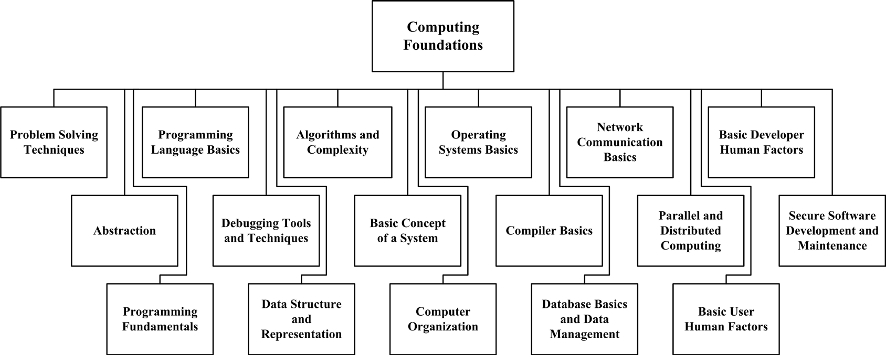
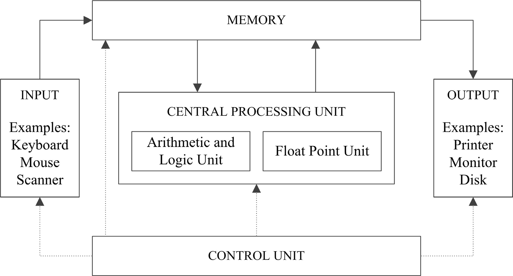

## Chapter 13: Computing Foundations

**Acronyms**

- AOP Aspect-Oriented Programming
- ALU Arithmetic and Logic Unit
- API Application Programming Interface
- ATM Asynchronous Transfer Mode
- B/S Browser-Server
- CERT Computer Emergency Response Team
- COTS Commercial Off-The-Shelf
- CRUD Create, Read, Update, Delete C/S Client-Server
- CS Computer Science
- DBMS Database Management System
- FPU Float Point Unit
- I/O Input and Output
- ISA Instruction Set Architecture
- ISO International Organization for Standardization
- ISP Internet Service Provider
- LAN Local Area Network
- MUX Multiplexer
- NIC Network Interface Card
- OOP Object-Oriented Programming
- OS Operating System
- OSI Open Systems Interconnection
- PC Personal Computer
- PDA Personal Digital Assistant
- PPP Point-to-Point Protocol
- RFID Radio Frequency Identification
- RAM Random Access Memory
- ROM Read Only Memory
- SCSI Small Computer System Interface
- SQL Structured Query Language
- TCP Transport Control Protocol
- UDP User Datagram Protocol
- VPN Virtual Private Network
- WAN Wide Area Network

**Introduction**

The scope of the Computing Foundations knowledge area (KA) encompasses the
development and operational environment in which software evolves and executes.
Because no software can exist in a vacuum or run without a computer, the core
of such an environment is the computer and its various components. Knowledge
about the computer and its underlying principles of hardware and software
serves as a framework on which software engineering is anchored. Thus, all
software engineers must have good understanding of the Computing Foundations
KA. It is generally accepted that software engineering builds on top of
computer science. For example, “Software Engineering 2004: Curriculum
Guidelines for Undergraduate Degree Programs in Software Engineering” [1]
clearly states, “One particularly important aspect is that software engineering
builds on computer science and mathematics” (italics added). Steve Tockey wrote
in his book Return on Software:

Both computer science and software engineering deal with computers,
computing, and software. The science of computing, as a body of knowledge, is
at the core of both.

... Software engineering is concerned with the application of computers,
computing, and software to practical purposes, specifically the design,
construction, and operation of efficient and economical software systems.

Thus, at the core of software engineering is an understanding of computer
science. While few people will deny the role computer science plays in the
development of software engineering both as a discipline and as a body of
knowledge, the importance of computer science to software engineering cannot be
overemphasized; thus, this Computing Foundations KA is being written.

The majority of topics discussed in the Computing Foundations KA are also
topics of discussion in basic courses given in computer science undergraduate
and graduate programs. Such courses include programming, data structure,
algorithms, computer organization, operating systems, compilers, databases,
networking, distributed systems, and so forth. Thus, when breaking down
topics, it can be tempting to decompose the Computing Foundations KA according
to these often-found divisions in relevant courses. However, a purely
course-based division of topics suffers serious drawbacks. For one, not all
courses in computer science are related or equally important to software
engineering. Thus, some topics that would otherwise be covered in a computer
science course are not covered in this KA. For example, computer graphics - while
an important course in a computer science degree program - is not included in
this KA.

Second, some topics discussed in this guideline do not exist as standalone
courses in undergraduate or graduate computer science programs. Consequently,
such topics may not be adequately covered in a purely course-based breakdown.
For example, abstraction is a topic incorporated into several different
computer science courses; it is unclear which course abstraction should belong
to in a course-based breakdown of topics. The Computing Foundations KA is
divided into seventeen different topics. A topic’s direct usefulness to
software engineers is the criterion used for selecting topics for inclusion in
this KA (see Figure 13.1). The advantage of this topic-based breakdown is its
foundation on the belief that Computing Foundations - if it is to be grasped
firmly - must be considered as a collection of logically connected topics
undergirding software engineering in general and software construction in
particular.

The Computing Foundations KA is related closely to the Software Design,
Software Construction, Software Testing, Software Maintenance, Software
Quality, and Mathematical Foundations KAs.

**Breakdown Of Topics For Computing Foundations**

The breakdown of topics for the Computing Foundations KA is shown in Figure 13.1.



### 1. Problem Solving Techniques

<!-- [2*, s3.2, c4] [3*, c5] -->

The concepts, notions, and terminology introduced here form an underlying basis
for understanding the role and scope of problem solving techniques.

#### 1.1. Definition of Problem Solving

Problem solving refers to the thinking and activities conducted to answer or
derive a solution to a problem. There are many ways to approach a problem, and
each way employs different tools and uses different processes. These different
ways of approaching problems gradually expand and define themselves and finally
give rise to different disciplines. For example, software engineering
focuses on solving problems using computers and software.

While different problems warrant different solutions and may require different
tools and processes, the methodology and techniques used in solving problems do
follow some guidelines and can often be generalized as problem solving
techniques. For example, a general guideline for solving a generic engineering
problem is to use the three-step process given below [2].

- Formulate the real problem.
- Analyze the problem.
- Design a solution search strategy.

#### 1.2. Formulating the Real Problem

Gerard Voland writes, “It is important to recognize that a specific problem
should be formulated if one is to develop a specific solution” [2]. This
formulation is called the problem statement, which explicitly specifies what
both the problem and the desired outcome are.

Although there is no universal way of stating a problem, in general a problem
should be expressed in such a way as to facilitate the development of
solutions. Some general techniques to help one formulate the real problem
include statement-restatement, determining the source and the cause, revising
the statement, analyzing present and desired state, and using the fresh eye
approach.

#### 1.3. Analyze the Problem

Once the problem statement is available, the next step is to analyze the
problem statement or situation to help structure our search for a solution.
Four types of analysis include situation analysis, in which the most urgent or
critical aspects of a situation are identified first; problem analysis, in
which the cause of the problem must be determined; decision analysis, in
which the action(s) needed to correct the problem or eliminate its cause must
be determined; and potential problem analysis, in which the action(s) needed to
prevent any reoccurrences of the problem or the development of new problems
must be determined.

#### 1.4. Design a Solution Search Strategy

Once the problem analysis is complete, we can focus on structuring a search
strategy to find the solution. In order to find the “best” solution (here,
“best” could mean different things to different people, such as faster,
cheaper, more usable, different capabilities, etc.), we need to eliminate
paths that do not lead to viable solutions, design tasks in a way that provides
the most guidance in searching for a solution, and use various attributes of
the final solution state to guide our choices in the problem solving process.

#### 1.5. Problem Solving Using Programs

The uniqueness of computer software gives problem solving a flavor that is
distinct from general engineering problem solving. To solve a problem using
computers, we must answer the following questions.

- How do we figure out what to tell the computer to do?
- How do we convert the problem statement into an algorithm?
- How do we convert the algorithm into machine instructions?

The first task in solving a problem using a computer is to determine what to
tell the computer to do. There may be many ways to tell the story, but all
should take the perspective of a computer such that the computer can eventually
solve the problem. In general, a problem should be expressed in such a way as
to facilitate the development of algorithms and data structures for solving it.
The result of the first task is a problem statement. The next step is to
convert the problem statement into algorithms that solve the problem. Once an
algorithm is found, the final step converts the algorithm into machine
instructions that form the final solution: software that solves the problem.
Abstractly speaking, problem solving using a computer can be considered as a
process of problem transformation - in other words, the step-by-step
transformation of a problem statement into a problem solution. To the
discipline of software engineering, the ultimate objective of problem solving
is to transform a problem expressed in natural language into electrons running
around a circuit. In general, this transformation can be broken into three
phases:

a) Development of algorithms from the problem statement.
b) Application of algorithms to the problem.
c) Transformation of algorithms to program code.

The conversion of a problem statement into algorithms and algorithms into
program codes usually follows a “stepwise refinement” (a.k.a. systematic
decomposition) in which we start with a problem statement, rewrite it as a
task, and recursively decompose the task into a few simpler subtasks until the
task is so simple that solutions to it are straightforward. There are three
basic ways of decomposing: sequential, conditional, and iterative.

### 2. Abstraction

<!-- [3*, s5.2–5.4] -->

Abstraction is an indispensible technique associated with problem solving. It
refers to both the process and result of generalization by reducing the
information of a concept, a problem, or an observable phenomenon so that one
can focus on the “big picture.” One of the most important skills in any
engineering undertaking is framing the levels of abstraction appropriately.

“Through abstraction,” according to Voland, “we view the problem and its
possible solution paths from a higher level of conceptual understanding. As a
result, we may become better prepared to recognize possible relationships
between different aspects of the problem and thereby generate more creative
design solutions” [2]. This is particularly true in computer science in general
(such as hardware vs. software) and in software engineering in particular (data
structure vs. data flow, and so forth).

#### 2.1. Levels of Abstraction

When abstracting, we concentrate on one “level” of the big picture at a time
with confidence that we can then connect effectively with levels above and
below. Although we focus on one level, abstraction does not mean knowing
nothing about the neighboring levels. Abstraction levels do not necessarily
correspond to discrete components in reality or in the problem domain, but to
well-defined standard interfaces such as programming APIs. The advantages that
standard interfaces provide include portability, easier software/hardware
integration and wider usage.

#### 2.2. Encapsulation

Encapsulation is a mechanism used to implement abstraction. When we are
dealing with one level of abstraction, the information concerning the levels
below and above that level is encapsulated. This information can be the
concept, problem, or observable phenomenon; or it may be the permissible
operations on these relevant entities. Encapsulation usually comes with some
degree of information hiding in which some or all of the underlying details are
hidden from the level above the interface provided by the abstraction. To an
object, information hiding means we don’t need to know the details of how the
object is represented or how the operations on those objects are implemented.

#### 2.3. Hierarchy

When we use abstraction in our problem formulation and solution, we may use
different abstractions at different times - in other words, we work on dif-
ferent levels of abstraction as the situation calls. Most of the time, these
different levels of abstraction are organized in a hierarchy. There are many
ways to structure a particular hierarchy and the criteria used in determining
the specific content of each layer in the hierarchy varies depending on the
individuals performing the work.

Sometimes, a hierarchy of abstraction is sequential, which means that each
layer has one and only one predecessor (lower) layer and one and only one
successor (upper) layer - except the upmost layer (which has no successor) and
the bottommost layer (which has no predecessor). Sometimes, however, the
hierarchy is organized in a tree-like structure, which means each layer can
have more than one predecessor layer but only one successor layer.
Occasionally, a hierarchy can have a many-to-many structure, in which each
layer can have multiple predecessors and successors. At no time, shall there be
any loop in a hierarchy.

A hierarchy often forms naturally in task decomposition. Often, a task
analysis can be decomposed in a hierarchical fashion, starting with the larger
tasks and goals of the organization and breaking each of them down into smaller
subtasks that can again be further subdivided This continuous division of
tasks into smaller ones would produce a hierarchical structure of
tasks-subtasks.

#### 2.4. Alternate Abstractions

Sometimes it is useful to have multiple alternate abstractions for the same
problem so that one can keep different perspectives in mind. For example, we
can have a class diagram, a state chart, and a sequence diagram for the same
software at the same level of abstraction. These alternate abstractions do not
form a hierarchy but rather complement each other in helping understanding the
problem and its solution. Though beneficial, it is as times difficult to keep
alternate abstractions in sync.

### 3. Programming Fundamentals

<!-- [3*, c6–19] -->

Programming is composed of the methodologies or activities for creating
computer programs that perform a desired function. It is an indispensible part
in software construction. In general, programming can be considered as the
process of designing, writing, testing, debugging, and maintaining the source
code. This source code is written in a programming language.

The process of writing source code often requires expertise in many different
subject areas - including knowledge of the application domain, appropriate data
structures, specialized algorithms, various language constructs, good
programming techniques, and software engineering.

#### 3.1. The Programming Process

Programming involves design, writing, testing, debugging, and maintenance.
Design is the conception or invention of a scheme for turning a customer
requirement for computer software into operational software. It is the activity
that links application requirements to coding and debugging. Writing is the
actual coding of the design in an appropriate programming language. Testing is
the activity to verify that the code one writes actually does what it is
supposed to do. Debugging is the activity to find and fix bugs (faults) in
the source code (or design). Maintenance is the activity to update, correct,
and enhance existing programs. Each of these activities is a huge topic and
often warrants the explanation of an entire KA in the SWEBOK Guide and many
books.

#### 3.2. Programming Paradigms

Programming is highly creative and thus somewhat personal. Different people
often write different programs for the same requirements. This diversity of
programming causes much difficulty in the construction and maintenance of large
complex software. Various programming paradigms have been developed over the
years to put some standardization into this highly creative and personal
activity. When one programs, he or she can use one of several programming
paradigms to write the code. The major types of programming paradigms are
discussed below.

Unstructured Programming: In unstructured programming, a programmer follows
his/her hunch to write the code in whatever way he/she likes as long as the
function is operational. Often, the practice is to write code to fulfill a
specific utility without regard to anything else. Programs written this way
exhibit no particular structure— thus the name “unstructured programming.”
Unstructured programming is also sometimes called ad hoc programming.

_Structured/Procedural/Imperative Programming:_ A hallmark of structured
programming is the use of well-defined control structures, including
procedures (and/or functions) with each procedure (or function) performing a
specific task. Interfaces exist between procedures to facilitate correct and
smooth calling operations of the programs. Under structured programming,
programmers often follow established protocols and rules of thumb when
writing code. These protocols and rules can be numerous and cover almost the
entire scope of programming - ranging from the simplest issue (such as how to
name variables, functions, procedures, and so forth) to more complex issues
(such as how to structure an interface, how to handle exceptions, and so
forth).

_Object-Oriented Programming:_ While procedural programming organizes
programs around procedures, object-oriented programming (OOP) organize a
program around objects, which are abstract data structures that combine both
data and methods used to access or manipulate the data. The primary features of
OOP are that objects representing various abstract and concrete entities are
created and these objects interact with each other to collectively fulfill the
desired functions.

_Aspect-Oriented Programming:_ Aspect-oriented programming (AOP) is a
programming paradigm that is built on top of OOP. AOP aims to isolate secondary
or supporting functions from the main program’s business logic by focusing on
the cross sections (concerns) of the objects. The primary motivation for AOP is
to resolve the object tangling and scattering associated with OOP, in which the
interactions among objects become very complex. The essence of AOP is the
greatly emphasized separation of concerns, which separates noncore functional
concerns or logic into various aspects.

_Functional Programming_ : Though less popular, functional programming is as
viable as the other paradigms in solving programming problems. In functional
programming, all computations are treated as the evaluation of mathematical
functions. In contrast to the imperative programming that emphasizes changes in
state, functional programming emphasizes the application of functions, avoids
state and mutable data, and provides referential transparency.

### 4. Programming Language Basics

<!-- [4*, c6] -->

Using computers to solve problems involves programming—which is writing and
organizing instructions telling the computer what to do at each step.
Programs must be written in some programming language with which and through
which we describe necessary computations. In other words, we use the facilities
provided by a programming language to describe problems, develop algorithms,
and reason about problem solutions. To write any program, one must understand
at least one programming language.

#### 4.1. Programming Language Overview

A programming language is designed to express computations that can be
performed by a computer. In a practical sense, a programming language is a
notation for writing programs and thus should be able to express most data
structures and algorithms. Some, but not all, people restrict the term
“programming language” to those languages that can express all possible
algorithms.

Not all languages have the same importance and popularity. The most popular
ones are often defined by a specification document established by a well-known
and respected organization. For example, the C programming language is speci-
fied by an ISO standard named ISO/IEC 9899. Other languages, such as Perl and
Python, do not enjoy such treatment and often have a dominant implementation
that is used as a reference.

#### 4.2. Syntax and Semantics of Programming Languages

Just like natural languages, many programming languages have some form of
written specification of their syntax (form) and semantics (meaning). Such
specifications include, for example, specific requirements for the definition
of variables and constants (in other words, declaration and types) and
format requirements for the instructions themselves.

In general, a programming language supports such constructs as variables, data
types, constants, literals, assignment statements, control statements,
procedures, functions, and comments. The syntax and semantics of each construct
must be clearly specified.

#### 4.3. Low-Level Programming Languages

Programming language can be classified into two classes: low-level languages
and high-level languages. Low-level languages can be understood by a computer
with no or minimal assistance and typically include machine languages and
assembly languages. A machine language uses ones and zeros to represent
instructions and variables, and is directly understandable by a computer. An
assembly language contains the same instructions as a machine language but the
instructions and variables have symbolic names that are easier for humans to
remember.

Assembly languages cannot be directly understood by a computer and must be
translated into a machine language by a utility program called an _assembler._
There often exists a correspondence between the instructions of an assembly
language and a machine language, and the translation from assembly code to
machine code is straightforward. For example, “add r1, r2, r3” is an assem-
bly instruction for adding the content of register r2 and r3 and storing the
sum into register r1. This instruction can be easily translated into machine
code “0001 0001 0010 0011**.** ” (Assume the operation code for addition is
0001, see Figure 13.2).

```
add r1, r2, r3
0001 0001 0010 0 011
```

Figure 13.2. Assembly-to-Binary Translations

One common trait shared by these two types of language is their close
association with the specifics of a type of computer or instruction set
architecture (ISA).

#### 4.4. High-Level Programming Languages

A high-level programming language has a strong abstraction from the details of
the computer’s ISA. In comparison to low-level programming languages, it often
uses natural-language elements and is thus much easier for humans to
understand. Such languages allow symbolic naming of variables, provide
expressiveness, and enable abstraction of the underlying hardware. For example,
while each microprocessor has its own ISA, code written in a high-level
programming language is usually portable between many different hardware
platforms. For these reasons, most programmers use and most software are
written in high-level programming languages. Examples of high-level
programming languages include C, C++, C#, and Java.

#### 4.5. Declarative vs. Imperative Programming Languages

Most programming languages (high-level or low-level) allow programmers to
specify the individual instructions that a computer is to execute. Such
programming languages are called imperative programming languages because one
has to specify every step clearly to the computer. But some programming
languages allow programmers to only describe the function to be performed
without specifying the exact instruction sequences to be executed. Such
programming languages are called declarative programming languages. Declarative
languages are high-level languages. The actual implementation of the
computation written in such a language is hidden from the programmers and thus
is not a concern for them.

The key point to note is that declarative programming only describes what the
program should accomplish without describing how to accomplish it. For this
reason, many people believe declarative programming facilitates easier software
development. Declarative programming languages include Lisp (also a func-
tional programming language) and Prolog, while imperative programming languages
include C, C++, and JAVA.

### 5. Debugging Tools and Techniques

<!-- [3*, c23] -->

Once a program is coded and compiled (compilation will be discussed in
section 10), the next step is debugging, which is a methodical process of
finding and reducing the number of bugs or faults in a program. The purpose of
debugging is to find out why a program doesn’t work or produces a wrong result
or output. Except for very simple programs, debugging is always necessary.

#### 5.1. Types of Errors

When a program does not work, it is often because the program contains bugs or
errors that can be either syntactic errors, logical errors, or data errors.
Logical errors and data errors are also known as two categories of “faults” in
software engineering terminology (see topic 1.1, Testing-Related Terminology,
in the Software Testing KA).

_Syntax errors_ are simply any error that prevents the translator
(compiler/interpreter) from successfully parsing the statement. Every state-
ment in a program must be parse-able before its meaning can be understood and
interpreted (and, therefore, executed). In high-level programming languages,
syntax errors are caught during the compilation or translation from the
high-level language into machine code. For example, in the C/C++ programming
language, the statement “123=constant;” contains a syntax error that will be
caught by the compiler during compilation.

_Logic errors_ are semantic errors that result in incorrect computations or
program behaviors. Your program is legal, but wrong! So the results do not
match the problem statement or user expectations. For example, in the C/C++
programming language, the inline function “int f(int _x_ ) {return f( _x_
-1);}” for computing factorial x! is legal but logically incorrect. This type
of error cannot be caught by a compiler during compilation and is often
discovered through tracing the execution of the program (Modern static checkers
do identify some of these errors. However, the point remains that these are not
machine checkable in general).

_Data errors_ are input errors that result either in input data that is
different from what the program expects or in the processing of wrong data.

#### 5.2. Debugging Techniques

Debugging involves many activities and can be static, dynamic, or postmortem.
Static debugging usually takes the form of code review, while dynamic
debugging usually takes the form of tracing and is closely associated with
testing. Postmortem debugging is the act of debugging the core dump (memory
dump) of a process. Core dumps are often generated after a process has ter-
minated due to an unhandled exception. All three techniques are used at various
stages of program development.

The main activity of dynamic debugging is tracing, which is executing the
program one piece at a time, examining the contents of registers and memory, in
order to examine the results at each step. There are three ways to trace a
program.

- _Single-stepping:_ execute one instruction at a time to make sure each
  instruction is executed correctly. This method is tedious but useful in
  verifying each step of a program.
- _Breakpoints:_ tell the program to stop executing when it reaches a
  specific instruction. This technique lets one quickly execute selected code
  sequences to get a high-level overview of the execution behavior.
- _Watch points:_ tell the program to stop when a register or memory location
  changes or when it equals to a specific value. This technique is useful when
  one doesn’t know where or when a value is changed and when this value change
  likely causes the error.

#### 5.3. Debugging Tools

Debugging can be complex, difficult, and tedious. Like programming, debugging
is also highly creative (sometimes more creative than programming). Thus
some help from tools is in order. For dynamic debugging, debuggers are widely
used and enable the programmer to monitor the execution of a program, stop
the execution, restart the execution, set breakpoints, change values in mem-
ory, and even, in some cases, go back in time. For static debugging, there are
many static code analysis tools, which look for a specific set of known
problems within the source code.

Both commercial and free tools exist in various languages. These tools can be
extremely useful when checking very large source trees, where it is impractical
to do code walkthroughs. The UNIX _lint_ program is an early example.

### 6. Data Structure and Representation

<!-- [5*, s2.1–2.6] -->

Programs work on data. But data must be expressed and organized within
computers before being processed by programs. This organization and expression
of data for programs’ use is the subject of data structure and representation.
Simply put, a data structure tries to store and organize data in a computer
in such a way that the data can be used efficiently. There are many types of
data structures and each type of structure is suitable for some kinds of
applications. For example, B/B+ trees are well suited for implementing mas-
sive file systems and databases.

#### 6.1. Data Structure Overview

Data structures are computer representations of data. Data structures are used
in almost every program. In a sense, no meaningful program can be constructed
without the use of some sort of data structure. Some design methods and
programming languages even organize an entire software system around data
structures. Fundamentally, data structures are abstractions defined on a col-
lection of data and its associated operations. Often, data structures are
designed for improving program or algorithm efficiency. Examples of such data
structures include stacks, queues, and heaps. At other times, data structures
are used for conceptual unity (abstract data type), such as the name and
address of a person. Often, a data structure can determine whether a program
runs in a few seconds or in a few hours or even a few days. From the
perspective of physical and logical ordering, a data structure is either
linear or nonlinear. Other perspectives give rise to different
classifications that include homogeneous vs. heterogeneous, static vs. dynamic,
persistent vs. transient, external vs. internal, primitive vs. aggregate,
recursive vs. nonrecursive; passive vs. active; and stateful vs. stateless
structures.

#### 6.2. Types of Data Structure

As mentioned above, different perspectives can be used to classify data
structures. However, the predominant perspective used in classification centers
on physical and logical ordering between data items. This classification
divides data structures into linear and nonlinear structures. Linear
structures organize data items in a single dimension in which each data entry
has one (physical or logical) predecessor and one successor with the exception
of the first and last entry. The first entry has no predecessor and the last
entry has no successor. Nonlinear structures organize data items in two or more
dimensions, in which case one entry can have multiple predecessors and
successors. Examples of linear structures include lists, stacks, and queues.
Examples of nonlinear structures include heaps, hash tables, and trees (such as
binary trees, balance trees, B-trees, and so forth).

Another type of data structure that is often encountered in programming is the
compound structure. A compound data structure builds on top of other (more
primitive) data structures and, in some way, can be viewed as the same
structure as the underlying structure. Examples of compound structures
include sets, graphs, and partitions. For example, a partition can be viewed
as a set of sets.

#### 6.3. Operations on Data Structures

All data structures support some operations that produce a specific structure
and ordering, or retrieve relevant data from the structure, store data into the
structure, or delete data from the structure. Basic operations supported by all
data structures include create, read, update, and delete (CRUD).

- Create: Insert a new data entry into the structure.
- Read: Retrieve a data entry from the structure.
- Update: Modify an existing data entry.
- Delete: Remove a data entry from the structure.

Some data structures also support additional operations:

- Find a particular element in the structure.
- Sort all elements according to some ordering.
- Traverse all elements in some specific order.
- Reorganize or rebalance the structure.

Different structures support different operations with different
efficiencies. The difference between operation efficiency can be significant.
For example, it is easy to retrieve the last item inserted into a stack, but
finding a particular element within a stack is rather slow and tedious.

### 7. Algorithms and Complexity

<!-- [5*, s1.1–1.3, s3.3–3.6, s4.1–4.8, s5.1–5.7, s6.1–6.3, s7.1–7.6, s11.1, s12.1] -->

Programs are not random pieces of code: they are meticulously written to
perform user-expected actions. The guide one uses to compose programs are
algorithms, which organize various functions into a series of steps and take
into consideration the application domain, the solution strategy, and the data
structures being used. An algorithm can be very simple or very complex.

#### 7.1. Overview of Algorithms

Abstractly speaking, algorithms guide the operations of computers and consist
of a sequence of actions composed to solve a problem. Alternative definitions
include but are not limited to:

- An algorithm is any well-defined computational procedure that takes some
  value or set of values as input and produces some value or set of values as
  output.
- An algorithm is a sequence of computational steps that transform the input
  into the output.
- An algorithm is a tool for solving a well-specified computation problem.

Of course, different definitions are favored by different people. Though there
is no universally accepted definition, some agreement exists that an
algorithm needs to be correct, finite (in other words, terminate eventually or
one must be able to write it in a finite number of steps), and unambiguous.

#### 7.2. Attributes of Algorithms

The attributes of algorithms are many and often include modularity,
correctness, maintainability, functionality, robustness, user-friendliness
(i.e. easy to be understood by people), programmer time, simplicity, and
extensibility. A commonly emphasized attribute is “performance” or
“efficiency” by which we mean both time and resource-usage efficiency while
generally emphasizing the time axis. To some degree, efficiency determines if
an algorithm is feasible or impractical. For example, an algorithm that takes
one hundred years to terminate is virtually useless and is even considered
incorrect.

#### 7.3. Algorithmic Analysis

Analysis of algorithms is the theoretical study of computer-program performance
and resource usage; to some extent it determines the goodness of an algorithm.
Such analysis usually abstracts away the particular details of a specific
computer and focuses on the asymptotic, machine-independent analysis.

There are three basic types of analysis. In worst-case analysis, one determines
the maximum time or resources required by the algorithm on any input of size
n. In average-case analysis, one determines the expected time or resources
required by the algorithm over all inputs of size n ; in performing
average-case analysis, one often needs to make assumptions on the statistical
distribution of inputs. The third type of analysis is the best-case analysis,
in which one determines the minimum time or resources required by the algorithm
on any input of size n. Among the three types of analysis, average-case
analysis is the most relevant but also the most difficult to perform.

Besides the basic analysis methods, there are also the amortized analysis, in
which one determines the maximum time required by an algorithm over a
sequence of operations; and the competitive analysis, in which one determines
the relative performance merit of an algorithm against the optimal algorithm
(which may not be known) in the same category (for the same operations).

#### 7.4. Algorithmic Design Strategies

The design of algorithms generally follows one of the following strategies:
brute force, divide and conquer, dynamic programming, and greedy selection. The
_brute force strategy_ is actually a no-strategy. It exhaustively tries every
possible way to tackle a problem. If a problem has a solution, this strategy
is guaranteed to find it; however, the time expense may be too high. The
_divide and conquer strategy_ improves on the brute force strategy by dividing
a big problem into smaller, homogeneous problems. It solves the big problem
by recursively solving the smaller problems and combing the solutions to the
smaller problems to form the solution to the big problem. The underlying
assumption for divide and conquer is that smaller problems are easier to solve.

The _dynamic programming strategy_ improves on the divide and conquer strategy
by recognizing that some of the sub-problems produced by division may be the
same and thus avoids solving the same problems again and again. This elimina-
tion of redundant subproblems can dramatically improve efficiency.

The _greedy selection strategy_ further improves on dynamic programming by
recognizing that not all of the sub-problems contribute to the solution of
the big problem. By eliminating all but one sub-problem, the greedy selection
strategy achieves the highest efficiency among all algorithm design
strategies. Sometimes the use of _randomization_ can improve on the greedy
selection strategy by eliminating the complexity in determining the greedy
choice through coin flipping or randomization.

#### 7.5. Algorithmic Analysis Strategies

The analysis strategies of algorithms include _basic counting analysis,_ in
which one actually counts the number of steps an algorithm takes to complete
its task; _asymptotic analysis,_ in which one only considers the order of
magnitude of the number of steps an algorithm takes to complete its task;
_probabilistic analysis,_ in which one makes use of probabilities in analyzing
the average performance of an algorithm; _amortized analysis_, in which one
uses the methods of aggregation, potential, and accounting to analyze the
worst performance of an algorithm on a sequence of operations; and competitive
analysis, in which one uses methods such as potential and accounting to analyze
the relative performance of an algorithm to the optimal algorithm. For complex
problems and algorithms, one may need to use a combination of the aforemen-
tioned analysis strategies.

### 8. Basic Concept of a System

<!-- [6*, c10] -->

Ian Sommerville writes, “a system is a purposeful collection of interrelated
components that work together to achieve some objective” [6]. A system can be
very simple and include only a few components, like an ink pen, or rather
complex, like an aircraft. Depending on whether humans are part of the system,
systems can be divided into technical computer-based systems and socio-
technical systems. A technical computer-based system functions without human
involvement, such as televisions, mobile phones, thermostat, and some software;
a sociotechnical system will not function without human involvement. Examples
of such system include manned space vehicles, chips embedded inside a human,
and so forth.

#### 8.1. Emergent System Properties

A system is more than simply the sum of its parts. Thus, the properties of a
system are not simply the sum of the properties of its components. Instead, a
system often exhibits properties that are properties of the system as a
whole. These properties are called emergent properties because they develop
only after the integration of constituent parts in the system. Emergent system
properties can be either functional or nonfunctional. Functional properties
describe the things that a system does. For example, an aircraft’s functional
properties include flotation on air, carrying people or cargo, and use as a
weapon of mass destruction. Non-functional properties describe how the system
behaves in its operational environment. These can include such qualities as
consistency, capacity, weight, security, etc.

#### 8.2. Systems Engineering

“Systems engineering is the interdisciplinary approach governing the total
technical and managerial effort required to transform a set of customer
needs, expectations, and constraints into a solution and to support that
solution throughout its life.” [7]. The life cycle stages of systems
engineering vary depending on the system being built but, in general, include
system requirements definition, system design, sub-system development, system
integration, system testing, system installation, system evolution, and
system decommissioning.

Many practical guidelines have been produced in the past to aid people in
performing the activities of each phase. For example, system design can be
broken into smaller tasks of identification of subsystems, assignment of system
requirements to subsystems, specification of subsystem functionality,
definition of sub-system interfaces, and so forth.

#### 8.3. Overview of a Computer System

Among all the systems, one that is obviously relevant to the software
engineering community is the computer system. A computer is a machine that
executes programs or software. It consists of a purposeful collection of
mechanical, electrical, and electronic components with each component
performing a preset function. Jointly, these components are able to execute
the instructions that are given by the program.

Abstractly speaking, a computer receives some input, stores and manipulates
some data, and provides some output. The most distinct feature of a computer is
its ability to store and execute sequences of instructions called programs. An
interesting phenomenon concerning the computer is the universal equivalence in
functionality. According to Turing, all computers with a certain minimum
capability are equivalent in their ability to perform computation tasks. In
other words, given enough time and memory, all computers— ranging from a
netbook to a supercomputer—are capable of computing exactly the same things,
irrespective of speed, size, cost, or anything else. Most computer systems have
a structure that is known as the “von Neumann model,” which consists of five
components: a memory for storing instructions and data, a central processing
unit for performing arithmetic and logical operations, a control unit for
sequencing and interpreting instructions, input for getting external informa-
tion into the memory, and output for producing results for the user. The basic
components of a computer system based on the von Neumann model are depicted in
Figure 13.3.



### 9. Computer Organization

<!-- [8*, c1–c4] -->

From the perspective of a computer, a wide semantic gap exists between its
intended behavior and the workings of the underlying electronic devices that
actually do the work within the computer. This gap is bridged through
computer organization, which meshes various electrical, electronic, and
mechanical devices into one device that forms a computer. The objects that
computer organization deals with are the devices, connections, and controls.
The abstraction built in computer organization is the computer.

#### 9.1. Computer Organization Overview

A computer generally consists of a CPU, memory, input devices, and output
devices. Abstractly speaking, the organization of a computer can be divided
into four levels (Figure 13.4). The _macro architecture_ level is the formal
specification of all the functions a particular machine can carry out and is
known as the instruction set architecture (ISA). The _micro architecture_ level
is the implementation of the ISA in a specific CPU - in other words, the way in
which the ISA’s specifications are actually carried out. The _logic circuits_
level is the level where each functional component of the micro architecture is
built up of circuits that make decisions based on simple rules. The _devices_
level is the level where, finally, each logic circuit is actually built of
electronic devices such as complementary metal-oxide semiconductors (CMOS),
n-channel metal oxide semiconductors (NMOS), or gallium arsenide (GaAs)
transistors, and so forth.

- Macro Architecture Level (ISA)
- Micro Architecture Level
- Logic Circuits Level
- Devices Level

Figure 13.4. Machine Architecture Levels

Each level provides an abstraction to the level above and is dependent on the
level below. To a programmer, the most important abstraction is the ISA, which
specifies such things as the native data types, instructions, registers,
addressing modes, the memory architecture, interrupt and exception handling,
and the I/Os. Overall, the ISA specifies the ability of a computer and what can
be done on the computer with programming.

#### 9.2. Digital Systems

At the lowest level, computations are carried out by the electrical and
electronic devices within a computer. The computer uses circuits and memory
to hold charges that represents the presence or absence of voltage. The
presence of voltage is equal to a 1 while the absence of voltage is a zero. On
disk the polarity of the voltage is represented by 0s and 1s that in turn
represents the data stored. Everything - including instruction and data - is
expressed or encoded using digital zeros and ones. In this sense, a computer
becomes a digital system. For example, decimal value 6 can be encoded as 110,
the addition instruction may be encoded as 0001, and so forth. The component of
the computer such as the control unit, ALU, memory and I/O use the information
to compute the instructions.

#### 9.3. Digital Logic

Obviously, logics are needed to manipulate data and to control the operation of
computers. This logic, which is behind a computer’s proper function, is
called digital logic because it deals with the operations of digital zeros and
ones. Digital logic specifies the rules both for building various digital
devices from the simplest elements (such as transistors) and for governing the
operation of digital devices. For example, digital logic spells out what the
value will be if a zero and one is ANDed, ORed, or exclusively ORed together.
It also specifies how to build decoders, multiplexers (MUX), memory, and
adders that are used to assemble the computer.

#### 9.4. Computer Expression of Data

<!-- FIXME: math equations -->
As mentioned before, a computer expresses data with electrical signals or
digital zeros and ones. Since there are only two different digits used in data
expression, such a system is called a _binary expression system_. Due to the
inherent nature of a binary system, the maximum numerical value expressible by
an n-bits binary code is 2n − 1. Specifically, binary number _a_ n _a_ n−1...
_a_ 1 _a_ 0 corre- sponds to _a_ n × 2 n + _a_ n−1 × 2 n−1 + ... + _a_ 1 × 21 +
_a_ 0 × 20. Thus, the numerical value of the binary expression of 1011 is 1 × 8
+ 0 × 4 + 1 × 2 + 1 × 1 = 11. To express a nonnumerical value, we need to
decide the number of zeros and ones to use and the order in which those zeros
and ones are arranged.

Of course, there are different ways to do the encoding, and this gives rise to
different data expression schemes and subschemes. For example, integers can be
expressed in the form of unsigned, one’s complement, or two’s complement. For
characters, there are ASCII, Unicode, and IBM’s EBCDIC standards. For floating
point numbers, there are IEEE-754 FP 1, 2, and 3 standards.

#### 9.5. The Central Processing Unit (CPU)

The central processing unit is the place where instructions (or programs) are
actually executed. The execution usually takes several steps, including
fetching the program instruction, decoding the instruction, fetching operands,
performing arithmetic and logical operations on the operands, and storing the
result. The main components of a CPU consist of registers where instructions
and data are often read from and written to, the arithmetic and logic
unit (ALU) that performs the actual arithmetic (such as addition, subtraction,
multiplication, and division) and logic (such as AND, OR, shift, and so
forth) operations, the control unit that is responsible for producing proper
signals to control the operations, and various (data, address, and control)
buses that link the components together and transport data to and from these
components.

#### 9.6. Memory System Organization

Memory is the storage unit of a computer. It concerns the assembling of a
large-scale memory system from smaller and single-digit storage units. The main
topics covered by memory system architecture include the following:

- Memory cells and chips
- Memory boards and modules
- Memory hierarchy and cache
- Memory as a subsystem of the computer.

Memory cells and chips deal with single-digital storage and the assembling of
single-digit units into one-dimensional memory arrays as well as the assembling
of one-dimensional storage arrays into multi-dimensional storage memory chips.
Memory boards and modules concern the assembling of memory chips into memory
systems, with the focus being on the organization, operation, and management
of the individual chips in the system. Memory hierarchy and cache are used to
support efficient memory operations. Memory as a sub-system deals with the
interface between the memory system and other parts of the computer.

#### 9.7. Input and Output (I/O)

A computer is useless without I/O. Common input devices include the keyboard
and mouse; common output devices include the disk, the screen, the printer, and
speakers. Different I/O devices operate at different data rates and reli-
abilities. How computers connect and manage various input and output devices to
facilitate the interaction between computers and humans (or other computers) is
the focus of topics in I/O. The main issues that must be resolved in input and
output are the ways I/O can and should be performed.

In general, I/O is performed at both hardware and software levels. Hardware
I/O can be performed in any of three ways. Dedicated I/O dedicates the CPU to
the actual input and output operations during I/O; memory-mapped I/O treats I/O
operations as memory operations; and hybrid I/O combines dedicated I/O and
memory-mapped I/O into a single holistic I/O operation mode. Coincidentally,
software I/O can also be performed in one of three ways. Programmed I/O lets
the CPU wait while the I/O device is doing I/O; interrupt-driven I/O lets the
CPU’s handling of I/O be driven by the I/O device; and direct memory access (
DMA) lets I/O be handled by a secondary CPU embedded in a DMA device (or
channel). (Except during the initial setup, the main CPU is not disturbed
during a DMA I/O operation.)

Regardless of the types of I/O scheme being used, the main issues involved in
I/O include _I/O addressing_ (which deals with the issue of how to identify the
I/O device for a specific I/O operation), _synchronization_ (which deals with
the issue of how to make the CPU and I/O device work in harmony during I/O),
and _error detection and correction_ (which deals with the occurrence of
transmission errors).

### 10. Compiler Basics

<!-- [4*, s6.4] [8*, s8.4] -->

#### 10.1. Compiler/Interpreter Overview

Programmers usually write programs in high level language code, which the CPU
cannot execute; so this source code has to be converted into machine code to
be understood by a computer. Due to the differences between different ISAs, the
translation must be done for each ISA or specific machine language under
consideration. The translation is usually performed by a piece of software
called a compiler or an interpreter. This process of translation from a
high-level language to a machine language is called compilation, or,
sometimes, interpretation.

#### 10.2. Interpretation and Compilation

There are two ways to translate a program written in a higher-level language
into machine code: interpretation and compilation. _Interpretation_ translates
the source code one statement at a time into machine language, executes it on
the spot, and then goes back for another statement. Both the
high-level-language source code and the interpreter are required every time
the program is run. _Compilation_ translates the high-level-language source
code into an entire machine-language program (an executable image) by a
program called a compiler. After compilation, only the executable image is
needed to run the program. Most application software is sold in this form.
While both compilation and interpretation convert high level language code
into machine code, there are some important differences between the two
methods. First, a compiler makes the conversion just once, while an
interpreter typically converts it every time a program is executed. Second,
interpreting code is slower than running the compiled code, because the
interpreter must analyze each statement in the program when it is executed and
then perform the desired action, whereas the compiled code just performs the
action within a fixed context determined by the compilation. Third, access to
variables is also slower in an interpreter because the mapping of identifiers
to storage locations must be done repeatedly at runtime rather than at
compile time.

The primary tasks of a compiler may include preprocessing, lexical analysis,
parsing, semantic analysis, code generation, and code optimization. Program
faults caused by incorrect compiler behavior can be very difficult to track
down. For this reason, compiler implementers invest a lot of time ensuring the
correctness of their software.

#### 10.3. The Compilation Process

Compilation is a complex task. Most compilers divide the compilation process
into many phases. A typical breakdown is as follows:

- Lexical Analysis
- Syntax Analysis or Parsing
- Semantic Analysis
- Code Generation

Lexical analysis partitions the input text (the source code), which is a
sequence of characters, into separate comments, which are to be ignored in
subsequent actions, and basic symbols, which have lexical meanings. These basic
symbols must correspond to some terminal symbols of the grammar of the
particular programming language. Here terminal symbols refer to the ele-
mentary symbols (or tokens) in the grammar that cannot be changed.

Syntax analysis is based on the results of the lexical analysis and discovers
the structure in the program and determines whether or not a text conforms to
an expected format. Is this a textually correct C++ program? or Is this entry
textually correct? are typical questions that can be answered by syntax
analysis. Syntax analysis determines if the source code of a program is cor-
rect and converts it into a more structured representation (parse tree) for
semantic analysis or transformation.

_Semantic analysis_ adds semantic information to the parse tree built during
the syntax analysis and builds the symbol table. It performs various semantic
checks that include type checking, object binding (associating variable and
function references with their definitions), and definite assignment (requiring
all local variables to be initialized before use). If mistakes are found, the
semantically incorrect program statements are rejected and flagged as errors.

Once semantic analysis is complete, the phase of _code generation_ begins and
transforms the intermediate code produced in the previous phases into the
native machine language of the computer under consideration. This involves
resource and storage decisions—such as deciding which variables to fit into
registers and memory and the selection and scheduling of appropriate machine
instructions, along with their associated addressing modes.

It is often possible to combine multiple phases into one pass over the code in
a compiler implementation. Some compilers also have a preprocessing phase
at the beginning or after the lexical analysis that does necessary housekeeping
work, such as processing the program instructions for the compiler
(directives). Some compilers provide an optional optimization phase at the
end of the entire compilation to optimize the code (such as the rearrangement
of instruction sequence) for efficiency and other desirable objectives
requested by the users.

### 11. Operating Systems Basics

<!-- [4*, c3] -->

Every system of meaningful complexity needs to be managed. A computer, as a
rather complex electrical-mechanical system, needs its own manager for
managing the resources and activities occurring on it. That manager is called
an _operating system_ (OS)_.

#### 11.1. Operating Systems Overview

Operating systems is a collection of software and firmware, that controls the
execution of computer programs and provides such services as computer resource
allocation, job control, input/output control, and file management in a
computer system. Conceptually, an operating system is a computer program that
manages the hardware resources and makes it easier to use by applications by
presenting nice abstractions. This nice abstraction is often called the
virtual machine and includes such things as processes, virtual memory, and file
systems. An OS hides the complexity of the underlying hardware and is found on
all modern computers.

The principal roles played by OSs are management and illusion. Management
refers to the OS’s management (allocation and recovery) of physical resources
among multiple competing users/ applications/tasks. Illusion refers to the nice
abstractions the OS provides.

#### 11.2. Tasks of an Operating System

The tasks of an operating system differ significantly depending on the
machine and time of its invention. However, modern operating systems have come
to agreement as to the tasks that must be performed by an OS. These tasks
include CPU management, memory management, disk management (file system), I/O
device management, and security and protection. Each OS task manages one type
of physical resource.

Specifically, CPU management deals with the allocation and releases of the CPU
among competing programs (called processes/threads in OS jargon), including
the operating system itself. The main abstraction provided by CPU management is
the process/thread model. Memory management deals with the allocation and
release of memory space among competing processes, and the main abstraction
provided by memory management is virtual memory. Disk management deals with the
sharing of magnetic or optical or solid state disks among multiple
programs/users and its main abstraction is the file system. I/O device manage-
ment deals with the allocation and releases of various I/O devices among
competing processes.

Security and protection deal with the protection of computer resources from
illegal use.

#### 11.3. Operating System Abstractions

The arsenal of OSs is abstraction. Corresponding to the five physical tasks,
OSs use five abstractions: process/thread, virtual memory, file systems,
input/output, and protection domains. The overall OS abstraction is the virtual
machine. For each task area of OS, there is both a physical reality and a
conceptual abstraction. The physical reality refers to the hardware resource
under management; the conceptual abstraction refers to the interface the OS
presents to the users/programs above. For example, in the thread model of the
OS, the physical reality is the CPU and the abstraction is multiple CPUs. Thus,
a user doesn’t have to worry about sharing the CPU with others when working on
the abstraction provided by an OS. In the virtual memory abstraction of an OS,
the physical reality is the physical RAM or ROM (whatever), the abstraction is
multiple unlimited memory space. Thus, a user doesn’t have to worry about
sharing physical memory with others or about limited physical memory size.

Abstractions may be virtual or transparent; in this context virtual applies to
something that appears to be there, but isn’t (like usable memory beyond
physical), whereas transparent applies to something that is there, but appears
not to be there (like fetching memory contents from disk or physical memory).

#### 11.4. Operating Systems Classification

Different operating systems can have different functionality implementation. In
the early days of the computer era, operating systems were relatively simple.
As time goes on, the complexity and sophistication of operating systems
increases significantly. From a historical perspective, an operating system can
be classified as one of the following.

- _Batching OS:_ organizes and processes work in batches. Examples of such OSs
  include IBM’s FMS, IBSYS, and University of Michigan’s UMES.
- _Multiprogrammed batching OS:_ adds multitask capability into earlier simple
  batching OSs. An example of such an OS is IBM’s OS/360.
- _Time-sharing OS:_ adds multi-task and interactive capabilities into the OS.
  Examples of such OSs include UNIX, Linux, and NT.
- _Real-time OS:_ adds timing predictability into the OS by scheduling
  individual tasks according to each task’s completion deadlines. Examples of
  such OS include VxWorks (WindRiver) and DART (EMC).
- _Distributed OS:_ adds the capability of managing a network of computers into
  the OS.
- _Embedded OS:_ has limited functionality and is used for embedded systems
  such as cars and PDAs. Examples of such OSs include Palm OS, Windows CE, and
  TOPPER.

Alternatively, an OS can be classified by its applicable target
machine/environment into the following.

- _Mainframe OS:_ runs on the mainframe computers and include OS/360, OS/390,
  AS/400, MVS, and VM.
- _Server OS:_ runs on workstations or servers and includes such systems as
  UNIX, Windows, Linux, and VMS.
- _Multicomputer OS:_ runs on multiple computers and include such examples as
  Novell Netware.
- _Personal computers OS:_ runs on personal computers and include such examples
  as DOS, Windows, Mac OS, and Linux.
- _Mobile device OS:_ runs on personal devices such as cell phones, IPAD and
  include such examples of iOS, Android, Symbian, etc.

### 12. Database Basics and Data Management

<!-- [4*, c9] -->

A database consists of an organized collection of data for one or more uses. In
a sense, a database is a generalization and expansion of data structures. But
the difference is that a database is usually external to individual programs
and permanent in existence compared to data structures. Databases are used when
the data volume is large or logical relations between data items are important.
The factors considered in database design include performance, concurrency,
integrity, and recovery from hardware failures.

#### 12.1. Entity and Schema

The things a database tries to model and store are called entities. Entities
can be real-world objects such as persons, cars, houses, and so forth, or they
may be abstract concepts such as persons, salary, names, and so forth. An
entity can be primitive such as a name or composite such as an employee that
consists of a name, identification number, salary, address, and so forth.

The single most important concept in a database is the _schema_, which is a
description of the entire database structure from which all other database
activities are built. A schema defines the relationships between the various
entities that compose a database. For example, a schema for a company payroll
system would consist of such things as employee ID, name, salary rate, address,
and so forth. Database software maintains the database according to the schema.

Another important concept in database is the _database model_ that describes
the type of relationship among various entities. The commonly used models
include relational, network, and object models.

#### 12.2. Database Management Systems (DBMS)

Database Management System (DBMS) components include database applications
for the storage of structured and unstructured data and the required database
management functions needed to view, collect, store, and retrieve data from
the databases. A DBMS controls the creation, maintenance, and use of the
database and is usually categorized according to the database model it
supports—such as the relational, network, or object model. For example, a
relational database management system (RDBMS) implements features of the
relational model. An object database management system (ODBMS) implements
features of the object model.

#### 12.3. Database Query Language

Users/applications interact with a database through a database query language,
which is a specialized programming language tailored to database use. The
database model tends to determine the query languages that are available to
access the database. One commonly used query language for the relational
database is the structured query language, more commonly abbreviated as SQL. A
common query language for object databases is the object query language
(abbreviated as OQL). There are three components of SQL: Data Definition
Language (DDL), Data Manipulation Language (DML), and Data Control Language
(DCL). An example of an DML query may look like the following:

```
SELECT Component_No, Quantity FROM COMPONENT WHERE Item_No = 100
```

The above query selects all the Component_No and its corresponding quantity
from a database table called COMPONENT, where the Item_No equals to 100.

#### 12.4. Tasks of DBMS Packages

A DBMS system provides the following capabilities:

- _Database development_ is used to define and organize the content,
  relationships, and structure of the data needed to build a database.
- _Database interrogation_ is used for accessing the data in a database for
  information retrieval and report generation. End users can selectively
  retrieve and display information and produce printed reports. This is the
  operation that most users know about databases.
- _Database Maintenance_ is used to add, delete, update, and correct the data
  in a database.
- _Application Development_ is used to develop prototypes of data entry
  screens, queries, forms, reports, tables, and labels for a prototyped
  application. It also refers to the use of 4th Generation Language or
  application generators to develop or generate program code.

#### 12.5. Data Management

A database must manage the data stored in it. This management includes both
organization and storage.

The organization of the actual data in a database depends on the database
model. In a relational model, data are organized as tables with different
tables representing different entities or relations among a set of entities.
The storage of data deals with the storage of these database tables on disks.
The common ways for achieving this is to use files. Sequential, indexed, and
hash files are all used in this purpose with different file structures
providing different access performance and convenience.

#### 12.6. Data Mining

One often has to know what to look for before querying a database. This type of
“pinpointing” access does not make full use of the vast amount of information
stored in the database, and in fact reduces the database into a collection of
discrete records. To take full advantage of a database, one can perform
statistical analysis and pattern discovery on the content of a database using
a technique called _data mining._ Such operations can be used to support a
number of business activities that include, but are not limited to, marketing,
fraud detection, and trend analysis.

Numerous ways for performing data mining have been invented in the past decade
and include such common techniques as class description, class discrimination,
cluster analysis, association analysis, and outlier analysis.

### 13. Network Communication Basics

<!-- [8*, c12] -->

A computer network connects a collection of computers and allows users of
different computers to share resources with other users. A network
facilitates the communications between all the connected computers and may give
the illusion of a single, omnipresent computer. Every computer or device
connected to a network is called a _network node._

A number of computing paradigms have emerged to benefit from the functions and
capabilities provided by computer networks. These paradigms include distributed
computing, grid computing, Internet computing, and cloud computing.

#### 13.1. Types of Network

Computer networks are not all the same and may be classified according to a
wide variety of characteristics, including the network’s connection method,
wired technologies, wireless technologies, scale, network topology,
functions, and speed. But the classification that is familiar to most is based
on the scale of networking.

- _Personal Area Network/Home Network_ is a computer network used for
  communication among computer(s) and different information technological
  devices close to one person. The devices connected to such a network may
  include PCs, faxes, PDAs, and TVs. This is the base on which the Internet of
  Things is built.
- _Local Area Network_ (LAN) connects computers and devices in a limited
  geographical area, such as a school campus, computer laboratory, office
  building, or closely positioned group of buildings.
- _Campus Network_ is a computer network made up of an interconnection of local
  area networks (LANs) within a limited geographical area.
- _Wide area network_ (WAN) is a computer network that covers a large
  geographic area, such as a city or country or even across intercontinental
  distances. A WAN limited to a city is sometimes called a Metropolitan Area
  Network.
- _Internet_ is the global network that connects computers located in many
  (perhaps all) countries.

Other classifications may divide networks into control networks, storage
networks, virtual private networks (VPN), wireless networks, point-to-point
networks, and Internet of Things.

#### 13.2. Basic Network Components

All networks are made up of the same basic hardware components, including
computers, network interface cards (NICs), bridges, hubs, switches, and
routers. All these components are called _nodes_ in the jargon of networking.
Each component performs a distinctive function that is essential for the
packaging, connection, transmission, amplification, controlling, unpacking,
and interpretation of the data. For example, a repeater amplifies the signals,
a switch performs many-to-many connections, a hub performs one-to-many
connections, an interface card is attached to the computer and performs data
packing and transmission, a bridge connects one network with another, and a
router is a computer itself and performs data analysis and flow control to
regulate the data from the network. The functions performed by various network
components correspond to the functions specified by one or more levels of the
seven-layer Open Systems Interconnect (OSI) networking model, which is
discussed below.

#### 13.3. Networking Protocols and Standards

Computers communicate with each other using protocols, which specify the format
and regulations used to pack and un-pack data. To facilitate easier
communication and better structure, network protocols are divided into
different layers with each layer dealing with one aspect of the communication.
For example, the physical layers deal with the physical connection between
the parties that are to communicate, the data link layer deals with the raw
data transmission and flow control, and the network layer deals with the
packing and un-packing of data into a particular format that is understandable
by the relevant parties. The most commonly used OSI networking model
organizes network protocols into seven layers, as depicted in Figure 13.5.

One thing to note is that not all network protocols implement all layers of
the OSI model. For example, the TCP/IP protocol implements neither the
presentation layer nor the session layer. There can be more than one protocol
for each layer. For example, UDP and TCP both work on the transport layer above
IP’s network layer, providing best-effort, unreliable transport (UDP) vs.
reliable transport function (TCP). Physical layer protocols include token
ring, Ethernet, fast Ethernet, gigabit Ethernet, and wireless Ethernet.
Data link layer protocols include frame-relay, asynchronous transfer mode
(ATM), and Point-to-Point Protocol (PPP). Application layer protocols
include Fibre channel, Small Computer System Interface (SCSI), and
Bluetooth. For each layer or even each individual protocol, there may be
standards established by national or international organizations to guide
the design and development of the corresponding protocols.

- Application Layer
- Presentation Layer
- Session Layer
- Transport Layer
- Network Layer
- Data link Layer
- Physical Layer

Figure 13.5. The Seven-Layer OSI Networking Model

#### 13.4. The Internet

The Internet is a global system of interconnected governmental, academic,
corporate, public, and private computer networks. In the public domain access
to the internet is through organizations known as internet service providers
(ISP). The ISP maintains one or more switching centers called a point of
presence, which actually connects the users to the Internet.

#### 13.5. Internet of Things

The Internet of Things refers to the networking of everyday objects—such as
cars, cell phones, PDAs, TVs, refrigerators, and even buildings— using wired or
wireless networking technologies. The function and purpose of Internet of
Things is to interconnect all things to facilitate autonomous and better
living. Technologies used in the Internet of Things include RFID, wireless and
wired networking, sensor technology, and much software of course. As the
paradigm of Internet of Things is still taking shape, much work is needed for
Internet of Things to gain wide spread acceptance.

#### 13.6. Virtual Private Network (VPN)

A virtual private network is a preplanned virtual connection between nodes in a
LAN/WAN or on the internet. It allows the network administrator to separate
network traffic into user groups that have a common affinity for each other
such as all users in the same organization, or workgroup. This circuit type may
improve performance and security between nodes and allows for easier
maintenance of circuits when troubleshooting.

### 14. Parallel and Distributed Computing

<!-- [8*, c9] -->

Parallel computing is a computing paradigm that emerges with the development of
multi-functional units within a computer. The main objective of parallel
computing is to execute several tasks simultaneously on different functional
units and thus improve throughput or response or both. Distributed computing,
on the other hand, is a computing paradigm that emerges with the development
of computer networks. Its main objective is to either make use of multiple
computers in the network to accomplish things otherwise not possible within a
single computer or improve computation efficiency by harnessing the power of
multiple computers.

#### 14.1. Parallel and Distributed Computing Overview_

Traditionally, parallel computing investigates ways to maximize concurrency
(the simultaneous execution of multiple tasks) within the boundary of a
computer. Distributed computing studies distributed systems, which consists of
multiple _autonomous_ computers that communicate through a computer network.
Alternatively, distributed computing can also refer to the use of distributed
systems to solve computational or transactional problems. In the former
definition, distributed computing investigates the protocols, mechanisms, and
strategies that provide the foundation for distributed computation; in the
latter definition, distributed computing studies the ways of dividing a problem
into many tasks and assigning such tasks to various computers involved in the
computation.

Fundamentally, distributed computing is another form of parallel computing,
albeit on a grander scale. In distributed computing, the functional units are
not ALU, FPU, or separate cores, but individual computers. For this reason,
some people regard distributed computing as being the same as parallel
computing. Because both distributed and parallel computing involve some form
of concurrency, they are both also called concurrent computing.

#### 14.2. Difference between Parallel and Distributed Computing

Though parallel and distributed computing resemble each other on the surface,
there is a subtle but real distinction between them: parallel computing does
not necessarily refer to the execution of programs on different computers—
instead, they can be run on different processors within a single computer. In
fact, consensus among computing professionals limits the scope of parallel
computing to the case where a shared memory is used by all processors
involved in the computing, while distributed computing refers to computations
where private memory exists for each processor involved in the computations.

Another subtle difference between parallel and distributed computing is that
parallel computing necessitates concurrent execution of several tasks while
distributed computing does not have this necessity.

Based on the above discussion, it is possible to classify concurrent systems as
being “parallel” or “distributed” based on the existence or nonexistence of
shared memory among all the processor: parallel computing deals with
computations within a single computer; distributed computing deals with
computations within a set of computers. According to this view, multicore
computing is a form of parallel computing.

#### 14.3. Parallel and Distributed Computing Models

Since multiple computers/processors/cores are involved in distributed/parallel
computing, some coordination among the involved parties is necessary to
ensure correct behavior of the system.

Different ways of coordination give rise to different computing models. The
most common models in this regard are the shared memory (parallel) model
and the message-passing (distributed) model.

In a _shared memory (parallel)_ model, all computers have access to a shared
central memory where local caches are used to speed up the processing power.
These caches use a protocol to insure the localized data is fresh and up to
date, typically the MESI protocol. The algorithm designer chooses the program
for execution by each computer. Access to the central memory can be synchronous
    or asynchronous, and must be coordinated such that coherency is maintained.
    Different access models have been invented for such a purpose.

In a _message-passing (distributed)_ model, all computers run some programs
that collectively achieve some purpose. The system must work correctly
regardless of the structure of the network. This model can be further
classified into client-server (C/S), browser-server (B/S), and n-tier models.
In the C/S model, the server provides services and the client requests
services from the server. In the B/S model, the server provides services and
the client is the browser. In the n-tier model, each tier (i.e. layer) provides
services to the tier immediately above it and requests services from the tier
immediately below it. In fact, the n-tier model can be seen as a chain of
client-server models. Often, the tiers between the bottommost tier and the
topmost tier are called _middleware,_ which is a distinct subject of study in
its own right.

#### 14.4. Main Issues in Distributed Computing

Coordination among all the components in a distributed computing environment
is often complex and time-consuming. As the number of cores/ CPUs/computers
increases, the complexity of distributed computing also increases. Among the
many issues faced, memory coherency and consensus among all computers are the
most difficult ones. Many computation paradigms have been invented to solve
these problems and are the main discussion issues in distributed/parallel
computing.

### 15. Basic User Human Factors

<!-- [3*, c8] [9*, c5] -->

Software is developed to meet human desires or needs. Thus, all software design
and development must take into consideration human-user factors such as how
people use software, how people view software, and what humans expect from
software. There are numerous factors in the human-machine interaction, and ISO
9241 document series define all the detailed standards of such
interactions.[10] But the basic human-user factors considered here include
input/output, the handling of error messages, and the robustness of the
software in general.

#### 15.1. Input and Output

Input and output are the interfaces between users and software. Software is
useless without input and output. Humans design software to process some input
and produce desirable output. All software engineers must consider input and
output as an integral part of the software product they engineer or develop.
Issues considered for input include (but are not limited to):

- What input is required?
- How is the input passed from users to computers?
- What is the most convenient way for users to enter input?
- What format does the computer require of the input data?

The designer should request the minimum data from human input, only when the
data is not already stored in the system. The designer should format and edit
the data at the time of entry to reduce errors arising from incorrect or
malicious data entry.

For output, we need to consider what the users wish to see:

- In what format would users like to see output?
- What is the most pleasing way to display output?

If the party interacting with the software isn’t human but another software or
computer or control system, then we need to consider the input/ output type
and format that the software should produce to ensure proper data exchange
between systems.

There are many rules of thumb for developers to follow to produce good
input/output for a software. These rules of thumb include simple and natural
dialogue, speaking users’ language, minimizing user memory load, consistency,
minimal surprise, conformance to standards (whether agreed to or not: e.g.,
automobiles have a standard interface for accelerator, brake, steering).

#### 15.2. Error Messages

It is understandable that most software contains faults and fails from time
to time. But users should be notified if there is anything that impedes the
smooth execution of the program. Nothing is more frustrating than an unexpected
termination or behavioral deviation of software without any warning or
explanation. To be user friendly, the software should report all error con-
ditions to the users or upper-level applications so that some measure can be
taken to rectify the situation or to exit gracefully. There are several
guidelines that define what constitutes a good error message: error messages
should be clear, to the point, and timely.

First, error messages should clearly explain what is happening so that users
know what is going on in the software. Second, error messages should pinpoint
the cause of the error, if at all possible, so that proper actions can be
taken. Third, error messages should be displayed right when the error condition
occurs. According to Jakob Nielsen, “Good error messages should be expressed in
plain language (no codes), precisely indicate the problem, and constructively
suggest a solution” [9]. Fourth, error messages should not overload the users
with too much information and cause them to ignore the messages all together.

However, messages relating to security access errors should not provide extra
information that would help unauthorized persons break in.

#### 15.3. Software Robustness

Software robustness refers to the ability of software to tolerate erroneous
inputs. Software is said to be robust if it continues to function even when
erroneous inputs are given. Thus, it is unacceptable for software to simply
crash when encountering an input problem as this may cause unexpected
consequences, such as the loss of valuable data. Software that exhibits such
behavior is considered to lack robustness.

Nielsen gives a simpler description of software robustness: “The software
should have a low error rate, so that users make few errors during the use of
the system and so that if they do make errors they can easily recover from
them. Further, catastrophic errors must not occur” [9]. There are many ways to
evaluate the robustness of software and just as many ways to make software
more robust. For example, to improve robustness, one should always check the
validity of the inputs and return values before progressing further; one
should always throw an exception when something unexpected occurs, and one
should never quit a program without first giving users/applications a chance to
correct the condition.

### 16. Basic Developer Human Factors

<!-- [3*, c31–32] -->

Developer human factors refer to the considerations of human factors taken
when developing software. Software is developed by humans, read by humans, and
maintained by humans. If anything is wrong, humans are responsible for cor-
recting those wrongs. Thus, it is essential to write software in a way that is
easily understandable by humans or, at the very least, by other software
developers. A program that is easy to read and understand exhibits readability.

The means to ensure that software meet this objective are numerous and range
from proper architecture at the macro level to the particular coding style and
variable usage at the micro level. But the two prominent factors are structure
(or program layouts) and comments (documentation).

#### 16.1. Structure

Well-structured programs are easier to understand and modify. If a program is
poorly structured, then no amount of explanation or comments is sufficient to
make it understandable. The ways to organize a program are numerous and range
from the proper use of white space, indentation, and parentheses to nice
arrangements of groupings, blank lines, and braces. Whatever style one chooses,
it should be consistent across the entire program.

#### 16.2. Comments

To most people, programming is coding. These people do not realize that
programming also includes writing comments and that comments are an integral
part of programming. True, comments are not used by the computer and certainly
do not constitute final instructions for the computer, but they improve the
readability of the programs by explaining the meaning and logic of the
statements or sections of code. It should be remembered that programs are
not only meant for computers, they are also read, written, and modified by
humans. The types of comments include repeat of the code, explanation of
the code, marker of the code, summary of the code, description of the
code’s intent, and information that cannot possibly be expressed by the
code itself. Some comments are good, some are not. The good ones are
those that explain the intent of the code and justify why this code looks
the way it does. The bad ones are repeat of the code and stating irrel-
evant information. The best comments are self-documenting code. If the
code is written in such a clear and precise manner that its meaning is
self-proclaimed, then no comment is needed. But this is easier said than
done. Most programs are not self-explanatory and are often hard to read and
understand if no comments are given. Here are some general guidelines for
writing good comments:

- Comments should be consistent across the entire program.
- Each function should be associated with comments that explain the purpose of
  the function and its role in the overall program.

       - Within a function, comments should be given for each logical section
         of coding to explain the meaning and purpose (intention) of the
         section.
       - Comments should stipulate what freedom does (or does not) the
         maintaining programmers have with respect to making changes to that
         code.
       - Comments are seldom required for individual statements. If a
         statement needs comments, one should reconsider the statement.

### 17. Secure Software Development and Maintenance

<!-- [11*, c29] -->

Due to increasing malicious activities targeted at computer systems, security
has become a significant issue in the development of software. In addition to
the usual correctness and reliability, software developers must also pay
attention to the security of the software they develop. Secure software
development builds security in software by following a set of established
and/or recommended rules and practices in software development. Secure
software maintenance complements secure software development by ensuring the no
security problems are introduced during software maintenance.

A generally accepted view concerning software security is that it is much
better to design security into software than to patch it in after software is
developed. To design security into software, one must take into consideration
every stage of the software development lifecycle. In particular, secure
software development involves software requirements security, software
design security, software construction security, and software testing secu-
rity. In addition, security must also be taken into consideration when
performing software maintenance as security faults and loopholes can be and
often are introduced during maintenance.

#### 17.1. Software Requirements Security

Software requirements security deals with the clarification and specification
of security policy and objectives into software requirements, which lays the
foundation for security considerations in the software development. Factors to
consider in this phase include software requirements and threats/risks. The
former refers to the specific functions that are required for the sake of secu-
rity; the latter refers to the possible ways that the security of software is
threatened.

#### 17.2. Software Design Security

Software Design security deals with the design of software modules that fit
together to meet the security objectives specified in the security
requirements. This step clarifies the details of security considerations and
develops the specific steps for implementation. Factors considered may include
frameworks and access modes that set up the overall security
monitoring/enforcement strategies, as well as the individual policy
enforcement mechanisms.

#### 17.3. Software Construction Security

Software construction security concerns the question of how to write actual
programming code for specific situations such that security considerations are
taken care of. The term “Software Construction Security” could mean different
things for different people. It can mean the way a specific function is coded,
such that the coding itself is secure, or it can mean the coding of security
into software. Most people entangle the two together without distinction. One
reason for such entanglement is that it is not clear how one can make sure that
a specific coding is secure. For example, in C programming language, the
expression of i<<1 (shift the binary representation of i’s value to the left by
one bit) and 2*i (multiply the value of variable i by constant 2) mean the same
thing semantically, but do they have the same security ramification? The answer
could be different for different combinations of ISAs and compilers. Due to
this lack of understanding, software construction security - in its current
state of existence—mostly refers to the second aspect mentioned above: the
coding of security into software. Coding of security into software can be
achieved by following recommended rules. A few such rules follow:

- Structure the process so that all sections requiring extra privileges are
  modules. The modules should be as small as possible and should perform only
  those tasks that require those privileges.
- Ensure that any assumptions in the program are validated. If this is not
  possible, document them for the installers and maintainers so they know the
  assumptions that attackers will try to invalidate.
- Ensure that the program does not share objects in memory with any other
  program.
- The error status of every function must be checked. Do not try to recover
  unless neither the cause of the error nor its effects affect any security
  considerations. The program should restore the state of the software to the
  state it had before the process began, and then terminate.

#### 17.4. Software Testing Security

Software testing security determines that software protects data and
maintains security specification as given. For more information, please refer
to the Software Testing KA.

#### 17.5. Build Security into Software Engineering Process

Software is only as secure as its development process goes. To ensure the
security of software, security must be built into the software engineering
process. One trend that emerges in this regard is the Secure Development
Lifecycle (SDL) concept, which is a classical spiral model that takes a
holistic view of security from the perspective of software lifecycle and
ensures that security is inherent in software design and development, not an
afterthought later in production. The SDL process is claimed to reduce
software maintenance costs and increase reliability of software concerning
software security related faults.

#### 17.6. Software Security Guidelines

Although there are no bulletproof ways for secure software development, some
general guidelines do exist that can be used to aid such effort. These
guidelines span every phase of the software development lifecycle. Some
reputable guidelines are published by the Computer Emergency Response Team
(CERT) and below are its top 10 software security practices (the details can be
found in [12]:

1. Validate input.
2. Heed compiler warnings.
3. Architect and design for security policies.
4. Keep it simple.
5. Default deny.
6. Adhere to the principle of least privilege.
7. Sanitize data sent to other software.
8. Practice defense in depth.
9. Use effective quality assurance techniques.
10. Adopt a software construction security standard.

### Matrix Of Topics vs. Reference Material

Voland 2003

[2]

McConnell 2004

[3]

Brookshear 2008

[4]

Horowitz et al. 2007

[5]

Sommerville 2011

[6]

Null and Lobur 2006

[8]

Nielsen 1993

[9]

Bishop 2002

[11]

**1. Problem Solving Te c h n i que s** s3.2, s4.2
    1.1. Definition of Problem Solving s3.2
    1.2. Formulating the Real Problem s3.2
    1.3. Analyze the Problem s3.2
    1.4. Design a Solution Search Strategy s4.2
    1.5. Problem Solving Using Programs c5
**2. Abstraction** s5.2– 5.4
    2.1. Levels of Abstraction s5.2– 5.3
    2.2. Encapsulation s5.3
    2.3. Hierarchy s5.2
**3. Programming Fundamentals** c6–19
    3.1. The Programming Process c6–c19
    3.2. Programming Paradigms c6–c19
    3.3. Defensive Programming c8
**4. Programming Language Basics** c6
    4.1. Programming Language Overview s6.1
    4.2. Syntax and Semantics of Programming Language s6.2

Voland 2003

[2]

McConnell 2004

[3]

Brookshear 2008

[4]

Horowitz et al. 2007

[5]

Sommerville 2011

[6]

Null and Lobur 2006

[8]

Nielsen 1993

[9]

Bishop 2002

[11]

    4.3. Low Level Programming Language s6.5– 6.7
    4.4. High Level Programing Language s6.5– 6.7
    4.5. Declarative vs. Imperative Programming Language s6.5– 6.7
**5. Debugging Tools and Techniques** c23 
    5.1. Types of Errors s23.1
    5.2. Debugging Techniques: s23.2 
    5.3. Debugging To ol s s23.5
**6. Data Structure and Representation** s2.1– 2.6
    6.1. Data Structure Overview s2.1– 2.6
    6.2. Types of Data Structure s2.1– 2.6
    6.3. Operations on Data Structures s2.1– 2.6
**7. Algorithms and Complexity** s1.1– 1.3, s3.3– 3.6, s4.1– 4.8, s5.1– 5.7, s6.1– 6.3, s7.1– 7.6, s11.1, s12.1

Voland 2003

[2]


McConnell 2004

[3]

Brookshear 2008

[4]

Horowitz et al. 2007

[5]

Sommerville 2011

[6]

Null and Lobur 2006

[8]

Nielsen 1993

[9]

Bishop 2002

[11]

    7.1. Overview of Algorithms s1.1–1.2
    7.2. Attributes of Algorithms s1.3 
    7.3. Algorithmic Analysis s1.3
    7.4. Algorithmic Design Strategies s3.3– 3.6, s4.1– 4.8, s5.1– 5.7, s6.1– 6.3, s7.1– 7.6, s11.1, s12.1
    7.5. Algorithmic Analysis Strategies s3.3– 3.6, s4.1– 4.8, s5.1– 5.7, s6.1– 6.3, s7.1– 7.6, s11.1, s12.1
**8. Basic Concept of a System** c10 
    8.1. Emergent System Properties s10.1 
    8.2. System Engineering s10.2 
    8.3. Overview of a Computer System 

Voland 2003

[2]

McConnell 2004

[3]

Brookshear 2008

[4]

Horowitz et al. 2007

[5]

Sommerville 2011

[6]

Null and Lobur 2006

[8]

Nielsen 1993

[9]

Bishop 2002

[11]

**9. Computer Organization** c1–4 
    9.1. Computer Organization Overview s1.1–1.2 
    9.2. Digital Systems c3
    9.3. Digital Logic c3
    9.4. Computer Expression of Data c2
    9.5. The Central Processing Unit (CPU) s4.1– 4.2
    9.6. Memory System Organization s4.6
    9.7. Input and Output (I/O) s4.5
**10. Compiler Basics** s6.4 s8.4
    10.1. Compiler Overview s8.4
    10.2. Interpretation and Compilation s8.4
    10.3. The Compilation Process s6.4 s8.4
**11. Operating Systems Basics** c3 
    11.1. Operating Systems Overview s3.2
    11. 2. Ta sk s of Operating System s3.3
    11.3. Operating System Abstractions s3.2
    11.4. Operating Systems Classification s3.1

Voland 2003

[2]

McConnell 2004

[3]

Brookshear 2008

[4]

Horowitz et al. 2007

[5]

Sommerville 2011

[6]

Null and Lobur 2006

[8]

Nielsen 1993

[9]

Bishop 2002

[11]

**12. Database Basics and Data Management** c9
    12.1. Entity and Schema s9.1
    12.2. Database Management Systems (DBMS) s9.1 
    12.3. Database Query Language s9.2
    12.4. Ta sk s of DBMS Packages s9.2
    12.5. Data Management s9.5
    12.6. Data Mining s9.6
**13. Network Communication Basics** c12
    13.1. Ty p e s of Network s12.2– 12.3
    13.2. Basic Network Components s12.6
    13.3. Networking Protocols and Standards s12.4– 12.5
    13.4. The Internet
    13.5. Internet of Things s12.8
    13.6. Virtual Private Network 
**14. Parallel and Distributed Computing** c9 
    14.1. Parallel and Distributed Computing Overview s9.4.1– 9.4.3

Voland 2003

[2]

McConnell 2004

[3]

Brookshear 2008

[4]

Horowitz et al. 2007

[5]

Sommerville 2011

[6]

Null and Lobur 2006

[8]

Nielsen 1993

[9]

Bishop 2002

[11]

    14.2. Differences between Parallel and Distributed Computing s9.4.4– 9.4.5
    14.3. Parallel and Distributed Computing Models s9.4.4– 9.4.5
    14.4. Main Issues in Distributed Computing
**15. Basic User Human Factors** c8 c5
    15.1. Input and Output s5.1, s5.3 
    15.2. Error Messages s5.2, s5.8
    15.3. Software Robustness s5.5– 5.6
**16. Basic Developer Human Factors** c31–32 
    16.1. Structure c31
    16.2. Comments c32
**17. Secure Software Development and Maintenance** c29
    17.1. Two Aspects of Secure Coding s29.1
    17.2. Coding Security into Software s29.4
    17.3. Requirement Security s29.2
    17.4. Design Security s29.3
    17.5. Implementation Security s29.5

**References**

[1] Joint Task Force on Computing Curricula, IEEE Computer Society and
Association for Computing Machinery, _Software Engineering 2004: Curriculum
Guidelines for Undergraduate Degree Programs in Software Engineering_, 2004;
[http://sites.](http://sites.) computer.org/ccse/SE2004Volume.pdf.

[2] G. Voland, _Engineering by Design_, 2nd ed., Prentice Hall, 2003.

[3] S. McConnell, _Code Complete_, 2nd ed., Microsoft Press, 2004.

[4] J.G. Brookshear, _Computer Science: An Overview_, 10th ed.,
Addison-Wesley, 2008.

[5] E. Horowitz et al., _Computer Algorithms_, 2nd ed., Silicon Press, 2007.

[6] I. Sommerville, _Software Engineering_, 9th ed., Addison-Wesley, 2011.

[7] ISO/IEC/IEEE 24765:2010 Systems and Software Engineering—Vocabulary, ISO/
IEC/IEEE, 2010.

[8] L. Null and J. Lobur, The Essentials of Computer Organization and
Architecture, 2nd ed., Jones and Bartlett Publishers, 2006.

[9] J. Nielsen, Usability Engineering, Morgan Kaufmann, 1993.

[10] ISO 9241-420:2011 Ergonomics of Human-System Interaction, ISO, 2011.

[11] M. Bishop, Computer Security: Art and Science, Addison-Wesley, 2002.

[12] R.C. Seacord, The CERT C Secure Coding Standard, Addison-Wesley
Professional, 2008.
