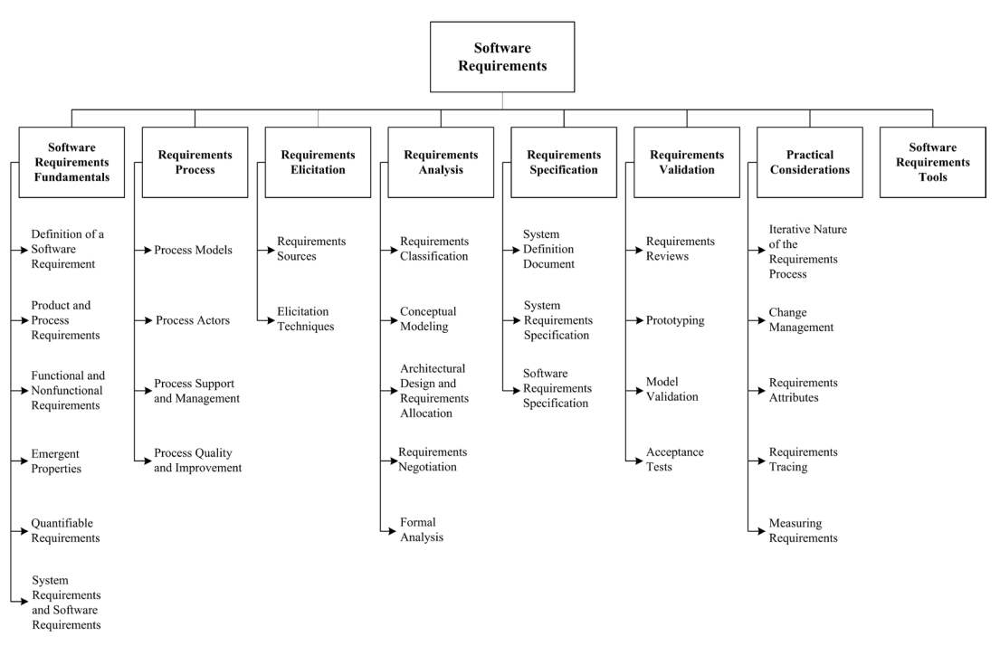

## Chapter 1: Software Requirements

**Acronyms**

- CIA - Confidentiality, Integrity, and Availability
- DAG Directed Acyclic Graph
- FSM Functional Size Measurement
- INCOSE International Council on Systems Engineering
- UML Unified Modeling Language
- SysML Systems Modeling Language

**Introduction**

The Software Requirements knowledge area (KA) is concerned with the
elicitation, analysis, specification, and validation of software requirements
as well as the management of requirements during the whole life cycle of the
software product. It is widely acknowledged amongst researchers and industry
practitioners that software projects are critically vulnerable when the
requirements-related activities are poorly performed.

Software requirements express the needs and constraints placed on a software
product that contribute to the solution of some real-world problem.

The term “requirements engineering” is widely used in the field to denote the
systematic handling of requirements. For reasons of consistency, the term
“engineering” will not be used in this KA other than for software engineering
per se.

For the same reason, “requirements engineer,” a term which appears in some of
the literature, will not be used either. Instead, the term “software engineer”
or, in some specific cases, “requirements specialist” will be used, the latter
where the role in question is usually performed by an individual other than a
software engineer. This does not imply, however, that a software engineer could
not perform the function.

A risk inherent in the proposed breakdown is that a waterfall-like process may
be inferred. To guard against this, topic 2, Requirements Process, is designed
to provide a high-level overview of the requirements process by setting out the
resources and constraints under which the process operates and which act to
configure it.

An alternate decomposition could use a product-based structure (system
requirements, software requirements, prototypes, use cases, and so on). The
process-based breakdown reflects the fact that the requirements process, if it
is to be successful, must be considered as a process involving complex, tightly
coupled activities (both sequential and concurrent), rather than as a discrete,
one-off activity performed at the outset of a software development project.

The Software Requirements KA is related closely to the Software Design,
Software Testing, Software Maintenance, Software Configuration Management,
Software Engineering Manage- ment, Software Engineering Process, Software
Engineering Models and Methods, and Software Quality KAs.

**BREAKDOWN OF TOPICS FOR SOFTWARE REQUIREMENTS**

The breakdown of topics for the Software

Requirements KA is shown in Figure 1.1.

### 1. Software Requirements Fundamentals

<!--[1, c4, c4s1, c10s1, c10s4] [2, c1, c6, c12]-->

#### 1.1. Definition of a Software Requirement

At its most basic, a software requirement is a property that must be exhibited
by something in order to solve some problem in the real world. It may aim to
automate part of a task for someone to support the business processes of an
organization, to correct shortcomings of existing software, or to control a
device to name just a few of the many problems for which software solutions are
possible. The ways in which users, business processes, and devices function are
typically complex. By extension, therefore, the requirements on particular
software are typically a complex combination from various people at different
levels of an organization, and who are in one way or another involved or
connected with this feature from the environment in which the software will
operate.

An essential property of all software requirements is that they be verifiable
as an individual feature as a functional requirement or at the system level as
a nonfunctional requirement. It may be difficult or costly to verify certain
software requirements. For example, verification of the throughput requirement
on a call center may necessitate the development of simulation software.
Software requirements, software testing, and quality personnel must ensure that
the requirements can be verified within available resource constraints.

Requirements have other attributes in addition to behavioral properties. Common
examples include a priority rating to enable tradeoffs in the face of finite
resources and a status value to enable project progress to be monitored.
Typically, software requirements are uniquely identi- fied so that they can be
subjected to software configuration management over the entire life cycle of
the feature and of the software.

#### 1.2. Product and Process Requirements

A product requirement is a need or constraint on the software to be developed
(for example, “The software shall verify that a student meets all prerequisites
before he or she registers for a course”). A process requirement is essentially
a constraint on the development of the software (for example, “The software
shall be developed using a RUP process”).

Some software requirements generate implicit process requirements. The choice
of verification technique is one example. Another might be the use of
particularly rigorous analysis techniques (such as formal specification
methods) to reduce faults that can lead to inadequate reliability. Process
requirements may also be imposed directly by the development organization,
their customer, or a third party such as a safety regulator.

#### 1.3. Functional and Nonfunctional Requirements

_Functional_ requirements describe the functions that the software is to
execute; for example, formatting some text or modulating a signal. They are
sometimes known as capabilities or features. A functional requirement can also
be described as one for which a finite set of test steps can be written to
validate its behavior.

_Nonfunctional_ requirements are the ones that act to constrain the solution.
Nonfunctional requirements are sometimes known as constraints or quality
requirements. They can be further classified according to whether they are
performance requirements, maintainability requirements, safety requirements,
reliability requirements, security requirements, interoperability requirements
or one of many other types of software requirements (see Models and Quality
Characteristics in the Software Quality KA).

#### 1.4. Emergent Properties

Some requirements represent emergent properties of software that is,
requirements that can- not be addressed by a single component but that depend
on how all the software components interoperate. The throughput requirement for
a call center would, for example, depend on how the telephone system,
information system, and the operators all interacted under actual operating
conditions. Emergent properties are crucially dependent on the system
architecture.

#### 1.5. Quantifiable Requirements

Software requirements should be stated as clearly and as unambiguously as
possible, and, where appropriate, quantitatively. It is important to avoid
vague and unverifiable requirements that depend for their interpretation on
subjective judgment (“the software shall be reliable”; “the software shall be
user-friendly”). This is particularly important for nonfunctional requirements.
Two examples of quantified requirements are the following: a call center’s
software must increase the center’s throughput by 20%; and a system shall have
a probability of generating a fatal error during any hour of operation of less
than 1 * 10^-8. The throughput requirement is at a very high level and will
need to be used to derive a number of detailed requirements. The reliability
requirement will tightly constrain the system architecture.

#### 1.6. System Requirements and Software Requirements

In this topic, “system” means

an interacting combination of elements to accomplish a defined objective. These
include hardware, software, firmware, people, information, techniques,
facilities, services, and other support elements,

as defined by the International Council on Software and Systems
Engineering (INCOSE) [3].

_System_ requirements are the requirements for the system as a whole. In a system
containing software components, software requirements are derived from _system_
requirements. This KA defines “user requirements” in a restricted way, as the
requirements of the system’s customers or end users. System requirements, by
contrast, encompass user requirements, requirements of other stakeholders (such
as regulatory authorities), and requirements without an identifiable human
source.

### 2. Requirements Process

<!-- [1*, c4s4] [2*, c1–4, c6, c22, c23] -->

This section introduces the software requirements process, orienting the
remaining five topics and showing how the requirements process dovetails with
the overall software engineering process.

#### 2.1. Process Models

The objective of this topic is to provide an understanding that the
requirements process

- is not a discrete front-end activity of the soft- ware life cycle, but rather
  a process initiated at the beginning of a project that continues to be
  refined throughout the life cycle;
- identifies software requirements as configu- ration items and manages them
  using the same software configuration management practices as other products
  of the software life cycle processes;
- needs to be adapted to the organization and project context.

In particular, the topic is concerned with how the activities of elicitation,
analysis, specification, and validation are configured for different types of
projects and constraints. The topic also includes activities that provide input
into the requirements process, such as marketing and feasibility studies.

#### 2.2. Process Actors

This topic introduces the roles of the people who participate in the
requirements process. This process is fundamentally interdisciplinary, and the
requirements specialist needs to mediate between the domain of the stakeholder
and that of software engineering. There are often many people involved besides
the requirements specialist, each of whom has a stake in the software. The
stakeholders will vary across projects, but will always include users/operators
and customers (who need not be the same). Typical examples of software
stakeholders include (but are not restricted to) the following:

- Users: This group comprises those who will operate the software. It is often
  a heterogeneous group involving people with different roles and
  requirements.
- Customers: This group comprises those who have commissioned the software or
  who represent the software’s target market.
- Market analysts: A mass-market product will not have a commissioning
  customer, so marketing people are often needed to estab- lish what the market
  needs and to act as proxy customers.
- Regulators: Many application domains, such as banking and public transport,
  are regulated. Software in these domains must comply with the
  requirements of the regulatory authorities.
- Software engineers: These individuals have a legitimate interest in profiting
  from developing the software by, for example, reusing components in or from
  other products. If, in this scenario, a customer of a particular product has
  specific requirements that compromise the potential for component reuse, the
  software engineers must carefully weigh their own stake against those of the
  customer. Specific requirements, particularly constraints, may have major
  impact on project cost or delivery because they either fit well or poorly
  with the skill set of the engineers. Important tradeoffs among such
  requirements should be identified.

It will not be possible to perfectly satisfy the requirements of every
stakeholder, and it is the software engineer’s job to negotiate tradeoffs that
are both acceptable to the principal stakeholders and within budgetary,
technical, regulatory, and other constraints. A prerequisite for this is that
all the stakeholders be identified, the nature of their “stake” analyzed, and
their requirements elicited.

#### 2.3. Process Support and Management

This section introduces the project management resources required and consumed
by the requirements process. It establishes the context for the first topic
(Initiation and Scope Definition) of the Software Engineering Management KA.
Its principal purpose is to make the link between the pro- cess activities
identified in 2.1 and the issues of cost, human resources, training, and tools.

#### 2.4. Process Quality and Improvement

This topic is concerned with the assessment of the quality and improvement of
the requirements process. Its purpose is to emphasize the key role the
requirements process plays in terms of the cost and timeliness of a software
product and of the customer’s satisfaction with it. It will help to orient the
requirements process with quality standards and process improvement models for
soft- ware and systems. Process quality and improvement is closely related to
both the Software Quality KA and Software Engineering Process KA, comprising

- requirements process coverage by process improvement standards and models;
- requirements process measures and benchmarking;
- improvement planning and implementation;
- security/CIA improvement/planning and implementation.

### 3. Requirements Elicitation

<!-- [1, c4s5] [2, c5, c6, c9] -->

Requirements elicitation is concerned with the origins of software requirements
and how the software engineer can collect them. It is the first stage in
building an understanding of the problem the software is required to solve. It
is fundamentally a human activity and is where the stakeholders are
identified and relationships established between the development team and the
customer. It is variously termed “requirements capture,” “requirements
discovery,” and “requirements acquisition.”

One of the fundamental principles of a good requirements elicitation process is
that of effective communication between the various stake- holders. This
communication continues through the entire Software Development Life Cycle
(SDLC) process with different stakeholders at different points in time. Before
development begins, requirements specialists may form the conduit for this
communication. They must mediate between the domain of the software users (and
other stakeholders) and the technical world of the software engineer. A set of
internally consistent models at different levels of abstraction facilitate
communications between software users/stakeholders and software engineers.

A critical element of requirements elicitation is informing the project scope.
This involves providing a description of the software being specified and its
purpose and prioritizing the deliverables to ensure the customer’s most
important business needs are satisfied first. This minimizes the risk of
requirements specialists spending time eliciting requirements that are of low
importance, or those that turn out to be no longer relevant when the software
is delivered. On the other hand, the description must be scalable and
extensible to accept further requirements not expressed in the first formal
lists and compatible with the previous ones as contemplated in recursive
methods.

#### 3.1. Requirements Sources

Requirements have many sources in typical software, and it is essential that
all potential sources be identified and evaluated. This topic is designed to
promote awareness of the various sources of software requirements and of the
frameworks for managing them. The main points covered are as follows:

- Goals. The term “goal” (sometimes called “business concern” or “critical
  success factor”) refers to the overall, high-level objec- tives of the
  software. Goals provide the motivation for the software but are often vaguely
  formulated. Software engineers need to pay particular attention to assessing
  the value (relative to priority) and cost of goals. A feasibility study is a
  relatively low-cost way of doing this.
- Domain knowledge. The software engineer needs to acquire or have available
  knowledge about the application domain. Domain knowledge provides the
  background against which all elicited requirements knowledge must be set in
  order to understand it. It’s a good practice to emulate an ontological
  approach in the knowledge domain. Relations between relevant concepts within
  the application domain should be identified.
- Stakeholders (see section 2.2, Process Actors). Much software has proved
  unsatisfactory because it has stressed the require- ments of one group of
  stakeholders at the expense of others. Hence, the delivered software is
  difficult to use, or subverts the cultural or political structures of the
  customer organization. The software engineer needs to identify, represent,
  and manage the “viewpoints” of many different types of stakeholders.
- Business rules. These are statements that define or constrain some aspect of
  the structure or the behavior of the business itself. “A student cannot
  register in next semester’s courses if there remain some unpaid tuition fees”
  would be an example of a business rule that would be a requirement source for
  a university’s course-registration software.
- The operational environment. Requirements will be derived from the
  environment in which the software will be executed. These may be, for
  example, timing constraints in real-time software or performance constraints
  in a business environment. These must be sought out actively because they can
  greatly affect software feasibility and cost as well as restrict design
  choices.
- The organizational environment. Software is often required to support a
  business process, the selection of which may be condi- tioned by the
  structure, culture, and internal politics of the organization. The software
  engineer needs to be sensitive to these since, in general, new software
  should not force unplanned change on the business process.

#### 3.2. Elicitation Techniques

Once the requirements sources have been identified, the software engineer can
start eliciting requirements information from them. Note that requirements are
seldom elicited ready-made. Rather, the software engineer elicits information
from which he or she formulates requirements. This topic concentrates on
techniques for getting human stakeholders to articulate requirements-relevant
information. It is a very difficult task and the software engineer needs to be
sensitized to the fact that (for example) users may have difficulty describing
their tasks, may leave important information unstated, or may be unwilling or
unable to cooperate. It is particularly important to understand that
elicitation is not a passive activity and that, even if cooperative and
articulate stakeholders are available, the software engineer has to work hard
to elicit the right information. Many business or technical requirements are
tacit or in feedback that has yet to be obtained from end users. The impor
tance of planning, verification, and validation in requirements elicitation
cannot be overstated. A number of techniques exist for requirements
elicitation; the principal ones are these:

- Interviews. Interviewing stakeholders is a “traditional” means of eliciting
  requirements. It is important to understand the advantages and limitations of
  interviews and how they should be conducted.
- Scenarios. Scenarios provide a valuable means for providing context to the
  elicitation of user requirements. They allow the software engineer to provide
  a framework for questions about user tasks by permitting “what if” and “how
  is this done” questions to be asked. The most common type of scenario is the
  use case description. There is a link here to topic 4.2 (Conceptual Modeling)
  because scenario notations such as use case diagrams are common in modeling
  software.
- Prototypes. This technique is a valuable tool for clarifying ambiguous
  requirements. They can act in a similar way to scenarios by providing users
  with a context within which they can better understand what information they
  need to provide. There is a wide range of prototyping techniques from paper
  mockups of screen designs to beta-test versions of software products and a
  strong overlap of their separate uses for requirements elicitation and for
  requirements validation (see section 6.2, Prototyping). Low fidelity
  prototypes are often preferred to avoid stakeholder “anchoring” on minor,
  incidental characteristics of a higher quality prototype that can limit
  design flexibility in unintended ways.
- Facilitated meetings. The purpose of these meetings is to try to achieve a
  summative effect, whereby a group of people can bring more insight into their
  software requirements than by working individually. They can brainstorm and
  refine ideas that may be difficult to bring to the surface using interviews.
  Another advantage is that conflicting requirements surface early on in a way
  that lets the stakeholders recognize where these occur. When it works well,
  this technique may result in a richer and more consistent set of requirements
  than might otherwise be achievable. However, meetings need to be handled
  carefully (hence the need for a facilitator) to prevent a situation in which
  the critical abilities of the team are eroded by group loyalty, or in which
  requirements reflecting the concerns of a few outspoken (and perhaps senior)
  people that are favored to the detriment of others.
- Observation. The importance of software context within the organizational
  environment has led to the adaptation of observa- tional techniques such as
  ethnography for requirements elicitation. Software engineers learn about user
  tasks by immersing themselves in the environment and observing how users
  perform their tasks by interacting with each other and with software tools
  and other resources. These techniques are relatively expensive but also
  instructive because they illustrate that many user tasks and business
  processes are too subtle and complex for their actors to describe easily.
- User stories. This technique is commonly used in adaptive methods (see Agile
  Methods in the Software Engineering Models and Methods KA) and refers to
  short, high-level descriptions of required functionality expressed in
  customer terms. A typical user story has the form: _“As a <role>, I want
  <goal/desire> so that <benefit>.”_ A user story is intended to contain just
  enough information so that the developers can produce a reasonable estimate
  of the effort to implement it. The aim is to avoid some of the waste that
  often happens in projects where detailed requirements are gathered early but
  become invalid before the work begins. Before a user story is implemented, an
  appropriate acceptance procedure must be written by the customer to determine
  whether the goals of the user story have been fulfilled.
- Other techniques. A range of other techniques for supporting the elicitation
  of requirements information exist and range from analyzing competitors’
  products to applying data mining techniques to using sources of domain
  knowledge or customer request databases.

### 4. Requirements Analysis

<!-- [1*, c4s1, c4s5, c10s4, c12s5] [2*, c7, c11, c12, c17] -->

This topic is concerned with the process of analyzing requirements to

- detect and resolve conflicts between requirements;
- discover the bounds of the software and how it must interact with its
  organizational and operational environment;
- elaborate system requirements to derive software requirements.

The traditional view of requirements analysis has been that it be reduced to
conceptual modeling using one of a number of analysis methods, such as the
structured analysis method. While conceptual modeling is important, we include
the classification of requirements to help inform tradeoffs between
requirements (requirements classification) and the process of establishing
these tradeoffs (requirements negotiation). Care must be taken to describe
requirements precisely enough to enable the requirements to be validated, their
implementation to be verified, and their costs to be estimated.

#### 4.1. Requirements Classification

Requirements can be classified on a number of dimensions. Examples include the
following:

- Whether the requirement is functional or nonfunctional (see section 1.3,
  Functional and Nonfunctional Requirements).
- Whether the requirement is derived from one or more high-level requirements
  or an emergent property (see section 1.4, Emergent Properties), or is being
  imposed directly on the software by a stakeholder or some other source.
- Whether the requirement is on the product or the process (see section 1.2,
  Product and Process Requirements). Requirements on the process can constrain
  the choice of contractor, the software engineering process to be adopted,
  or the standards to be adhered to.
- The requirement priority. The higher the priority, the more essential the
  requirement is for meeting the overall goals of the software. Often
  classified on a fixed-point scale such as mandatory, highly desirable,
  desirable, or optional, the priority often has to be balanced against the
  cost of development and implementation.
- The scope of the requirement. Scope refers to the extent to which a
  requirement affects the software and software components. Some requirements,
  particularly certain nonfunctional ones, have a global scope in that their
  satisfaction cannot be allocated to a discrete component. Hence, a
  requirement with global scope may strongly affect the software architecture
  and the design of many components, whereas one with a narrow scope may offer
  a number of design choices and have little impact on the satisfaction of
  other requirements.
- Volatility/stability. Some requirements will change during the life cycle of
  the software and even during the development process itself. It is useful if
  some estimate of the likelihood that a requirement will change can be made.
  For example, in a banking application, requirements for functions to
  calculate and credit interest to customers’ accounts are likely to be more
  stable than a requirement to support a particular kind of tax-free account.
  The former reflects a fundamental feature of the banking domain (that
  accounts can earn interest), while the latter may be rendered obsolete by a
  change to government legislation. Flagging potentially volatile requirements
  can help the software engineer establish a design that is more tolerant of
  change.

Other classifications may be appropriate, depending upon the organization’s
normal practice and the application itself. There is a strong overlap between
requirements classification and requirements attributes (see section 7.3,
Requirements Attributes).

#### 4.2. Conceptual Modeling

The development of models of a real-world problem is key to software
requirements analysis. Their purpose is to aid in understanding the situation
in which the problem occurs, as well as depicting a solution. Hence, conceptual
models comprise models of entities from the problem domain, configured to
reflect their real-world relationships and dependencies. This topic is closely
related to the Software Engineering Models and Methods KA.

Several kinds of models can be developed. These include use case diagrams, data
flow models, state models, goal-based models, user interactions, object models,
data models, and many others. Many of these modeling notations are part of the
_Unified Modeling Language (UML)_. Use case diagrams, for example, are routinely
used to depict scenarios where the boundary separates the actors (users or
systems in the external environment) from the internal behavior where each use
case depicts a functionality of the system. The factors that influence the
choice of modeling notation include these:

- The nature of the problem. Some types of software demand that certain aspects
  be analyzed particularly rigorously. For example, state and parametric
  models, which are part of SysML [4], are likely to be more important for
  real-time software than for information systems, while it would usually be
  the opposite for object and activity models.
- The expertise of the software engineer. It is often more productive to adopt
  a modeling notation or method with which the software engineer has
  experience.
- The process requirements of the customer (see section 1.2, Product and
  Process Requirements). Customers may impose their favored notation or method
  or prohibit any with which they are unfamiliar. This factor can conflict with
  the previous factor.

Note that, in almost all cases, it is useful to start by building a model of
the software context. The software context provides a connection between the
intended software and its external environment.

This is crucial to understanding the software’s context in its operational
environment and to identifying its interfaces with the environment. This
subtopic does not seek to “teach” a particular modeling style or notation but
rather provides guidance on the purpose and intent of modeling.

#### 4.3. Architectural Design and Requirements Allocation

At some point, the solution architecture must be derived. Architectural design
is the point at which the requirements process overlaps with software or
systems design and illustrates how impossible it is to cleanly decouple the two
tasks. This topic is closely related to Software Structure and Architecture in
the Software Design KA. In many cases, the software engineer acts as software
architect because the process of analyzing and elaborating the requirements
demands that the architecture/design components that will be responsible for
satisfying the requirements be identified. This is requirements allocation –
the assignment to architecture components responsible for satisfying the
requirements.

Allocation is important to permit detailed analysis of requirements. Hence, for
example, once a set of requirements has been allocated to a component, the
individual requirements can be further analyzed to discover further
requirements on how the component needs to interact with other components in
order to satisfy the allocated requirements. In large projects, allocation
stimulates a new round of analysis for each subsystem. As an example,
requirements for a particular braking performance for a car (braking distance,
safety in poor driving conditions, smoothness of application, pedal pressure
required, and so on) may be allocated to the braking hardware (mechanical and
hydraulic assemblies) and an antilock braking system (ABS). Only when a
requirement for an antilock braking system has been identified, and the
requirements allocated to it, can the capabilities of the ABS, the braking
hardware, and emer- gent properties (such as car weight) be used to identify
the detailed ABS software requirements.

Architectural design is closely identified with conceptual modeling (see
section 4.2, Conceptual Modeling).

#### 4.4. Requirements Negotiation

Another term commonly used for this subtopic is “conflict resolution.” This
concerns resolving problems with requirements where conflicts occur between two
stakeholders requiring mutually incompatible features, between requirements and
resources, or between functional and non-functional requirements, for example.
In most cases, it is unwise for the software engineer to make a unilateral
decision, so it becomes necessary to consult with the stakeholder(s) to reach a
consensus on an appropriate tradeoff. It is often important, for contractual
reasons, that such decisions be traceable back to the customer. We have
classified this as a software requirements analysis topic because problems
emerge as the result of analysis. However, a strong case can also be made for
considering it a requirements validation topic (see topic 6, Requirements
Validation).

Requirements prioritization is necessary, not only as a means to filter
important requirements, but also in order to resolve conflicts and plan for
staged deliveries, which means making complex decisions that require detailed
domain knowledge and good estimation skills. However, it is often difficult to
get real information that can act as a basis for such decisions. In addition,
requirements often depend on each other, and priorities are relative. In
practice, software engineers perform requirements prioritization frequently
without knowing about all the requirements. Requirements prioritization may
follow a cost-value approach that involves an analysis from the stakeholders
defining in a scale the benefits or the aggregated value that the
implementation of the requirement brings them, versus the penalties of not
having implemented a particular requirement. It also involves an analysis from
the software engineers estimating in a scale the cost of implementing each
requirement, relative to other requirements. Another requirements
prioritization approach called the analytic hierarchy process involves
comparing all unique pairs of requirements to determine which of the two is of
higher priority, and to what extent.

#### 4.5. Formal Analysis

Formal analysis concerns not only topic 4, but also sections 5.3 and 6.3. This
topic is also related to Formal Methods in the Software Engineering Models and
Methods Knowledge Area.

Formal analysis has made an impact on some application domains, particularly
those of high-integrity systems. The formal expression of requirements requires
a language with formally defined semantics. The use of a formal analysis for
requirements expression has two benefits. First, it enables requirements
expressed in the language to be specified precisely and unambiguously, thus (in
principle) avoiding the potential for misinterpretation. Secondly, requirements
can be reasoned over, permitting desired properties of the specified software
to be proven. Formal reasoning requires tool support to be practicable for
anything other than trivial systems, and tools generally fall into two types:
theorem provers or model checkers. In neither case can proof be fully
automated, and the level of competence in formal reasoning needed in order to
use the tools restricts the wider application of formal analysis.

Most formal analysis is focused on relatively late stages of requirements
analysis. It is generally counterproductive to apply formalization until the
business goals and user requirements have come into sharp focus through means
such as those described elsewhere in section 4. However, once the requirements
have stabilized and have been elaborated to specify concrete properties of the
software, it may be beneficial to formalize at least the critical requirements.
This permits static validation that the software specified by the requirements
does indeed have the properties (for example, absence of deadlock) that the
customer, users, and software engineer expect it to have.

### 5. Requirements Specification

<!-- [1*, c4s2, c4s3, c12s2–5] [2*, c10] -->

For most engineering professions, the term “specification” refers to the
assignment of numerical values or limits to a product’s design goals. In
software engineering, “software requirements specification” typically refers to
the production of a document that can be systematically reviewed, evaluated,
and approved. For complex systems, particularly those involving substantial
nonsoftware components, as many as three different types of documents are
produced: system definition, system requirements, and software requirements.
For simple software products, only the third of these is required. All three
documents are described here, with the understanding that they may be combined
as appropriate. A description of systems engineering can be found in the
Related Disciplines of Software Engineering chapter of this _Guide_.

#### 5.1. System Definition Document

This document (sometimes known as the user requirements document or concept of
operations document) records the system requirements. It defines the high-level
system requirements from the domain perspective. Its readership includes
representatives of the system users/customers (marketing may play these roles
for market-driven software), so its content must be couched in terms of the
domain. The document lists the system requirements along with background
information about the overall objectives for the system, its target
environment, and a statement of the constraints, assumptions, and
nonfunctional requirements. It may include conceptual models designed to
illustrate the system context, usage scenarios, and the principal domain
entities, as well as workflows.

#### 5.2. System Requirements Specification

Developers of systems with substantial software and nonsoftware components - a
modern airliner, for example - often separate the description of system
requirements from the description of software requirements. In this view,
system requirements are specified, the software requirements are derived from
the system requirements, and then the requirements for the software components
are specified. Strictly speaking, system requirements specification is a
systems engineering activity and falls outside the scope of this Guide.

#### 5.3. Software Requirements Specification

Software requirements specification establishes the basis for agreement between
customers and contractors or suppliers (in market-driven projects, these
roles may be played by the marketing and development divisions) on what the
software product is to do as well as what it is not expected to do.

Software requirements specification permits a rigorous assessment of
requirements before design can begin and reduces later redesign. It should also
provide a realistic basis for estimating product costs, risks, and schedules.

Organizations can also use a software requirements specification document as
the basis for developing effective verification and validation plans.

Software requirements specification provides an informed basis for transferring
a software product to new users or software platforms. Finally, it can provide
a basis for software enhancement.

Software requirements are often written in natural language, but, in software
requirements specification, this may be supplemented by formal or semiformal
descriptions. Selection of appropriate notations permits particular
requirements and aspects of the software architecture to be described more
precisely and concisely than natural language. The general rule is that
notations should be used that allow the requirements to be described as
precisely as possible. This is particularly crucial for safety-critical,
regulatory, and certain other types of dependable software. However, the choice
of notation is often constrained by the training, skills, and preferences of
the document’s authors and readers.

A number of quality indicators have been developed that can be used to relate
the quality of software requirements specification to other project variables
such as cost, acceptance, performance, schedule, and reproducibility. Quality
indicators for individual software requirements specification statements
include imperatives, directives, weak phrases, options, and continuances.
Indicators for the entire software require- ments specification document
include size, readability, specification, depth, and text structure.

### 6. Requirements Validation

<!-- [1, c4s6] [2, c13, c15] -->

The requirements documents may be subject to validation and verification
procedures. The requirements may be validated to ensure that the software
engineer has understood the requirements; it is also important to verify that a
requirements document conforms to company standards and that it is
understandable, consistent, and complete. In cases where documented company
standards or terminology are inconsistent with widely accepted standards, a
mapping between the two should be agreed on and appended to the document.
Formal notations offer the important advantage of permitting the last two
properties to be proven (in a restricted sense, at least). Different
stakeholders, including representatives of the customer and developer, should
review the document(s).  Requirements documents are subject to the same
configuration management practices as the other deliverables of the software
life cycle processes.  When practical, the individual requirements are also
subject to configuration management, generally using a requirements management
tool (see topic 8, Software Requirements Tools). It is normal to explicitly
schedule one or more points in the requirements process where the requirements
are validated. The aim is to pick up any problems before resources are
committed to addressing the requirements. Requirements validation is concerned
with the process of examining the requirements document to ensure that it
defines the right software (that is, the software that the users expect).

#### 6.1. Requirements Reviews

Perhaps the most common means of validation is by inspection or reviews of the
requirements document(s). A group of reviewers is assigned a brief to look for
errors, mistaken assumptions, lack of clarity, and deviation from standard
practice. The composition of the group that conducts the review is important
(at least one representative of the customer should be included for a
customer-driven project, for example), and it may help to provide guidance on
what to look for in the form of checklists.

Reviews may be constituted on completion of the system definition document, the
system specification document, the software requirements specification
document, the baseline specification for a new release, or at any other step in
the process.

#### 6.2. Prototyping

Prototyping is commonly a means for validating the software engineer’s
interpretation of the software requirements, as well as for eliciting new
requirements. As with elicitation, there is a range of prototyping techniques
and a number of points in the process where prototype validation may be
appropriate. The advantage of prototypes is that they can make it easier to
interpret the software engineer’s assumptions and, where needed, give useful
feedback on why they are wrong. For example, the dynamic behavior of a user
interface can be better understood through an animated prototype than through
textual description or graphical models. The volatility of a requirement that
is defined after prototyping has been done is extremely low because there is
agreement between the stakeholder and the software engineer - therefore, for
safety-critical and crucial features prototyping would really help. There are
also disadvantages, however. These include the danger of users’ attention being
distracted from the core underlying functionality by cosmetic issues or quality
problems with the prototype. For this reason, some advocate prototypes that
avoid software, such as flip-chart-based mockups. Prototypes may be costly to
develop. However, if they avoid the wastage of resources caused by trying to
satisfy erroneous requirements, their cost can be more easily justified. Early
prototypes may contain aspects of the final solution. Prototypes may be
evolutionary as opposed to throwaway.

#### 6.3. Model Validation

It is typically necessary to validate the quality of the models developed
during analysis. For example, in object models, it is useful to perform a
static analysis to verify that communication paths exist between objects that,
in the stakeholders’ domain, exchange data. If formal analysis notations are
used, it is possible to use formal reasoning to prove specification properties.
This topic is closely related to the Software Engineering Models and Methods
KA.

#### 6.4. Acceptance Tests

An essential property of a software requirement is that it should be possible
to validate that the finished product satisfies it. Requirements that cannot be
validated are really just “wishes.” An important task is therefore planning how
to verify each requirement. In most cases, designing acceptance tests does this
for how end-users typically conduct business using the system. Identifying and
designing acceptance tests may be difficult for nonfunctional requirements
(see section 1.3, Functional and Nonfunctional Requirements). To be
validated, they must first be analyzed and decomposed to the point where
they can be expressed quantitatively. Additional information can be found
in Acceptance/Qualification/Conformance Testing in the Software Testing KA.

### 7. Practical Considerations

<!-- [1*, c4s1, c4s4, c4s6, c4s7] [2*, c3, c12, c14, c16, c18–21] -->

The first level of topic decomposition presented in this KA may seem to
describe a linear sequence of activities. This is a simplified view of the
process.

The requirements process spans the whole software life cycle. Change management
and the maintenance of the requirements in a state that accurately mirrors the
software to be built, or that has been built, are key to the success of the
software engineering process.

Not every organization has a culture of documenting and managing requirements.
It is com- mon in dynamic start-up companies, driven by a strong “product
vision” and limited resources, to view requirements documentation as
unnecessary overhead. Most often, however, as these companies expand, as their
customer base grows, and as their product starts to evolve, they discover that
they need to recover the requirements that motivated product features in order
to assess the impact of proposed changes. Hence, requirements documentation and
change management are key to the success of any requirements process.

#### 7.1. Iterative Nature of the Requirements Process

There is general pressure in the software industry for ever shorter development
cycles, and this is particularly pronounced in highly competitive,
market-driven sectors. Moreover, most projects are constrained in some way by
their environment, and many are upgrades to, or revisions of, existing software
where the architecture is a given. In practice, therefore, it is almost always
impractical to implement the requirements process as a linear, deterministic
process in which software requirements are elicited from the stakeholders,
baselined, allocated, and handed over to the software development team. It is
certainly a myth that the requirements for large software projects are ever
perfectly understood or perfectly specified. Instead, requirements typically
iterate towards a level of quality and detail that is sufficient to permit
design and procurement decisions to be made. In some projects, this may result
in the requirements being baselined before all their properties are fully
understood. This risks expensive rework if problems emerge late in the soft-
ware engineering process. However, software engineers are necessarily
constrained by project management plans and must therefore take steps to ensure
that the “quality” of the requirements is as high as possible given the
available resources. They should, for example, make explicit any assumptions
that underpin the requirements as well as any known problems.
For software products that are developed iteratively, a project team may
baseline only those requirements needed for the current iteration. The
requirements specialist can continue to develop requirements for future
iterations, while developers proceed with design and construction of the
current iteration. This approach provides customers with business value
quickly, while minimizing the cost of rework.

In almost all cases, requirements understanding continues to evolve as design
and development proceeds. This often leads to the revision of requirements late
in the life cycle. Perhaps the most crucial point in understanding software
requirements is that a significant proportion of the requirements will change.
This is sometimes due to errors in the analysis, but it is frequently an
inevitable consequence of change in the “environment” - for example, the
customer’s operating or business environment, regulatory processes imposed by
the authorities, or the market into which software must sell. Whatever the
cause, it is important to recognize the inevitability of change and take steps
to mitigate its effects. Change has to be managed by ensuring that proposed
changes go through a defined review and approval process and by applying
careful requirements tracing, impact analysis, and software configuration
management (see the Software Configuration Management KA). Hence, the
requirements process is not merely a front-end task in software development,
but spans the whole software life cycle. In a typical project, the software
requirements activities evolve over time from elicitation to change management.
A combination of top-down analysis and design methods and bottom-up
implementation and refactoring methods that meet in the middle could provide
the best of both worlds. However, this is difficult to achieve in practice, as
it depends heavily upon the maturity and expertise of the software engineers.

#### 7.2. Change Management

Change management is central to the management of requirements. This topic
describes the role of change management, the procedures that need to be in
place, and the analysis that should be applied to proposed changes. It has
strong links to the Software Configuration Management KA.

#### 7.3. Requirements Attributes

Requirements should consist not only of a specification of what is required,
but also of ancillary information, which helps manage and interpret the
requirements. Requirements attributes must be defined, recorded, and updated as
the software under development or maintenance evolves. This should include the
various classification dimensions of the requirement (see section 4.1,
Requirements Classification) and the verification method or relevant acceptance
test plan section. It may also include additional information, such as a
summary rationale for each requirement, the source of each requirement, and a
change history. The most important requirements attribute, however, is an
identifier that allows the requirements to be uniquely and unambiguously
identified.

#### 7.4. Requirements Tracing

Requirements tracing is concerned with recover- ing the source of requirements
and predicting the effects of requirements. Tracing is fundamental to
performing impact analysis when requirements change. A requirement should be
traceable backward to the requirements and stakeholders that motivated it (from
a software requirement back to the system requirement(s) that it helps satisfy,
for example). Conversely, a requirement should be traceable forward into the
requirements and design entities that satisfy it (for example, from a
system requirement into the software requirements that have been elaborated
from it, and on into the code modules that implement it, or the test cases
related to that code and even a given section on the user manual which
describes the actual functionality) and into the test case that verifies
it.

The requirements tracing for a typical project will form a complex directed
acyclic graph (DAG) (see Graphs in the Computing Foundations KA) of
requirements. Maintaining an up-to-date graph or traceability matrix is an
activity that must be considered during the whole life cycle of a product. If
the traceability information is not updated as changes in the requirements
continue to happen, the traceability information becomes unreliable for impact
analysis.

#### 7.5. Measuring Requirements

As a practical matter, it is typically useful to have some concept of the
“volume” of the requirements for a particular software product. This number is
useful in evaluating the “size” of a change in requirements, in estimating the
cost of a development or maintenance task, or simply for use as the denominator
in other measurements. Functional size measurement (FSM) is a technique for
evaluating the size of a body of functional requirements. Additional
information on size measurement and standards will be found in the Software
Engineering Process KA.

### 8. Software Requirements Tools

Tools for dealing with software requirements fall broadly into two categories:
tools for modeling and tools for managing requirements. Requirements management
tools typically support a range of activities - including documentation,
tracing, and change management and have had a significant impact on practice.
Indeed, tracing and change management are really only prac- ticable if
supported by a tool. Since requirements management is fundamental to good
requirements practice, many organizations have invested in requirements
management tools, although many more manage their requirements in more ad hoc
and generally less satisfactory ways (e.g., using spreadsheets).

### Matrix of topics vs. Reference material

Sommerville 2011

##### [1]

Wiegers 2003

##### [2]

**1. Software Requirements Fundamentals**
    1.1. Definition of a Software Requirement c4 c1
    1.2. Product and Process Requirements c4s1 c1, c6
    1.3. Functional and Nonfunctional Requirements c4s1 c12
    1.4. Emergent Properties c10 s1
    1.5. Quantifiable Requirements c1
    1.6. System Requirements and Software Requirements c10s4 c1
**2. Requirements Process**
    2.1. Process Models c4s4 c3
    2.2. Process Actors c1, c2, c4, c6
    2.3. Process Support and Management c3
    2.4. Process Quality and Improvement c22, c23
**3. Requirements Elicitation**
    3.1. Requirements Sources c4s5 c5, c6,c9
    3.2. Elicitation Techniques c4s5 c6
**4. Requirements Analysis**
    4.1. Requirements Classification c4s1 c12
    4.2. Conceptual Modeling c4s5 c11
    4.3. Architectural Design and Requirements Allocation c10s4 c17
    4.4. Requirements Negotiation c4s5 c7
    4.5. Formal Analysis c12s5
**5. Requirements Specification**
    5.1. System Definition Document c4s2 c10
    5.2. System Requirements Specification c4s2, c12s2, c12s3, c12s4, c12s5 c10
    5.3. Software Requirements Specification c4s3 c10
**6. Requirements Validation**
    6.1. Requirements Reviews c4s6 c15
    6.2. Prototyping c4s6 c13
    6.3. Model Validation c4s6 c15
    6.4. Acceptance Tests c4s6 c15
**7. Practical Considerations**
    7.1. Iterative Nature of the Requirements Process c4s4 c3, c16
    7.2. Change Management c4s7 c18, c19
    7.3. Requirements Attributes c4s1 c12, c14
    7.4. Requirements Tracing c20
    7.5. Measuring Requirements c4s6 c18
**8. Software Requirements Tools** c21

**FURTHER READINGS**

I. Alexander and L. Beus-Dukic, _Discovering Requirements_ [5].

An easily digestible and practically oriented book on software requirements,
this is perhaps the best of current textbooks on how the various elements of
software requirements fit together. It is full of practical advice on (for
example) how to identify the various system stakeholders and how to evaluate
alternative solutions. Its coverage is exemplary and serves as a useful
reference for key techniques such as use case modeling and requirements
prioritization.

C. Potts, K. Takahashi, and A. Antón, “Inquiry- Based Requirements Analysis” [6].

This paper is an easily digested account of work that has proven to be very
influential in the development of requirements handling. It describes how and
why the elaboration of requirements cannot be a linear process by which the
analyst simply transcribes and reformulates requirements elicited from the
customer. The role of scenarios is described in a way that helps to define
their use in discovering and describing requirements.

A. van Lamsweerde, Requirements Engineering: From System Goals to UML Models to
Software Specifications [7].

Serves as a good introduction to requirements engineering but its unique value
is as a reference book for the KAOS goal-oriented requirements modelling
language. Explains why goal modelling is useful and shows how it can integrate
with mainstream modelling techniques using UML.

O. Gotel and A. Finkelstein, “An Analysis of the Requirements Traceability
Problem” [8].

This paper is a classic reference work on a key element of requirements
management. Based on empirical studies, it sets out the reasons for and the
barriers to the effective tracing of requirements. It is essential reading for
an understanding of why requirements tracing is an essential element of an
effective software process.

N. Maiden and C. Ncube, “Acquiring COTS Software Selection Requirements” [9].

This paper is significant because it recognises explicitly that software
products often integrate third-party components. It offers insights into the
problems of selecting off-the-shelf software to satisfy requirements: there is
usually a mismatch. This challenges some of the assumptions underpinning much
of traditional requirements handling, which tends to assume custom software.

**REFERENCES**

[1] I. Sommerville, _Software Engineering_ , 9th ed., Addison-Wesley, 2011.

[2] K.E. Wiegers, _Software Requirements_ , 2nd ed., Microsoft Press, 2003.

[3] INCOSE, _Systems Engineering Handbook: A Guide for System Life Cycle
Processes and Activities_ , version 3.2.2, International Council on Systems
Engineering, 2012.

[4] S. Friedenthal, A. Moore, and R. Steiner, _A Practical Guide to SysML: The
Systems Modeling Language_ , 2nd ed., Morgan Kaufmann, 2012.

[5] I. Alexander and L. Beus-Deukic, _Discovering Requirements: How to Specify
Products and Services_ , Wiley, 2009.

[6] C. Potts, K. Takahashi, and A.I. Antón, “Inquiry-Based Requirements
Analysis,” IEEE Software, vol. 11, no. 2, Mar. 1994, pp. 21–32.

[7] A. van Lamsweerde, Requirements Engineering: From System Goals to UML
Models to Software Specifications , Wiley, 2009.

[8] O. Gotel and C.W. Finkelstein, “An Analysis of the Requirements
Traceability Problem,” Proc. 1st Int’l Conf. Requirements Eng. , IEEE, 1994.

[9] N.A. Maiden and C. Ncube, “Acquiring COTS Software Selection Requirements,”
IEEE Software, vol. 15, no. 2, Mar.–Apr.  1998, pp. 46–56.
