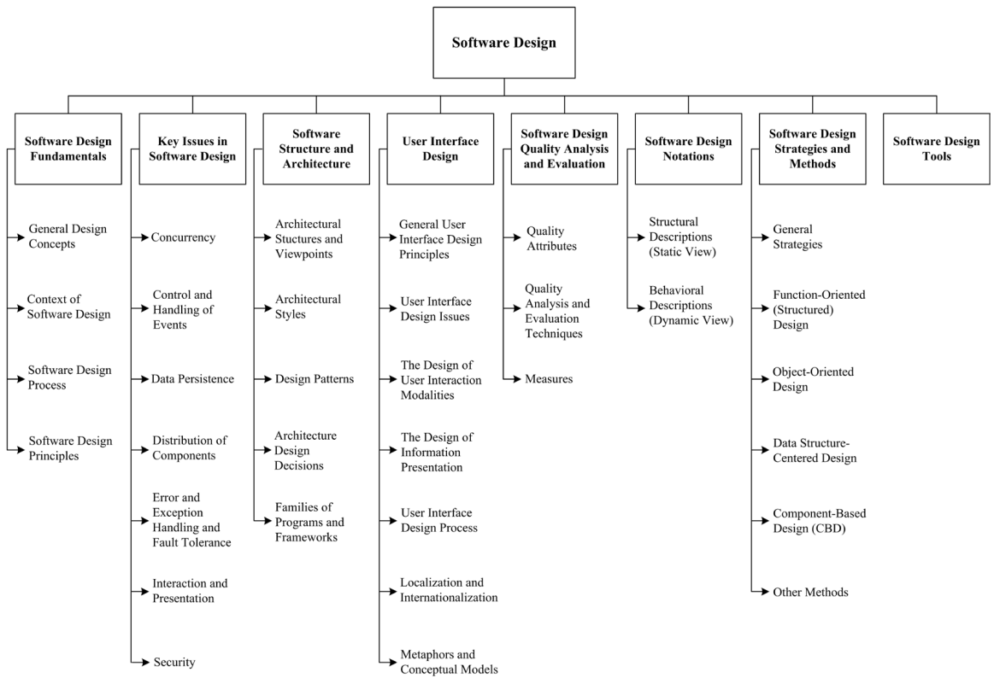

## Chapter 2: Software Design

**ACRONYMS**

ADL Architecture Description Language
CBD Component-Based Design
CRC Class Responsibility Collaborator
DFD Data Flow Diagram
ERD Entity Relationship Diagram
IDL Interface Description Language
MVC Model View Controller
OO Object-Oriented
PDL Program Design Language

**Introduction**

Design is defined as both “the process of defining the architecture,
components, interfaces, and other characteristics of a system or component” and
“the result of [that] process” [1]. Viewed as a process, software design is the
software engineering life cycle activity in which software require- ments are
analyzed in order to produce a description of the software’s internal structure
that will serve as the basis for its construction. A software design (the
result) describes the software architecture - that is, how software is
decomposed and organized into components - and the interfaces between those
components. It should also describe the components at a level of detail that
enables their construction.

Software design plays an important role in developing software: during software
design, software engineers produce various models that form a kind of blueprint
of the solution to be implemented. We can analyze and evaluate these models to
determine whether or not they will allow us to fulfill the various
requirements.

We can also examine and evaluate alternative solutions and tradeoffs. Finally,
we can use the resulting models to plan subsequent development activities, such
as system verification and validation, in addition to using them as inputs and
as the starting point of construction and testing. In a standard list of
software life cycle processes, such as that in ISO/IEC/IEEE Std. 12207,
Software Life Cycle Processes [2], software design consists of two activities
that fit between software requirements analysis and software construction:

- Software architectural design (sometimes called high-level design): develops
  top-level structure and organization of the software and identifies the
  various components.
- Software detailed design: specifies each component in sufficient detail to
  facilitate its construction.

This Software Design knowledge area (KA) does not discuss every topic that
includes the word “design.” In Tom DeMarco’s terminology [3], the topics
discussed in this KA deal mainly with D-design (decomposition design), the goal
of which is to map software into component pieces. However, because of its
importance in the field of software architecture, we will also address
FP-design (family pattern design), the goal of which is to establish
exploitable commonalities in a family of software products. This KA does not
address I-design (invention design), which is usually performed during the
software requirements process with the goal of conceptualizing and specifying
software to satisfy discovered needs and requirements, since this topic is
considered to be part of the requirements process (see the Software
Requirements KA).

This Software Design KA is related specifically to the Software Requirements,
Software Construction, Software Engineering Management, Software Engineering
Models and Methods, Software Quality, and Computing Foundations KAs.

**BREAKDOWN OF TOPICS FOR SOFTWARE DESIGN**

The breakdown of topics for the Software Design KA is shown in Figure 2.1.

### 1. Software Design Fundamentals

The concepts, notions, and terminology introduced here form an underlying basis
for understanding the role and scope of software design.

#### 1.1. General Design Concepts

<!-- [4*, c1] -->

In the general sense, design can be viewed as a form of problem solving. For
example, the concept of a wicked problem - a problem with no definitive
solution - is interesting in terms of understanding the limits of design. A
number of other notions and concepts are also of interest in understanding
design in its general sense: goals, constraints, alternatives, representations,
and solutions (see Problem Solving Techniques in the Computing Foundations KA).

#### 1.2. Context of Software Design

<!-- [4*, c3] -->

Software design is an important part of the software development process. To
understand the role of software design, we must see how it fits in the software
development life cycle. Thus, it is important to understand the major
characteristics of software requirements analysis, software design, software
construction, software testing, and software maintenance.

#### 1.3. Software Design Process

<!-- [4*, c2] -->

Software design is generally considered a two-step process:

Software Design 2-3

- Architectural design (also referred to as high-level design and top-level
  design) describes how software is organized into components.
- Detailed design describes the desired behavior of these components.

The output of these two processes is a set of models and artifacts that record
the major decisions that have been taken, along with an explana- tion of the
rationale for each nontrivial decision. By recording the rationale, long-term
maintainability of the software product is enhanced.

#### 1.4. Software Design Principles

<!-- [4] [5*, c6, c7, c21] [6*, c1, c8, c9] -->

A _principle_ is “a comprehensive and fundamental law, doctrine, or assumption”
[7]. Software design principles are key notions that provide the basis for many
different software design approaches and concepts. Software design principles
include abstraction; coupling and cohesion; decomposition and modularization;
encapsulation/information hiding; separation of interface and implementation;
sufficiency, completeness, and primitiveness; and separation of concerns.

- _Abstraction_ is “a view of an object that focuses on the information
  relevant to a particular purpose and ignores the remain- der of the
  information” [1] (see Abstraction in the Computing Foundations KA). In the
  context of software design, two key abstraction mechanisms are
  parameterization and specification. Abstraction by parameterization abstracts
  from the details of data representations by representing the data as named
  parameters. Abstraction by specification leads to three major kinds of
  abstraction: procedural abstraction, data abstraction, and control
  (iteration) abstraction.
- _Coupling and Cohesion._ Coupling is defined as “a measure of the
  interdependence among modules in a computer program,” whereas cohesion is
  defined as “a measure of the strength of association of the elements within a
  module” [1].
- _Decomposition and modularization._ Decomposing and modularizing means that
  large software is divided into a number of smaller named components having
  well-defined interfaces that describe component interactions. Usually the
  goal is to place different functionalities and responsibilities in different
  components.
- _Encapsulation and information hiding_ means grouping and packaging the
  internal details of an abstraction and making those details inaccessible to
  external entities.
- _Separation of interface and implementation._ Separating interface and
  implementation involves defining a component by specifying a public interface
  (known to the clients) that is separate from the details of how the component
  is realized (see encapsulation and information hiding above).
- _Sufficiency, completeness, and primitiveness._ Achieving sufficiency and
  completeness means ensuring that a software component captures all the
  important characteristics of an abstraction and nothing more. Primitiveness
  means the design should be based on patterns that are easy to implement.
- _Separation of concerns._ A concern is an “area of interest with respect to a
  software design” [8]. A design concern is an area of design that is relevant
  to one or more of its stakeholders. Each architecture view frames one or more
  concerns. Separating concerns by views allows interested stakeholders to
  focus on a few things at a time and offers a means of managing complexity
  [9].

### 2. Key Issues in Software Design

A number of key issues must be dealt with when designing software. Some are
quality concerns that all software must address - for example, performance,
security, reliability, usability, etc. Another important issue is how to
decompose, organize, and package software components. This is so fundamental
that all design approaches address it in one way or another (see section 1.4,
Software Design Principles, and topic 7, Software Design Strategies and
Methods). In contrast, other issues “deal with some aspect of software’s
behavior that is not in the application domain, but which addresses some of the
supporting domains” [10]. Such issues, which often crosscut the system’s
functionality, have been referred to as _aspects_ , which “tend not to be units
of software’s functional decomposition, but rather to be properties that affect
the performance or semantics of the components in systemic ways” [11]. A number
of these key, crosscutting issues are discussed in the following sections
(presented in alphabetical order).

#### 2.1. Concurrency

<!-- [5*, c18] -->

Design for concurrency is concerned with decomposing software into processes,
tasks, and threads and dealing with related issues of efficiency, atomicity,
synchronization, and scheduling.

#### 2.2. Control and Handling of Events

<!-- [5*, c21] -->

This design issue is concerned with how to organize data and control flow as
well as how to handle reactive and temporal events through various mechanisms
such as implicit invocation and call-backs.

#### 2.3. Data Persistence

<!-- [12*, c9] -->

This design issue is concerned with how to handle long-lived data.

#### 2.4. Distribution of Components

<!-- [5*, c18] -->

This design issue is concerned with how to distribute the software across the
hardware (including computer hardware and network hardware), how the components
communicate, and how middleware can be used to deal with heterogeneous
software.

#### 2.5. Error and Exception Handling and Fault Tolerance

<!-- [5*, c18] -->

This design issue is concerned with how to prevent, tolerate, and process
errors and deal with exceptional conditions.

#### 2.6. Interaction and Presentation

<!-- [5*, c16] -->

This design issue is concerned with how to structure and organize interactions
with users as well as the presentation of information (for example, separation
of presentation and business logic using the Model-View-Controller approach).
Note that this topic does not specify user interface details, which is the task
of user interface design (see topic 4, User Interface Design).

#### 2.7. Security

<!-- [5*, c12, c18] [13*, c4] -->

Design for security is concerned with how to prevent unauthorized disclosure,
creation, change, deletion, or denial of access to information and other
resources. It is also concerned with how to tolerate security-related attacks
or violations by limiting damage, continuing service, speeding repair and
recovery, and failing and recovering securely. Access control is a fundamental
concept of security, and one should also ensure the proper use of cryptology.

### 3. Software Structure and Architecture

In its strict sense, a software architecture is “the set of structures needed
to reason about the system, which comprise software elements, relations among
them, and properties of both” [14]. During the mid-1990s, however, software
architecture started to emerge as a broader discipline that involved the study
of software structures and architectures in a more generic way. This gave rise
to a number of interesting concepts about software design at different lev- els
of abstraction. Some of these concepts can be useful during the architectural
design (for example, architectural styles) as well as during the detailed
design (for example, design patterns). These design concepts can also be used
to design families of programs (also known as product lines). Interestingly,
most of these concepts can be seen as attempts to describe, and thus reuse,
design knowledge.

Software Design 2-5

#### 3.1. Architectural Structures and Viewpoints

<!-- [14*, c1] -->

Different high-level facets of a software design can be described and
documented. These facets are often called views: “A view represents a partial
aspect of a software architecture that shows specific properties of a software
system” [14]. Views pertain to distinct issues associated with software design
- for example, the logical view (satisfying the functional requirements) vs.
the process view (concurrency issues) vs. the physical view (distribution
issues) vs. the development view (how the design is broken down into
implementation units with explicit representation of the dependencies among the
units). Various authors use different terminologies - like behavioral vs.
functional vs. structural vs. data modeling views. In summary, a software
design is a multifaceted artifact produced by the design process and generally
composed of relatively independent and orthogonal views.

#### 3.2. Architectural Styles

<!-- [14*, c1, c2, c3, c4, c5] -->

An architectural style is “a specialization of element and relation types,
together with a set of constraints on how they can be used” [14]. An
architectural style can thus be seen as providing the software’s high-level
organization. Various authors have identified a number of major architectural
styles:

- General structures (for example, layers, pipes and filters, blackboard)
- Distributed systems (for example, client- server, three-tiers, broker)
- Interactive systems (for example, Model-View- Controller,
  Presentation-Abstraction-Control)
- Adaptable systems (for example, microkernel, reflection)
- Others (for example, batch, interpreters, process control, rule-based).

#### 3.3. Design Pattern

<!-- [15*, c3, c4, c5] -->

Succinctly described, a pattern is “a common solution to a common problem in a
given context” [16]. While architectural styles can be viewed as patterns
describing the high-level organization of software, other design patterns can
be used to describe details at a lower level. These lower level design patterns
include the following:

- Creational patterns (for example, builder, factory, prototype, singleton)
- Structural patterns (for example, adapter, bridge, composite, decorator,
  façade, fly-weight, proxy)
- Behavioral patterns (for example, command, interpreter, iterator, mediator,
  memento, observer, state, strategy, template, visitor).

#### 3.4. Architecture Design Decisions

<!-- [5*, c6] -->

Architectural design is a creative process. During the design process, software
designers have to make a number of fundamental decisions that profoundly affect
the software and the development process. It is useful to think of the archi-
tectural design process from a decision-making perspective rather than from an
activity perspective. Often, the impact on quality attributes and tradeoffs
among competing quality attributes are the basis for design decisions.

#### 3.5. Families of Programs and Frameworks

<!-- [5*, c6, c7, c16] -->

One approach to providing for reuse of software designs and components is to
design families of programs, also known as software product lines. This can be
done by identifying the commonalities among members of such families and by
designing reusable and customizable components to account for the variability
among family members. In object-oriented (OO) programming, a key related notion
is that of a framework : a partially completed software system that can be
extended by appropriately instantiating specific extensions (such as plug-ins).

### 4. User Interface Design

User interface design is an essential part of the software design process. User
interface design should ensure that interaction between the human and the
machine provides for effective operation and control of the machine. For
software to achieve its full potential, the user interface should be designed
to match the skills, experience, and expectations of its anticipated users.

#### 4.1. General User Interface Design Principles

<!-- [5*, c29-web] [17*, c2]^1 -->

- _Learnability_. The software should be easy to learn so that the user can
  rapidly start work- ing with the software.
- _User familiarity_. The interface should use terms and concepts drawn from
  the experiences of the people who will use the software.
- _Consistency_. The interface should be consis- tent so that comparable
  operations are activated in the same way.
- _Minimal surprise._ The behavior of software should not surprise users.
- _Recoverability._ The interface should provide mechanisms allowing users to
  recover from errors.
- _User guidance._ The interface should give meaningful feedback when errors
  occur and provide context-related help to users.
- _User diversity_. The interface should provide appropriate interaction
  mechanisms for diverse types of users and for users with different
  capabilities (blind, poor eyesight, deaf, colorblind, etc.).

#### _4.2. User Interface Design Issues

<!-- [5*, c29-web] [17*, c2] -->

User interface design should solve two key issues:

- How should the user interact with the software?
- How should information from the software be presented to the user?

1 Chapter 29 is a web-based chapter available
at [http://ifs.host.cs.st-andrews.ac.uk/Books/SE9/](http://ifs.host.cs.st-andrews.ac.uk/Books/SE9/)
WebChapters/.

User interface design must integrate user interaction and information
presentation. User interface design should consider a compromise between the
most appropriate styles of interaction and presentation for the software, the
background and experience of the software users, and the available devices.

#### 4.3. The Design of User Interaction Modalities

<!-- [5*, c29-web] [17*, c2] -->

User interaction involves issuing commands and providing associated data to the
software. User interaction styles can be classified into the following
primary styles:

- _Question-answer._ The interaction is essentially restricted to a single
  question-answer exchange between the user and the software. The user issues a
  question to the software, and the software returns the answer to the
  question.
- _Direct manipulation_. Users interact with objects on the computer screen.
  Direct manipulation often includes a pointing device (such as a mouse,
  trackball, or a finger on touch screens) that manipulates an object and
  invokes actions that specify what is to be done with that object.
- _Menu selection_. The user selects a command from a menu list of commands.
- _Form fill-in_. The user fills in the fields of a form. Sometimes fields
  include menus, in which case the form has action buttons for the user to
  initiate action.
- _Command language_. The user issues a command and provides related parameters
  to direct the software what to do.
- _Natural language_. The user issues a command in natural language. That is,
  the natural language is a front end to a command language and is parsed and
  translated into software commands.

#### 4.4. The Design of Information Presentation

<!-- [5*, c29-web] [17*, c2] -->

Information presentation may be textual or graphical in nature. A good design
keeps the information presentation separate from the information itself. The
MVC (Model-View-Controller) approach is an effective way to keep information
presentation separating from the information being presented.

Software Design 2-7

Software engineers also consider software response time and feedback in the
design of information presentation. Response time is generally measured from
the point at which a user executes a certain control action until the software
responds with a response. An indication of progress is desirable while the
software is preparing the response. Feedback can be provided by restating the
user’s input while processing is being completed. Abstract visualizations can
be used when large amounts of information are to be presented. According to the
style of information presentation, designers can also use color to enhance the
interface. There are several important guidelines:

- Limit the number of colors used.
- Use color change to show the change of soft- ware status.
- Use color-coding to support the user’s task.
- Use color-coding in a thoughtful and consis- tent way.
- Use colors to facilitate access for people with color blindness or color
  deficiency (e.g., use the change of color saturation and color brightness,
  try to avoid blue and red combinations).
- Don’t depend on color alone to convey important information to users with
  different capabilities (blindness, poor eyesight, color-blindness, etc.).

#### 4.5. User Interface Design Process

<!-- [5*, c29-web] [17*, c2] -->

User interface design is an iterative process; interface prototypes are often
used to determine the features, organization, and look of the software user
interface. This process includes three core activities:

- _User analysis._ In this phase, the designer analyzes the users’ tasks, the
  working environ- ment, other software, and how users interact with other
  people.
- _Software prototyping._ Developing prototype software help users to guide the
  evolution of the interface.
- _Interface evaluation._ Designers can observe users’ experiences with the
  evolving interface.

#### 4.6. Localization and Internationalization

<!-- [17*, c8, c9] -->

User interface design often needs to consider internationalization and
localization, which are means of adapting software to the different languages,
regional differences, and the technical requirements of a target market.
Internationalization is the process of designing a software application so that
it can be adapted to various languages and regions without major engineering
changes. Localization is the process of adapting internationalized software for
a specific region or language by adding locale-specific components and
translating the text. Localization and internationalization should consider
factors such as symbols, numbers, currency, time, and measurement units.

#### 4.7. Metaphors and Conceptual Models

<!-- [17*, c5] -->

User interface designers can use metaphors and conceptual models to set up
mappings between the software and some reference system known to the users in
the real world, which can help the users to more readily learn and use the
interface. For example, the operation “delete file” can be made into a metaphor
using the icon of a trash can. When designing a user interface, software
engineers should be careful to not use more than one metaphor for each concept.
Metaphors also present potential problems with respect to internationalization,
since not all metaphors are meaningful or are applied in the same way within
all cultures.

### 5. Software Design Quality Analysis and Evaluation

This section includes a number of quality analysis and evaluation topics that
are specifically related to software design. (See also the Software Quality
KA.)

#### 5.1. Quality Attributes

<!-- [4*, c4] -->

Various attributes contribute to the quality of a software design, including
various “-ilities” (maintainability, portability, testability, usability) and
“-nesses” (correctness, robustness). There is an interesting distinction
between quality attributes discernible at runtime (for example, performance,
security, availability, functionality, usability), those not discernible at
runtime (for example, modifiability, portability, reusability, testability),
and those related to the architecture’s intrinsic qualities (for example,
conceptual integrity, correctness, completeness). (See also the Software
Quality KA.)

#### 5.2. Quality Analysis and Evaluation Techniques

<!-- [4*, c4] [5*, c24] -->

Various tools and techniques can help in analyzing and evaluating software
design quality.

- Software design reviews: informal and formalized techniques to determine the
  quality of design artifacts (for example, architecture reviews, design
  reviews, and inspections; scenario-based techniques; requirements tracing).
  Software design reviews can also evaluate security. Aids for installation,
  operation, and usage (for example, manuals and help files) can be reviewed.
- Static analysis: formal or semiformal static (nonexecutable) analysis that
  can be used to evaluate a design (for example, fault-tree analysis or
  automated cross-checking). Design vulnerability analysis (for example, static
  analysis for security weaknesses) can be performed if security is a concern.
  Formal design analysis uses mathematical models that allow designers to
  predicate the behavior and validate the performance of the software instead
  of having to rely entirely on testing. Formal design analysis can be used to
  detect residual specification and design errors (perhaps caused by
  imprecision, ambiguity, and sometimes other kinds of mistakes). (See also the
  Software Engineering Models and Methods KA.)
- Simulation and prototyping: dynamic techniques to evaluate a design (for
  example, performance simulation or feasibility prototypes).

#### 5.3. Measures

<!-- [4*, c4] [5*, c24] -->

Measures can be used to assess or to quantitatively estimate various aspects of
a software design; for example, size, structure, or quality. Most measures that
have been proposed depend on the approach used for producing the design. These
measures are classified in two broad categories:

- Function-based (structured) design measures: measures obtained by analyzing
  functional decomposition; generally represented using a structure chart
  (sometimes called a hierarchical diagram) on which various measures can be
  computed.
- Object-oriented design measures: the design structure is typically
  represented as a class diagram, on which various measures can be computed.
  Measures on the properties of the internal content of each class can also be
  computed.

### 6. Software Design Notations

Many notations exist to represent software design artifacts. Some are used to
describe the structural organization of a design, others to represent software
behavior. Certain notations are used mostly during architectural design and
others mainly during detailed design, although some notations can be used for
both purposes. In addition, some notations are used mostly in the context of
specific design methods (see topic 7, Software Design Strategies and Methods).
Please note that software design is often accomplished using multiple
notations. Here, they are categorized into notations for describing the
structural (static) view vs. the behavioral (dynamic) view.

#### 6.1. Structural Descriptions (Static View)

<!--
[4*, c7] [5*, c6, c7] [6*, c4, c5, c6, c7]
[12*, c7] [14*, c7]
-->

Software Design 2-9

The following notations, mostly but not always graphical, describe and
represent the structural aspects of a software design - that is, they are used
to describe the major components and how they are interconnected (static view):

- Architecture description languages (ADLs): textual, often formal, languages
  used to describe software architecture in terms of components and connectors.
- Class and object diagrams: used to represent a set of classes (and objects)
  and their interrelationships.
- Component diagrams: used to represent a set of components (“physical and
  replaceable part[s] of a system that [conform] to and [provide] the
  realization of a set of interfaces” [18]) and their interrelationships.
- Class responsibility collaborator cards (CRCs): used to denote the names of
  components (class), their responsibilities, and their collaborating
  components’ names.
- Deployment diagrams: used to represent a set of (physical) nodes and their
  interrelationships, and, thus, to model the physical aspects of software.
- Entity-relationship diagrams (ERDs): used to represent conceptual models of
  data stored in information repositories.
- Interface description languages (IDLs): programming-like languages used to
  define the interfaces (names and types of exported operations) of software
  components.
- Structure charts: used to describe the calling structure of programs (which
  modules call, and are called by, which other modules).

#### 6.2. Behavioral Descriptions (Dynamic View)

<!-- [4*, c7, c13] [5*, c6, c7] [6*, c4, c5, c6, c7] [14*, c8] -->

The following notations and languages, some graphical and some textual, are
used to describe the dynamic behavior of software systems and components. Many
of these notations are useful mostly, but not exclusively, during detailed
design. Moreover, behavioral descriptions can include a rationale for design
decision such as how a design will meet security requirements.

- Activity diagrams: used to show control flow from activity to activity. Can
  be used to represent concurrent activities.
- Communication diagrams: used to show the interactions that occur among a
  group of objects; emphasis is on the objects, their links, and the messages
  they exchange on those links.
- Data flow diagrams (DFDs): used to show data flow among elements. A data flow
  diagram provides “a description based on modeling the flow of information
  around a network of operational elements, with each element making use of or
  modifying the information flowing into that element” [4]. Data flows (and
  therefore data flow diagrams) can be used for security analysis, as they
  offer identification of possible paths for attack and disclosure of
  confidential information.
- Decision tables and diagrams: used to represent complex combinations of
  conditions and actions.
- Flowcharts: used to represent the flow of control and the associated actions
  to be performed.
- Sequence diagrams: used to show the interactions among a group of objects,
  with emphasis on the time ordering of messages passed between objects.
- State transition and state chart diagrams: used to show the control flow from
  state to state and how the behavior of a component changes based on its
  current state in a state machine.
- Formal specification languages: textual languages that use basic notions from
  mathematics (for example, logic, set, sequence) to rigorously and abstractly
  define software component interfaces and behavior, often in terms of pre- and
  postconditions. (See also the Software Engineering Models and Methods KA.)
- Pseudo code and program design languages (PDLs): structured programming-like
  languages used to describe, generally at the detailed design stage, the
  behavior of a procedure or method.

### 7. Software Design Strategies and Methods

There exist various general strategies to help guide the design process. In
contrast with general strategies, methods are more specific in that they
generally provide a set of notations to be used with the method, a description
of the process to be used when following the method, and a set of guidelines
for using the method. Such methods are useful as a common framework for teams
of software engineers. (See also the Software Engineering Models and
Methods KA).

#### 7.1. General Strategies

<!-- [4*, c8, c9, c10] [12*, c7] -->

Some often-cited examples of general strategies useful in the design process
include the divide-and-conquer and stepwise refinement strategies, top-down vs.
bottom-up strategies, and strategies making use of heuristics, use of patterns
and pattern languages, and use of an iterative and incremental approach.

#### 7.2. Function-Oriented (Structured) Design

<!-- [4*, c13] -->

This is one of the classical methods of software design, where decomposition
centers on identifying the major software functions and then elaborating and
refining them in a hierarchical top-down manner. Structured design is
generally used after structured analysis, thus producing (among other things)
data flow diagrams and associated process descriptions. Researchers have
proposed various strategies (for example, transformation analysis, transaction
analysis) and heuristics (for example, fan-in/fan-out, scope of effect vs.
scope of control) to transform a DFD into a software architecture generally
represented as a structure chart.

#### 7.3. Object-Oriented Design

<!-- [4*, c16] -->

Numerous software design methods based on objects have been proposed. The field
has evolved from the early object-oriented (OO) design of the mid-1980s (noun =
object; verb = method; adjective = attribute), where inheritance and
polymorphism play a key role, to the field of component-based design, where
metainformation can be defined and accessed (through reflection, for example).
Although OO design’s roots stem from the concept of data abstraction,
responsibility-driven design has been proposed as an alternative approach to OO
design.

#### 7.4. Data Structure-Centered Design

<!-- [4*, c14, c15] -->

Data structure-centered design starts from the data structures a program
manipulates rather than from the function it performs. The software engineer
first describes the input and output data structures and then develops the
program’s control structure based on these data structure diagrams. Various
heuristics have been proposed to deal with special cases - for example, when
there is a mismatch between the input and output structures.

#### 7.5. Component-Based Design (CBD)

<!-- [4*, c17] -->

A software component is an independent unit, having well-defined interfaces and
dependencies that can be composed and deployed independently. Component-based
design addresses issues related to providing, developing, and integrating such
components in order to improve reuse. Reused and off-the-shelf software
components should meet the same security requirements as new software. Trust
management is a design concern; components treated as having a certain degree
of trustworthiness should not depend on less trustworthy components or
services.

#### 7.6. Other Methods

<!-- [5*, c19, c21] -->

Other interesting approaches also exist (see the Software Engineering Models
and Methods KA). Iterative and adaptive methods implement software increments
and reduce emphasis on rigorous software requirement and design.

Software Design 2-11

Aspect-oriented design is a method by which software is constructed using
aspects to implement the crosscutting concerns and extensions that are
identified during the software requirements process. Service-oriented
architecture is a way to build distributed software using web services executed
on distributed computers. Software systems are often constructed by using
services from different providers because standard protocols (such as HTTP,
HTTPS, SOAP) have been designed to support service communication and service
information exchange.

### 8. Software Design Tools

<!-- [14*, c10, Appendix A] -->

Software design tools can be used to support the creation of the software
design artifacts during the software development process. They can support
part or whole of the following activities:

- to translate the requirements model into a design representation;
- to provide support for representing functional components and their
  interface(s);
- to implement heuristics refinement and partitioning;
- to provide guidelines for quality assessment.

### Matrix Of Topics vs. Reference Material

Budgen 2003

[4]

Sommerville 2011

[5]

Page-Jones 1999

[6]

Brookshear 2008

[12]

Allen 2008

[13]

Clements et al. 2010

[14]

Gamma et al. 1994

[15]

Nielsen 1993

[17]

**1. Software Design Fundamentals**
    1.1. General Design Concepts c1
    1.2. The Context of Software Design c3
    1.3. The Software Design Process c2
    1.4. Software Design Principles c1 c6, c7, c21 c1, c8, c9
**2. Key Issues in Software Design**
    2.1. Concurrency c18
    2.2. Control and Handling of Events c21
    2.3. Data Persistence c9
    2.4. Distribution of Components c18
    2.5. Error and Exception Handling and Fault Tolerance c18
    2.6. Interaction and Presentation c16
    2.7. Security c12, c18 c4
**3. Software Structure and Architecture**
    3.1. Architectural Structures and Viewpoints c1
    3.2. Architectural Styles c1, c2, c3, c4, c5
    3.3. Design Patterns c3, c4, c5

Software Design 2-13

Budgen 2003

[4]

Sommerville 2011

[5]

Page-Jones 1999

[6]

Brookshear 2008

[12]

Allen 2008

[13]

Clements et al. 2010

[14]

Gamma et al. 1994

[15]

Nielsen 1993

[17]

    3.4. Architecture Design Decisions c6
    3.5. Families of Programs and Frameworks c6, c7, c16

**4. User Interface Design**
    4.1. General User Interface Design Principle c29- web c2
    4.2. User Interface Design Issues c29- web
    4.3. The Design of User Interaction Modalities c29- web
    4.4. The Design of Information Presentation c29- web
    4.5. User Interface Design Process c29- web
    4.6. Localization and Internationalization c8, c9 
    4.7. Metaphors and Conceptual Models c5
**5. Software Design Quality Analysis and Evaluation**
    5.1. Quality Attributes c4
    5.2. Quality Analysis and Evaluation Techniques c4 c24
    5.3. Measures c4 c24

Budgen 2003

[4]

Sommerville 2011

[5]

Page-Jones 1999

[6]

Brookshear 2008

[12]

Allen 2008

[13]

Clements et al. 2010

[14]

Gamma et al. 1994

[15]

Nielsen 1993

[17]

**6. Software Design Notations**
    6.1. Structural Descriptions (Static View) c7 c6, c7 c4, c5, c6, c7 c7 c7
    6.2. Behavioral Descriptions (Dynamic View) c7, c13, c18 c6, c7 c4, c5, c6, c7 c8
**7. Software Design Strategies and Methods**
    7.1. General Strategies c8, c9, c10 c7
    7.2. Function-Oriented (Structured) Design c13
    7.3. Object-Oriented Design c16
    7.4. Data Structure-Centered Design c14, c15
    7.5. Component-Based Design (CBD) c17
    7.6. Other Methods c19, c21

**8. Software Design Tools**

c10, App. A

Software Design 2-15

**FURTHER READINGS**

Roger Pressman, _Software Engineering: A Practitioner’s Approach (Seventh
Edition)_ [19].

For roughly three decades, Roger Pressman’s _Software Engineering: A
Practitioner’s Approach_ has been one of the world’s leading textbooks in
software engineering. Notably, this complemen- tary textbook to [5]
comprehensively presents software design - including design concepts,
architectural design, component-level design, user interface design,
pattern-based design, and web application design.

“The 4+1 View Model of Architecture” [20].

The seminal paper “The 4+1 View Model” organizes a description of a software
architecture using five concurrent views. The four views of the model are the
logical view, the development view, the process view, and the physical view. In
addition, selected use cases or scenarios are utilized to illustrate the
architecture. Hence, the model contains 4+1 views. The views are used to
describe the software as envisioned by different stakeholders - such as
end-users, developers, and project managers.

Len Bass, Paul Clements, and Rick Kazman, _Software Architecture in Practice_
[21].

This book introduces the concepts and best practices of software architecture,
meaning how software is structured and how the software’s components interact.
Drawing on their own experience, the authors cover the essential technical
topics for designing, specifying, and validating software architectures. They
also emphasize the importance of the business context in which large software
is designed. Their aim is to present software architecture in a real-world
setting, reflecting both the opportunities and constraints that organizations
encounter. This is one of the best books currently available on software
architecture.

**References**

[1] ISO/IEC/IEEE 24765:2010 Systems and Software Engineering—Vocabulary , ISO/
IEC/IEEE, 2010.

[2] IEEE Std. 12207-2008 (a.k.a. ISO/IEC 12207:2008) Standard for Systems and
Software Engineering—Software Life Cycle Processes , IEEE, 2008.

[3] T. DeMarco, “The Paradox of Software Architecture and Design,” Stevens
Prize Lecture, 1999.

[4] D. Budgen, Software Design , 2nd ed., Addison-Wesley, 2003.

[5] I. Sommerville, Software Engineering , 9th ed., Addison-Wesley, 2011.

[6] M. Page-Jones, Fundamentals of Object- Oriented Design in UML , 1st ed.,
Addison- Wesley, 1999.

[7] Merriam-Webster’s Collegiate Dictionary , 11th ed., 2003.

[8] IEEE Std. 1069-2009 Standard for Information Technology—Systems
Design—Software Design Descriptions , IEEE, 2009.

[9] ISO/IEC 42010:2011 Systems and Software Engineering—Recommended Practice
for Architectural Description of Software- Intensive Systems , ISO/IEC, 2011.

[10] J. Bosch, Design and Use of Software Architectures: Adopting and Evolving
a Product-Line Approach , ACM Press, 2000.

[11] G. Kiczales et al., “Aspect-Oriented Programming,” Proc. 11th European
Conf.  Object-Oriented Programming (ECOOP 97), Springer, 1997.

[12] J.G. Brookshear, _Computer Science: An Overview_ , 10th ed.,
Addison-Wesley, 2008.

[13] J.H. Allen et al., _Software Security Engineering: A Guide for Project
Managers_ , Addison-Wesley, 2008.

[14] P. Clements et al., _Documenting Software Architectures: Views and
Beyond_, 2nd ed., Pearson Education, 2010.

[15] E. Gamma et al., _Design Patterns: Elements of Reusable Object-Oriented
Software_ , 1st ed., Addison-Wesley Professional, 1994.

[16] I. Jacobson, G. Booch, and J. Rumbaugh, _The Unified Software Development
Process_ , Addison-Wesley Professional, 1999.

[17] J. Nielsen, Usability Engineering , Morgan Kaufmann, 1993.

[18] G. Booch, J. Rumbaugh, and I. Jacobson, The Unified Modeling Language User
Guide, Addison-Wesley, 1999.

[19] R.S. Pressman, Software Engineering: A Practitioner’s Approach , 7th ed.,
McGraw- Hill, 2010.

[20] P.B. Kruchten, “The 4+1 View Model of Architecture,” IEEE Software, vol.
12, no.  6, 1995, pp. 42–55.

[21] L. Bass, P. Clements, and R. Kazman, Software Architecture in Practice,
3rd ed., Addison-Wesley Professional, 2013.
