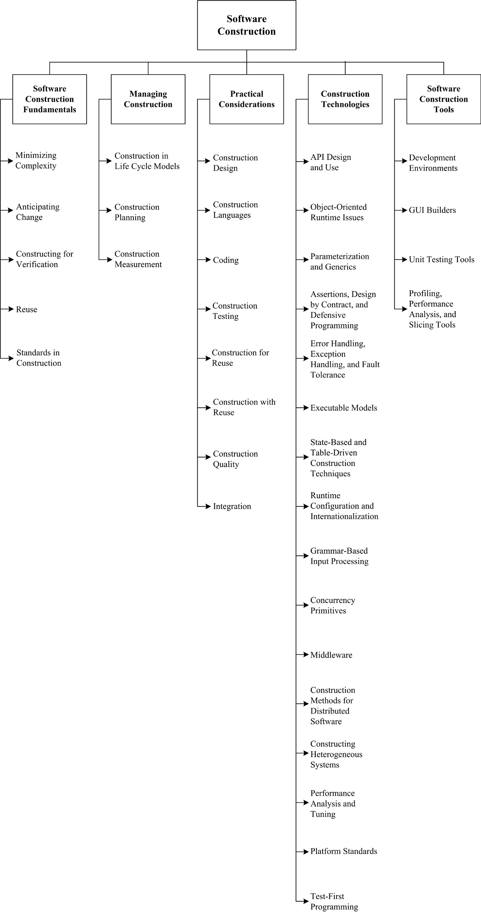

## Chapter 3: Software Construction

**Acronyms**

API Application Programming Interface
COTS Commercial Off-the-Shelf
GUI Graphical User Interface
IDE Integrated Development Environment
OMG Object Management Group
POSIX Portable Operating System Interface
TDD Test-Driven Development
UML Unified Modeling Language

**Introduction**

The term software construction refers to the detailed creation of working
software through a combination of coding, verification, unit testing,
integration testing, and debugging. The Software Construction knowledge area
(KA) is linked to all the other KAs, but it is most strongly linked to Software
Design and Software Testing because the software construction process involves
significant software design and testing. The process uses the design output and
provides an input to testing (“design” and “testing” in this case referring to
the activities, not the KAs). Boundaries between design, construction, and
testing (if any) will vary depending on the software life cycle processes that
are used in a project. Although some detailed design may be performed prior to
construction, much design work is performed during the construction activity.
Thus, the Software Construction KA is closely linked to the Software Design KA.
Throughout construction, software engineers both unit test and integration test
their work.

Thus, the Software Construction KA is closely linked to the Software Testing KA
as well. Software construction typically produces the highest number of
configuration items that need to be managed in a software project (source
files, documentation, test cases, and so on). Thus, the Software Construction
KA is also closely linked to the Software Configuration Management KA. While
software quality is important in all the KAs, code is the ultimate deliverable
of a software project, and thus the Software Quality KA is closely linked to
the Software Construction KA. Since software construction requires knowledge of
algorithms and of coding practices, it is closely related to the Computing
Foundations KA, which is concerned with the computer science foundations that
support the design and construction of software products. It is also related to
project management, insofar as the management of construction can present
considerable challenges.

**BREAKDOWN OF TOPICS FOR SOFTWARE CONSTRUCTION**

Figure 3.1 gives a graphical representation of the top-level decomposition of
the breakdown for the Software Construction KA.

### 1. Software Construction Fundamentals

Software construction fundamentals include

- minimizing complexity
- anticipating change
- constructing for verification
- reuse
- standards in construction.

The first four concepts apply to design as well as to construction. The
following sections define these concepts and describe how they apply to
construction.

Software Construction 3-3

#### 1.1. Minimizing Complexity

<!-- [1] -->

Most people are limited in their ability to hold complex structures and
information in their working memories, especially over long periods of time.
This proves to be a major factor influencing how people convey intent to
computers and leads to one of the strongest drives in software construction:
_minimizing_ complexity. The need to reduce complexity applies to essentially
every aspect of software construction and is particularly critical to testing
of software constructions.

In software construction, reduced complexity is achieved through emphasizing
code creation that is simple and readable rather than clever. It is
accomplished through making use of standards (see section 1.5, Standards in
Construction), modular design (see section 3.1, Construction Design), and
numerous other specific techniques (see section 3.3, Coding). It is also
supported by construction-focused quality techniques (see section 3.7,
Construction Quality).

#### 1.2. Anticipating Change

<!-- [1] -->

Most software will change over time, and the anticipation of _change_ drives
many aspects of software construction; changes in the environments in which
software operates also affect software in diverse ways. Anticipating change
helps software engineers build extensible software, which means they can
enhance a software product without disrupting the underlying structure.
Anticipating change is supported by many specific techniques (see section 3.3,
Coding).

#### 1.3. Constructing for Verification

<!-- [1] -->

Constructing for verification means building software in such a way that faults
can be readily found by the software engineers writing the software as well as
by the testers and users during independent testing and operational activities.
Specific techniques that support constructing for verification include
following coding standards to support code reviews and unit testing, organizing
code to support automated testing, and restricting the use of complex or
hard-to-understand language structures, among others.

#### 1.4. Reuse

<!-- [2] -->

Reuse refers to using existing assets in solving different problems. In
software construction, typical assets that are reused include libraries,
modules, components, source code, and commercial off-the-shelf (COTS) assets.
Reuse is best practiced systematically, according to a well-defined, repeatable
process. Systematic reuse can enable significant software productivity,
quality, and cost improvements.

Reuse has two closely related facets: “construction for reuse” and
“construction with reuse.” The former means to create reusable software assets,
while the latter means to reuse software assets in the construction of a new
solution. Reuse often transcends the boundary of projects, which means
reused assets can be constructed in other projects or organizations.

#### 1.5. Standards in Construction

<!-- [1] -->

Applying external or internal development standards during construction helps
achieve a project’s objectives for efficiency, quality, and cost. Specifically,
the choices of allowable programming language subsets and usage standards are
important aids in achieving higher security. Standards that directly affect
construction issues include

- communication methods (for example, standards for document formats and
  contents)
- programming languages (for example, language standards for languages like
  Java and C++)
- coding standards (for example, standards for naming conventions, layout, and
  indentation)
- platforms (for example, interface standards for operating system calls)
- tools (for example, diagrammatic standards for notations like UML (Unified
  Modeling Language)).

_Use of external standards._ Construction depends on the use of external
standards for construction languages, construction tools, technical interfaces,
and interactions between the Software Construction KA and other KAs. Standards
come from numerous sources, including hardware and software interface
specifications (such as the Object Management Group (OMG)) and international
organizations (such as the IEEE or ISO).
_Use of internal standards._ Standards may also be created on an organizational
basis at the corporate level or for use on specific projects. These standards
support coordination of group activities, minimizing complexity, anticipating
change, and constructing for verification.

### 2. Managing Construction

#### 2.1. Construction in Life Cycle Models

<!-- [1] -->

Numerous models have been created to develop software; some emphasize
construction more than others.

Some models are more linear from the construction point of view - such as the
waterfall and staged-delivery life cycle models. These models treat
construction as an activity that occurs only after significant prerequisite
work has been completed - including detailed requirements work, extensive
design work, and detailed planning. The more linear approaches tend to
emphasize the activities that precede construction (requirements and design)
and to create more distinct separations between activities. In these models,
the main emphasis of construction may be coding.

Other models are more iterative - such as evolutionary prototyping and agile
development. These approaches tend to treat construction as an activity that
occurs concurrently with other software development activities (including
requirements, design, and planning) or that overlaps them. These approaches
tend to mix design, coding, and testing activities, and they often treat the
combination of activities as construction (see the Software Management and
Software Process KAs).

Consequently, what is considered to be “construction” depends to some degree on
the life cycle model used. In general, software construction is mostly coding
and debugging, but it also involves construction planning, detailed design,
unit testing, integration testing, and other activities.

#### 2.2. Construction Planning

<!-- [1] -->

The choice of construction method is a key aspect of the construction-planning
activity. The choice of construction method affects the extent to which
construction prerequisites are performed, the order in which they are
performed, and the degree to which they should be completed before construction
work begins.

The approach to construction affects the project team’s ability to reduce
complexity, anticipate change, and construct for verification. Each of these
objectives may also be addressed at the process, requirements, and design
levels - but they will be influenced by the choice of construction method.

Construction planning also defines the order in which components are created
and integrated, the integration strategy (for example, phased or incremental
integration), the software quality management processes, the allocation of task
assignments to specific software engineers, and other tasks, according to the
chosen method.

#### 2.3. Construction Measurement

<!-- [1] -->

Numerous construction activities and artifacts can be measured - including code
developed, code modified, code reused, code destroyed, code complexity, code
inspection statistics, fault-fix and fault-find rates, effort, and scheduling.
These measurements can be useful for purposes of managing construction,
ensuring quality during construction, and improving the construction process,
among other uses (see the Software Engineering Process KA for more on
measurement).

Software Construction 3-5

### 3. Practical Considerations

Construction is an activity in which the software engineer has to deal with
sometimes chaotic and changing real-world constraints, and he or she must do so
precisely. Due to the influence of real-world constraints, construction is more
driven by practical considerations than some other KAs, and software
engineering is perhaps most craft-like in the construction activities.

#### 3.1. Construction Design

<!-- [1] -->

Some projects allocate considerable design activity to construction, while
others allocate design to a phase explicitly focused on design. Regardless of
the exact allocation, some detailed design work will occur at the construction
level, and that design work tends to be dictated by constraints imposed by the
real-world problem that is being addressed by the software.

Just as construction workers building a physical structure must make
small-scale modifications to account for unanticipated gaps in the builder’s
plans, software construction workers must make modifications on a smaller or
larger scale to flesh out details of the software design during construction.

The details of the design activity at the construction level are essentially
the same as described in the Software Design KA, but they are applied on a
smaller scale of algorithms, data structures, and interfaces.

#### 3.2. Construction Languages

<!-- [1] -->

Construction languages include all forms of communication by which a human can
specify an executable problem solution to a problem. Construction languages and
their implementations (for example, compilers) can affect software quality
attributes of performance, reliability, portability, and so forth. They can be
serious contributors to security vulnerabilities.

The simplest type of construction language is a _configuration language,_ in
which software engineers choose from a limited set of pre-defined options to
create new or custom software installations. The text-based configuration files
used in both the Windows and Unix operating systems are examples of this, and
the menu-style selection lists of some program generators constitute another
example of a configuration language. Toolkit languages are used to build
applications out of elements in toolkits (integrated sets of
application-specific reusable parts); they are more complex than configuration
languages.

_Toolkit languages_ may be explicitly defined as application programming
languages, or the applications may simply be implied by a toolkit’s set of
interfaces.

_Scripting languages_ are commonly used kinds of application programming
languages. In some scripting languages, scripts are called batch files or
macros.

_Programming languages_ are the most flexible type of construction languages.
They also contain the least amount of information about specific application
areas and development processes - therefore, they require the most training and
skill to use effectively. The choice of programming language can have a large
effect on the likelihood of vulnerabilities being introduced during coding -
for example, uncritical usage of C and C++ are questionable choices from a
security viewpoint.

There are three general kinds of notation used for programming languages,
namely

- linguistic (e.g., C/C++, Java)
- formal (e.g., Event-B)
- visual (e.g., MatLab).

_Linguistic notations_ are distinguished in particular by the use of textual
strings to represent complex software constructions. The combination of textual
strings into patterns may have a sentence-like syntax. Properly used, each such
string should have a strong semantic connotation providing an immediate
intuitive understanding of what will happen when the software construction is
executed.

_Formal notations_ rely less on intuitive, everyday meanings of words and text
strings and more on definitions backed up by precise, unambiguous, and formal
(or mathematical) definitions. Formal construction notations and formal methods
are at the semantic base of most forms of system programming notations, where
accuracy, time behavior, and testability are more important than ease of
mapping into natural language. Formal constructions also use precisely defined
ways of combining symbols that avoid the ambiguity of many natural language
constructions.

_Visual notations_ rely much less on the textual notations of linguistic and
formal construction and instead rely on direct visual interpretation and
placement of visual entities that represent the underlying software. Visual
construction tends to be somewhat limited by the difficulty of making “complex”
statements using only the arrangement of icons on a display. However, these
icons can be powerful tools in cases where the primary programming task is
simply to build and “adjust” a visual interface to a program, the detailed
behavior of which has an underlying definition.

#### 3.3. Coding

<!-- [1] -->

The following considerations apply to the software construction coding
activity:

- Techniques for creating understandable source code, including naming
  conventions and source code layout;
- Use of classes, enumerated types, variables, named constants, and other
  similar entities;
- Use of control structures;
- Handling of error conditions - both anticipated and exceptional (input of bad
  data, for example);
- Prevention of code-level security breaches (buffer overflows or array index
  bounds, for example);
- Resource usage via use of exclusion mechanisms and discipline in accessing
  serially reusable resources (including threads and database locks);
- Source code organization (into statements, routines, classes, packages, or
  other structures);
- Code documentation;
- Code tuning,

#### 3.4. Construction Testing

<!-- [1] -->

Construction involves two forms of testing, which are often performed by the
software engineer who wrote the code:

- Unit testing
- Integration testing.

The purpose of construction testing is to reduce the gap between the time when
faults are inserted into the code and the time when those faults are detected,
thereby reducing the cost incurred to fix them. In some instances, test cases
are written after code has been written. In other instances, test cases may be
created before code is written.

Construction testing typically involves a subset of the various types of
testing, which are described in the Software Testing KA. For instance,
construction testing does not typically include system testing, alpha testing,
beta testing, stress testing, configuration testing, usability testing, or
other more specialized kinds of testing. Two standards have been published on
the topic of construction testing: IEEE Standard 829-1998, _IEEE Standard for
Software Test Documentation_, and _IEEE Standard 1008-1987, IEEE Standard for
Software Unit Testing_.

(See sections 2.1.1., Unit Testing, and 2.1.2., Integration Testing, in the
Software Testing KA for more specialized reference material.)

#### 3.5. Construction for Reuse

<!-- [2] -->

Construction for reuse creates software that has the potential to be reused in
the future for the present project or other projects taking a broad-based,
multisystem perspective. Construction for reuse is usually based on variability
analysis and design. To avoid the problem of code clones, it is desired to
encapsulate reusable code fragments into well-structured libraries or
components. The tasks related to software construction for reuse during coding
and testing are as follows:

Software Construction 3-7

- Variability implementation with mechanisms such as parameterization,
  conditional compilation, design patterns, and so forth.
- Variability encapsulation to make the software assets easy to configure and
  customize.
- Testing the variability provided by the reusable software assets.
- Description and publication of reusable software assets.

#### 3.6. Construction with Reuse

<!-- [2] -->

Construction with reuse means to create new software with the reuse of existing
software assets. The most popular method of reuse is to reuse code from the
libraries provided by the language, platform, tools being used, or an
organizational repository. Asides from these, the applications developed
today widely make use of many open-source libraries. Reused and off-the-shelf
software often have the same - or better - quality requirements as newly
developed software (for example, security level).

The tasks related to software construction with reuse during coding and testing
are as follows:

- The selection of the reusable units, databases, test procedures, or test
  data.
- The evaluation of code or test reusability.
- The integration of reusable software assets into the current software.
- The reporting of reuse information on new code, test procedures, or test
  data.

#### 3.7. Construction Quality

<!-- [1] -->

In addition to faults resulting from requirements and design, faults introduced
during construction can result in serious quality problems - for example,
security vulnerabilities. This includes not only faults in security
functionality but also faults elsewhere that allow bypassing of this
functionality and other security weaknesses or violations. Numerous techniques
exist to ensure the quality of code as it is constructed. The primary
techniques used for construction quality include

- unit testing and integration testing (see section 3.4, Construction
  Testing)
- test-first development (see section 2.2 in the Software Testing KA)
- use of assertions and defensive programming
- debugging
- inspections
- technical reviews, including security-oriented reviews (see section 2.3.2 in
  the Software Quality KA)
- static analysis (see section 2.3 of the Software Quality KA)

The specific technique or techniques selected depend on the nature of the
software being constructed as well as on the skillset of the software engineers
performing the construction activities. Programmers should know good practices
and common vulnerabilities - for example, from widely recognized lists about
common vulnerabilities. Automated static analysis of code for security
weaknesses is available for several common programming languages and can be
used in security-critical projects.

Construction quality activities are differentiated from other quality
activities by their focus. Construction quality activities focus on code and
artifacts that are closely related to code - such as detailed design - as
opposed to other artifacts that are less directly connected to the code, such
as requirements, high-level designs, and plans.

#### 3.8. Integration

<!-- [1] -->

A key activity during construction is the integration of individually
constructed routines, classes, components, and subsystems into a single system.
In addition, a particular software system may need to be integrated with other
software or hardware systems.

Concerns related to construction integration include planning the sequence in
which components will be integrated, identifying what hardware is needed,
creating scaffolding to support interim versions of the software, determining
the degree of testing and quality work performed on components before they are
integrated, and determining points in the project at which interim versions of
the software are tested.

Programs can be integrated by means of either the phased or the incremental
approach. Phased integration, also called “big bang” integration, entails
delaying the integration of component software parts until all parts intended
for release in a version are complete. Incremental integration is thought to
offer many advantages over the traditional phased integration - for
example, easier error location, improved progress monitoring, earlier
product delivery, and improved customer relations. In incremental
integration, the developers write and test a program in small pieces and
then combine the pieces one at a time. Additional test infrastructure, such
as stubs, drivers, and mock objects, are usually needed to enable
incremental integration. By building and integrating one unit at a time
(for example, a class or component), the construction process can provide
early feedback to developers and customers. Other advantages of incremental
integration include easier error location, improved progress monitoring,
more fully tested units, and so forth.

### 4. Construction Technologies

#### 4.1. API Design and Use

<!-- [3] -->

An application programming interface (API) is the set of signatures that are
exported and available to the users of a library or a framework to write their
applications. Besides signatures, an API should always include statements about
the program’s effects and/or behaviors (i.e., its semantics).

API design should try to make the API easy to learn and memorize, lead to
readable code, be hard to misuse, be easy to extend, be complete, and maintain
backward compatibility. As the APIs usually outlast their implementations for a
widely used library or framework, it is desired that the API be straightforward
and kept stable to facilitate the development and maintenance of the client
applications.

API use involves the processes of selecting, learning, testing, integrating,
and possibly extending APIs provided by a library or framework (see section
3.6, Construction with Reuse).

#### 4.2. Object-Oriented Runtime Issues

<!-- [1] -->

Object-oriented languages support a series of runtime mechanisms including
polymorphism and reflection. These runtime mechanisms increase the flexibility
and adaptability of object-oriented programs. Polymorphism is the ability of a
language to support general operations without knowing until runtime what kind
of concrete objects the software will include. Because the program does not
know the exact types of the objects in advance, the exact behaviour is
determined at runtime (called dynamic binding).

Reflection is the ability of a program to observe and modify its own structure
and behavior at runtime. Reflection allows inspection of classes, interfaces,
fields, and methods at runtime without knowing their names at compile time. It
also allows instantiation at runtime of new objects and invocation of methods
using parameterized class and method names.

#### 4.3. Parameterization and Generics

<!-- [4] -->

Parameterized types, also known as generics (Ada, Eiffel) and templates (C++),
enable the definition of a type or class without specifying all the other types
it uses. The unspecified types are supplied as parameters at the point of use.
Parameterized types provide a third way (in addition to class inheritance and
object composition) to compose behaviors in object-oriented software.

#### 4.4. Assertions, Design by Contract, and Defensive Programming

<!-- [1] -->

An assertion is an executable predicate that’s placed in a program - usually a
routine or macro - that allows runtime checks of the program. Assertions are
especially useful in high-reliability programs. They enable programmers to more
quickly flush out mismatched interface assumptions, errors that creep in when
code is modified, and so on. Assertions are normally compiled into the code at
development time and are later compiled out of the code so that they don’t
degrade the performance.

Software Construction 3-9

Design by contract is a development approach in which preconditions and
postconditions are included for each routine. When preconditions and
postconditions are used, each routine or class is said to form a contract with
the rest of the program. Furthermore, a contract provides a precise
specification of the semantics of a routine, and thus helps the understanding
of its behavior. Design by contract is thought to improve the quality of
software construction.

_Defensive programming_ means to protect a routine from being broken by invalid
inputs. Common ways to handle invalid inputs include checking the values of all
the input parameters and deciding how to handle bad inputs. Assertions are
often used in defensive programming to check input values.

#### 4.5. Error Handling, Exception Handling, and Fault Tolerance

<!-- [1] -->

The way that errors are handled affects software’s ability to meet requirements
related to correctness, robustness, and other nonfunctional attributes.
Assertions are sometimes used to check for errors. Other error handling
techniques - such as returning a neutral value, substituting the next piece of
valid data, logging a warning message, returning an error code, or shutting
down the software - are also used.

Exceptions are used to detect and process errors or exceptional events. The
basic structure of an exception is that a routine uses _throw_ to throw a
detected exception and an exception handling block will _catch_ the exception
in a _try-catch_ block. The try-catch block may process the erroneous
condition in the routine or it may return control to the calling routine.
Exception handling policies should be carefully designed following common
principles such as including in the exception message all information that led
to the exception, avoiding empty catch blocks, knowing the exceptions the
library code throws, perhaps building a centralized exception reporter, and
standardizing the program’s use of exceptions. Fault tolerance is a collection
of techniques that increase software reliability by detecting errors and then
recovering from them if possible or containing their effects if recovery is not
possible. The most common fault tolerance strategies include backing up and
retrying, using auxiliary code, using voting algorithms, and replacing an
erroneous value with a phony value that will have a benign effect.

#### 4.6. Executable Models

<!-- [5] -->

Executable models abstract away the details of specific programming languages
and decisions about the organization of the software. Different from
traditional software models, a specification built in an executable modeling
language like xUML (executable UML) can be deployed in various software
environments without change. An executable-model compiler (transformer) can
turn an executable model into an implementation using a set of decisions about
the target hardware and software environment. Thus, constructing executable
models can be regarded as a way of constructing executable software.

Executable models are one foundation supporting the Model-Driven Architecture
(MDA) initiative of the Object Management Group (OMG). An executable model is a
way to completely specify a Platform Independent Model (PIM); a PIM is a model
of a solution to a problem that does not rely on any implementation
technologies. Then a Platform Specific Model (PSM), which is a model that
contains the details of the implementation, can be produced by weaving together
the PIM and the platform on which it relies.

#### 4.7. State-Based and Table-Driven Construction Techniques

<!-- [1] -->

State-based programming, or automata-based programming, is a programming
technology using finite state machines to describe program behaviours. The
transition graphs of a state machine are used in all stages of software
development (specification, implementation, debugging, and documentation). The
main idea is to construct computer programs the same way the automation of
technological processes is done. State-based programming is usually combined
with object-oriented programming, forming a new composite approach called
_state-based, object-oriented programming._

A table-driven method is a schema that uses tables to look up information
rather than using logic statements (such as _if_ and _case_ ). Used in
appropriate circumstances, table-driven code is simpler than complicated logic
and easier to modify. When using table-driven methods, the programmer addresses
two issues: what information to store in the table or tables, and how to
efficiently access information in the table.

#### 4.8. Runtime Configuration and Internationalization

<!-- [1] -->

To achieve more flexibility, a program is often constructed to support late
binding time of its variables. Runtime configuration is a technique that binds
variable values and program settings when the program is running, usually by
updating and reading configuration files in a just-in-time mode.
Internationalization is the technical activity of preparing a program, usually
interactive software, to support multiple locales. The corresponding activity,
_localization,_ is the activity of modifying a program to support a specific
local language. Interactive software may contain dozens or hundreds of prompts,
status displays, help messages, error messages, and so on. The design and
construction processes should accommodate string and character-set issues
including which character set is to be used, what kinds of strings are used,
how to maintain the strings without changing the code, and translating the
strings into different languages with minimal impact on the processing code and
the user interface.

#### 4.9. Grammar-Based Input Processing

<!-- [1] [6] -->

Grammar-based input processing involves syntax analysis, or _parsing_, of the
input token stream. It involves the creation of a data structure (called a
_parse tree_ or _syntax tree_ ) representing the input data. The inorder
traversal of the parse tree usually gives the expression just parsed. The
parser checks the symbol table for the presence of programmer-defined variables
that populate the tree. After building the parse tree, the program uses it as
input to the computational processes.

#### 4.10. Concurrency Primitives

<!-- [7] -->

A synchronization primitive is a programming abstraction provided by a
programming language or the operating system that facilitates concurrency and
synchronization. Well-known concurrency primitives include semaphores,
monitors, and mutexes.

A semaphore is a protected variable or abstract data type that provides a
simple but useful abstraction for controlling access to a common resource by
multiple processes or threads in a concurrent programming environment.

A monitor is an abstract data type that presents a set of programmer-defined
operations that are executed with mutual exclusion. A monitor contains the
declaration of shared variables and procedures or functions that operate on
those variables. The monitor construct ensures that only one process at a time
is active within the monitor. A mutex (mutual exclusion) is a synchronization
primitive that grants exclusive access to a shared resource by only one process
or thread at a time.

#### 4.11. Middleware

<!-- [3] [6] -->

Middleware is a broad classification for software that provides services above
the operating system layer yet below the application program layer. Middleware
can provide runtime containers for software components to provide message
passing, persistence, and a transparent location across a network. Middleware
can be viewed as a connector between the components that use the middleware.
Modern message-oriented middleware usually provides an Enterprise Service Bus
(ESB), which supports service-oriented interaction and communication between
multiple software applications.

Software Construction 3-11

#### 4.12. Construction Methods for Distributed Software

<!-- [7] -->

A distributed system is a collection of physically separate, possibly
heterogeneous computer systems that are networked to provide the users with
access to the various resources that the system maintains. Construction of
distributed software is distinguished from traditional software construction
by issues such as parallelism, communication, and fault tolerance.

Distributed programming typically falls into one of several basic architectural
categories: client-server, 3-tier architecture, n-tier architecture,
distributed objects, loose coupling, or tight coupling (see section 14.3 of the
Computing Foundations KA and section 3.2 of the Software Design KA).

#### 4.13. Constructing Heterogeneous Systems

<!-- [6] -->

Heterogeneous systems consist of a variety of specialized computational units
of different types, such as Digital Signal Processors (DSPs), microcontrollers,
and peripheral processors. These computational units are independently
controlled and communicate with one another. Embedded systems are typically
heterogeneous systems. The design of heterogeneous systems may require the
combination of several specification languages in order to design different
parts of the system - in other words, hardware/software codesign. The key
issues include multilanguage validation, cosimulation, and interfacing. During
the hardware/software codesign, software development and virtual hardware
development proceed concurrently through stepwise decomposition. The hardware
part is usually simulated in field programmable gate arrays (FPGAs) or
application-specific integrated circuits (ASICs). The software part is
translated into a low-level programming language.

#### 4.14. Performance Analysis and Tuning

<!-- [1] -->

Code efficiency - determined by architecture, detailed design decisions, and
data-structure and algorithm selection - influences an execution speed and
size. Performance analysis is the investigation of a program’s behavior using
information gathered as the program executes, with the goal of identifying
possible hot spots in the program to be improved.

Code tuning, which improves performance at the code level, is the practice of
modifying correct code in ways that make it run more efficiently. Code tuning
usually involves only small-scale changes that affect a single class, a single
routine, or, more commonly, a few lines of code. A rich set of code tuning
techniques is available, including those for tuning logic expressions, loops,
data transformations, expressions, and routines. Using a low-level language is
another common technique for improving some hot spots in a program.

#### 4.15. Platform Standards

<!-- [6] [7] -->

Platform standards enable programmers to develop portable applications that can
be executed in compatible environments without changes. Platform standards
usually involve a set of standard services and APIs that compatible platform
implementations must implement. Typical examples of platform standards are Java
2 Platform Enterprise Edition (J2EE) and the POSIX standard for operating
systems (Portable Operating System Interface), which represents a set of
standards implemented primarily for UNIX-based operating systems.

#### 4.16. Test-First Programming

<!-- [1] -->

Test-first programming (also known as Test-Driven Development - TDD) is a
popular development style in which test cases are written prior to writing any
code. Test-first programming can usually detect defects earlier and correct
them more easily than traditional programming styles. Furthermore, writing test
cases first forces programmers to think about requirements and design before
coding, thus exposing requirements and design problems sooner.

### 5. Software Construction Tools

#### 5.1. Development Environments

<!-- [1] -->

A development environment, or integrated development environment (IDE),
provides comprehensive facilities to programmers for software construction by
integrating a set of development tools. The choices of development environments
can affect the efficiency and quality of software construction.

In additional to basic code editing functions, modern IDEs often offer other
features like compilation and error detection from within the editor,
integration with source code control, build/test/debugging tools, compressed
or outline views of programs, automated code transforms, and support for
refactoring.

#### 5.2. GUI Builders

<!-- [1] -->

A GUI (Graphical User Interface) builder is a software development tool that
enables the developer to create and maintain GUIs in a WYSIWYG (what you see is
what you get) mode. A GUI builder usually includes a visual editor for the
developer to design forms and windows and manage the layout of the widgets by
dragging, dropping, and parameter setting. Some GUI builders can automatically
generate the source code corresponding to the visual GUI design. Because
current GUI applications usually follow the event-driven style (in which the
flow of the program is determined by events and event handling), GUI builder
tools usually provide code generation assistants, which automate the most
repetitive tasks required for event handling. The supporting code connects
widgets with the outgoing and incoming events that trigger the functions
providing the application logic. Some modern IDEs provide integrated GUI
builders or GUI builder plug-ins. There are also many standalone GUI builders.

#### 5.3. Unit Testing Tools

<!-- [1] [2] -->

Unit testing verifies the functioning of software modules in isolation from
other software elements that are separately testable (for example, classes,
routines, components). Unit testing is often automated. Developers can use
unit testing tools and frameworks to extend and create automated testing
environment. With unit testing tools and frameworks, the developer can code
criteria into the test to verify the unit’s correctness under various data
sets. Each individual test is implemented as an object, and a test runner runs
all of the tests. During the test execution, those failed test cases will be
automatically flagged and reported.

#### 5.4. Profiling, Performance Analysis, and Slicing Tools

<!-- [1] -->

Performance analysis tools are usually used to support code tuning. The most
common performance analysis tools are profiling tools. An execution profiling
tool monitors the code while it runs and records how many times each statement
is executed or how much time the program spends on each statement or execution
path. Profiling the code while it is running gives insight into how the program
works, where the hot spots are, and where the developers should focus the code
tuning efforts.

Program slicing involves computation of the set of program statements (i.e.,
the program slice) that may affect the values of specified variables at some
point of interest, which is referred to as a slicing criterion. Program slicing
can be used for locating the source of errors, program understanding, and
optimization analysis. Program slicing tools compute program slices for various
programming languages using static or dynamic analysis methods.

Software Construction 3-13

### Matrix Of Topics vs. Reference Material

McConnell 2004

[1]

Sommerville 2011

[2]

Clements et al. 2010

[3]

Gamma et al. 1994

[4]

Mellor and Balcer 2002

[5]

Null and Lobur 2006

[6]

Silberschatz et al. 2008

[7]

**1. Software Construction Fundamentals**
    1.1. Minimizing Complexity c2, c3, c7-c9, c24, c27, c28, c31, c32, c34
    1.2. Anticipating Change c3–c5, c24, c31, c32, c34
    1.3. Constructing for Verification c8, c20– c23, c31, c34
    1.4. Reuse c16
    1.5. Standards in Construction c4
**2. Managing
Construction**
    2.1. Construction in Life Cycle Models c2, c3, c27, c29
    2.2. Construction Planning c3, c4, c21, c27–c29
    2.3. Construction Measurement c25, c28
**3. Practical Considerations**
    3.1. Construction Design c3, c5, c24
    3.2. Construction Languages c4
    3.3. Coding c5–c19, c25–c26 

McConnell 2004

[1]

Sommerville 2011

[2]

Clements et al. 2010

[3]

Gamma et al. 1994

[4]

Mellor and Balcer 2002

[5]

Null and Lobur 2006

[6]

Silberschatz et al. 2008

[7]

    3.4. Construction Testing c22, c23
    3.5. Construction for Reuse c16
    3.6. Construction with Reuse c16
    3.7. Construction Quality c8, c20–c25
    3.8. Integration c29

**4. Construction Technologies**
    4.1. API Design and Use c7 
    4.2. Object-Oriented Runtime Issues c6, c7 
    4.3. Parameterization and Generics c1
    4.4. Assertions, Design by Contract, and Defensive Programming c8, c9
    4.5. Error Handling, Exception Handling, and Fault Tolerance c3, c8
    4.6. Executable Models c1
    4.7. State-Based and Table-Driven Construction Techniques c18
    4.8. Runtime Configuration and Internationalization c3, c10
    4.9. Grammar-Based Input Processing c5 c8

Software Construction 3-15

McConnell 2004

[1]

Sommerville 2011

[2]

Clements et al. 2010

[3]

Gamma et al. 1994

[4]

Mellor and Balcer 2002

[5]

Null and Lobur 2006

[6]

Silberschatz et al. 2008

[7]
    4.10. Concurrency Primitives c6
    4.11. Middleware c1 c8
    4.12. Construction Methods for Distributed Software c2
    4.13. Constructing Heterogeneous Systems c9
    4.14. Performance Analysis and Tuning c25, c26
    4.15. Platform Standards c10 c1
    4.16. Test-First Programming c22
**5. Construction Tools**
    5.1. Development Environments c30
    5.2. GUI Builders c30
    5.3. Unit Testing Tools c22 c8
    5.4. Profiling, Performance Analysis, and Slicing Tools c25, c26

**Further Readings**

_IEEE Std. 1517-2010 Standard for Information Technology - System and Software
Life Cycle Processes - Reuse Processes_, IEEE, 2010 [8].

This standard specifies the processes, activities, and tasks to be applied
during each phase of the software life cycle to enable a software product to be
constructed from reusable assets. It covers the concept of reuse-based
development and the processes of construction for reuse and construction with
reuse.

_IEEE Std. 12207-2008 (a.k.a. ISO/IEC 12207:2008) Standard for Systems and
Software Engineering - Software Life Cycle Processes_, IEEE, 2008 [9].

This standard defines a series of software development processes, including
software construction process, software integration process, and software reuse
process.

**References**

[1] S. McConnell, Code Complete, 2nd ed., Microsoft Press, 2004.

[2] I. Sommerville, Software Engineering, 9th ed., Addison-Wesley, 2011.

[3] P. Clements et al., Documenting Software Architectures: Views and Beyond,
2nd ed., Pearson Education, 2010.

[4] E. Gamma et al., Design Patterns: Elements of Reusable Object-Oriented
Software, 1st ed., Addison-Wesley Professional, 1994.

[5] S.J. Mellor and M.J. Balcer, Executable UML: A Foundation for Model-Driven
Architecture, 1st ed., Addison-Wesley, 2002.

[6] L. Null and J. Lobur, The Essentials of Computer Organization and
Architecture, 2nd ed., Jones and Bartlett Publishers, 2006.

[7] A. Silberschatz, P.B. Galvin, and G. Gagne, Operating System Concepts, 8th
ed., Wiley, 2008.

[8] IEEE Std. 1517-2010 Standard for Information Technology—System and Software
Life Cycle Processes—Reuse Processes, IEEE, 2010.

[9] IEEE Std. 12207-2008 (a.k.a. ISO/IEC 12207:2008) Standard for Systems and
