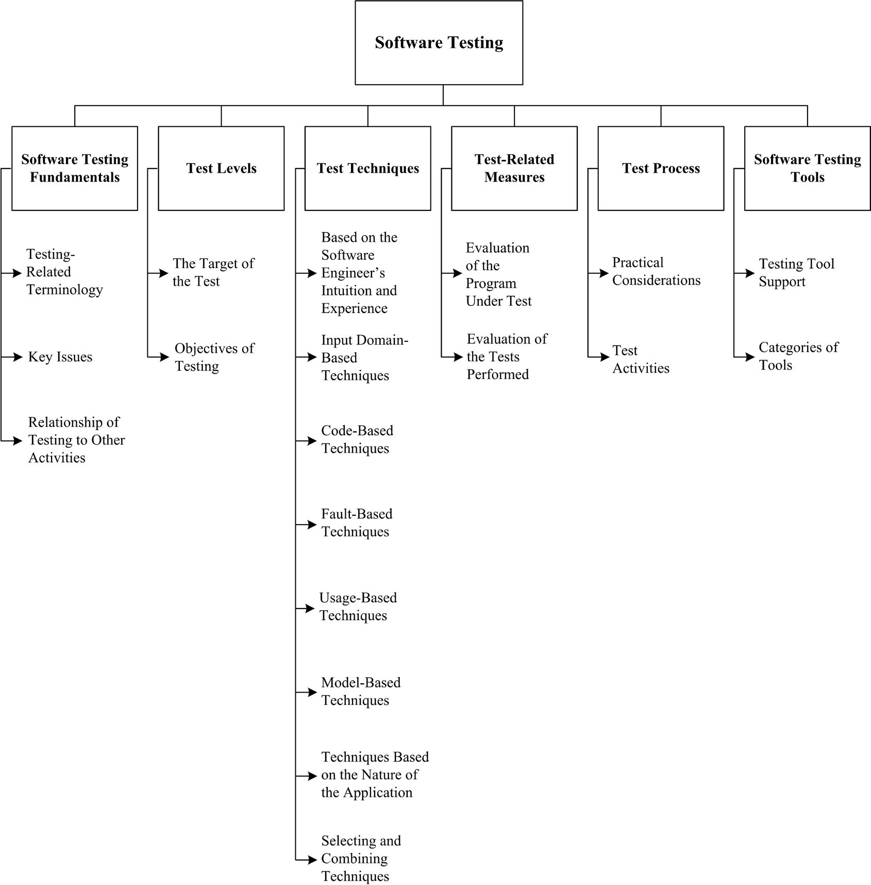

## Chapter 4: Software Testing

**Acronyms**

API Application Program Interface
TDD Test-Driven Development
TTCN3 Testing and Test Control Notation Version 3
XP Extreme Programming

**Introduction**

Software testing consists of the _dynamic_ verification that a program provides
_expected_ behaviors on a _finite_ set of test cases, suitably _selected_ from
the usually infinite execution domain.  In the above definition, italicized
words correspond to key issues in describing the Software Testing knowledge
area (KA):

- _Dynamic:_ This term means that testing always implies executing the program
  on selected inputs. To be precise, the input value alone is not always
  sufficient to specify a test, since a complex, nondeterministic system might
  react to the same input with different behaviors, depending on the system
  state. In this KA, however, the term “input” will be maintained, with the
  implied convention that its meaning also includes a specified input state in
  those cases for which it is important. Static techniques are different from
  and complementary to dynamic testing.  Static techniques are covered in the
  Software Quality KA. It is worth noting that terminology is not uniform among
  different communities and some use the term “testing” also in reference to
  static techniques.
- _Finite:_ Even in simple programs, so many test cases are theoretically
  possible that exhaustive testing could require months or years to execute.
  This is why, in practice, a complete set of tests can generally be considered
  infinite, and testing is conducted on a subset of all possible tests, which
  is determined by risk and prioritization criteria. Testing always implies a
  tradeoff between limited resources and schedules on the one hand and
  inherently unlimited test requirements on the other.
- _Selected:_ The many proposed test techniques differ essentially in how the
  test set is selected, and software engineers must be aware that different
  selection criteria may yield vastly different degrees of effectiveness. How
  to identify the most suitable selection criterion under given conditions is a
  complex problem; in practice, risk analysis techniques and software
  engineering expertise are applied.
- _Expected:_ It must be possible, although not always easy, to decide whether
  the observed outcomes of program testing are acceptable or not; otherwise,
  the testing effort is useless. The observed behavior may be checked against
  user needs (commonly referred to as testing for validation), against a
  specification (testing for verification), or, perhaps, against the
  anticipated behavior from implicit requirements or expectations (see
  Acceptance Tests in the Software Requirements KA).

In recent years, the view of software testing has matured into a constructive
one. Testing is no longer seen as an activity that starts only after the coding
phase is complete with the limited purpose of detecting failures. Software
testing is, or should be, pervasive throughout the entire development and
maintenance life cycle. Indeed, planning for software testing should start with
the early stages of the software requirements process, and test plans and
procedures should be systematically and continuously developed - and possibly
refined - as software development proceeds.  These test planning and test
designing activities provide useful input for software designers and help to
highlight potential weaknesses, such as design oversights/contradictions, or
omissions/ ambiguities in the documentation.

For many organizations, the approach to software quality is one of prevention:
it is obviously much better to prevent problems than to correct them. Testing
can be seen, then, as a means for providing information about the functionality
and quality attributes of the software and also for identifying faults in those
cases where error prevention has not been effective. It is perhaps obvious but
worth recognizing that software can still contain faults, even after completion
of an extensive testing activity. Software failures experienced after delivery
are addressed by corrective maintenance. Software maintenance topics are
covered in the Software Maintenance KA. In the Software Quality KA (see
Software Quality Management Techniques), software quality management techniques
are notably categorized into static techniques (no code execution) and dynamic
techniques (code execution). Both categories are useful. This KA focuses on
dynamic techniques.

Software testing is also related to software construction (see Construction
Testing in the Software Construction KA). In particular, unit and integration
testing are intimately related to software construction, if not part of it.

**BREAKDOWN OF TOPICS FOR SOFTWARE TESTING**

The breakdown of topics for the Software Testing KA is shown in Figure 4.1. A
more detailed breakdown is provided in the Matrix of Topics vs. Reference
Material at the end of this KA.  The first topic describes Software Testing
Fundamentals. It covers the basic definitions in the field of software testing,
the basic terminology and key issues, and software testing’s relationship with
other activities.

The second topic, Test Levels, consists of two (orthogonal) subtopics: the
first subtopic lists the levels in which the testing of large software is
traditionally subdivided, and the second subtopic considers testing for
specific conditions or properties and is referred to as Objectives of Testing.
Not all types of testing apply to every software product, nor has every
possible type been listed.  The test target and test objective together
determine how the test set is identified, both with regard to its consistency -
_how much testing is enough for achieving the stated objective_  - and to its
composition - _which test cases should be selected for achieving the stated
objective_ (although usually “for achieving the stated objective” remains
implicit and only the first part of the two italicized questions above is
posed). Criteria for addressing the first question are referred to as _test
adequacy criteria_, while those addressing the second question are the test
_selection criteria_. Several Test Techniques have been developed in the past
few decades, and new ones are still being proposed. Generally accepted
techniques are covered in the third topic.

Test-Related Measures are dealt with in the fourth topic, while the issues
relative to Test Process are covered in the fifth. Finally, Software Testing
Tools are presented in topic six.

### 1. Software Testing Fundamentals

#### 1.1. Testing-Related Terminology

##### 1.1.1. Definitions of Testing and Related Terminology

<!-- [1*, c1, c2] [2*, c8] -->

Definitions of testing and testing-related terminology are provided in the
cited references and summarized as follows.

##### 1.1.2. Faults vs. Failures

<!-- [1*, c1s5] [2*, c11] -->

Many terms are used in the software engineering literature to describe a
malfunction: notably fault, failure, and error, among others. This terminology
is precisely defined in [3, c2]. It is essential to clearly distinguish between
the cause of a malfunction (for which the term fault will be used here) and an
undesired effect observed in the system’s delivered service (which will be
called a failure). Indeed there may well be faults in the software that never
manifest themselves as failures (see Theoretical and Practical Limitations of
Testing in section 1.2, Key Issues). Thus testing can reveal failures, but it
is the faults that can and must be removed [3]. The more generic term defect
can be used to refer to either a fault or a failure, when the distinction is
not important [3].  However, it should be recognized that the cause of a
failure cannot always be unequivocally identified. No theoretical criteria
exist to definitively determine, in general, the fault that caused an observed
failure. It might be said that it was the fault that had to be modified to
remove the failure, but other modifications might have worked just as well. To
avoid ambiguity, one could refer to failure-causing inputs instead of
faults - that is, those sets of inputs that cause a failure to appear.

#### 1.2. Key Issues

##### 1.2.1. Test Selection Criteria / Test Adequacy Criteria (Stopping Rules)

<!-- [1, c1s14, c6s6, c12s7] -->

A test selection criterion is a means of selecting test cases or determining
that a set of test cases is sufficient for a specified purpose. Test adequacy
criteria can be used to decide when sufficient testing will be, or has been
accomplished [4] (see Termination in section 5.1, Practical Considerations).

##### 1.2.2. Testing Effectiveness / Objectives for Testing

<!-- [1, c11s4, c13s11] -->

Testing effectiveness is determined by analyzing a set of program executions.
Selection of tests to be executed can be guided by different objectives: it is
only in light of the objective pursued that the effectiveness of the test set
can be evaluated.

##### 1.2.3. Testing for Defect Discovery

<!-- [1, c1s14] -->

In testing for defect discovery, a successful test is one that causes the
system to fail. This is quite different from testing to demonstrate that the
software meets its specifications or other desired properties, in which case
testing is successful if no failures are observed under realistic test cases
and test environments.

##### 1.2.4. The Oracle Problem

<!-- [1, c1s9, c9s7] -->

An oracle is any human or mechanical agent that decides whether a program
behaved correctly in a given test and accordingly results in a verdict of
“pass” or “fail.” There exist many different kinds of oracles; for example,
unambiguous requirements specifications, behavioral models, and code
annotations. Automation of mechanized oracles can be difficult and expensive.

##### 1.2.5. Theoretical and Practical Limitations of Testing

<!-- [1, c2s7] -->

Testing theory warns against ascribing an unjustified level of confidence to a
series of successful tests. Unfortunately, most established results of testing
theory are negative ones, in that they state what testing can never achieve as
opposed to what is actually achieved. The most famous quotation in this regard
is the Dijkstra aphorism that “program testing can be used to show the presence
of bugs, but never to show their absence” [5]. The obvious reason for this is
that complete testing is not feasible in realistic software. Because of this,
testing must be driven based on risk [6, part 1] and can be seen as a risk
management strategy.

##### 1.2.6. The Problem of Infeasible Paths

<!-- [1, c4s7] -->

Infeasible paths are control flow paths that cannot be exercised by any input
data. They are a significant problem in path-based testing, particularly in
automated derivation of test inputs to exercise control flow paths.

##### 1.2.7. Testability

<!-- [1, c17s2] -->

The term “software testability” has two related but different meanings: on the
one hand, it refers to the ease with which a given test coverage criterion can
be satisfied; on the other hand, it is defined as the likelihood, possibly
measured statistically, that a set of test cases will expose a failure if the
software is faulty. Both meanings are important.

#### 1.3. Relationship of Testing to Other Activities

Software testing is related to, but different from, static software quality
management techniques, proofs of correctness, debugging, and program
construction. However, it is informative to consider testing from the point
of view of software quality analysts and of certifiers.

- Testing vs. Static Software Quality Management Techniques (see Software
  Quality Management Techniques in the Software Quality KA [1, c12]).
- Testing vs. Correctness Proofs and Formal Verification (see the Software
  Engineering Models and Methods KA [1, c17s2]).
- Testing vs. Debugging (see Construction Testing in the Software Construction
  KA and Debugging Tools and Techniques in the Computing Foundations KA [1,
  c3s6]).
- Testing vs. Program Construction (see Construction Testing in the Software
  Construction KA [1, c3s2]).

### 2. Test Levels

Software testing is usually performed at different _levels_ throughout the
development and maintenance processes. Levels can be distinguished based on the
object of testing, which is called the _target_ , or on the purpose, which is
called the _objective_ (of the test level).

#### 2.1. The Target of the Test

<!-- [1, c1s13] [2, c8s1] -->

The target of the test can vary: a single module, a group of such modules
(related by purpose, use, behavior, or structure), or an entire system. Three
test stages can be distinguished: unit, integration, and system. These three
test stages do not imply any process model, nor is any one of them assumed to
be more important than the other two.

##### 2.1.1. Unit Testing

<!-- [1, c3] [2, c8] -->

Unit testing verifies the functioning in isolation of software elements that
are separately testable. Depending on the context, these could be the
individual subprograms or a larger component made of highly cohesive units.
Typically, unit testing occurs with access to the code being tested and with
the support of debugging tools. The programmers who wrote the code typically,
but not always, conduct unit testing.

##### 2.1.2. Integration Testing

<!-- [1, c7] [2, c8] -->

Integration testing is the process of verifying the interactions among software
components. Classical integration testing strategies, such as top-down and
bottom-up, are often used with hierarchically structured software.

Modern, systematic integration strategies are typically architecture-driven,
which involves incrementally integrating the software components or subsystems
based on identified functional threads. Integration testing is often an ongoing
activity at each stage of development during which software engineers abstract
away lower-level perspectives and concentrate on the perspectives of the level
at which they are integrating. For other than small, simple software,
incremental integration testing strategies are usually preferred to putting all
of the components together at once - which is often called “big bang” testing.

##### 2.1.3. System Testing

<!-- [1, c8] [2, c8] -->

System testing is concerned with testing the behavior of an entire system.
Effective unit and integration testing will have identified many of the
software defects. System testing is usually considered appropriate for
assessing the non-functional system requirements - such as security, speed,
accuracy, and reliability (see Functional and Non-Functional Requirements in
the Software Requirements KA and Software Quality Requirements in the Software
Quality KA). External interfaces to other applications, utilities, hardware
devices, or the operating environments are also usually evaluated at this
level.

#### 2.2. Objectives of Testing

<!-- [1, c1s7] -->

Testing is conducted in view of specific objectives, which are stated more or
less explicitly and with varying degrees of precision. Stating the objectives
of testing in precise, quantitative terms supports measurement and control of
the test process.

Testing can be aimed at verifying different properties. Test cases can be
designed to check that the functional specifications are correctly implemented,
which is variously referred to in the literature as conformance testing,
correctness testing, or functional testing. However, several other
nonfunctional properties may be tested as well - including performance,
reliability, and usability, among many others (see Models and Quality
Characteristics in the Software Quality KA). Other important objectives for
testing include but are not limited to reliability measurement, identification
of security vulnerabilities, usability evaluation, and software acceptance, for
which different approaches would be taken. Note that, in general, the test
objectives vary with the test target; different purposes are addressed at
different levels of testing.

The subtopics listed below are those most often cited in the literature. Note
that some kinds of testing are more appropriate for custom-made software
packages - installation testing, for example - and others for consumer
products, like beta testing.

##### 2.2.1. Acceptance / Qualification Testing

<!-- [1, c1s7] [2, c8s4] -->

Acceptance / qualification testing determines whether a system satisfies its
acceptance criteria, usually by checking desired system behaviors against the
customer’s requirements. The customer or a customer’s representative thus
specifies or directly undertakes activities to check that their requirements
have been met, or in the case of a consumer product, that the organization has
satisfied the stated requirements for the target market. This testing activity
may or may not involve the developers of the system.

##### 2.2.2. Installation Testing

<!-- [1, c12s2] -->

Often, after completion of system and acceptance testing, the software is
verified upon installation in the target environment. Installation testing can
be viewed as system testing conducted in the operational environment of
hardware configurations and other operational constraints. Installation
procedures may also be verified.

##### 2.2.3. Alpha and Beta Testing

<!-- [1, c13s7, c16s6] [2, c8s4] -->

Before software is released, it is sometimes given to a small, selected group
of potential users for trial use (_alpha_ testing) and/or to a larger set of
representative users (_beta_ testing). These users report problems with the
product. Alpha and beta testing are often uncontrolled and are not always
referred to in a test plan.

##### 2.2.4. Reliability Achievement and Evaluation

<!-- [1, c15] [2, c15s2] -->

Testing improves reliability by identifying and correcting faults. In addition,
statistical measures of reliability can be derived by randomly generating
test cases according to the operational profile of the software (see
Operational Profile in section 3.5, Usage-Based Techniques). The latter
approach is called operational testing. Using reliability growth models, both
objectives can be pursued together [3] (see L ife Test, Reliability Evaluation
in section 4.1, Evaluation of the Program under Test).

##### 2.2.5. Regression Testing

<!-- [1, c8s11, c13s3] -->

According to [7], regression testing is the “selective retesting of a system or
component to verify that modifications have not caused unintended effects and
that the system or component still complies with its specified requirements.”
In practice, the approach is to show that software still passes previously
passed tests in a test suite (in fact, it is also sometimes referred to as
nonregression testing). For incremental development, the purpose of regression
testing is to show that software behavior is unchanged by incremental changes
to the software, except insofar as it should. In some cases, a tradeoff must be
made between the assurance given by regression testing every time a change is
made and the resources required to perform the regression tests, which can be
quite time consuming due to the large number of tests that may be executed.
Regression testing involves selecting, minimizing, and/or prioritizing a subset
of the test cases in an existing test suite [8].  Regression testing can be
conducted at each of the test levels described in section 2.1, The Target of
the Test, and may apply to functional and nonfunctional testing.

##### 2.2.6. Performance Testing

<!-- [1, c8s6] -->

Performance testing verifies that the software meets the specified performance
requirements and assesses performance characteristics - for instance, capacity
and response time.

##### 2.2.7. Security Testing

<!-- [1, c8s3] [2, c11s4] -->

Security testing is focused on the verification that the software is protected
from external attacks. In particular, security testing verifies the
confidentiality, integrity, and availability of the systems and its data.
Usually, security testing includes verification against misuse and abuse of the
software or system (negative testing).

##### 2.2.8. Stress Testing

<!-- [1, c8s8] -->

Stress testing exercises software at the maximum design load, as well as beyond
it, with the goal of determining the behavioral limits, and to test defense
mechanisms in critical systems.

##### 2.2.9. Back-to-Back Testing

<!-- [7] -->

IEEE/ISO/IEC Standard 24765 defines back-to-back testing as “testing in which
two or more variants of a program are executed with the same inputs, the
outputs are compared, and errors are analyzed in case of discrepancies.”

##### 2.2.10. Recovery Testing

<!-- [1, c14s2] -->

Recovery testing is aimed at verifying software restart capabilities after a
system crash or other “disaster.”

##### 2.2.11. Interface Testing

<!-- [2, c8s1.3] [9, c4s4.5] -->

Interface defects are common in complex systems. Interface testing aims at
verifying whether the components interface correctly to provide the correct
exchange of data and control information. Usually the test cases are
generated from the interface specification. A specific objective of interface
testing is to simulate the use of APIs by end-user applications. This involves
the generation of parameters of the API calls, the setting of external
environment conditions, and the definition of internal data that affect the
API.

##### 2.2.12. Configuration Testing

<!-- [1, c8s5] -->

In cases where software is built to serve different users, configuration
testing verifies the software under different specified configurations.

##### 2.2.13. Usability and Human Computer Interaction Testing

<!-- [10, c6] -->

The main task of usability and human computer interaction testing is to
evaluate how easy it is for end users to learn and to use the software. In
general, it may involve testing the software functions that supports user
tasks, documentation that aids users, and the ability of the system to recover
from user errors (see User Interface Design in the Software Design KA).

### 3. Test Techniques

One of the aims of testing is to detect as many failures as possible. Many
techniques have been developed to do this [6, part 4]. These techniques attempt
to “break” a program by being as systematic as possible in identifying inputs
that will produce representative program behaviors; for instance, by
considering subclasses of the input domain, scenarios, states, and data flows.
The classification of testing techniques presented here is based on how tests
are generated: from the software engineer’s intuition and experience, the
specifications, the code structure, the real or imagined faults to be
discovered, predicted usage, models, or the nature of the application.  One
category deals with the combined use of two or more techniques.  Sometimes
these techniques are classified as white-box (also called glass-box ), if the
tests are based on information about how the software has been designed or
coded, or as black-box if the test cases rely only on the input/output behavior
of the software. The following list includes those testing techniques that are
commonly used, but some practitioners rely on some of the techniques more than
others.

#### 3.1. Based on the Software Engineer’s Intuition and Experience

##### 3.1.1. Ad Hoc

Perhaps the most widely practiced technique is ad hoc testing: tests are
derived relying on the software engineer’s skill, intuition, and experience
with similar programs. Ad hoc testing can be useful for identifying tests cases
that not easily generated by more formalized techniques.

##### 3.1.2. Exploratory Testing

Exploratory testing is defined as simultaneous learning, test design, and test
execution [6, part 1]; that is, the tests are not defined in advance in an
established test plan, but are dynamically designed, executed, and modified.
The effectiveness of exploratory testing relies on the software engineer’s
knowledge, which can be derived from various sources: observed product behavior
during testing, familiarity with the application, the platform, the failure
process, the type of possible faults and failures, the risk associated with a
particular product, and so on.

#### 3.2. Input Domain-Based Techniques

##### 3.2.1. Equivalence Partitioning

<!-- [1, c9s4] -->

Equivalence partitioning involves partitioning the input domain into a
collection of subsets (or equivalent classes) based on a specified criterion or
relation. This criterion or relation may be different computational results, a
relation based on control flow or data flow, or a distinction made between
valid inputs that are accepted and processed by the system and invalid inputs,
such as out of range values, that are not accepted and should generate an error
message or initiate error processing. A representative set of tests (sometimes
only one) is usually taken from each equivalency class.

##### 3.2.2. Pairwise Testing

<!-- [1, c9s3] -->

Test cases are derived by combining interesting values for every pair of a set
of input variables instead of considering all possible combinations.  Pairwise
testing belongs to combinatorial testing , which in general also includes
higher-level combinations than pairs: these techniques are referred to as
t-wise, whereby every possible combination of t input variables is considered.

##### 3.2.3. Boundary-Value Analysis

<!-- [1, c9s5] -->

Test cases are chosen on or near the boundaries of the input domain of
variables, with the underly ing rationale that many faults tend to concentrate
near the extreme values of inputs. An extension of this technique is robustness
testing, wherein test cases are also chosen outside the input domain of
variables to test program robustness in processing unexpected or erroneous
inputs.

##### 3.2.4. Random Testing

<!-- [1, c9s7] -->

Tests are generated purely at random (not to be confused with statistical
testing from the operational profile, as described in Operational Profile in
section 3.5). This form of testing falls under the heading of input domain
testing since the input domain must be known in order to be able to pick random
points within it. Random testing provides a relatively simple approach for test
automation; recently, enhanced forms of random testing have been proposed in
which the random input sampling is directed by other input selection criteria
[11]. Fuzz testing or fuzzing is a special form of random testing aimed at
breaking the software; it is most often used for security testing.

#### 3.3. Code-Based Techniques

##### 3.3.1. Control Flow-Based Criteria

<!-- [1, c4] -->

Control flow-based coverage criteria are aimed at covering all the statements,
blocks of statements, or specified combinations of statements in a program.
The strongest of the control flow-based criteria is path testing, which aims to
execute all entry-to-exit control flow paths in a program’s control flow graph.
Since exhaustive path testing is generally not feasible because of loops, other
less stringent criteria focus on coverage of paths that limit loop iterations
such as statement coverage, branch coverage, and condition/decision testing.
The adequacy of such tests is measured in percentages; for example, when all
branches have been executed at least once by the tests, 100% branch coverage
has been achieved.

##### 3.3.2. Data Flow-Based Criteria

<!-- [1, c5] -->

In data flow-based testing, the control flow graph is annotated with
information about how the program variables are defined, used, and killed
(undefined). The strongest criterion, all definition-use paths, requires
that, for each variable, every control flow path segment from a definition of
that variable to a use of that definition is executed. In order to reduce the
number of paths required, weaker strategies such as all-definitions and
all-uses are employed.

##### 3.3.3. Reference Models for Code-Based Testing

<!-- [1, c4] -->

Although not a technique in itself, the control structure of a program can be
graphically represented using a flow graph to visualize code-based testing
techniques. A flow graph is a directed graph, the nodes and arcs of which
correspond to program elements (see Graphs and Trees in the Mathematical
Foundations KA).  For instance, nodes may represent statements or uninterrupted
sequences of statements, and arcs may represent the transfer of control between
nodes.

#### 3.4. Fault-Based Techniques

<!-- [1, c1s14] -->

With different degrees of formalization, fault-based testing techniques devise
test cases specifically aimed at revealing categories of likely or predefined
faults. To better focus the test case generation or selection, a _fault model_
can be introduced that classifies the different types of faults.

##### 3.4.1. Error Guessing

<!-- [1, c9s8] -->

In error guessing, test cases are specifically designed by software engineers
who try to anticipate the most plausible faults in a given program.  A good
source of information is the history of faults discovered in earlier projects,
as well as the software engineer’s expertise.

##### 3.4.2. Mutation Testing

<!-- [1, c3s5] -->

A mutant is a slightly modified version of the program under test, differing
from it by a small syntactic change. Every test case exercises both the
original program and all generated mutants: if a test case is successful in
identifying the difference between the program and a mutant, the latter is said
to be “killed.” Originally conceived as a technique to evaluate test sets (see
section 4.2. Evaluation of the Tests Performed), mutation testing is also a
testing criterion in itself: either tests are randomly generated until enough
mutants have been killed, or tests are specifically designed to kill surviving
mutants. In the latter case, mutation testing can also be categorized as a
code-based technique. The underlying assumption of mutation testing, the
coupling effect, is that by looking for simple syntactic faults, more complex
but real faults will be found. For the technique to be effective, a large
number of mutants must be automatically generated and executed in a systematic
way [12].

#### 3.5. Usage-Based Techniques

##### 3.5.1. Operational Profile

<!-- [1, c15s5] -->

In testing for reliability evaluation (also called operational testing), the
test environment reproduces the operational environment of the software, or the
operational profile , as closely as possible. The goal is to infer from the
observed test results the future reliability of the software when in actual
use. To do this, inputs are assigned probabilities, or profiles, according to
their frequency of occurrence in actual operation. Operational profiles can be
used during system testing to guide derivation of test cases that will assess
the achievement of reliability objectives and exercise relative usage and
criticality of different functions similar to what will be encountered in the
operational environment [3].

##### 3.5.2. User Observation Heuristics

<!-- [10, c5, c7] -->

Usability principles can provide guidelines for discovering problems in the
design of the user interface [10, c1s4] (see User Interface Design in the
Software Design KA). Specialized heuristics, also called usability inspection
methods, are applied for the systematic observation of system usage under
controlled conditions in order to determine how well people can use the
system and its interfaces. Usability heuristics include cognitive walkthroughs,
claims analysis, field observations, thinking aloud, and even indirect
approaches such as user questionnaires and interviews.

#### 3.6. Model-Based Testing Techniques

A model in this context is an abstract (formal) representation of the software
under test or of its software requirements (see Modeling in the Software
Engineering Models and Methods KA). Model-based testing is used to validate
requirements, check their consistency, and generate test cases focused on the
behavioral aspects of the software. The key components of model-based testing
are [13]: the notation used to represent the model of the software or its
requirements; workflow models or similar models; the test strategy or
algorithm used for test case generation; the supporting infrastructure for the
test execution; and the evaluation of test results compared to expected
results. Due to the complexity of the techniques, model-based testing
approaches are often used in conjunction with test automation harnesses.
Model-based testing techniques include the following.

##### 3.6.1. Decision Tables

<!-- [1, c9s6] -->

Decision tables represent logical relationships between conditions (roughly,
inputs) and actions (roughly, outputs). Test cases are systematically derived
by considering every possible combination of conditions and their corresponding
resultant actions. A related technique is cause-effect graphing [1, c13s6].

##### 3.6.2. Finite-State Machines

<!-- [1, c10] -->

By modeling a program as a finite state machine, tests can be selected in order
to cover the states and transitions.

##### 3.6.3. Formal Specifications

<!-- [1, c10s11] [2, c15] -->

Stating the specifications in a formal language (see Formal Methods in the
Software Engineering Models and Methods KA) permits automatic derivation of
functional test cases, and, at the same time, provides an oracle for checking
test results.

TTCN3 (Testing and Test Control Notation version 3) is a language developed for
writing test cases. The notation was conceived for the specific needs of
testing telecommunication systems, so it is particularly suitable for testing
complex communication protocols.

##### 3.6.4. Workflow Models

<!-- [2, c8s3.2, c19s3.1] -->

Workflow models specify a sequence of activities performed by humans and/or
software applications, usually represented through graphical notations. Each
sequence of actions constitutes one workflow (also called a scenario). Both
typical and alternate workflows should be tested [6, part 4]. A special focus
on the roles in a workflow specification is targeted in business process
testing.

#### 3.7. Techniques Based on the Nature of the Application

The above techniques apply to all kinds of software. Additional techniques
for test derivation and execution are based on the nature of the software
being tested; for example,

- object-oriented software
- component-based software
- web-based software
- concurrent programs
- protocol-based software
- real-time systems
- safety-critical systems
- service-oriented software
- open-source software
- embedded software

#### 3.8. Selecting and Combining Techniques

##### 3.8.1. Combining Functional and Structural

<!-- [1, c9] -->

Model-based and code-based test techniques are often contrasted as functional
vs. structural testing. These two approaches to test selection are not to be
seen as alternatives but rather as complements; in fact, they use different
sources of information and have been shown to highlight different kinds of
problems. They could be used in combination, depending on budgetary
considerations.

##### 3.8.2. Deterministic vs. Random

<!-- [1, c9s6] -->

Test cases can be selected in a deterministic way, according to one of many
techniques, or randomly drawn from some distribution of inputs, such as is
usually done in reliability testing. Several analytical and empirical
comparisons have been conducted to analyze the conditions that make one
approach more effective than the other.

### 4. Test-Related Measures

Sometimes testing techniques are confused with testing objectives. Testing
techniques can be viewed as aids that help to ensure the achievement of test
objectives [6, part 4]. For instance, branch coverage is a popular testing
technique.  Achieving a specified branch coverage measure (e.g., 95% branch
coverage) should not be the objective of testing per se: it is a way of
improving the chances of finding failures by attempting to systematically
exercise every program branch at every decision point. To avoid such
misunderstandings, a clear distinction should be made between test-related
measures that provide an evaluation of the program under test, based on the
observed test outputs, and the measures that evaluate the thoroughness of the
test set.  (See Software Engineering Measurement in the Software Engineering
Management KA for information on measurement programs. See Software Process and
Product Measurement in the Software Engineering Process KA for information on
measures.)

Measurement is usually considered fundamental to quality analysis.
Measurement may also be used to optimize the planning and execution of the
tests. Test management can use several different process measures to monitor
progress. (See section 5.1, Practical Considerations, for a discussion of
measures of the testing process useful for management purposes.)

#### 4.1. Evaluation of the Program Under Test

##### 4.1.1. Program Measurements That Aid in Planning and Designing Tests

<!-- [9, c11] -->

Measures based on software size (for example, source lines of code or
functional size; see Measuring Requirements in the Software Requirements KA) or
on program structure can be used to guide testing. Structural measures also
include measurements that determine the frequency with which modules call one
another.

##### 4.1.2. Fault Types, Classification, and Statistics

<!-- [9, c4] -->

The testing literature is rich in classifications and taxonomies of faults. To
make testing more effective, it is important to know which types of faults
may be found in the software under test and the relative frequency with which
these faults have occurred in the past. This information can be useful in
making quality predictions as well as in process improvement (see Defect
Characterization in the Software Quality KA).

##### 4.1.3. Fault Density

<!-- [1, c13s4] [9, c4] -->

A program under test can be evaluated by counting discovered faults as the
ratio between the number of faults found and the size of the program.

##### 4.1.4. Life Test, Reliability Evaluation

<!-- [1, c15] [9, c3] -->

A statistical estimate of software reliability, which can be obtained by
observing reliability achieved, can be used to evaluate a software product and
decide whether or not testing can be stopped (see section 2.2, Reliability
Achievement and Evaluation).

##### 4.1.5. Reliability Growth Models

<!-- [1, c15] [9, c8] -->

Reliability growth models provide a prediction of reliability based on
failures. They assume, in general, that when the faults that caused the
observed failures have been fixed (although some models also accept imperfect
fixes), the estimated product’s reliability exhibits, on average, an
increasing trend. There are many published reliability growth models. Notably,
these models are divided into _failure-count_ and _time-between-failure_
models.

#### 3.2. Evaluation of the Tests Performed

##### 4.2.1. Coverage / Thoroughness Measures

<!-- [9, c11] -->

Several test adequacy criteria require that the test cases systematically
exercise a set of elements identified in the program or in the specifications
(see topic 3, Test Techniques). To evaluate the thoroughness of the executed
tests, software engineers can monitor the elements covered so that they can
dynamically measure the ratio between covered elements and the total number.
For example, it is possible to measure the percentage of branches covered in
the program flow graph or the percentage of functional requirements exercised
among those listed in the specifications document. Code-based adequacy
criteria require appropriate instrumentation of the program under test.

##### 4.2.2. Fault Seeding

<!-- [1, c2s5] [9, c6] -->

In fault seeding, some faults are artificially introduced into a program before
testing. When the tests are executed, some of these seeded faults will be
revealed as well as, possibly, some faults that were already there. In theory,
depending on which and how many of the artificial faults are discovered,
testing effectiveness can be evaluated and the remaining number of genuine
faults can be estimated. In practice, statisticians question the distribution
and representativeness of seeded faults relative to genuine faults and the
small sample size on which any extrapolations are based. Some also argue that
this technique should be used with great care since inserting faults into
software involves the obvious risk of leaving them there.

##### 4.2.3. Mutation Score

<!-- [1, c3s5] -->

In mutation testing (see Mutation Testing in section 3.4, Fault-Based
Techniques), the ratio of killed mutants to the total number of generated
mutants can be a measure of the effectiveness of the executed test set.

##### 4.2.4. Comparison and Relative Effectiveness of Different Techniques

Several studies have been conducted to compare the relative effectiveness of
different testing techniques. It is important to be precise as to the property
against which the techniques are being assessed; what, for instance, is the
exact meaning given to the term “effectiveness”? Possible interpretations
include the number of tests needed to find the first failure, the ratio of the
number of faults found through testing to all the faults found during and after
testing, and how much reliability was improved. Analytical and empirical
comparisons between different techniques have been conducted according to each
of the notions of effectiveness specified above.

### 5. Test Process

Testing concepts, strategies, techniques, and measures need to be integrated
into a defined and controlled process. The test process supports testing
activities and provides guidance to testers and testing teams, from test
planning to test output evaluation, in such a way as to provide assurance that
the test objectives will be met in a cost-effective way.

#### 5.1. Practical Considerations

##### 5.1.1. Attitudes / Egoless Programming

<!-- [1c16] [9, c15] -->

An important element of successful testing is a collaborative attitude towards
testing and quality assurance activities. Managers have a key role in fostering
a generally favorable reception towards failure discovery and correction during
software development and maintenance; for instance, by overcoming the mindset
of individual code ownership among programmers and by promoting a collaborative
environment with team responsibility for anomalies in the code.

##### 5.1.2. Test Guides

<!-- [1, c12s1] [9, c15s1] -->

The testing phases can be guided by various aims - for example, risk-based
testing uses the product risks to prioritize and focus the test strategy, and
scenario-based testing defines test cases based on specified software
scenarios.

##### 5.1.3. Test Process Management

<!-- [1, c12] [9, c15] -->

Test activities conducted at different levels (see topic 2, Test Levels) must
be organized - together with people, tools, policies, and measures - into a
well-defined process that is an integral part of the life cycle.

##### 5.1.4. Test Documentation and Work Products

<!-- [1, c8s12] [9, c4s5] -->

Documentation is an integral part of the formalization of the test process [6,
part 3]. Test documents may include, among others, the test plan, test design
specification, test procedure specification, test case specification, test log,
and test incident report. The software under test is documented as the test
item. Test documentation should be produced and continually updated to the same
level of quality as other types of documentation in software engineering. Test
documentation should also be under the control of software configuration
management (see the Software Configuration Management KA). Moreover, test
documentation includes work products that can provide material for user manuals
and user training.

###### 5.1.5. Test-Driven Development

<!-- [1, c1s16] -->

Test-driven development (TDD) originated as one of the core XP (extreme
programming) practices and consists of writing unit tests prior to writing the
code to be tested (see Agile Methods in the Software Engineering Models and
Method KA).  In this way, TDD develops the test cases as a surrogate for a
software requirements specification document rather than as an independent
check that the software has correctly implemented the requirements. Rather than
a testing strategy, TDD is a practice that requires software developers to
define and maintain unit tests; it thus can also have a positive impact on
elaborating user needs and software requirements specifications.

###### 5.1.6. Internal vs. Independent Test Team

<!-- [1, c16] -->

Formalizing the testing process may also involve formalizing the organization
of the testing team.  The testing team can be composed of internal members
(that is, on the project team, involved or not in software construction), of
external members (in the hope of bringing an unbiased, independent
perspective), or of both internal and external members. Considerations of
cost, schedule, maturity levels of the involved organizations, and criticality
of the application can guide the decision.

##### 5.1.7. Cost/Effort Estimation and Test Process Measures

<!-- [1, c18s3] [9, c5s7] -->

Several measures related to the resources spent on testing, as well as to the
relative fault-finding effectiveness of the various test phases, are used by
managers to control and improve the testing process. These test measures may
cover such aspects as number of test cases specified, number of test cases
executed, number of test cases passed, and number of test cases failed, among
others.

Evaluation of test phase reports can be combined with root-cause analysis to
evaluate test-process effectiveness in finding faults as early as possible.
Such an evaluation can be associated with the analysis of risks. Moreover, the
resources that are worth spending on testing should be commensurate with the
use/criticality of the application: different techniques have different costs
and yield different levels of confidence in product reliability.

###### 5.1.8. Termination

<!-- [9, c10s4] -->

A decision must be made as to how much testing is enough and when a test
stage can be terminated. Thoroughness measures, such as achieved code
coverage or functional coverage, as well as estimates of fault density or of
operational reliability, provide useful support but are not sufficient in
themselves. The decision also involves considerations about the costs and risks
incurred by possible remaining failures, as opposed to the costs incurred by
continuing to test (see Test Selection Criteria / Test Adequacy Criteria in
section 1.2, Key Issues).

##### 5.1.9. Test Reuse and Test Patterns

<!-- [9, c2s5] -->

To carry out testing or maintenance in an organized and cost-effective way,
the means used to test each part of the software should be reused
systematically. A repository of test materials should be under the control of
software configuration management so that changes to software requirements
or design can be reflected in changes to the tests conducted.

The test solutions adopted for testing some application types under certain
circumstances, with the motivations behind the decisions taken, form a test
pattern that can itself be documented for later reuse in similar projects.

#### 5.2. Test Activities

As shown in the following description, successful management of test activities
strongly depends on the software configuration management process (see the
Software Configuration Management KA).

##### 5.2.1. Planning

<!-- [1, c12s1, c12s8] -->

Like all other aspects of project management, testing activities must be
planned. Key aspects of test planning include coordination of personnel,
availability of test facilities and equipment, creation and maintenance of all
test-related documentation, and planning for possible undesirable outcomes. If
more than one baseline of the software is being maintained, then a major
planning consideration is the time and effort needed to ensure that the test
environment is set to the proper configuration.

##### 5.2.2. Test-Case Generation

<!-- [1, c12s1, c12s3] -->

Generation of test cases is based on the level of testing to be performed and
the particular testing techniques. Test cases should be under the control of
software configuration management and include the expected results for each
test.

##### 5.2.3. Test Environment Development

<!-- [1, c12s6] -->

The environment used for testing should be compatible with the other adopted
software engineering tools. It should facilitate development and control of
test cases, as well as logging and recovery of expected results, scripts, and
other testing materials.

##### 5.2.4. Execution

<!-- [1, c12s7] -->

Execution of tests should embody a basic principle of scientific
experimentation: everything done during testing should be performed and
documented clearly enough that another person could replicate the results.
Hence, testing should be performed in accordance with documented procedures
using a clearly defined version of the software under test.

##### 5.2.5. Test Results Evaluation

<!-- [9, c15] -->

The results of testing should be evaluated to determine whether or not the
testing has been successful. In most cases, “successful” means that the
software performed as expected and did not have any major unexpected outcomes.
Not all unexpected outcomes are necessarily faults but are sometime determined
to be simply noise.  Before a fault can be removed, an analysis and debugging
effort is needed to isolate, identify, and describe it. When test results are
particularly important, a formal review board may be convened to evaluate
them.

##### 5.2.6. Problem Reporting / Test Log

<!-- [1, c13s9] -->

Testing activities can be entered into a testing log to identify when a test
was conducted, who performed the test, what software configuration was used,
and other relevant identification information. Unexpected or incorrect test
results can be recorded in a problem reporting system, the data for which forms
the basis for later debugging and fixing the problems that were observed as
failures during testing. Also, anomalies not classified as faults could be
documented in case they later turn out to be more serious than first thought.
Test reports are also inputs to the change management request process (see
Software Configuration Control in the Software Configuration Management KA).

##### 5.2.7. Defect Tracking

<!-- [9, c9] -->

Defects can be tracked and analyzed to determine when they were introduced into
the software, why they were created (for example, poorly defined requirements,
incorrect variable declaration, memory leak, programming syntax error), and
when they could have been first observed in the software. Defect tracking
information is used to determine what aspects of software testing and other
processes need improvement and how effective previous approaches have been.

### 6. Software Testing Tools

##### 6.1. Testing Tool Support

<!-- [1, c12s11] [9*, c5] -->

Testing requires many labor-intensive tasks, running numerous program
executions, and handling a great amount of information. Appropriate tools can
alleviate the burden of clerical, tedious operations and make them less
error-prone. Sophisticated tools can support test design and test case
generation, making it more effective.

##### 6.1.1. Selecting Tools

<!-- [1, c12s11] -->

Guidance to managers and testers on how to select testing tools that will be
most useful to their organization and processes is a very important topic, as
tool selection greatly affects testing efficiency and effectiveness. Tool
selection depends on diverse evidence, such as development choices, evaluation
objectives, execution facilities, and so on. In general, there may not be a
unique tool that will satisfy particular needs, so a suite of tools could be an
appropriate choice.

#### 6.2. Categories of Tools

We categorize the available tools according to their functionality:

- _Test harnesses_ (drivers, stubs) [1, c3s9] provide a controlled environment
  in which tests can be launched and the test outputs can be logged. In order
  to execute parts of a program, drivers and stubs are provided to simulate
  calling and called modules, respectively.
- _Test generators_ [1, c12s11] provide assistance in the generation test
  cases. The generation can be random, path-based, model-based, or a mix
  thereof.
- _Capture/replay tools_ [1, c12s11] auto-matically reexecute, or replay,
  previously executed tests which have recorded inputs and outputs (e.g.,
  screens).
- _Oracle/file comparators/assertion checking_ _tools_ [1, c9s7] assist in
  deciding whether a test outcome is successful or not.
- _Coverage analyzers and instrumenters_ [1, c4] work together. Coverage
  analyzers assess which and how many entities of the program flow graph have
  been exercised amongst all those required by the selected test coverage
  criterion. The analysis can be done thanks to program instrumenters that
  insert recording probes into the code.
- _Tracers_ [1*, c1s7] record the history of a program’s execution paths.
- _Regression testing tools_ [1*, c12s16] support the reexecution of a test
  suite after a section of software has been modified. They can also help to
  select a test subset according to the change made.
- _Reliability evaluation tools_ [9*, c8] support test results analysis and
  graphical visualization in order to assess reliability-related measures
  according to selected models.

### Matrix of topics vs. Reference material

Naik and Tripathy 2008

[1*]

Sommerville 2011

[2*]

Kan 2003

[9*]

Nielsen 1993

[10*]

**1. Software Testing Fundamentals**
    1.1. Testing-Related Terminology
    1.1.1. Definitions of Testing and Related Terminology c1,c2 c8
    1.1.2. Faults vs. Failures c1s5 c11
    1.2. Key Issues
    1.2.1. Test Selection Criteria / Test Adequacy Criteria (Stopping Rules) c1s14, c6s6, c12s7
    1.2.2. Testing Effectiveness / Objectives for Testing c13s11, c11s4
    1.2.3. Testing for Defect Identification c1s14
    1.2.4. The Oracle Problem c1s9, c9s7
    1.2.5. Theoretical and Practical Limitations of Testing c2s7
    1.2.6. The Problem of Infeasible Paths c4s7
    1.2.7. Testability c17s2
    1.3. Relationship of Testing to Other Activities
    1.3.1. Testing vs. Static Software Quality Management Techniques c12
    1.3.2. Testing vs. Correctness Proofs and Formal Verification c17s2
    1.3.3. Testing vs. Debugging c3s6
    1.3.4. Testing vs. Programming c3s2

**2. Test Levels**
    2.1. The Target of the Test c1s13 c8s1
    2.1.1. Unit Testing c3 c8
    2.1.2. Integration Testing c7 c8
    2.1.3. System Testing c8 c8

Naik and Tripathy 2008

[1*]

Sommerville 2011

[2*]

Kan 2003

[9*]

Nielsen 1993

[10*]

    2.2. Objectives of Testing c1s7
    2.2.1. Acceptance / Qualification c1s7 c8s4
    2.2.2. Installation Testing c12s2
    2.2.3. Alpha and Beta Testing c13s7, c16s6 c8s4
    2.2.4. Reliability Achievement and Evaluation c15 c15s2
    2.2.5. Regression Testing c8s11, c13s3
    2.2.6. Performance Testing c8s6
    2.2.7. Security Testing c8s3 c11s4
    2.2.8. Stress Testing c8s8
    2.2.9. Back-to-Back Testing
    2.2.10. Recovery Testing c14s2
    2.2.11. Interface Testing c8s1.3 c4s4.5
    2.2.12. Configuration Testing c8s5
    2.2.13. Usability and Human Computer Interaction Testing c6

**3. Test Techniques**
    3.1. Based on the Software Engineer’s Intuition and Experience
    3.1.1. Ad Hoc
    3.1.2. Exploratory Testing
    3.2. Input Domain-Based Techniques
    3.2.1. Equivalence Partitioning c9s4
    3.2.2. Pairwise Testing c9s3
    3.2.3. Boundary-Value Analysis c9s5
    3.2.4. Random Testing c9s7
    3.3. Code-Based Techniques
    3.3.1. Control Flow-Based Criteria c4

Naik and Tripathy 2008

[1*]

Sommerville 2011

[2*]

Kan 2003

[9*]

Nielsen 1993

[10*]

    3.3.2. Data Flow-Based Criteria c5
    3.3.3. Reference Models for Code-Based Testing c4
    3.4. Fault-Based Techniques c1s14
    3.4.1. Error Guessing c9s8
    3.4.2. Mutation Testing c3s5
    3.5. Usage-Based Techniques
    3.5.1. Operational Profile c15s5
    3.5.2. User Observation Heuristics c5, c7
    3.6. Model-Based Testing Techniques
    3.6.1. Decision Table c9s6
    3.6.2. Finite-State Machines c10
    3.6.3. Testing from Formal Specifications c10 s11 c15
    3.7. Techniques Based on the Nature of the Application
    3.8. Selecting and Combining Techniques
    3.8.1. Functional and Structural c9
    3.8.2. Deterministic vs. Random c9s6
**4. Test-Related Measures**
    4.1. Evaluation of the Program Under Test
    4.1.1. Program Measurements That Aid in Planning and Designing Testing c11 
    4.1.2. Fault Types, Classification, and Statistics c4
    4.1.3. Fault Density c13s4 c4
    4.1.4. Life Test, Reliability Evaluation c15 c3
    4.1.5. Reliability Growth Models c15 c8

Naik and Tripathy 2008

[1*]

Sommerville 2011

[2*]

Kan 2003

[9*]

Nielsen 1993

[10*]

    4.2. Evaluation of the Tests Performed
    4.2.1. Coverage / Thoroughness Measures c11
    4.2.2. Fault Seeding c2s5 c6
    4.2.3. Mutation Score c3s5
    4.2.4. Comparison and Relative Effectiveness of Different Techniques

**5. Test Process**
    5.1. Practical Considerations
    5.1.1. Attitudes / Egoless Programming c16 c15
    5.1.2. Test Guides c12s1 c15s1
    5.1.3. Test Process Management c12 c15
    5.1.4. Test Documentation and Work Products c8s12 c4s5
    5.1.5. Test-Driven Development c1s16
    5.1.6. Internal vs. Independent Test Team c16
    5.1.7. Cost/Effort Estimation and Other Process Measures c18s3 c5s7
    5.1.8. Termination c10s4
    5.1.9. Test Reuse and Patterns c2s5
    5.2. Test Activities
    5.2.1. Planning c12s1 c12s8
    5.2.2. Test-Case Generation c12s1 c12s3
    5.2.3. Test Environment Development c12s6
    5.2.4. Execution c12s7
    5.2.5. Test Results Evaluation c15

Naik and Tripathy 2008

[1*]

Sommerville 2011

[2*]

Kan 2003

[9*]

Nielsen 1993

[10*]

    5.2.6. Problem Reporting / Test Log c13s9
    5.2.7. Defect Tracking c9

**6. Software Testing Tools**
    6.1. Testing Tool Support c12 s11 c5
    6.1.1. Selecting Tools c12 s11
    6.2. Categories of Tools c1s7, c3s9, c4, c9s7, c12 s11, c12s16 c8

##### REFERENCES

[1] S. Naik and P. Tripathy, _Software Testing and Quality Assurance: Theory
and Practice_ , Wiley-Spektrum, 2008.
[2] I. Sommerville, _Software Engineering_ , 9th ed., Addison-Wesley, 2011.
[3] M.R. Lyu, ed., _Handbook of Software Reliability Engineering_ , McGraw-Hill
and IEEE Computer Society Press, 1996.
[4] H. Zhu, P.A.V. Hall, and J.H.R. May, “Software Unit Test Coverage and
Adequacy,” _ACM Computing Surveys,_ vol.  29, no. 4, Dec. 1997, pp. 366–427.
[5] E.W. Dijkstra, “Notes on Structured Programming,” T.H.-Report 70-WSE-03,
Technological University, Eindhoven, 1970;
[http://www.cs.utexas.edu/users/EWD/](http://www.cs.utexas.edu/users/EWD/)
ewd02xx/EWD249.PDF.
[6] _ISO/IEC/IEEE P29119-1/DIS Draft Standard for Software and Systems
Engineering - Software Testing - Part 1: Concepts and Definitions_ , ISO/IEC/IEEE,
2012.
[7] _ISO/IEC/IEEE 24765:2010 Systems and Software Engineering - Vocabulary_ ,
ISO/ IEC/IEEE, 2010.
[8] S. Yoo and M. Harman, “Regression Testing Minimization, Selection and
Prioritization: A Survey,” Software Testing Verification and Reliability, vol.
22, no. 2, Mar. 2012, pp. 67–120.
[9] S.H. Kan, Metrics and Models in Software Quality Engineering , 2nd ed.,
Addison- Wesley, 2002.
[10] J. Nielsen, Usability Engineering , Morgan Kaufmann, 1993.
[11] T.Y. Chen et al., “Adaptive Random Testing: The ART of Test Case
Diversity,” Journal of Systems and Software, vol. 83, no. 1, Jan.  2010, pp.
60–66.
[12] Y. Jia and M. Harman, “An Analysis and Survey of the Development of
Mutation Testing,” IEEE Trans. Software Engineering, vol. 37, no. 5, Sep.–Oct.
2011, pp. 649–678.
[13] M. Utting and B. Legeard, Practical Model-Based Testing: A Tools Approach
, Morgan Kaufmann, 2007.
