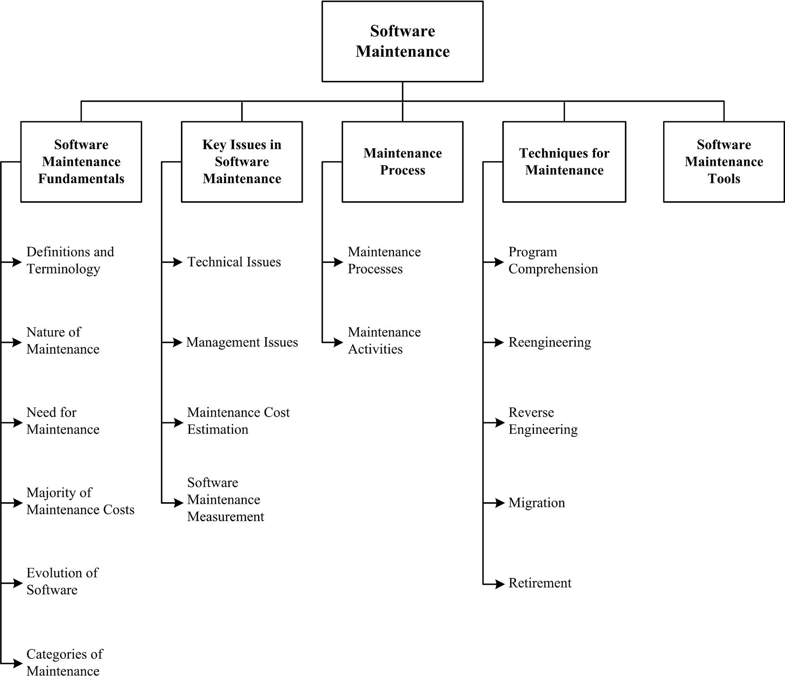
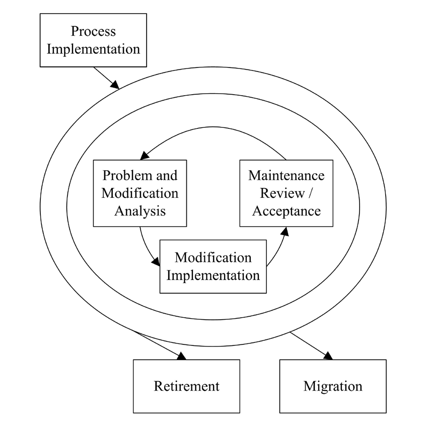

## Chapter 5: Software Maintenance

**Acronyms**

MR Modification Request
PR Problem Report
SCM Software Configuration Management
SLA Service-Level Agreement
SQA Software Quality Assurance
V&V Verification and Validation

**Introduction**

Software development efforts result in the delivery of a software product that
satisfies user requirements. Accordingly, the software product must change or
evolve. Once in operation, defects are uncovered, operating environments
change, and new user requirements surface. The maintenance phase of the life
cycle begins following a warranty period or postimplementation support
delivery, but maintenance activities occur much earlier.

Software maintenance is an integral part of a software life cycle. However, it
has not received the same degree of attention that the other phases have.
Historically, software development has had a much higher profile than software
maintenance in most organizations. This is now changing, as organizations
strive to squeeze the most out of their software development investment by
keeping software operating as long as possible. The open source paradigm has
brought further attention to the issue of maintaining software artifacts
developed by others.

In this _Guide_, software maintenance is defined as the totality of activities
required to provide cost-effective support to software. Activities are
performed during the predelivery stage as well as during the postdelivery
stage. Predelivery activities include planning for postdelivery operations,
maintainability, and logistics determination for transition activities [1*,
c6s9]. Postdelivery activities include software modification, training, and
operating or interfacing to a help desk. The Software Maintenance knowledge
area (KA) is related to all other aspects of software engineering. Therefore,
this KA description is linked to all other software engineering KAs of the
Guide.

BREAKDOWN OF TOPICS FOR SOFTWARE MAINTENANCE

The breakdown of topics for the Software Maintenance KA is shown in Figure
5.1.

### 1. Software Maintenance Fundamentals

This first section introduces the concepts and terminology that form an
underlying basis to understanding the role and scope of software maintenance.
The topics provide definitions and emphasize why there is a need for
maintenance. Categories of software maintenance are critical to understanding
its underlying meaning.

#### 1.1. Definitions and Terminology

<!-- [1*, c3] [2*, c1s2, c2s2] -->

The purpose of software maintenance is defined in the international standard
for software maintenance: ISO/IEC/IEEE 14764 [1].^1 In the context of software
engineering, software maintenance is essentially one of the many technical
processes.

1 For the purpose of conciseness and ease of reading, this standard is
referred to simply as IEEE 14764 in the subsequent text of this KA.

The objective of software maintenance is to modify existing software while
preserving its integrity. The international standard also states the importance
of having some maintenance activities prior to the final delivery of software
(predelivery activities). Notably, IEEE 14764 emphasizes the importance of the
predelivery aspects of maintenance - planning, for example.

#### 1.2. Nature of Maintenance

<!-- [2*, c1s3] -->

Software maintenance sustains the software product throughout its life cycle
(from development to operations). Modification requests are logged and tracked,
the impact of proposed changes is determined, code and other software artifacts
are modified, testing is conducted, and a new version of the software product
is released. Also, training and daily support are provided to users. The term
maintainer is defined as an organization that performs maintenance activities.
In this KA, the term will sometimes refer to individuals who perform those
activities, contrasting them with the developers.

IEEE 14764 identifies the primary activities of software maintenance as process
implementation, problem and modification analysis, modification implementation,
maintenance review/acceptance, migration, and retirement. These activities are
discussed in section 3.2, Maintenance Activities. Maintainers can learn from
the developers’ knowledge of the software. Contact with the developers and
early involvement by the maintainer helps reduce the overall maintenance
effort. In some instances, the initial developer cannot be reached or has moved
on to other tasks, which creates an additional challenge for maintainers.
Maintenance must take software artifacts from development (for example, code or
documentation) and support them immediately, then progressively
evolve/maintain them over a software life cycle.

Software Maintenance 5-3

#### 1.3. Need for Maintenance

<!-- [2*, c1s5] -->

Maintenance is needed to ensure that the software continues to satisfy user
requirements. Maintenance is applicable to software that is developed using any
software life cycle model (for example, spiral or linear). Software products
change due to corrective and noncorrective software actions. Maintenance must
be performed in order to

- correct faults;
- improve the design;
- implement enhancements;
- interface with other software;
- adapt programs so that different hardware, software, system features, and
  telecommunications facilities can be used;
- migrate legacy software; and
- retire software.

Five key characteristics comprise the maintainer’s activities:

- maintaining control over the software’s day-to-day functions;
- maintaining control over software modification;
- perfecting existing functions;
- identifying security threats and fixing security vulnerabilities; and
- preventing software performance from degrading to unacceptable levels.

#### 1.4. Majority of Maintenance Costs

<!-- [2*, c4s3, c5s5.2] -->

Maintenance consumes a major share of the financial resources in a software
life cycle. A common perception of software maintenance is that it merely fixes
faults. However, studies and surveys over the years have indicated that the
majority, over 80 percent, of software maintenance is used for noncorrective
actions [2*, figure 4.1]. Grouping enhancements and corrections together in
management reports contributes to some misconceptions regarding the high cost
of corrections. Understanding the categories of software maintenance helps to
understand the structure of software maintenance costs. Also, understanding the
factors that influence the maintainability of software can help to contain
costs. Some environmental factors and their relationship to software
maintenance costs include the following:

- Operating environment refers to hardware and software.
- Organizational environment refers to policies, competition, process, product,
  and personnel.

#### 1.5. Evolution of Software

<!-- [2*, c3s5] -->

Software maintenance in terms of evolution was first addressed in the late
1960s. Over a period of twenty years, research led to the formulation of eight
“Laws of Evolution.” Key findings include a proposal that maintenance is
evolutionary development and that maintenance decisions are aided by
understanding what happens to software over time. Some state that maintenance
is continued development, except that there is an extra input (or constraint) –
in other words, existing large software is never complete and continues to
evolve; as it evolves, it grows more complex unless some action is taken to
reduce this complexity.

#### 1.6. Categories of Maintenance

<!-- [1*, c3, c6s2] [2*, c3s3.1] -->

Three categories (types) of maintenance have been defined: corrective,
adaptive, and perfective [2*, c4s3]. IEEE 14764 includes a fourth
category–preventative.

- Corrective maintenance: reactive modification (or repairs) of a software
  product performed after delivery to correct discovered problems. Included in
  this category is emergency maintenance, which is an unscheduled modification
  performed to temporarily keep a software product operational pending
  corrective maintenance.
- Adaptive maintenance: modification of a software product performed after
  delivery to keep a software product usable in a changed or changing
  environment. For example, the operating system might be upgraded and some
  changes to the software may be necessary.
- Perfective maintenance: modification of a software product after delivery to
  provide enhancements for users, improvement of program documentation, and
  recoding to improve software performance, maintainability, or other software
  attributes.
- Preventive maintenance: modification of a software product after delivery to
  detect and correct latent faults in the software product before they become
  operational faults.

IEEE 14764 classifies adaptive and perfective maintenance as maintenance
enhancements. It also groups together the corrective and preventive maintenance
categories into a correction category, as shown in Table 5.1.

|            | Correction  | Enhancement |
|-----------:|:------------|-------------|
|  Proactive |  Preventive | Perfective  |
|  Reactive  |  Corrective | Adaptive    |

Table 5.1. Software Maintenance Categories

### 2. Key Issues in Software Maintenance

A number of key issues must be dealt with to ensure the effective maintenance
of software. Software maintenance provides unique technical and management
challenges for software engineers—for example, trying to find a fault in
software containing a large number of lines of code that another software
engineer developed. Similarly, competing with software developers for resources
is a constant battle. Planning for a future release, which often includes
coding the next release while sending out emergency patches for the current
release, also creates a challenge. The following section presents some of the
technical and management issues related to software maintenance. They have been
grouped under the following topic headings:

- technical issues,
- management issues,
- cost estimation, and
- measurement.

#### 2.1. Technical Issues

##### 2.1.1. Limited Understanding

<!-- [2*, c6] -->

Limited understanding refers to how quickly a software engineer can understand
where to make a change or correction in software that he or she did not
develop. Research indicates that about half of the total maintenance effort is
devoted to understanding the software to be modified. Thus, the topic of
software comprehension is of great interest to software engineers.
Comprehension is more difficult in text-oriented representation - in source
code, for example - where it is often difficult to trace the evolution of
software through its releases/ versions if changes are not documented and if
the developers are not available to explain it, which is often the case. Thus,
software engineers may initially have a limited understanding of the software;
much has to be done to remedy this.

##### 2.1.2. Testing

<!-- [1*, c6s2.2.2] [2*, c9] -->

The cost of repeating full testing on a major piece of software is significant
in terms of time and money. In order to ensure that the requested problem
reports are valid, the maintainer should replicate or verify problems by
running the appropriate tests. Regression testing (the selective retesting of
software or a component to verify that the modifications have not caused
unintended effects) is an important testing concept in maintenance.
Additionally, finding time to test is often difficult. Coordinating tests when
different members of the maintenance team are working on different problems at
the same time remains a challenge. When software performs critical functions,
it may be difficult to bring it offline to test. Tests cannot be executed in
the most meaningful place - the production system. The Software Testing KA
provides additional information and references on this matter in its subtopic
on regression testing.

Software Maintenance 5-5

##### 2.1.3. Impact Analysis

<!-- [1*, c5s2.5] [2*, c13s3] -->

Impact analysis describes how to conduct, costeffectively, a complete analysis
of the impact of a change in existing software. Maintainers must possess an
intimate knowledge of the software’s structure and content. They use that
knowledge to perform impact analysis, which identifies all systems and software
products affected by a software change request and develops an estimate of the
resources needed to accomplish the change. Additionally, the risk of making the
change is determined. The change request, sometimes called a modification
request (MR) and often called a problem report (PR), must first be analyzed and
translated into software terms. Impact analysis is performed after a change
request enters the software configuration management process. IEEE 14764 states
the impact analysis tasks:

- analyze MRs/PRs;
- replicate or verify the problem;
- develop options for implementing the modification;
- document the MR/PR, the results, and the execution options;
- obtain approval for the selected modification option.

The severity of a problem is often used to decide how and when it will be
fixed. The software engineer then identifies the affected components. Several
potential solutions are provided, followed by a recommendation as to the best
course of action.

Software designed with maintainability in mind greatly facilitates impact
analysis. More information can be found in the Software Configuration
Management KA.

##### 2.1.4. Maintainability

<!-- [1*, c6s8] [2*, c12s5.5] -->

IEEE 14764 [1*, c3s4] defines maintainability as the capability of the software
product to be modified. Modifications may include corrections, improvements, or
adaptation of the software to changes in environment as well as changes in
requirements and functional specifications. As a primary software quality
characteristic, maintainability should be specified, reviewed, and controlled
during software development activities in order to reduce maintenance costs.
When done successfully, the software’s maintainability will improve.
Maintainability is often difficult to achieve because the subcharacteristics
are often not an important focus during the process of software development.
The developers are, typically, more preoccupied with many other activities and
frequently prone to disregard the maintainer’s requirements. This in turn can,
and often does, result in a lack of software documentation and test
environments, which is a leading cause of difficulties in program comprehension
and subsequent impact analysis. The presence of systematic and mature
processes, techniques, and tools helps to enhance the maintainability of
software.

#### 2.2. Management Issues

##### 2.2.1. Alignment with Organizational Objectives

<!-- [2*, c4] -->

Organizational objectives describe how to demonstrate the return on investment
of software maintenance activities. Initial software development is usually
project-based, with a defined time scale and budget. The main emphasis is to
deliver a product that meets user needs on time and within budget. In contrast,
software maintenance often has the objective of extending the life of software
for as long as possible. In addition, it may be driven by the need to meet user
demand for software updates and enhancements. In both cases, the return on
investment is much less clear, so that the view at the senior management
level is often that of a major activity consuming significant resources
with no clear quantifiable benefit for the organization.

##### 2.2.2. Staffing

<!-- [2*, c4s5, c10s4] -->

Staffing refers to how to attract and keep software maintenance staff.
Maintenance is not often viewed as glamorous work. As a result, software
maintenance personnel are frequently viewed as “second-class citizens,” and
morale therefore suffers.

##### 2.2.3. Process

<!-- [1*, c5] [2*, c5] -->

The software life cycle process is a set of activities, methods, practices, and
transformations that people use to develop and maintain software and its
associated products. At the process level, software maintenance activities
share much in common with software development (for example, software
configuration management is a crucial activity in both). Maintenance also
requires several activities that are not found in software development (see
section 3.2 on unique activities for details). These activities present
challenges to management.

##### 2.2.4. Organizational Aspects of Maintenance

<!-- [1*, c7s2.3] [2*, c10] -->

Organizational aspects describe how to identify which organization and/or
function will be responsible for the maintenance of software. The team that
develops the software is not necessarily assigned to maintain the software once
it is operational.

In deciding where the software maintenance function will be located, software
engineering organizations may, for example, stay with the original developer or
go to a permanent maintenance-specific team (or maintainer). Having a permanent
maintenance team has many benefits:

- allows for specialization;
- creates communication channels;
- promotes an egoless, collegiate atmosphere;
- reduces dependency on individuals;
- allows for periodic audit checks.

Since there are many pros and cons to each option, the decision should be made
on a case-by-case basis. What is important is the delegation or assignment of
the maintenance responsibility to a single group or person, regardless of the
organization’s structure.

##### 2.2.5. Outsourcing

<!-- [3] -->

Outsourcing and offshoring software maintenance has become a major industry.
Organizations are outsourcing entire portfolios of software, including software
maintenance. More often, the outsourcing option is selected for less
mission-critical software, as organizations are unwilling to lose control of
the software used in their core business. One of the major challenges for
outsourcers is to determine the scope of the maintenance services required, the
terms of a service-level agreement, and the contractual details. Outsourcers
will need to invest in a maintenance infrastructure, and the help desk at the
remote site should be staffed with native-language speakers. Outsourcing
requires a significant initial investment and the setup of a maintenance
process that will require automation.

#### 2.3. Maintenance Cost Estimation

Software engineers must understand the different categories of software
maintenance, discussed above, in order to address the question of estimating
the cost of software maintenance. For planning purposes, cost estimation is an
important aspect of planning for software maintenance.

##### 2.3.1. Cost Estimation

<!-- [2*, c7s2.4] -->

Section 2.1.3 describes how impact analysis identifies all systems and software
products affected by a software change request and develops an estimate of the
resources needed to accomplish that change.

Maintenance cost estimates are affected by many technical and nontechnical
factors. IEEE 14764 states that “the two most popular approaches to estimating
resources for software maintenance are the use of parametric models and the use
of experience” [1*, c7s4.1]. A combination of these two can also be used.

Software Maintenance 5-7

##### 2.3.2. Parametric Models

<!-- [2*, c12s5.6] -->

Parametric cost modeling (mathematical models) has been applied to software
maintenance. Of significance is that historical data from past maintenance are
needed in order to use and calibrate the mathematical models. Cost driver
attributes affect the estimates.

##### 2.3.3. Experience

<!-- [2*, c12s5.5] -->

Experience, in the form of expert judgment, is often used to estimate
maintenance effort. Clearly, the best approach to maintenance estimation is to
combine historical data and experience. The cost to conduct a modification (in
terms of number of people and amount of time) is then derived. Maintenance
estimation historical data should be provided as a result of a measurement
program.

#### 2.4. Software Maintenance Measurement

<!-- [1*, c6s5] [2*, c12] -->

Entities related to software maintenance, whose attributes can be subjected to
measurement, include process, resource, and product [2*, c12s3.1].

There are several software measures that can be derived from the attributes of
the software, the maintenance process, and personnel, including size,
complexity, quality, understandability, maintainability, and effort. Complexity
measures of software can also be obtained using available commercial tools.
These measures constitute a good starting point for the maintainer’s
measurement program. Discussion of software process and product measurement is
also presented in the Software Engineering Process KA. The topic of a software
measurement program is described in the Software Engineering Management KA.

##### 2.4.1. Specific Measures

<!-- [2*, c12] -->

The maintainer must determine which measures are appropriate for a specific
organization based on that organization’s own context. The software quality
model suggests measures that are specific for software maintenance. Measures
for subcharacteristics of maintainability include the following [4*, p. 60]:

- Analyzability: measures of the maintainer’s effort or resources expended in
  trying either to diagnose deficiencies or causes of failure or to identify
  parts to be modified.
- Changeability: measures of the maintainer’s effort associated with
  implementing a specified modification.
- Stability: measures of the unexpected behav- ior of software, including that
  encountered during testing.
- Testability: measures of the maintainer’s and users’ effort in trying to test
  the modified software.
- Other measures that maintainers use include
- size of the software,
- complexity of the software,
- understandability, and
- maintainability.

Providing software maintenance effort, by categories, for different
applications provides business information to users and their organizations. It
can also enable the comparison of software maintenance profiles internally
within an organization.

### 3. Maintenance Process

In addition to standard software engineering processes and activities described
in IEEE 14764, there are a number of activities that are unique to maintainers.

#### 3.1. Maintenance Processes

<!-- [1*, c5] [2*, c5] [5, s5.5] -->

Maintenance processes provide needed activities and detailed inputs/outputs to
those activities as described in IEEE 14764. The maintenance process activities
of IEEE 14764 are shown in Figure 5.2. Software maintenance activities include

- process implementation,
- problem and modification analysis,
- modification implementation,
- maintenance review/acceptance,
- migration, and
- software retirement.

Other maintenance process models include:

- quick fix,
- spiral,
- Osborne’s,
- iterative enhancement, and
- reuse-oriented.

Recently, agile methodologies, which promote light processes, have been also
adapted to maintenance. This requirement emerges from the everincreasing
demand for fast turnaround of maintenance services. Improvement to the software
maintenance process is supported by specialized software maintenance capability
maturity models (see [6] and [7], which are briefly annotated in the Further
Readings section).

#### 3.2. Maintenance Activities

<!-- [1*, c5, c6s8.2, c7s3.3] -->

The maintenance process contains the activities and tasks necessary to modify
an existing software product while preserving its integrity. These activities
and tasks are the responsibility of the maintainer. As already noted, many
maintenance activities are similar to those of software development.
Maintainers perform analysis, design, coding, testing, and documentation.
They must track requirements in their activities - just as is done in
development - and update documentation as baselines change. IEEE 14764
recommends that when a maintainer uses a development process, it must be
tailored to meet specific needs [1*, c5s3.2.2]. However, for software
maintenance, some activities involve processes unique to software maintenance.

##### 3.2.1. Unique Activities

<!-- [1*, c3s10, c6s9, c7s2, c7s3] [2*, c6, c7] -->

There are a number of processes, activities, and practices that are unique to
software maintenance:

- Program understanding: activities needed to obtain a general knowledge of
  what a software product does and how the parts work together.
- Transition: a controlled and coordinated sequence of activities during which
  software is transferred progressively from the developer to the maintainer.
- Modification request acceptance/rejection: modifications requesting work
  beyond a certain size/effort/complexity may be rejected by maintainers and
  rerouted to a developer.
- Maintenance help desk: an end-user and maintenance coordinated support
  function that triggers the assessment, prioritization, and costing of
  modification requests.
- Impact analysis: a technique to identify areas impacted by a potential
  change;
- Maintenance Service-Level Agreements (SLAs) and maintenance licenses and
  contracts: contractual agreements that describe the services and quality
  objectives.

##### 3.2.2. Supporting Activities

<!-- [1*, c4s1, c5, c6s7] [2*, c9] -->

Maintainers may also perform support activities, such as documentation,
software configuration management, verification and validation, problem
resolution, software quality assurance, reviews, and audits. Another important
support activity consists of training the maintainers and users.

Software Maintenance 5-9

##### 3.2.3. Maintenance Planning Activities

<!-- [1*, c7s3] -->

An important activity for software maintenance is planning, and maintainers
must address the issues associated with a number of planning perspectives,
including

- business planning (organizational level),
- maintenance planning (transition level),
- release/version planning (software level), and
- individual software change request planning (request level).

At the individual request level, planning is carried out during the impact
analysis (see section 2.1.3, Impact Analysis). The release/version planning
activity requires that the maintainer:

- collect the dates of availability of individual requests,
- agree with users on the content of subsequent releases/versions,
- identify potential conflicts and develop alternatives,
- assess the risk of a given release and develop a back-out plan in case
  problems should arise, and
- inform all the stakeholders.

Whereas software development projects can typically last from some months to a
few years, the maintenance phase usually lasts for many years. Making estimates
of resources is a key element of maintenance planning. Software maintenance
planning should begin with the decision to develop a new software product and
should consider quality objectives. A concept document should be developed,
followed by a maintenance plan. The maintenance concept for each software
product needs to be documented in the plan [1*, c7s2] and should address the

- scope of the software maintenance,
- adaptation of the software maintenance process,
- identification of the software maintenance organization, and
- estimate of software maintenance costs.

The next step is to develop a corresponding software maintenance plan. This
plan should be prepared during software development and should specify how
users will request software modifications or report problems. Software
maintenance planning is addressed in IEEE 14764. It provides guidelines for a
maintenance plan. Finally, at the highest level, the maintenance organization
will have to conduct business planning activities (budgetary, financial, and
human resources) just like all the other divisions of the organization.
Management is discussed in the chapter Related Disciplines of Software
Engineering.

##### 3.2.4. Software Configuration Management

<!-- [1*, c5s1.2.3] [2*, c11] -->

IEEE 14764 describes software configuration management as a critical element of
the maintenance process. Software configuration management procedures should
provide for the verification, validation, and audit of each step required to
identify, authorize, implement, and release the software product.

It is not sufficient to simply track modification requests or problem reports.
The software product and any changes made to it must be controlled. This
control is established by implementing and enforcing an approved software
configuration management (SCM) process. The Software Configuration Management
KA provides details of SCM and discusses the process by which software change
requests are submitted, evaluated, and approved. SCM for software maintenance
is different from SCM for software development in the number of small changes
that must be controlled on operational software. The SCM process is implemented
by developing and following a software configuration management plan and
operating procedures. Maintainers participate in Configuration Control Boards
to determine the content of the next release/version.

##### 3.2.5. Software Quality

<!-- [1*, c6s5, c6s7, c6s8] [2*, c12s5.3] -->

It is not sufficient to simply hope that increased quality will result from the
maintenance of software. Maintainers should have a software quality program. It
must be planned and processes must be implemented to support the maintenance
process. The activities and techniques for Software Quality Assurance (SQA),
V&V, reviews, and audits must be selected in concert with all the other
processes to achieve the desired level of quality. It is also recommended that
the maintainer adapt the software development processes, techniques and
deliverables (for instance, testing documentation), and test results. More
details can be found in the Software Quality KA.

### 4. Techniques for Maintenance

This topic introduces some of the generally accepted techniques used in
software maintenance.

#### 4.1. Program Comprehension

<!-- [2*, c6, c14s5] -->

Programmers spend considerable time reading and understanding programs in order
to implement changes. Code browsers are key tools for program comprehension and
are used to organize and present source code. Clear and concise documentation
can also aid in program comprehension.

#### 4.2. Reengineering

<!-- [2*, c7] -->

Reengineering is defined as the examination and alteration of software to
reconstitute it in a new form, and includes the subsequent implementation of
the new form. It is often not undertaken to improve maintainability but to
replace aging legacy software. Refactoring is a reengineering technique that
aims at reorganizing a program without changing its behavior. It seeks to
improve a program structure and its maintainability. Refactoring techniques can
be used during minor changes.

#### 4.3. Reverse Engineering

<!-- [1*, c6s2] [2*, c7, c14s5] -->

Reverse engineering is the process of analyzing software to identify the
software’s components and their inter-relationships and to create
representations of the software in another form or at higher levels of
abstraction. Reverse engineering is passive; it does not change the software or
result in new software. Reverse engineering efforts produce call graphs and
control flow graphs from source code. One type of reverse engineering is
redocumentation. Another type is design recovery. Finally, data reverse
engineering, where logical schemas are recovered from physical databases, has
grown in importance over the last few years. Tools are key for reverse
engineering and related tasks such as redocumentation and design recovery.

#### 4.4. Migration

<!-- [1*, c5s5] -->

During software’s life, it may have to be modified to run in different
environments. In order to migrate it to a new environment, the maintainer needs
to determine the actions needed to accomplish the migration, and then develop
and document the steps required to effect the migration in a migration plan
that covers migration requirements, migration tools, conversion of product and
data, execution, verification, and support. Migrating software can also entail
a number of additional activities such as

- notification of intent: a statement of why the old environment is no longer
  to be supported, followed by a description of the new environment and its
  date of availability;
- parallel operations: make available the old and new environments so that the
  user experiences a smooth transition to the new environment;
- notification of completion: when the scheduled migration is completed, a
  notification is sent to all concerned;

Software Maintenance 5-11

- postoperation review: an assessment of parallel operation and the impact of
  changing to the new environment;
- data archival: storing the old software data.

#### 4.5. Retirement

<!-- [1*, c5s6] -->

Once software has reached the end of its useful life, it must be retired. An
analysis should be performed to assist in making the retirement decision. This
analysis should be included in the retirement plan, which covers retirement
requirements, impact, replacement, schedule, and effort. Accessibility of
archive copies of data may also be included. Retiring software entails a number
of activities similar to migration.

### 5. Software Maintenance Tools

<!-- [1*, c6s4] [2*, c14] -->

This topic encompasses tools that are particularly important in software
maintenance where existing software is being modified. Examples regarding
program comprehension include

- program slicers, which select only parts of a program affected by a change;
- static analyzers, which allow general viewing and summaries of a program content;
- dynamic analyzers, which allow the maintainer to trace the execution path of
  a program;
- data flow analyzers, which allow the maintainer to track all possible data
  flows of a program;
- cross-referencers, which generate indices of program components; and
- dependency analyzers, which help maintainers analyze and understand the
  interrelationships between components of a program.

Reverse engineering tools assist the process by working backwards from an
existing product to create artifacts such as specification and design
descriptions, which can then be transformed to generate a new product from an
old one. Maintainers also use software test, software configuration management,
software documentation, and software measurement tools.

### Matrix Of Topics vs. Reference Material

IEEE/ISO/IEC 14764 2006

[1]

Grubb and Takang 2003

[2]

Sneed 2008

[3]

**1. Software Maintenance Fundamentals**
    1.1. Definitions and Terminology c3 c1s2, c2s2
    1.2. Nature of Maintenance c1s3
    1.3. Need for Maintenance c1s5
    1.4. Majority of Maintenance Costs c4s3, c5s5.2
    1.5. Evolution of Software c3s5
    1.6. Categories of Maintenance c3, c6s2 c3s3.1, c4s3
**2. Key Issues in Software Maintenance**
    2.1. Technical Issues
    2.1.1. Limited Understanding c6
    2.1.2. Testing c6s2.2.2 c9
    2.1.3. Impact Analysis c5s2.5 c13s3
    2.1.4. Maintainability c6s8, c3s4 c12s5.5
    2.2. Management Issues
    2.2.1. Alignment with Organizational objectives c4
    2.2.2. Staffing c4s5, c10s4
    2.2.3. Process c5 c5
    2.2.4. Organizational Aspects of Maintenance c7s.2.3 c10
    2.2.5. Outsourcing/Offshoring all
    2.3. Maintenance Cost Estimation
    2.3.1. Cost Estimation c7s4.1 c7s2.4

Software Maintenance 5-13

IEEE/ISO/IEC 14764 2006

[1]

Grubb and Takang 2003

[2]

Sneed 2008

[3]
    2.3.2. Parametric Models c12s5.6
    2.3.3. Experience c12s5.5
    2.4. Software Maintenance Measurement c6s5 c12, c12s3.1
    2.4.1. Specific Measures c12
**3. Maintenance Process**
    3.1. Maintenance Processes c5 c5
    3.2. Maintenance Activities c5, c5s3.2.2, c6s8.2, c7s3.3
    3.2.1. Unique Activities c3s10, c6s9, c7s2, c7s3 c6,c7
    3.2.2. Supporting Activities c4s1, c5, c6s7 c9
    3.2.3. Maintenance Planning Activities c7s2, c7s.3
    3.2.4. Software Configuration Management c5s1.2.3 c11
    3.2.5. Software Quality c6s5, c6s7, c6s8 c12s5.3
**4. Techniques for Maintenance**
    4.1. Program Comprehension c6,c14s5
    4.2. Reengineering c7
    4.3. Reverse Engineering c6s2 c7, c14s5
    4.4. Migration c5s5
    4.5. Retirement c5s6
**5. Software Maintenance Tools** c6s4 c14

**Further Readings

A. April and A. Abran, _Software Maintenance Management: Evaluation and
Continuous Improvement_ [6].

This book explores the domain of small software maintenance processes (S3M). It
provides roadmaps for improving software maintenance processes in
organizations. It describes a software maintenance specific maturity model
organized by levels which allow for benchmarking and continuous improvement.
Goals for each key practice area are provided, and the process model presented
is fully aligned with the architecture and framework of international standards
ISO12207, ISO14764 and ISO15504 and popular maturity models like ITIL, CoBIT,
CMMI and CM3.

M. Kajko-Mattsson, “Towards a Business Maintenance Model,” IEEE Int’l Conf.
Software Maintenance [7].

This paper presents an overview of the Corrective Maintenance Maturity Model
(CM3). In contrast to other process models, CM3 is a specialized model,
entirely dedicated to corrective maintenance of software. It views maintenance
in terms of the activities to be performed and their order, in terms of the
information used by these activities, goals, rules and motivations for their
execution, and organizational levels and roles involved at various stages of a
typical corrective maintenance process.

**References**

[1] IEEE Std. 14764-2006 (a.k.a. ISO/IEC 14764:2006) Standard for Software
Engineering—Software Life Cycle Processes—Maintenance, IEEE, 2006.

[2] P. Grubb and A.A. Takang, Software Maintenance: Concepts and Practice, 2nd
ed., World Scientific Publishing, 2003.

[3] H.M. Sneed, “Offering Software Maintenance as an Offshore Service,” Proc.
IEEE Int’l Conf. Software Maintenance (ICSM 08), IEEE, 2008, pp. 1–5.

[4] J.W. Moore, The Road Map to Software Engineering: A Standards-Based Guide,
Wiley-IEEE Computer Society Press, 2006.

[5] ISO/IEC/IEEE 24765:2010 Systems and Software Engineering—Vocabulary, ISO/
IEC/IEEE, 2010.

[6] A. April and A. Abran, Software Maintenance Management: Evaluation and
Continuous Improvement, Wiley-IEEE Computer Society Press, 2008.

[7] M. Kajko-Mattsson, “Towards a Business Maintenance Model,” Proc. Int’l
Conf.  Software Maintenance, IEEE, 2001, pp.  500–509.
