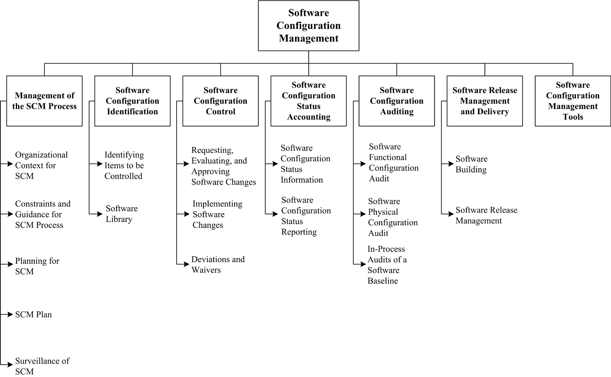
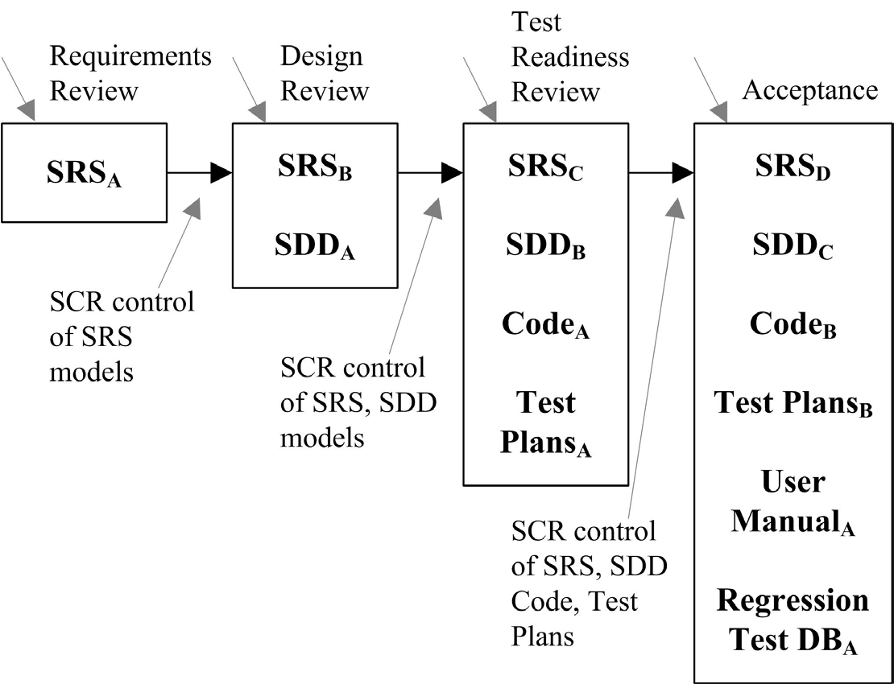
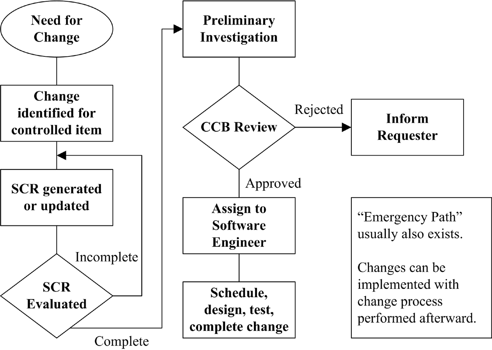

## Chapter 6: Software Configuration Management

**Acronyms**

- CCB Configuration Control Board
- CM Configuration Management
- FCA Functional Configuration Audit
- PCA Physical Configuration Audit
- SCCB Software Configuration Control Board
- SCI Software Configuration Item
- SCM Software Configuration Management
- SCMP Software Configuration Management Plan
- SCR Software Change Request
- SCSA Software Configuration Status Accounting
- SDD Software Design Document
- SEI/ CMMI Software Engineering Institute’s Capability Maturity Model
  Integration
- SQA Software Quality Assurance
- SRS Software Requirement Specification

**Introduction**

A system can be defined as the combination of interacting elements organized to
achieve one or more stated purposes [1]. The configuration of a system is the
functional and physical characteristics of hardware or software as set forth in
technical documentation or achieved in a product [1]; it can also be thought of
as a collection of specific versions of hardware, firmware, or software items
combined according to specific build procedures to serve a particular purpose.
Configuration management (CM), then, is the discipline of identifying the
configuration of a system at distinct points in time for the purpose of
systematically controlling changes to the configuration and maintaining the
integrity and traceability of the configuration throughout the system life
cycle. It is formally defined as a discipline applying technical and
administrative direction and surveillance to: identify and document the
functional and physical characteristics of a configuration item, control
changes to those characteristics, record and report change processing and
implementation status, and verify compliance with specified requirements. [1]

Software configuration management (SCM) is a supporting-software life cycle
process that benefits project management, development and maintenance
activities, quality assurance activities, as well as the customers and users of
the end product.  The concepts of configuration management apply to all items
to be controlled, although there are some differences in implementation between
hardware CM and software CM.  SCM is closely related to the software quality
assurance (SQA) activity. As defined in the Software Quality knowledge area
(KA), SQA processes provide assurance that the software products and processes
in the project life cycle conform to their specified requirements by planning,
enacting, and performing a set of activities to provide adequate confidence
that quality is being built into the software. SCM activities help in
accomplishing these SQA goals. In some project contexts, specific SQA
requirements prescribe certain SCM activities.

The SCM activities are management and planning of the SCM process, software
configuration identification, software configuration control, software
configuration status accounting, software configuration auditing, and software
release management and delivery.

The Software Configuration Management KA is related to all the other KAs, since
the object of configuration management is the artifact produced and used
throughout the software engineering process.

**BREAKDOWN OF TOPICS FOR SOFTWARE CONFIGURATION MANAGEMENT**

The breakdown of topics for the Software Configuration Management KA is shown
in Figure 6.1.

### 1. Management of the SCM Process

SCM controls the evolution and integrity of a product by identifying its
elements; managing and controlling change; and verifying, recording, and
reporting on configuration information. From the software engineer’s
perspective, SCM facilitates development and change implementation activi ties.
A successful SCM implementation requires careful planning and management.

This, in turn, requires an understanding of the organizational context for, and
the constraints placed on, the design and implementation of the SCM process.

#### 1.1. Organizational Context for SCM

<!-- [2*, c6, ann. D] [3*, introduction] [4*, c29] -->

To plan an SCM process for a project, it is necessary to understand the
organizational context and the relationships among organizational elements.
SCM interacts with several other activities or organizational elements.

The organizational elements responsible for the software engineering supporting
processes may be structured in various ways. Although the responsibility for
performing certain SCM tasks might be assigned to other parts of the
organization (such as the development organization), the overall responsibility
for SCM often rests with a distinct organizational element or designated
individual.  Software is frequently developed as part of a larger system
containing hardware and firmware elements. In this case, SCM activities take
place

in parallel with hardware and firmware CM activities and must be consistent
with system-level CM. Note that firmware contains hardware and software;
therefore, both hardware and software CM concepts are applicable.

SCM might interface with an organization’s quality assurance activity on issues
such as records management and nonconforming items.  Regarding the former, some
items under SCM control might also be project records subject to provisions of
the organization’s quality assurance program. Managing nonconforming items is
usually the responsibility of the quality assurance activity; however, SCM
might assist with tracking and reporting on software configuration items
falling into this category.

Perhaps the closest relationship is with the software development and
maintenance organizations. It is within this context that many of the
software configuration control tasks are conducted. Frequently, the same
tools support development, maintenance, and SCM purposes.

#### 1.2. Constraints and Guidance for the SCM Process_

<!-- [2, c6, ann. D, ann. E] [3, c2, c5] [5, c19s2.2] -->

Constraints affecting, and guidance for, the SCM process come from a number of
sources. Policies and procedures set forth at corporate or other organizational
levels might influence or prescribe the design and implementation of the SCM
process for a given project. In addition, the contract between the acquirer and
the supplier might contain provisions affecting the SCM process. For example,
certain configuration audits might be required, or it might be specified that
certain items be placed under CM. When software products to be developed have
the potential to affect public safety, external regulatory bodies may impose
constraints. Finally, the particular software life cycle process chosen for a
software project and the level of formalism selected to implement the software
affect the design and implementation of the SCM process.

Guidance for designing and implementing an SCM process can also be obtained
from “best practice,” as reflected in the standards on software engineering
issued by the various standards organizations (see Appendix B on standards).

#### 1.3. Planning for SCM

<!-- [2, c6, ann. D, ann. E] [3, c23] [4, c29] -->

The planning of an SCM process for a given project should be consistent with
the organizational context, applicable constraints, commonly accepted
guidance, and the nature of the project (for example, size, safety criticality,
and security). The major activities covered are software configuration
identification, software configuration control, software configuration status
accounting, software configuration auditing, and software release management
and delivery. In addition, issues such as organization and responsibilities,
resources and schedules, tool selection and implementation, vendor and
subcontractor control, and interface control are typically considered. The
results of the planning activity are recorded in an SCM Plan (SCMP), which is
typically subject to SQA review and audit.  Branching and merging strategies
should be carefully planned and communicated, since they impact many SCM
activities. From an SCM standpoint, a branch is defined as a set of evolving
source file versions [1]. Merging consists in combining different changes to
the same file [1]. This typically occurs when more than one person changes a
configuration item. There are many branching and merging strategies in common
use (see the Further Readings section for additional discussion).  The software
development life cycle model (see Software Life Cycle Models in the Software
Engineering Process KA) also impacts SCM activities, and SCM planning should
take this into account. For instance, continuous integration is a common
practice in many software development approaches. It is typically
characterized by frequent build-test-deploy cycles. SCM activities must be
planned accordingly.

##### 1.3.1. SCM Organization and Responsibilities

<!-- [2, ann. Ds5, ann. Ds6] [3, c10-11] [4, introduction, c29] -->

To prevent confusion about who will perform given SCM activities or tasks,
organizational roles to be involved in the SCM process need to be clearly
identified. Specific responsibilities for given SCM activities or tasks also
need to be assigned to organizational entities, either by title or by
organizational element. The overall authority and reporting channels for SCM
should also be identified, although this might be accomplished at the project
management or quality assurance planning stage.

##### 1.3.2. SCM Resources and Schedules

<!-- [2, ann. Ds8] [3, c23] -->

Planning for SCM identifies the staff and tools involved in carrying out SCM
activities and tasks.  It addresses scheduling questions by establishing
necessary sequences of SCM tasks and identifying their relationships to the
project schedules and milestones established at the project management planning
stage. Any training requirements necessary for implementing the plans and
training new staff members are also specified.

##### 1.3.3. Tool Selection and Implementation

<!-- [3, c26s2, c26s6] [4, c29s5] -->

As for any area of software engineering, the selection and implementation of
SCM tools should be carefully planned. The following questions should be
considered:

- Organization: what motivates tool acquisition from an organizational
  perspective?
- Tools: can we use commercial tools or develop them ourselves?
- Environment: what are the constraints imposed by the organization and its
  technical context?
- Legacy: how will projects use (or not) the new tools?
- Financing: who will pay for the tools’ acquisition, maintenance, training,
  and customization?
- Scope: how will the new tools be deployed - for instance, through the entire
  organization or only on specific projects?
- Ownership: who is responsible for the introduction of new tools?
- Future: what is the plan for the tools’ use in the future?
- Change: how adaptable are the tools?
- Branching and merging: are the tools’ capabilities compatible with the
  planned branching and merging strategies?
- Integration: do the various SCM tools integrate among themselves? With other
  tools in use in the organization?
- Migration: can the repository maintained by the version control tool be
  ported to another version control tool while maintaining complete history of
  the configuration items it contains?

SCM typically requires a set of tools, as opposed to a single tool. Such tool
sets are sometimes referred to as workbenches. In such a context, another
important consideration in planning for tool selection is determining if the
SCM workbench will be open (in other words, tools from different suppliers will
be used in different activities of the SCM process) or integrated (where
elements of the workbench are designed to work together).

The size of the organization and the type of projects involved may also impact
tool selection (see topic 7, Software Configuration Management Tools).

##### 1.3.4. Vendor/Subcontractor Control

<!-- [2, c13] [3, c13s9, c14s2] -->

A software project might acquire or make use of purchased software products,
such as compilers or other tools. SCM planning considers if and how these items
will be taken under configuration control (for example, integrated into the
project libraries) and how changes or updates will be evaluated and managed.

Similar considerations apply to subcontracted software. When using
subcontracted software, both the SCM requirements to be imposed on the
subcontractor’s SCM process as part of the subcontract and the means for
monitoring compliance need to be established. The latter includes consideration
of what SCM information must be available for effective compliance monitoring.

##### 1.3.5. Interface Control

<!-- [2, c12] [3, c24s4] -->

When a software item will interface with another software or hardware item, a
change to either item can affect the other. Planning for the SCM process
considers how the interfacing items will be identified and how changes to the
items will be managed and communicated. The SCM role may be part of a larger,
system-level process for interface specification and control; it may involve
interface specifications, interface control plans, and interface control
documents.  In this case, SCM planning for interface control takes place within
the context of the system-level process.

#### 1.4. SCM Plan

<!-- [2, ann. D] [3, c23] [4, c29s1] -->

The results of SCM planning for a given project are recorded in a software
configuration management plan (SCMP), a “living document” which serves as a
reference for the SCM process. It is maintained (that is, updated and approved)
as necessary during the software life cycle. In implementing the SCMP, it is
typically necessary to develop a number of more detailed, subordinate
procedures defining how specific requirements will be carried out during
day-to-day activities— for example, which branching strategies will be used and
how frequently builds occur and automated tests of all kinds are run.

Guidance on the creation and maintenance of an SCMP, based on the information
produced by the planning activity, is available from a number of sources, such
as [2]. This reference provides requirements for the information to be
contained in an SCMP; it also defines and describes six categories of SCM
information to be included in an SCMP:

- Introduction (purpose, scope, terms used)
- SCM Management (organization, responsibilities, authorities, applicable
  policies, directives, and procedures)
- SCM Activities (configuration identification, configuration control, and so
  on)
- SCM Schedules (coordination with other project activities)
- SCM Resources (tools, physical resources, and human resources)
- SCMP Maintenance.

#### 1.5. Surveillance of Software Configuration Management

<!--[3, c11s3]  -->

After the SCM process has been implemented, some degree of surveillance may be
necessary to ensure that the provisions of the SCMP are properly carried out.
There are likely to be specific SQA requirements for ensuring compliance with
specified SCM processes and procedures.  The person responsible for SCM ensures
that those with the assigned responsibility perform the defined SCM tasks
correctly. The software quality assurance authority, as part of a compliance
auditing activity, might also perform this surveillance.

The use of integrated SCM tools with process control capability can make the
surveillance task easier. Some tools facilitate process compliance while
providing flexibility for the software engineer to adapt procedures. Other
tools enforce process, leaving the software engineer with less flexibility.
Surveillance requirements and the level of flexibility to be provided to the
software engineer are important considerations in tool selection.

##### 1.5.1. SCM Measures and Measurement

<!-- [3, c9s2, c25s2–s3] -->

SCM measures can be designed to provide specific information on the evolving
product or to provide insight into the functioning of the SCM process. A
related goal of monitoring the SCM process is to discover opportunities for
process improvement. Measurements of SCM processes provide a good means for
monitoring the effectiveness of SCM activities on an ongoing basis.  These
measurements are useful in characterizing the current state of the process as
well as in providing a basis for making comparisons over time. Analysis of the
measurements may produce insights leading to process changes and corresponding
updates to the SCMP.  Software libraries and the various SCM tool capabilities
provide sources for extracting information about the characteristics of the SCM
process (as well as providing project and management information). For example,
information about the time required to accomplish various types of changes
would be useful in an evaluation of the criteria for determining what levels of
authority are optimal for authorizing certain types of changes and for
estimating future changes.  Care must be taken to keep the focus of the
surveillance on the insights that can be gained from the measurements, not on
the measurements themselves. Discussion of software process and product
measurement is presented in the Software Engineering Process KA. Software
measurement programs are described in the Software Engineering Management KA.

##### 1.5.2. In-Process Audits of SCM

<!-- [3, c1s1] -->

Audits can be carried out during the software engineering process to
investigate the current status of specific elements of the configuration or to
assess the implementation of the SCM process.  Inprocess auditing of SCM
provides a more formal mechanism for monitoring selected aspects of the process
and may be coordinated with the SQA function (see topic 5, Software
Configuration Auditing).

### 2. Software Configuration Identification

<!-- [2*, c8] [4*, c29s1.1] -->

Software configuration identification identifies items to be controlled,
establishes identification schemes for the items and their versions, and
establishes the tools and techniques to be used in acquiring and managing
controlled items. These activities provide the basis for the other SCM
activities.

#### 2.1. Identifying Items to Be Controlled

<!-- [2, c8s2.2] [4, c29s1.1] -->

One of the first steps in controlling change is identifying the software items
to be controlled.

This involves understanding the software configuration within the context of
the system configuration, selecting software configuration items, developing
a strategy for labeling software items and describing their relationships, and
identifying both the baselines to be used and the procedure for a baseline’s
acquisition of the items.

##### 2.1.1. Software Configuration

<!-- [1, c3] -->

Software configuration is the functional and physical characteristics of
hardware or software as set forth in technical documentation or achieved in a
product. It can be viewed as part of an overall system configuration.

##### 2.1.2. Software Configuration Item

<!-- [4, c29s1.1] -->

A configuration item (CI) is an item or aggregation of hardware or software or
both that is designed to be managed as a single entity. A software
configuration item (SCI) is a software entity that has been established as a
configuration item [1]. The SCM typically controls a variety of items in
addition to the code itself. Software items with potential to become SCIs
include plans, specifications and design documentation, testing materials,
software tools, source and executable code, code libraries, data and data
dictionaries, and documentation for installation, maintenance, operations, and
software use.

Selecting SCIs is an important process in which a balance must be achieved
between providing adequate visibility for project control purposes and
providing a manageable number of controlled items.

##### 2.1.3. Software Configuration Item Relationships

<!-- [3, c7s4] -->

Structural relationships among the selected SCIs, and their constituent parts,
affect other SCM activities or tasks, such as software building or analyzing
the impact of proposed changes. Proper tracking of these relationships is also
important for supporting traceability.  The design of the identification scheme
for SCIs should consider the need to map identified items to the software
structure, as well as the need to support the evolution of the software
items and their relationships.

##### 2.1.4. Software Version

<!-- [1, c3] [4, c29s3] -->

Software items evolve as a software project proceeds. A version of a software
item is an identified instance of an item. It can be thought of as a state of
an evolving item. A variant is a version of a program resulting from the
application of software diversity.

##### 2.1.5. Baseline

<!-- [1, c3] -->

A software baseline is a formally approved version of a configuration item
(regardless of media) that is formally designated and fixed at a specific time
during the configuration item’s life cycle.  The term is also used to refer to
a particular version of a software configuration item that has been agreed on.
In either case, the baseline can only be changed through formal change control
procedures. A baseline, together with all approved changes to the baseline,
represents the current approved configuration.  Commonly used baselines include
functional, allocated, developmental, and product baselines. The functional
baseline corresponds to the reviewed system requirements. The allocated
baseline corresponds to the reviewed software requirements specification and
software interface requirements specification.  The developmental baseline
represents the evolving software configuration at selected times during the
software life cycle. Change authority for this baseline typically rests
primarily with the development organization but may be shared with other
organizations (for example, SCM or Test). The product baseline corresponds to
the completed software product delivered for system integration. The
baselines to be used for a given project, along with the associated levels of
authority needed for change approval, are typically identified in the SCMP.

##### 2.1.6. Acquiring Software Configuration Items

<!-- [3, c18] -->

Software configuration items are placed under SCM control at different times;
that is, they are incorporated into a particular baseline at a particular
point in the software life cycle. The triggering event is the completion of
some form of formal acceptance task, such as a formal review. Figure 6.2
characterizes the growth of baselined items as the life cycle proceeds. This
figure is based on the waterfall model for purposes of illustration only; the
subscripts used in the figure indicate versions

of the evolving items. The software change request (SCR) is described in
section 3.1.  In acquiring an SCI, its origin and initial integrity must be
established. Following the acquisition of an SCI, changes to the item must be
formally approved as appropriate for the SCI and the baseline involved, as
defined in the SCMP.  Following approval, the item is incorporated into the
software baseline according to the appropriate procedure.

#### 2.2. Software Library

<!-- [3, c1s3] [4, c29s1.2] -->

A software library is a controlled collection of software and related
documentation designed to aid in software development, use, or maintenance [1].
It is also instrumental in software release management and delivery activities.
Several types of libraries might be used, each corresponding to the software
item’s particular level of maturity. For example, a working library could
support coding and a project support library could support testing, while a
master library could be used for finished products. An appropriate level of SCM
control (associated baseline and level of authority for change) is associated
with each library. Security, in terms of access control and the backup
facilities, is a key aspect of library management.  The tool(s) used for each
library must support the SCM control needs for that library—both in terms of
controlling SCIs and controlling access to the library. At the working library
level, this is a code management capability serving developers, maintainers,
and SCM. It is focused on managing the versions of software items while
supporting the activities of multiple developers. At higher levels of control,
access is more restricted and SCM is the primary user.

These libraries are also an important source of information for measurements of
work and progress.

### 3. Software Configuration Control

<!-- [2, c9] [4, c29s2] -->

Software configuration control is concerned with managing changes during the
software life cycle. It covers the process for determining what changes to
make, the authority for approving certain changes, support for the
implementation of those changes, and the concept of formal deviations from
project requirements as well as waivers of them. Information derived from these
activities is useful in measuring change traffic and breakage as well as
aspects of rework.

#### 3.1. Requesting, Evaluating, and Approving Software Changes

<!-- [2*, c9s2.4] [4*, c29s2] -->

The first step in managing changes to controlled items is determining what
changes to make. The software change request process (see a typical flow of a
change request process in Figure 6.3) provides formal procedures for submitting
and recording change requests, evaluating the potential cost and impact of a
proposed change, and accepting, modifying, deferring, or rejecting the proposed
change. A change request (CR) is a request to expand or reduce the project
scope; modify policies, processes, plans, or procedures; modify costs or
budgets; or revise schedules [1]. Requests for changes to software
configuration items may be originated by anyone at any point in the software
life cycle and may include a suggested solution and requested priority. One
source of a CR is the initiation of corrective action in response to problem
reports.  Regardless of the source, the type of change (for example, defect or
enhancement) is usually recorded on the Software CR (SCR).

This provides an opportunity for tracking defects and collecting change
activity measurements by change type. Once an SCR is received, a technical
evaluation (also known as an impact analysis) is performed to determine the
extent of the modifications that would be necessary should the change request
be accepted. A good understanding of the relationships among software (and,
possibly, hardware) items is important for this task. Finally, an established
authority - commensurate with the affected baseline, the SCI involved, and the
nature of the change - will evaluate the technical and managerial aspects of
the change request and either accept, modify, reject, or defer the proposed
change.

##### 3.1.1. Software Configuration Control Board

<!-- [2, c9s2.2] [3, c11s1] [4, c29s2] -->

The authority for accepting or rejecting proposed changes rests with an entity
typically known as a Configuration Control Board (CCB). In smaller projects,
this authority may actually reside with the leader or an assigned individual
rather than a multiperson board. There can be multiple levels of change
authority depending on a variety of criteria - such as the criticality of the
item involved, the nature of the change (for example, impact on budget and
schedule), or the project’s current point in the life cycle. The composition of
the CCBs used for a given system varies depending on these criteria (an SCM
representative would always be present). All stakeholders, appropriate to the
level of the CCB, are represented. When the scope of authority of a CCB is
strictly software, it is known as a Software Configuration Control Board
(SCCB). The activities of the CCB are typically subject to software quality
audit or review.

##### 3.1.2. Software Change Request Process

<!-- [3, c1s4, c8s4] -->

An effective software change request (SCR) process requires the use of
supporting tools and procedures for originating change requests, enforcing
the flow of the change process, capturing CCB decisions, and reporting change
process information. A link between this tool capability and the
problem-reporting system can facilitate the tracking of solutions for reported
problems.

#### 3.2. Implementing Software Changes

<!-- [4, c29] -->

Approved SCRs are implemented using the defined software procedures in
accordance with the applicable schedule requirements. Since a number of
approved SCRs might be implemented simultaneously, it is necessary to provide a
means for tracking which SCRs are incorporated into particular software
versions and baselines. As part of the closure of the change process, completed
changes may undergo configuration audits and software quality verification -
this includes ensuring that only approved changes have been made.  The software
change request process described above will typically document the SCM (and
other) approval information for the change.

Changes may be supported by source code version control tools. These tools
allow a team of software engineers, or a single software engineer, to track and
document changes to the source code.  These tools provide a single repository
for storing the source code, can prevent more than one software engineer from
editing the same module at the same time, and record all changes made to the

source code. Software engineers check modules out of the repository, make
changes, document the changes, and then save the edited modules in the
repository. If needed, changes can also be discarded, restoring a previous
baseline. More powerful tools can support parallel development and
geographically distributed environments.  These tools may be manifested as
separate, specialized applications under the control of an independent SCM
group. They may also appear as an integrated part of the software engineering
environment. Finally, they may be as elementary as a rudimentary change control
system provided with an operating system.

#### 3.3. Deviations and Waivers

<!-- [1, c3] -->

The constraints imposed on a software engineering effort or the
specifications produced during the development activities might contain
provisions that cannot be satisfied at the designated point in the life cycle.
A deviation is a written authorization, granted prior to the manufacture of
an item, to depart from a particular performance or design requirement for a
specific number of units or a specific period of time. A waiver is a written
authorization to accept a configuration item or other designated item that is
found, during production or after having been submitted for inspection, to
depart from specified requirements but is nevertheless considered suitable
for use as-is or after rework by an approved method. In these cases, a formal
process is used for gaining approval for deviations from, or waivers of, the
provisions.

### 4. Software Configuration Status Accounting

<!-- [2*, c10] -->

Software configuration status accounting (SCSA) is an element of configuration
management consisting of the recording and reporting of information needed to
manage a configuration effectively.

#### 4.1. Software Configuration Status Information

<!-- [2, c10s2.1] -->

The SCSA activity designs and operates a system for the capture and reporting
of necessary information as the life cycle proceeds. As in any information
system, the configuration status information to be managed for the evolving
configurations must be identified, collected, and maintained.  Various
information and measurements are needed to support the SCM process and to meet
the configuration status reporting needs of management, software engineering,
and other related activities.  The types of information available include the
approved configuration identification as well as the identification and current
implementation status of changes, deviations, and waivers.  Some form of
automated tool support is necessary to accomplish the SCSA data collection
and reporting tasks; this could be a database capability, a standalone tool,
or a capability of a larger, integrated tool environment.

#### 4.2. Software Configuration Status Reporting

<!-- [2, c10s2.4] [3, c1s5, c9s1, c17] -->

Reported information can be used by various organizational and project
elements - including the development team, the maintenance team, project
management, and software quality activities. Reporting can take the form of
ad hoc queries to answer specific questions or the periodic production of
predesigned reports. Some information produced by the status accounting
activity during the course of the life cycle might become quality assurance
records.

In addition to reporting the current status of the configuration, the
information obtained by the SCSA can serve as a basis of various measurements.
Examples include the number of change requests per SCI and the average time
needed to implement a change request.

### 5. Software Configuration Auditing

<!-- [2, c11] -->

A software audit is an independent examination of a work product or set of work
products to assess compliance with specifications, standards, contractual
agreements, or other criteria [1].  Audits are conducted according to a
well-defined process consisting of various auditor roles and responsibilities.
Consequently, each audit must be carefully planned. An audit can require a
number of individuals to perform a variety of tasks over a fairly short period
of time. Tools to support the planning and conduct of an audit can greatly
facilitate the process.

Software configuration auditing determines the extent to which an item
satisfies the required functional and physical characteristics. Informal audits
of this type can be conducted at key points in the life cycle. Two types of
formal audits might be required by the governing contract (for example, in
contracts covering critical software): the Functional Configuration Audit (FCA)
and the Physical Configuration Audit (PCA). Successful completion of these
audits can be a prerequisite for the establishment of the product baseline.

#### 5.1. Software Functional Configuration Audit

<!-- [2, c11s2.1] -->

The purpose of the software FCA is to ensure that the audited software item is
consistent with its governing specifications. The output of the software
verification and validation activities (see Verification and Validation in the
Software Quality KA) is a key input to this audit.

#### 5.2. Software Physical Configuration Audit

<!--[2, c11s2.2]  -->

The purpose of the software physical configuration audit (PCA) is to ensure
that the design and reference documentation is consistent with the as-built
software product.

#### 5.3. In-Process Audits of a Software Baseline

<!-- [2, c11s2.3] -->

As mentioned above, audits can be carried out during the development process to
investigate the current status of specific elements of the configuration. In
this case, an audit could be applied to sampled baseline items to ensure that
performance is consistent with specifications or to ensure that evolving
documentation continues to be consistent with the developing baseline item.

### 6. Software Release Management and Delivery

<!-- [2, c14] [3, c8s2] -->

In this context, _release_ refers to the distribution of a software
configuration item outside the development activity; this includes internal
releases as well as distribution to customers. When different versions of a
software item are available for delivery (such as versions for different
platforms or versions with varying capabilities), it is frequently necessary to
recreate specific versions and package the correct materials for delivery of
the version. The software library is a key element in accomplishing release and
delivery tasks.

#### 6.1. Software Building

<!-- [4, c29s4] -->

Software building is the activity of combining the correct versions of software
configuration items, using the appropriate configuration data, into an
executable program for delivery to a customer or other recipient, such as the
testing activity. For systems with hardware or firmware, the executable program
is delivered to the system-building activity. Build instructions ensure that
the proper build steps are taken in the correct sequence. In addition to
building software for new releases, it is usually also necessary for SCM to
have the capability to reproduce previous releases for recovery, testing,
maintenance, or additional release purposes.  Software is built using
particular versions of supporting tools, such as compilers (see Compiler Basics
in the Computing Foundations KA).  It might be necessary to rebuild an exact
copy of a previously built software configuration item. In this case,
supporting tools and associated build instructions need to be under SCM control
to ensure availability of the correct versions of the tools.

A tool capability is useful for selecting the correct versions of software
items for a given target environment and for automating the process of building
the software from the selected versions and appropriate configuration data. For
projects with parallel or distributed development environments, this tool
capability is necessary. Most software engineering environments provide this
capability. These tools vary in complexity from requiring the software engineer
to learn a specialized scripting language to graphics-oriented approaches
that hide much of the complexity of an “intelligent” build facility.

The build process and products are often subject to software quality
verification. Outputs of the build process might be needed for future reference
and may become quality assurance records.

#### 6.2. Software Release Management

<!--[4, c29s3.2] -->

Software release management encompasses the identification, packaging, and
delivery of the elements of a product—for example, an executable program,
documentation, release notes, and configuration data. Given that product
changes can occur on a continuing basis, one concern for release management is
determining when to issue a release. The severity of the problems addressed by
the release and measurements of the fault densities of prior releases affect
this decision. The packaging task must identify which product items are to be
delivered and then select the correct variants of those items, given the
intended application of the product. The information documenting the
physical contents of a release is known as a version description document.
The release notes typically describe new capabilities, known problems, and
platform requirements necessary for proper product operation. The package to be
released also contains installation or upgrading instructions. The latter can
be complicated by the fact that some current users might have versions that are
several releases old. In some cases, release management might be required in
order to track distribution of the product to various customers or target
systems - for example, in a case where the supplier was required to notify a
customer of newly reported problems. Finally, a mechanism to ensure the
integrity of the released item can be implemented - for example by releasing a
digital signature with it.

A tool capability is needed for supporting these release management functions.
It is useful to have a connection with the tool capability supporting the
change request process in order to map release contents to the SCRs that have
been received. This tool capability might also maintain information on various
target platforms and on various customer environments.

### 7. Software Configuration Management Tools

<!-- [3, c26s1] [4, c8s2] -->

When discussing software configuration management tools, it is helpful to
classify them. SCM tools can be divided into three classes in terms of the
scope at which they provide support: individual support, project-related
support, and companywide-process support.

_Individual support tools_ are appropriate and typically sufficient for small
organizations or development groups without variants of their software products
or other complex SCM requirements. They include:

- Version control tools: track, document, and store individual configuration
  items such as source code and external documentation.
- Build handling tools: in their simplest form, such tools compile and link an
  executable version of the software. More advanced building tools extract the
  latest version from the version control software, perform quality checks, run
  regression tests, and produce various forms of reports, among other tasks.
- Change control tools: mainly support the control of change requests and
  events notification (for example, change request status changes, milestones
  reached).

_Project-related support tools_ mainly support workspace management for
development teams and integrators; they are typically able to support
distributed development environments. Such tools are appropriate for medium to
large organizations with variants of their software products and parallel
development but no certification requirements.

_Companywide-process support tools_ can typically automate portions of a
companywide process, providing support for workflow managements, roles, and
responsibilities. They are able to handle many items, data, and life cycles.
Such tools add to project-related support by supporting a more formal
development process, including certification requirements.

### Matrix of topics vs. Reference material

IEEE 828-2012

[2]

Hass 2003

[3]

Moore 2006

[5]

Sommerville 2011

[4]

**1. Management of the SCM Process**
    1.1. Organizational Context for SCM c6, ann.D introduction c29 
    1.2. Constraints and Guidance for the SCM Process c6, ann.D, ann.E c2 c19s2.2 c29 intro
    1.3. Planning for SCM c6, ann.D, ann.E c23 c29
    1.3.1. SCM Organization and Responsibilities ann.Ds5–6 c10–11 c29 intro
    1.3.2. SCM Resources and Schedules ann.Ds8 c23
    1.3.3. Tool Selection and Implementation c26s2; s6 c29s5 
    1.3.4. Vendor/Subcontractor Control c13 c13s9–c14s2
    1.3.5. Interface Control c12 c24s4
    1.4. SCM Plan ann.D c23 c29s1
    1.5. Surveillance of Software Configuration Management c11s3
    1.5.1. SCM Measures and Measurement c9s2; c25s2–s3
    1.5.2. In-Process Audits of SCM c1s1
**2. Software Configuration Identification** c29s1.1
    2.1. Identifying Items to Be Controlled c8s2.2 c29s1.1
    2.1.1. Software Configuration
    2.1.2. Software Configuration Item c29s1.1
    2.1.3. Software Configuration Item Relationships c7s4
    2.1.4. Software Version c29s3

IEEE 828-2012

[2]

Hass 2003

[3]

Moore 2006

[5]

Sommerville 2011

[4]

    2.1.5. Baseline
    2.1.6. Acquiring Software Configuration Items c18
    2.2. Software Library c1s3 c29s1.2
**3. Software Configuration Control** c9 c29s2
    3.1. Requesting, Evaluating, and Approving Software Changes c9s2.4 c29s2
    3.1.1. Software Configuration Control Board c9s2.2 c11s1 c29s2
    3.1.2. Software Change Request Process c1s4, c8s4
    3.2. Implementing Software Changes c29
    3.3. Deviations and Waivers
**4. Software Configuration Status Accounting** c10
    4.1. Software Configuration Status Information c10 s2.1
    4.2. Software Configuration Status Reporting c10s2.4 c1s5, c9s1, c17
**5. Software Configuration Auditing** c11
    5.1. Software Functional Configuration Audit c11s 2 .1
    5.2. Software Physical Configuration Audit c11s 2. 2 
    5.3. In-Process Audits of a Software Baseline c11s2.3
**6. Software Release Management and Delivery** c14 c8s2 c29s3
    6.1. Software Building c29s4
    6.2. Software Release Management c29s3.2
**7. Software Configuration Management Tools** c26s1

**Further Readings**

Stephen P. Berczuk and Brad Appleton, _Software Configuration Management
Patterns: Effective Teamwork, Practical Integration_ [6].

This book expresses useful SCM practices and strategies as patterns. The
patterns can be implemented using various tools, but they are expressed in a
tool-agnostic fashion.

“CMMI for Development,” Version 1.3, pp.  137–147 [7].

This model presents a collection of best practices to help software
development organizations improve their processes. At maturity level 2, it
suggests configuration management activities.

**References**

[1] ISO/IEC/IEEE 24765:2010 Systems and Software Engineering—Vocabulary , ISO/
IEC/IEEE, 2010.

[2] IEEE Std. 828-2012, Standard for Configuration Management in Systems and
Software Engineering , IEEE, 2012.

[3] A.M.J. Hass, Configuration Management Principles and Practices , 1st ed.,
Addison-Wesley, 2003.

[4] I. Sommerville, Software Engineering , 9th ed., Addison-Wesley, 2011.

[5] J.W. Moore, The Road Map to Software Engineering: A Standards-Based Guide
, Wiley-IEEE Computer Society Press, 2006.

[6] S.P. Berczuk and B. Appleton, Software Configuration Management Patterns:
Effective Teamwork, Practical Integration , Addison-Wesley Professional, 2003.

[7] CMMI Product Team, “CMMI for Development, Version 1.3,” Software
Engineering Institute, 2010; http:// resources.sei.cmu.edu/library/asset-view.
cfm?assetID=9661.
