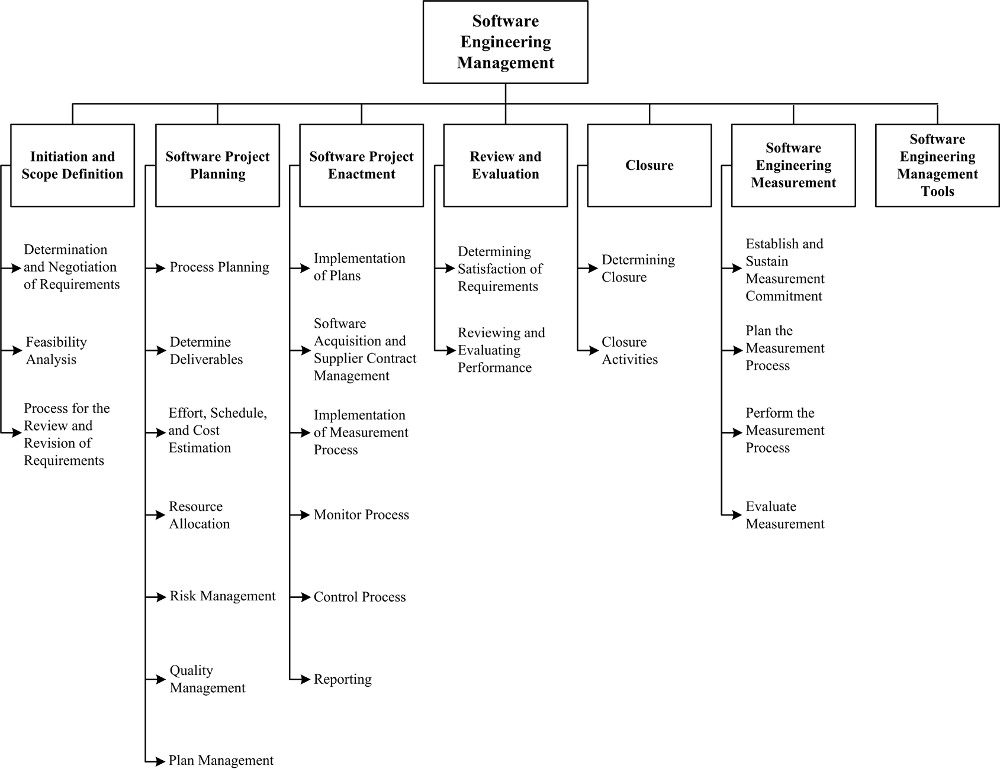

## Chapter 7: Software Engineering Management

**Acronyms**

- PMBOK® Guide Guide to the Project Management Body of Knowledge
- SDLC Software Development Life Cycle
- SEM Software Engineering Management
- SQA Software Quality Assurance
- SWX Software Extension to the PMBOK ® Guide
- WBS Work Breakdown Structure

**Introduction**

Software engineering management can be defined as the application of management
activities - planning, coordinating, measuring, monitoring, controlling, and
reporting^1 - to ensure that software products and software engineering
services are delivered efficiently, effectively, and to the benefit of
stakeholders. The related discipline of management is an important element of
all the knowledge areas (KAs), but it is of course more relevant to this KA
than to other KAs. Measurement is also an important aspect of all KAs; the
topic of measurement programs is presented in this KA.

In one sense, it should be possible to manage a software engineering project in
the same way other complex endeavors are managed. However, there are aspects
specific to software projects and software life cycle processes that complicate
effective management, including these:

<!-- FIXME: footnote -->
1 The terms Initiating, Planning, Executing, Monitoring and Controlling, and
Closing are used to describe process groups in the _PMBOK_ ® _Guide_ and _SWX_.

- Clients often don’t know what is needed or what is feasible.
- Clients often lack appreciation for the complexities inherent in software
  engineering, particularly regarding the impact of changing requirements.
- It is likely that increased understanding and changing conditions will
  generate new or changed software requirements.
- As a result of changing requirements, software is often built using an
  iterative process rather than as a sequence of closed tasks.
- Software engineering necessarily incorporates creativity and discipline.
  Maintaining an appropriate balance between the two is sometimes difficult.
- The degree of novelty and complexity is often high.
- There is often a rapid rate of change in the underlying technology.

Software engineering management activities occur at three levels:
organizational and infrastructure management, project management, and
management of the measurement program. The last two are covered in detail in
this KA description. However, this is not to diminish the importance of
organizational and infrastructure management issues. It is generally agreed
that software organizational engineering managers should be conversant with the
project manage- ment and software measurement knowledge described in this KA.
They should also possess some target domain knowledge. Likewise, it is also
helpful if managers of complex projects and programs in which software is a
component of the system architecture are aware of the differences that software
processes introduce into project management and project measurement.

Other aspects of organizational management exert an impact on software
engineering (for example, organizational policies and procedures that provide
the framework in which software engineering projects are undertaken). These
policies and procedures may need to be adjusted by the requirements for
effective software development and maintenance. In addition, a number of
policies specific to software engineering may need to be in place or
established for effective management of software engineering at the
organizational level. For example, policies are usually necessary to establish
specific organization-wide processes or procedures for software engineering
tasks such as software design, software construction, estimating, monitoring,
and reporting. Such policies are important for effective long-term management
of software engineering projects across an organization (for example,
establishing a consistent basis by which to analyze past project performance
and implement improvements).

Another important aspect of organizational management is personnel management
policies and procedures for hiring, training, and mentoring personnel for
career development, not only at the project level, but also to the longer-term
success of an organization. Software engineering personnel may present unique
training or personnel management challenges (for example, maintaining currency
in a context where the underlying technology undergoes rapid and continuous
change). Communication management is also often mentioned as an overlooked but
important aspect of the performance of individuals in a field where precise
understanding of user needs, software requirements, and software designs is
necessary. Furthermore, portfolio management, which provides an overall view,
not only of software currently under development in various projects and
programs (integrated projects), but also of software planned and currently in
use in an organization, is desirable. Also, software reuse is a key

factor in maintaining and improving productivity and competitiveness. Effective
reuse requires a strategic vision that reflects the advantages and
disadvantages of reuse.

In addition to understanding the aspects of management that are uniquely
influenced by software projects, software engineers should have some knowledge
of the more general aspects of management that are discussed in this KA (even
in the first few years after graduation). Attributes of organizational culture
and behavior, plus management of other functional areas of the enterprise, have
an influence, albeit indirectly, on an organization’s software engineering
processes.

Extensive information concerning software project management can be found in
the _Guide to the Project Management Body of Knowledge (PMBOK_ ® _Guide)_ and
the _Software Extension to the PMBOK_ ® _Guide_ ( _SWX_ ) [1] [2]. Each of
these guides includes ten project management KAs: project integration
management, project scope management, project time management, project cost
management, project quality management, project human resource management,
project communications management, project risk management, project
procurement management, and project stakeholder management. Each KA has direct
relevance to this Software Engineering Management KA.

Additional information is also provided in the other references and further
readings for this KA. This Software Engineering Management KA consists of the
software project management processes in the first five topics in Figure 7.1
(Initiation and Scope Definition, Software Project Planning, Software Project
Enactment, Review and Evaluation, Closure), plus Software Engineering
Measurement in the sixth topic and Software Engineering Management Tools in the
seventh topic. While project management and measurement management are often
regarded as being separate, and indeed each does possess many unique
attributes, the close relationship has led to combined treatment in this KA.

Unfortunately, a common perception of the software industry is that software
products are delivered late, over budget, of poor quality, and with incomplete
functionality. Measurement-informed managementa - basic principle of any true
engineering discipline (see Measurement in the Engineering Foundations KA) -
can help improve the perception and the reality. In essence, management without
measurement (qualitative and quantitative) suggests a lack of discipline, and
measurement without management suggests a lack of purpose or context. Effective
management requires a combination of both measurement and experience.

The following working definitions are adopted here:

- _Management_ is a system of processes and controls required to achieve the
  strategic objectives set by the organization.
- _Measurement_ refers to the assignment of values and labels to software
  engineering work products, processes, and resources plus the models that are
  derived from them, whether these models are developed using statistical or
  other techniques [3*, c7, c8].

The software engineering project management sections in this KA make extensive
use of the software engineering measurement section. This KA is closely related
to others in the SWEBOK Guide, and reading the following KA descriptions in
conjunction with this one will be particularly helpful:

- The Engineering Foundations KA describes some general concepts of measurement
  that are directly applicable to the Software Engineering Measurement section
  of this KA. In addition, the concepts and techniques presented in the
  Statistical Analysis section of the Engineering Foundations KA apply directly
  to many topics in this KA.
- The Software Requirements KA describes some of the activities that should be
  performed during the Initiation and Scope definition phase of the project.
- The Software Configuration Management KA deals with identification, control,
  status accounting, and auditing of software configurations along with
  software release man- agement and delivery and software configuration
  management tools.
- The Software Engineering Process KA describes software life cycle models and
  the relationships between processes and work products.
- The Software Quality KA emphasizes quality as a goal of management and as an
  aim of many software engineering activities.
- The Software Engineering Economics KA discusses how to make software-related
  decisions in a business context.

**Breakdown Of Topics For Software Engineering Management**

Because most software development life cycle models require similar activities
that may be executed in different ways, the breakdown of topics is
activity-based. That breakdown is shown in Figure 7.1. The elements of the
top-level breakdown shown in that figure are the activities that are usually
performed when a software development project is being managed, independent of
the software development life cycle model (see Software Life Cycle Models in
the Software Engineering Process KA) that has been chosen for a specific
project. There is no intent in this breakdown to recommend a specific life
cycle model. The breakdown implies only what happens and does not imply when,
how, or how many times each activity occurs. The seven topics are:

- Initiation and Scope Definition, which deal with the decision to embark on a
  software engineering project;
- Software Project Planning, which addresses the activities undertaken to
  prepare for a successful software engineering project from the management
  perspective;
- Software Project Enactment, which deals with generally accepted software
  engineering management activities that occur during the execution of a
  software engineering project;
- Review and Evaluation, which deal with ensuring that technical, schedule,
  cost, and quality engineering activities are satisfactory;
- Closure, which addresses the activities accomplished to complete a project;
- Software Engineering Measurement, which deals with the effective development
  and implementation of measurement programs in software engineering
  organizations;
- Software Engineering Management Tools, which describes the selection and use
  of tools for managing a software engineering project.

### 1. Initiation and Scope Definition

The focus of these activities is on effective determination of software
requirements using various elicitation methods and the assessment of project
feasibility from a variety of standpoints. Once project feasibility has been
established, the remaining tasks within this section are the specification of
requirements and selection of the processes for revision and review of
requirements.

#### 1.1. Determination and Negotiation of Requirements

<!-- [3*, c3] -->

Determining and negotiating requirements set the visible boundaries for the set
of tasks being undertaken (see the Software Requirements KA). Activities
include requirements elicitation, analysis, specification, and validation.
Methods and techniques should be selected and applied, taking into account the
various stakeholder perspectives. This leads to the determination of project
scope in order to meet objectives and satisfy constraints.

#### 1.2. Feasibility Analysis

<!-- [4*, c4] -->

The purpose of feasibility analysis is to develop a clear description of
project objectives and evaluate alternative approaches in order to determine
whether the proposed project is the best alternative given the constraints of
technology, resources, finances, and social/political considerations. An
initial project and product scope statement, project deliverables, project
duration constraints, and an estimate of resources needed should be prepared.
Resources include a sufficient number of people who have the needed skills,
facilities, infrastructure, and support (either internally or externally).
Feasibility analysis often requires approximate estimations of effort and cost
based on appropriate methods (see section 2.3, Effort, Schedule, and Cost
Estimation).

#### 1.3. Process for the Review and Revision of Requirements_

<!-- [3*, c3] -->

Given the inevitability of change, stakeholders should agree on the means by
which requirements and scope are to be reviewed and revised (for example,
change management procedures, iterative cycle retrospectives). This clearly
implies that scope and requirements will not be “set in stone” but can and
should be revisited at predetermined points as the project unfolds (for
example, at the time when backlog priorities are created or at milestone
reviews). If changes are accepted, then some form of traceability analysis and
risk analysis should be used to ascertain the impact of those changes (see
section 2.5, Risk Management, and Software Configuration Control in the
Software Configuration Management KA).

A managed-change approach can also form the basis for evaluation of success
during closure of an incremental cycle or an entire project, based on changes
that have occurred along the way (see topic 5, Closure).

### 2. Software Project Planning

The first step in software project planning should be selection of an
appropriate software development life cycle model and perhaps tailoring it
based on project scope, software requirements, and a risk assessment. Other
factors to be considered include the nature of the application domain,
functional and technical complexity, and software quality requirements (see
Software Quality Requirements in the Software Quality KA). In all SDLCs, risk
assessment should be an element of initial project planning, and the “risk
profile” of the project should be discussed and accepted by all relevant
stakeholders. Software quality management processes (see Software Quality
Management Processes in the Software Quality KA) should be determined as part
of the planning process and result in procedures and responsibilities for
software quality assurance, verification and validation, reviews, and audits
(see the Software Quality KA). Processes and responsibilities for ongoing
review and revision of the project plan and related plans should also be
clearly stated and agreed upon.

#### 2.1. Process Planning

<!-- [3*, c3, c4, c5] [5*, c1] -->

Software development life cycle (SDLC) models span a continuum from predictive
to adaptive (see Software Life Cycle Models in the Software Engineering Process
KA). Predictive SDLCs are characterized by development of detailed software
requirements, detailed project planning, and minimal planning for iteration
among development phases. Adaptive SDLCs are designed to accommodate emergent
software requirements and iterative adjustment of plans. A highly predictive
SDLC executes the first five processes listed in Figure 7.1 in a linear
sequence with revisions to earlier phases only as necessary. Adaptive SDLCs are
characterized by iterative development cycles. SDLCs in the mid-range of the
SDLC continuum produce increments of functionality on either a preplanned
schedule (on the predictive side of the continuum) or as the prod- ucts of
frequently updated development cycles (on the adaptive side of the continuum).

Well-known SDLCs include the waterfall, incremental, and spiral models plus
various forms of agile software development [2] [3*, c2]. Relevant methods (see
the Software Engineering Models and Methods KA) and tools should be selected as
part of planning. Automated tools that will be used throughout the project
should also be planned for and acquired. Tools may include tools for project
scheduling, software requirements, software design, software construction,
software maintenance, software configuration management, software engineering
process, software quality, and others. While many of these tools should be
selected based primarily on the technical considerations discussed in other
KAs, some of them are closely related to the management considerations
discussed in this chapter.

#### 2.2. Determine Deliverables

<!-- [3*, c4, c5, c6] -->

The work product(s) of each project activity (for example, software
architecture design documents, inspection reports, tested software) should be
identified and characterized. Opportunities to reuse software components from
previous projects or to utilize off-the-shelf software products should be
evaluated. Procurement of software and use of third parties to develop
deliverables should be planned and suppliers selected (see section 3.2,
Software Acquisition and Supplier Contract Management).

#### 2.3. Effort, Schedule, and Cost Estimation

<!-- [3*, c6] -->

The estimated range of effort required for a project, or parts of a project,
can be determined using a calibrated estimation model based on historical size
and effort data (when available) and other relevant methods such as expert
judgment and analogy. Task dependencies can be established and potential
opportunities for completing tasks concurrently and sequentially can be
identified and documented using a Gantt chart, for example. For predictive SDLC
projects, the expected schedule of tasks with projected start times, durations,
and end times is typically produced during planning. For adaptive SDLC
projects, an overall estimate of effort and schedule is typically developed
from the initial understanding of the requirements, or, alternatively,
constraints on overall effort and schedule may be specified and used to
determine an initial estimate of the number of iterative cycles and estimates
of effort and other resources allocated to each cycle.

Resource requirements (for example, people and tools) can be translated into
cost estimates. Initial estimation of effort, schedule, and cost is an
iterative activity that should be negotiated and revised among affected
stakeholders until consensus is reached on resources and time available for
project completion.

#### 2.4. Resource Allocation

<!-- [3*, c5, c10, c11] -->

Equipment, facilities, and people should be allocated to the identified tasks,
including the allocation of responsibilities for completion of various elements
of a project and the overall project. A matrix that shows who is responsible
for, accountable for, consulted about, and informed about each of the tasks can
be used. Resource allocation is based on, and constrained by, the
availability of resources and their optimal use, as well as by issues
relating to personnel (for example, productivity of individuals and teams,
team dynamics, and team structures).

#### 2.5. Risk Management

<!-- [3*, c9] [5*, c5] -->

Risk and uncertainty are related but distinct concepts. Uncertainty results
from lack of information. Risk is characterized by the probability of an event
that will result in a negative impact plus a characterization of the negative
impact on a project. Risk is often the result of uncertainty. The converse of
risk is opportunity, which is characterized by the probability that an event
having a positive outcome might occur.

Risk management entails identification of risk factors and analysis of the
probability and potential impact of each risk factor, prioritization of risk
factors, and development of risk mitigation strategies to reduce the
probability and minimize the negative impact if a risk factor becomes a
problem. Risk assessment methods (for example, expert judgment, historical
data, decision trees, and process simulations) can sometimes be used in order
to identify and evaluate risk factors.

Project abandonment conditions can also be determined at this point in
discussion with all relevant stakeholders. Software-unique aspects of risk,
such as software engineers’ tendency to add unneeded features, or the risks
related to software’s intangible nature, can influence risk management of a
software project. Particular attention should be paid to the management of
risks related to software quality requirements such as safety or security (see
the Software Quality KA). Risk management should be done not only at the
beginning of a project, but also at periodic intervals throughout the project
life cycle.

#### 2.6. Quality Management

<!-- [3*, c4] [4*, c24] -->

Software quality requirements should be identified, perhaps in both
quantitative and qualitative terms, for a software project and the associated
work products. Thresholds for acceptable quality measurements should be set for
each software quality requirement based on stakeholder needs and expectations.
Procedures concerned with ongoing Software Quality Assurance (SQA) and quality
improvement throughout the development process, and for verification and
validation of the deliverable software product, should also be specified during
quality planning (for example, technical reviews and inspections or
demonstrations of completed functionality; see the Software Quality KA).

#### 2.7. Plan Management

<!--[3*, c4] -->

For software projects, where change is an expectation, plans should be managed.
Managing the project plan should thus be planned. Plans and processes selected
for software development should be systematically monitored, reviewed,
reported, and, when appropriate, revised. Plans associated with supporting
processes (for example, documentation, software configuration management,
and problem resolution) also should be managed. Reporting, monitoring, and
controlling a project should fit within the selected SDLC and the realities
of the project; plans should account for the various artifacts that will be
used to manage the project.

### 3. Software Project Enactment

During software project enactment (also known as project execution) plans are
implemented and the processes embodied in the plans are enacted. Throughout,
there should be a focus on adherence to the selected SDLC processes, with an
overriding expectation that adherence will lead to the successful satisfaction
of stakeholder requirements and achievement of the project’s objectives.
Fundamental to enactment are the ongoing management activities of monitoring,
controlling, and reporting.

#### 3.1. Implementation of Plans

<!-- [4*, c2] -->

Project activities should be undertaken in accordance with the project plan
and supporting plans. Resources (for example, personnel, technology, and
funding) are utilized and work products (for example, software design, software
code, and software test cases) are generated.

#### 3.2. Software Acquisition and Supplier Contract Management

<!-- [3*, c3, c4] -->

Software acquisition and supplier contract man agement is concerned with issues
involved in contracting with customers of the software development organization
who acquire the deliverable work products and with suppliers who supply
products or services to the software engineering organization.

This may involve selection of appropriate kinds of contracts, such as fixed
price, time and materials, cost plus fixed fee, or cost plus incentive fee.
Agreements with customers and suppliers typically specify the scope of work and
the deliverables and include clauses such as penalties for late delivery or
nondelivery and intellectual property agreements that specify what the supplier
or suppliers are providing and what the acquirer is paying for, plus what will
be delivered to and owned by the acquirer. For software being developed by
suppliers (both internal to or external to the software development
organization), agreements commonly indicate software quality requirements for
acceptance of the delivered software.

After the agreement has been put in place, execution of the project in
compliance with the terms of the agreement should be managed (see chapter 12 of
SWX, Software Procurement Management, for more information on this topic [2]).

#### 3.3. Implementation of Measurement Process

<!-- [3*, c7] -->

The measurement process should be enacted during the software project to ensure
that relevant and useful data are collected (see sections 6.2, Plan the
Measurement Process, and 6.3, Perform the Measurement Process).

#### 3.4. Monitor Process

<!-- [3*, c8] -->

Adherence to the project plan and related plans should be assessed continually
and at predetermined intervals. Also, outputs and completion criteria for each
task should be assessed. Deliverables should be evaluated in terms of their
required characteristics (for example, via inspections or by demonstrating
working functionality). Effort expenditure, schedule adherence, and costs to
date should be analyzed, and resource usage examined. The project risk profile
(see section 2.5, Risk Management) should be revisited, and adherence to
software quality requirements evaluated (see Software Quality Requirements in
the Software Quality KA).

Measurement data should be analyzed (see Statistical Analysis in the
Engineering Foundations KA). Variance analysis based on the deviation of actual
from expected outcomes and values should be determined. This may include cost
overruns, schedule slippage, or other similar measures. Outlier identification
and analysis of quality and other measurement data should be performed (for
example, defect analysis; see Software Quality Measurement in the Software
Quality KA). Risk exposures should be recalculated (see section 2.5, Risk
Management). These activities can enable problem detection and exception
identification based on thresholds that have been exceeded. Outcomes should be
reported when thresholds have been exceeded, or as necessary.

#### 3.5. Control Process

<!-- [3*, c7, c8] -->

The outcomes of project monitoring activities provide the basis on which
decisions can be made. Where appropriate, and when the probability and impact
of risk factors are understood, changes can be made to the project. This may
take the form of corrective action (for example, retesting certain software
components); it may involve incorporating additional actions (for example,
deciding to use prototyping to assist in software requirements validation; see
Prototyping in the Software Requirements KA); and/or it may entail revision of
the project plan and other project documents (for example, the software
requirements specification) to accommodate unanticipated events and their
implications.

In some instances, the control process may lead to abandonment of the project.
In all cases, software configuration control and software configuration
management procedures should be adhered to (see the Software Configuration
Management KA), decisions should be documented and communicated to all relevant
parties, plans should be revisited and revised when necessary, and relevant
data recorded (see section 6.3, Perform the Measurement Process).

#### 3.6. Reporting

<!-- [3*, c11] -->

At specified and agreed-upon times, progress to date should be reported - both
within the organization (for example, to a project steering committee) and to
external stakeholders (for example, clients or users). Reports should focus on
the information needs of the target audience as opposed to the detailed status
reporting within the project team.

### 4. Review and Evaluation

At prespecified times and as needed, overall progress towards achievement of
the stated objectives and satisfaction of stakeholder (user and customer)
requirements should be evaluated. Similarly, assessments of the effectiveness
of the software process, the personnel involved, and the tools and methods
employed should also be undertaken regularly and as determined by
circumstances.

#### 4.1. Determining Satisfaction of Requirements

<!-- [4*, c8] -->

Because achieving stakeholder satisfaction is a principal goal of the software
engineering manager, progress towards this goal should be assessed
periodically. Progress should be assessed on achievement of major project
milestones (for example, completion of software design architecture or
completion of a software technical review), or upon completion of an iterative
development cycle that results in a product increment. Variances from software
requirements should be identified and appropriate actions should be taken. As
in the control process activity above (see section 3.5, Control Process),
software configuration control and software configuration management procedures
should be followed (see the Software Configuration Management KA), decisions
documented and communicated to all relevant parties, plans revisited and
revised where necessary, and relevant data recorded (see section 6.3, Perform
the Measurement Process).

#### 4.2. Reviewing and Evaluating Performance

<!-- [3*, c8, c10] -->

Periodic performance reviews for project personnel can provide insights as to
the likelihood of adherence to plans and processes as well as possible areas of
difficulty (for example, team member conflicts). The various methods, tools,
and techniques employed should be evaluated for their effectiveness and
appropriateness, and the process being used by the project should also be
systematically and periodically assessed for relevance, utility, and efficacy
in the project context. Where appropriate, changes should be made and managed.

### 5. Closure

An entire project, a major phase of a project, or an iterative development
cycle reaches closure when all the plans and processes have been enacted and
completed. The criteria for project, phase, or iteration success should be
evaluated. Once closure is established, archival, retrospective, and process
improvement activities can be performed.

#### 5.1. Determining Closure

<!-- [1, s3.7, s4.6] -->

Closure occurs when the specified tasks for a project, a phase, or an iteration
have been completed and satisfactory achievement of the completion criteria has
been confirmed. Software requirements can be confirmed as satisfied or not, and
the degree of achieving the objectives can be determined. Closure processes
should involve relevant stakeholders and result in documentation of relevant
stakeholders’ acceptance; any known problems should be documented.

#### 5.2. Closure Activities

<!-- [2, s3.7, s4.8] -->

After closure has been confirmed, archiving of project materials should be
accomplished in accordance with stakeholder agreed-upon methods, location, and
duration - possibly including destruction of sensitive information, software,
and the medium on which copies are resident. The organization’s measurement
database should be updated with relevant project data. A project, phase, or
iteration retrospective analysis should be undertaken so that issues, problems,
risks, and opportunities encountered can be analyzed (see topic 4, Review and
Evaluation). Lessons learned should be drawn from the project and fed into
organizational learning and improvement endeavors.

### 6. Software Engineering Measurement

The importance of measurement and its role in better management and engineering
practices is widely acknowledged (see Measurement in the Engineering
Foundations KA). Effective mea- surement has become one of the cornerstones of
organizational maturity. Measurement can be applied to organizations, projects,
processes, and work products. In this section the focus is on the application
of measurement at the levels of projects, processes, and work products. This
section follows the IEEE 15939:2008 standard [6], which describes a process to
define the activities and tasks necessary to implement a software measurement
process. The standard also includes a measurement information model.

#### 6.1. Establish and Sustain Measurement Commitment

<!-- [7*, c1, c2]^2 -->

- Requirements for measurement. Each measurement endeavor should be guided by
  organizational objectives and driven by a set of measurement requirements
  established by the organization and the project (for example, an
  organizational objective might be “first-to-market with new products”).
- Scope of measurement. The organizational unit to which each measurement
  requirement is to be applied should be established. This may consist of a
  functional area, a single project, a single site, or an entire enterprise.
  The temporal scope of the measurement effort should also be considered
  because time series of some measurements may be required; for example, to
  calibrate estimation models (see section 2.3, Effort, Schedule, and Cost
  Estimation).
- Team commitment to measurement. The commitment should be formally
  established, communicated, and supported by resources (see next item).
- Resources for measurement. An organization’s commitment to measurement is an
  essential factor for success, as evidenced by the assignment of resources for
  implementing the measurement process. Assigning resources includes allocation
  of responsibility for the various tasks of the measurement process (such as
  analyst and librarian). Adequate funding, training, tools, and support to
  conduct the process should also be allocated.

<!-- FIXME: footnote -->
2 Please note that these two chapters can be downloaded free of charge from
http://www.psmsc.com/PSMBook.asp.

#### 6.2. Plan the Measurement Process

<!-- [7*, c1, c2] -->

- Characterize the organizational unit. The organizational unit provides the
  context for measurement, so the organizational context should be made
  explicit, including the constraints that the organization imposes on the
  measurement process. The characterization can be stated in terms of
  organizational processes, application domains, technology, organizational
  interfaces, and organizational structure.
- Identify information needs. Information needs are based on the goals,
  constraints, risks, and problems of the organizational unit. They may be
  derived from business, organizational, regulatory, and/or product objectives.
  They should be identified and prioritized. Then a subset of objectives to be
  addressed can be selected, documented, communicated, and reviewed by
  stakeholders.
- Select measures. Candidate measures should be selected, with clear links to
  the information needs. Measures should be selected based on the priorities of
  the information needs and other criteria such as cost of collection, degree
  of process disruption during collection, ease of obtaining accurate,
  consistent data, and ease of analysis and reporting. Because internal quality
  characteristics (see Models and Quality Characteristics in the Software
  Quality KA) are often not contained in the contractually binding software
  requirements, it is important to consider measuring the internal quality of
  the software to provide an early indicator of potential issues that may
  impact external stakeholders.
- Define data collection, analysis, and reporting procedures. This encompasses
  collection procedures and schedules, storage, verification, analysis,
  reporting, and configuration management of data.
- Select criteria for evaluating the information products. Criteria for
  evaluation are influenced by the technical and business objectives of the
  organizational unit. Information products include those associated with the
  product being produced, as well as those associated with the processes being
  used to manage and measure the project.
- Provide resources for measurement tasks. The measurement plan should be
  reviewed and approved by the appropriate stakeholders to include all data
  collection procedures; storage, analysis, and reporting procedures;
  evaluation criteria; schedules; and responsibilities. Criteria for reviewing
  these artifacts should have been established at the organizational-unit level
  or higher and should be used as the basis for these reviews. Such criteria
  should take into consideration previous experience, availability of
  resources, and potential disruptions to projects when changes from current
  practices are proposed. Approval demonstrates commitment to the measurement
  process.
- Identify resources to be made available for implementing the planned and
  approved measurement tasks. Resource availability may be staged in cases
  where changes are to be piloted before widespread deployment. Consideration
  should be paid to the resources necessary for successful deployment of new
  procedures or measures.
- Acquire and deploy supporting technologies. This includes evaluation of
  available supporting technologies, selection of the most appropriate
  technologies, acquisition of those technologies, and deployment of those
  technologies.

#### 6.3. Perform the Measurement Process

<!-- [7*, c1, c2] -->

- Integrate measurement procedures with relevant software processes. The
  measurement procedures, such as data collection, should be integrated into
  the software processes they are measuring. This may involve changing current
  software processes to accommodate data collection or generation activities.
  It may also involve analysis of current software processes to minimize
  additional effort and evaluation of the effect on employees to ensure that
  the measurement procedures will be accepted. Morale issues and other human
  factors should be considered. In addition, the measurement procedures should
  be communicated to those providing the data. Training and support may also
  need to be provided. Data analysis and reporting procedures are typically
  integrated into organizational and/ or project processes in a similar manner.
- Collect data. Data should be collected, verified, and stored. Collection can
  sometimes be automated by using software engineering management tools (see
  topic 7, Software Engineering Management Tools) to analyze data and develop
  reports. Data may be aggregated, transformed, or recoded as part of the
  analysis process, using a degree of rigor appropriate to the nature of the
  data and the information needs. The results of this analysis are typically
  indicators such as graphs, numbers, or other indications that will be
  interpreted, resulting in conclusions and recommendations to be presented to
  stakeholders (see Statistical Analysis in the Engineering Foundations KA).
  The results and conclusions are usually reviewed, using a process defined by
  the organization (which may be formal or informal). Data providers and
  measurement users should participate in reviewing the data to ensure that
  they are meaningful and accurate and that they can result in reasonable
  actions.
- Communicate results. Information products should be documented and
  communicated to users and stakeholders.

#### 6.4. Evaluate Measurement

<!-- [7*, c1, c2] -->

- Evaluate information products and the measurement process against specified
  evaluation criteria and determine strengths and weaknesses of the information
  products or process, respectively. Evaluation may be performed by an internal
  process or an external audit; it should include feedback from measurement
  users. Lessons learned should be recorded in an appropriate database.
- Identify potential improvements. Such improvements may be changes in the
  format of indicators, changes in units measured, or reclassification of
  measurement categories. The costs and benefits of potential improvements
  should be determined and appropriate improvement actions should be reported.
- Communicate proposed improvements to the measurement process owner and
  stakeholders for review and approval. Also, lack of potential improvements
  should be communicated if the analysis fails to identify any improvements.

### 7. Software Engineering Management Tools

<!-- [3*, c5, c6, c7] -->

Software engineering management tools are often used to provide visibility and
control of software engineering management processes. Some tools are automated
while others are manually implemented. There has been a recent trend towards
the use of integrated suites of software engineering tools that are used
throughout a project to plan, collect and record, monitor and control, and
report project and product information. Tools can be divided into the
following categories:

- _Project Planning and Tracking Tools._ Project planning and tracking tools
  can be used to estimate project effort and cost and to prepare project
  schedules. Some projects use automated estimation tools that accept as input
  the estimated size and other characteristics of a software product and
  produce estimates of the required total effort, schedule, and cost. Planning
  tools also include automated scheduling tools that analyze the tasks within a
  work breakdown structure, their estimated durations, their precedence
  relationships, and the resources assigned to each task to produce a schedule
  in the form of a Gantt chart.
- Tracking tools can be used to track project milestones, regularly scheduled
  project status meetings, scheduled iteration cycles, product demonstrations,
  and/or action items.
- _Risk Management Tools._ Risk management tools (see section 2.5, Risk
  Management) can be used to track risk identification, estimation, and
  monitoring. These tools include the use of approaches such as simulation or
  decision trees to analyze the effect of costs versus payoffs and subjective
  estimates of the probabilities of risk events. Monte Carlo simulation tools
  can be used to produce probability distributions of effort, schedule, and
  risk by combining multiple input probability distributions in an algorithmic
  manner.
- _Communications Tools._ Communication tools can assist in providing timely
  and consistent information to relevant stakeholders involved in a project.
  These tools can include things like email notifications and broadcasts to
  team members and stakeholders. They also include communication of minutes
  from regularly scheduled project meetings, daily stand-up meetings, plus
  charts showing progress, backlogs, and maintenance request resolutions.
- _Measurement Tools._ Measurement tools support activities related to the
  software measurement program (see topic 6, Software Engineering Measurement).
  There are few completely automated tools in this category. Measurement tools
  used to gather, analyze, and report project measurement data may be based on
  spreadsheets developed by project team members or organizational employees.

### Matrix Of Topics vs. Reference Material

Fairley 2009

[3]

Sommerville 2011

[4]

Boehm and Turner 2003

[5]

McGarry et al. 2001

[7]

**1. Initiation and Scope Definition**
    1.1. Determination and Negotiation of Requirements c3
    1.2. Feasibility Analysis c4
    1.3. Process for the Review and Revision of Requirements c3
**2. Software Project Planning**
    2.1. Process Planning c2, c3, c4, c5 c1
    2.2. Determine Deliverables c4, c5, c6
    2.3. Effort, Schedule, and Cost Estimation c6
    2.4. Resource Allocation c5, c10, c11
    2.5. Risk Management c9 c5
    2.6. Quality Management c4 c24
    2.7. Plan Management c4
**3. Software Project Enactment**
    3.1. Implementation of Plans c2
    3.2. Software Acquisition and Supplier Contract Management c3, c4
    3.3. Implementation of Measurement Process c7
    3.4. Monitor Process c8
    3.5. Control Process c7, c8
    3.6. Reporting c11
**4. Review and Evaluation**
    4.1. Determining Satisfaction of Requirements
    4.2. Reviewing and Evaluating Performance c8, c10

Fairley 2009

[3]

Sommerville 2011

[4]

Boehm and Turner 2003

[5]

McGarry et al. 2001

[7]

**5. Closure**
    5.1. Determining Closure
    5.2. Closure Activities
**6. Software Engineering Measurement**
    6.1. Establish and Sustain Measurement Commitment c1, c2
    6.2. Plan the Measurement Process c1, c2
    6.3. Perform the Measurement Process c1, c2
    6.4. Evaluate Measurement c1, c2
**7. Software Engineering Management Tools** c5, c6, c7

**Further Readings**

_A Guide to the Project Management Body of Knowledge (PMBOK_ ® _Guide)_ [1].

The _PMBOK_ ® _Guide_ provides guidelines for managing individual projects and
defines project management-related concepts. It also describes the project
management life cycle and its related processes, as well as the project life
cycle. It is a globally recognized guide for the project management profession.

_Software Extension to the Guide to the Project Management Body of Knowledge
(PMBOK® Guide)_ [2].

SWX provides adaptations and extensions to the generic practices of project
management documented in the _PMBOK® Guide_ for managing software projects. The
primary contribution of this extension to the _PMBOK® Guide_ is a description
of processes that are applicable for managing adaptive life cycle software
projects.

_IEEE Standard Adoption of ISO/IEC 15939_ [6].

This international standard identifies a process that supports defining a
suitable set of measures to address specific information needs. It identifies
the activities and tasks that are necessary to successfully identify, define,
select, apply, and improve measurement within an overall project or
organizational measurement structure.

J. McDonald, _Managing the Development of Software Intensive Systems_, Wiley,
2010 [8].

This textbook provides an introduction to project management for beginning
software and hard- ware developers plus unique advanced material for
experienced project managers. Case studies are included for planning and
managing verification and validation for large software projects, complex
software, and hardware systems, as well as inspection results and testing
metrics to monitor project status.

**References**

[1] Project Management Institute, A Guide to the Project Management Body of
Knowledge (PMBOK(R) Guide), 5th ed., Project Management Institute, 2013.

[2] Project Management Institute and IEEE Computer Society, Software Extension
to the PMBOK® Guide Fifth Edition, Project Management Institute, 2013.

[3] R.E. Fairley, Managing and Leading Software Projects, Wiley-IEEE Computer
Society Press, 2009.

[4] I. Sommerville, Software Engineering, 9th ed., Addison-Wesley, 2011.

[5] B. Boehm and R. Turner, Balancing Agility and Discipline: A Guide for the
Perplexed, Addison-Wesley, 2003.

[6] IEEE Std. 15939-2008 Standard Adoption of ISO/IEC 15939:2007 Systems and
Software Engineering - Measurement Process, IEEE, 2008.

[7] J. McGarry et al., Practical Software Measurement: Objective Information
for Decision Makers, Addison-Wesley Professional, 2001.

[8] J. McDonald, Managing the Development of Software Intensive Systems, John
Wiley and Sons, Inc., 2010.
