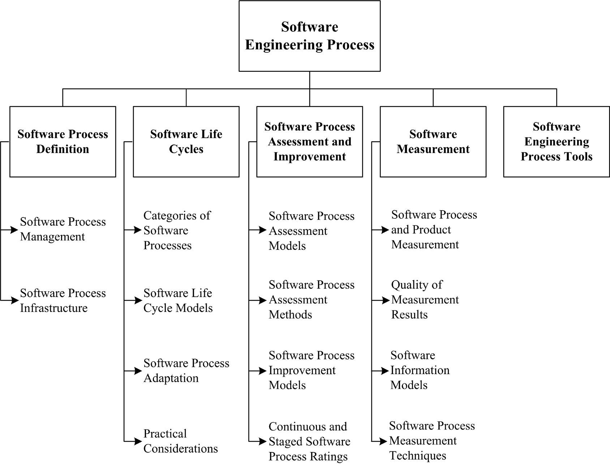
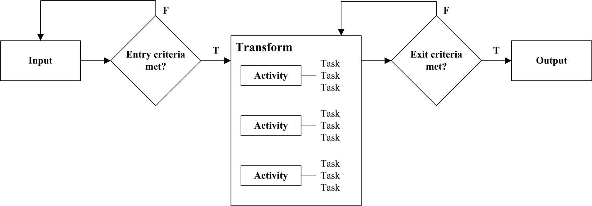

## Chapter 8: Software Engineering Process

**Acronyms**

- BPMN Business Process Modeling Notation
- CASE Computer-Assisted Software Engineering
- CM Configuration Management
- CMMI Capability Maturity Model Integration
- GQM Goal-Question-Metric
- IDEF0 Integration Definition
- LOE Level of Effort
- ODC Orthogonal Defect Classification
- SDLC Software Development Life Cycle
- SPLC Software Product Life Cycle
- UML Unified Modeling Language

**Introduction**

An engineering process consists of a set of interrelated activities that
transform one or more inputs into outputs while consuming resources to
accomplish the transformation. Many of the processes of traditional engineering
disciplines (e.g., electrical, mechanical, civil, chemical) are concerned with
transforming energy and physical entities from one form into another, as in a
hydroelectric dam that transforms potential energy into electrical energy or a
petroleum refinery that uses chemical processes to transform crude oil into
gasoline. In this knowledge area (KA), software engineering processes are
concerned with work activities accomplished by software engineers to develop,
maintain, and operate software, such as requirements, design, construction,
testing, configuration management, and other software engineering processes.
For readability, “software engineering process” will be referred to as
“software process” in this KA. In addition, please note that “software process”
denotes work activities - not the execution process for implemented software.
Software processes are specified for a number of reasons: to facilitate human
understanding, communication, and coordination; to aid management of software
projects; to measure and improve the quality of software products in an
efficient manner; to support process improvement; and to provide a basis for
automated support of process execution.

SWEBOK KAs closely related to this Software Engineering Process KA include
Software Engineering Management, Software Engineering Models and Methods, and
Software Quality; the Measurement and Root Cause Analysis topic found in the
Engineering Foundations KA is also closely related. Software Engineering
Management is concerned with tailoring, adapting, and implementing software
processes for a specific software project (see Process Planning in the Software
Engineering Management KA). Models and methods support a systematic approach
to software development and modification.

The Software Quality KA is concerned with the planning, assurance, and control
processes for project and product quality. Measurement and measurement results
in the Engineering Foundations KA are essential for evaluating and control-
ling software processes.

**Breakdown Of Topics For Software Engineering Process**

As illustrated in Figure 8.1, this KA is concerned with software process
definition, software life cycles, software process assessment and improve-
ment, software measurement, and software engineering process tools.

### 1. Software Process Definition

<!-- [1*, p177] [2*, p295] [3*, p28–29, p36, c5] -->

This topic is concerned with a definition of software process, software
process management, and software process infrastructure.

As stated above, a software process is a set of interrelated activities and
tasks that transform input work products into output work products. At minimum,
the description of a software process includes required inputs, transforming
work activities, and outputs generated. As illustrated in Figure 8.2, a
software process may also include its entry and exit criteria and decomposition
of the work activities into tasks, which are the smallest units of work subject
to management accountability. A process input may be a triggering event or
the output of another process. Entry criteria should be satisfied before a
process can commence. All specified conditions should be satisfied before a
process can be successfully concluded, including the acceptance criteria for
the output work product or work products.

A software process may include subprocesses. For example, software requirements
validation is a process used to determine whether the requirements will
provide an adequate basis for software development; it is a subprocess of the
software requirements process. Inputs for requirements validation are
typically a software requirements specification and the resources needed to
perform validation (personnel, validation tools, sufficient time). The tasks
of the requirements validation activity might include requirements reviews,
prototyping, and model validation. These tasks involve work assignments for
individuals and teams. The output of requirements validation is typically a
validated software requirements specification that provides inputs to the
software design and software testing processes. Requirements validation and
other subprocesses of the software requirements process are often interleaved
and iterated in various ways;

the software requirements process and its subprocesses may be entered and
exited multiple times during software development or modification.

Complete definition of a software process may also include the roles and
competencies, IT support, software engineering techniques and tools, and work
environment needed to perform the process, as well as the approaches and
measures (Key Performance Indicators) used to determine the efficiency and
effectiveness of performing the process.

In addition, a software process may include interleaved technical,
collaborative, and administrative activities.

Notations for defining software processes include textual lists of constituent
activities and tasks described in natural language; data-flow diagrams; state
charts; BPMN; IDEF0; Petri nets; and UML activity diagrams. The transforming
tasks within a process may be defined as procedures; a procedure may be
specified as an ordered set of steps or, alternatively, as a checklist of the
work to be accomplished in performing a task.

It must be emphasized that there is no best software process or set of
software processes. Software processes must be selected, adapted, and applied
as appropriate for each project and each organizational context. No ideal
process, or set of processes, exists.

#### 1.1. Software Process Management

<!-- [3*, s26.1] [4*, p453–454] -->

Two objectives of software process management are to realize the efficiency and
effectiveness that result from a systematic approach to accomplishing
software processes and producing work products - be it at the individual,
project, or organizational level - and to introduce new or improved processes.

Processes are changed with the expectation that a new or modified process will
improve the efficiency and/or effectiveness of the process and the quality of
the resulting work products. Changing to a new process, improving an existing
process, organizational change, and infrastructure change (technology insertion
or changes in tools) are closely related, as all are usually initiated with the
goal of improving the cost, development schedule, or quality of the software
products. Process change has impacts not only for the software product; they
often lead to organizational change. Changing a process or introducing a new
process can have ripple effects throughout an organization. For example,
changes in IT infrastructure tools and technology often require process
changes.

Existing processes may be modified when other new processes are deployed for
the first time (for example, introducing an inspection activity within a
software development project will likely impact the software testing process -
see Reviews and Audits in the Software Quality KA and in the Software Testing
KA). These situations can also be termed “process evolution.” If the
modifications are extensive, then changes in the organizational culture and
business model will likely be necessary to accommodate the process changes.

#### 1.2. Software Process Infrastructure

<!-- [2*, p183, p186] [4*, p437–438] -->

Establishing, implementing, and managing software processes and software life
cycle models often occurs at the level of individual software projects.
However, systematic application of software processes and software life cycle
models across an organization can provide benefits to all software work
within the organization, although it requires commitment at the organi-
zational level. A software process infrastructure can provide process
definitions, policies for interpreting and applying the processes, and
descriptions of the procedures to be used to implement the processes.
Additionally, a software process infrastructure may provide funding, tools,
training, and staff members who have been assigned responsibilities for
establishing and maintaining the software process infrastructure.

Software process infrastructure varies, depending on the size and complexity
of the organization and the projects undertaken within the organization.
Small, simple organizations and projects have small, simple infrastructure
needs. Large, complex organizations and projects, by necessity, have larger
and more complex software process infrastructures. In the latter case, various
organizational units may be established (such as a software engineering process
group or a steering committee) to oversee implementation and improvement of
the software processes.

A common misperception is that establishing a software process infrastructure
and implementing repeatable software processes will add time and cost to
software development and maintenance. There is a cost associated with
introducing or improving a software process; however, experience has shown
that implementing systematic improvement of software processes tends to result
in lower cost through improved efficiency, avoidance of rework, and more
reliable and affordable software. Process performance thus influences software
product quality.

### 2. Software Life Cycles

<!-- [1*, c2] [2*, p190] -->

This topic addresses categories of software processes, software life cycle
models, software process adaptation, and practical considerations. A software
development life cycle (SDLC) includes the software processes used to specify
and transform software requirements into a deliverable software product. A
software product life cycle (SPLC) includes a software development life cycle
plus additional software processes that provide for deployment, maintenance,
support, evolution, retirement, and all other inception-to-retirement
processes for a software product, including the software configuration
management and software quality assurance processes that are applied throughout
a software product life cycle. A software product life cycle may include multi-
ple software development life cycles for evolving and enhancing the software.

Individual software processes have no temporal ordering among them. The
temporal relationships among software processes are provided by a software
life cycle model: either an SDLC or SPLC. Life cycle models typically emphasize
the key software processes within the model and their temporal and logical
interdependencies and relationships. Detailed definitions of the software
processes in a life cycle model may be provided directly or by reference to
other documents.

In addition to conveying the temporal and logical relationships among software
processes, the software development life cycle model (or models used within an
organization) includes the control mechanisms for applying entry and exit
criteria (e.g., project reviews, customer approvals, software testing,
quality thresholds, demonstrations, team consensus). The output of one
software process often provides the input for others (e.g., software
requirements provide input for a software architectural design process and the
software construction and software testing processes). Concurrent execution
of several software process activities may produce a shared output (e.g., the
interface specifications for interfaces among multiple software components
developed by different teams). Some software processes may be regarded as less
effective unless other software processes are being performed at the same time
(e.g., software test planning during software requirements analysis can improve
the software requirements).

#### 2.1. Categories of Software Processes

<!-- [1*, Preface] [2*, p294–295] [3*, c22–c24] -->

Many distinct software processes have been defined for use in the various parts
of the software development and software maintenance life cycles. These
processes can be categorized as follows:

1. _Primary processes_ include software processes for development, operation,
   and maintenance of software.
2. _Supporting processes_ are applied intermittently or continuously
   throughout a software product life cycle to support primary processes;
   they include software processes such as configuration management, quality
   assurance, and verification and validation.
3. _Organizational processes_ provide support for software engineering; they
   include training, process measurement analysis, infrastructure management,
   portfolio and reuse management, organizational process improvement, and
   management of software life cycle models.
4. _Cross-project processes,_ such as reuse, software product line, and
   domain engineering; they involve more than a single software project in an
   organization.

Software processes in addition to those listed above include the following.

Project management processes include processes for planning and estimating,
resource management, measuring and controlling, leading, managing risk,
managing stakeholders, and coordinating the primary, supporting,
organizational, and cross-project processes of software development and
maintenance projects.

Software processes are also developed for particular needs, such as process
activities that address software quality characteristics (see the Software
Quality KA). For example, security concerns during software development may
necessitate one or more software processes to protect the security of the
development environment and reduce the risk of malicious acts. Software
processes may also be developed to provide adequate grounds for establishing
confidence in the integrity of the software.

#### 2.2. Software Life Cycle Models

<!-- [1*, c2] [2*, s3.2] [3*, s2.1] [5] -->

The intangible and malleable nature of software permits a wide variety of
software development life cycle models, ranging from linear models in which the
phases of software development are accomplished sequentially with feedback and
iteration as needed followed by integration, testing, and delivery of a
single product; to iterative models in which software is developed in incre-
ments of increasing functionality on iterative cycles; to agile models that
typically involve frequent demonstrations of working software to a customer or
user representative who directs development of the software in short iterative
cycles that produce small increments of working, deliverable software.
Incremental, iterative, and agile models can deliver early subsets of working
software into the user environment, if desired.

Linear SDLC models are sometimes referred to as predictive software development
life cycle models, while iterative and agile SDLCs are referred to as adaptive
software development life cycle models. It should be noted that various
maintenance activities during an SPLC can be conducted using different SDLC
models, as appropriate to the maintenance activities.

A distinguishing feature of the various software development life cycle
models is the way in which software requirements are managed. Linear
development models typically develop a complete set of software requirements,
to the extent possible, during project initiation and planning. The software
requirements are then rigorously controlled. Changes to the software
requirements are based on change requests that are processed by a change
control board (see Requesting, Evaluating and Approving Software Changes in the
Change Control Board in the Software Configuration Management KA). An
incremental model produces successive increments of working, deliverable
software based on partitioning of the software requirements to be implemented
in each of the increments. The software requirements may be rigorously
controlled, as in a linear model, or there may be some flexibility in revising
the software requirements as the software product evolves. Agile models may
define product scope and high-level features initially; however, agile models
are designed to facilitate evolution of the software requirements during the
project.

It must be emphasized that the continuum of SDLCs from linear to agile is not a
thin, straight line. Elements of different approaches may be incorporated into
a specific model; for example, an incremental software development life cycle
model may incorporate sequential software requirements and design phases but
permit considerable flexibility in revising the software requirements and
architecture during software construction.

#### 2.3. Software Process Adaptation

<!-- [1*, s2.7] [2*, p51] -->

Predefined SDLCs, SPLCs, and individual software processes often need to be
adapted (or “tailored”) to better serve local needs. Organizational context,
innovations in technology, project size, product criticality, regulatory
requirements, industry practices, and corporate culture may determine needed
adaptations. Adaptation of individual software processes and software life
cycle models (development and product) may consist of adding more details to
software processes, activities, tasks, and procedures to address critical
concerns. It may consist of using an alternate set of activities that
achieves the purpose and outcomes of the software process. Adaptation may also
include omitting software processes or activities from a development or product
life cycle model that are clearly inapplicable to the scope of work to be
accomplished.

#### 2.4. Practical Considerations

<!-- [2*, p188–190] -->

In practice, software processes and activities are often interleaved,
overlapped, and applied concurrently. Software life cycle models that specify
discrete software processes, with rigorously specified entry and exit
criteria and prescribed boundaries and interfaces, should be recognized as
idealizations that must be adapted to reflect the realities of software
development and maintenance within the organizational context and business
environment. Another practical consideration: software processes (such as
configuration management, construction, and testing) can be adapted to facili-
tate operation, support, maintenance, migration, and retirement of the
software.

Additional factors to be considered when defining and tailoring a software life
cycle model include required conformance to standards, directives, and
policies; customer demands; criticality of the software product; and
organizational maturity and competencies. Other factors include the nature of
the work (e.g., modification of existing software versus new development) and
the application domain (e.g., aerospace versus hotel management).

### 3. Software Process Assessment and Improvement

<!-- [2*, p188, p194] [3*, c26] [4*, p397, c15] -->

This topic addresses software process assessment models, software process
assessment methods, software process improvement models, and continuous and
staged process ratings. Software process assessments are used to evaluate the
form and content of a software process, which may be specified by a
standardized set of criteria. In some instances, the terms “process appraisal”
and “capability evaluation” are used instead of process assessment. Capability
evaluations are typically performed by an acquirer (or potential acquirer) or
by an external agent on behalf of an acquirer (or potential acquirer). The
results are used as an indicator of whether the software processes used by a
supplier (or potential supplier) are acceptable to the acquirer. Performance
appraisals are typically performed within an organization to identify
software processes in need of improvement or to determine whether a process (or
processes) satisfies the criteria at a given level of process capability or
maturity.

Process assessments are performed at the levels of entire organizations,
organizational units within organizations, and individual projects. Assessment
may involve issues such as assessing whether software process entry and exit
criteria are being met, to review risk factors and risk management, or to
identify lessons learned. Process assessment is carried out using both an
assessment model and an assessment method. The model can provide a norm for a
benchmarking comparison among projects within an organization and among
organizations.

A process audit differs from a process assessment. Assessments are performed
to determine levels of capability or maturity and to identify software
processes to be improved. Audits are typically conducted to ascertain
compliance with policies and standards. Audits provide management visibility
into the actual operations being performed in the organization so that accurate
and meaningful decisions can be made concerning issues that are impacting a
development project, a maintenance activity, or a software-related topic.

Success factors for software process assessment and improvement within
software engineering organizations include management sponsorship,
planning, training, experienced and capable leaders, team commitment,
expectation management, the use of change agents, plus pilot projects and
experimentation with tools. Additional factors include independence of the
assessor and the timeliness of the assessment.

#### 3.1. Software Process Assessment Models

<!-- [2*, s4.5, s4.6] [3*, s26.5] [4*, p44–48] -->

Software process assessment models typically include assessment criteria for
software processes that are regarded as constituting good practices. These
practices may address software development processes only, or they may also
include topics such as software maintenance, software project management,
systems engineering, or human resources management.

#### 3.2. Software Process Assessment Methods

<!-- [1*, p322–331] [3*, s26.3] [4*, p44–48, s16.4] [6] -->

A software process assessment method can be qualitative or quantitative.
Qualitative assessments rely on the judgment of experts; quantitative
assessments assign numerical scores to software processes based on analysis of
objective evidence that indicates attainment of the goals and outcomes of a
defined software process. For example, a quantitative assessment of the soft-
ware inspection process might be performed by examining the procedural steps
followed and results obtained plus data concerning defects found and time
required to find and fix the defects as compared to software testing.

A typical method of software process assessment includes planning,
fact-finding (by collecting evidence through questionnaires, interviews, and
observation of work practices), collection and validation of process data, and
analysis and reporting. Process assessments may rely on the subjective,
qualitative judgment of the assessor, or on the objective presence or absence
of defined artifacts, records, and other evidence.

The activities performed during a software process assessment and the
distribution of effort for assessment activities are different depending on the
purpose of the software process assessment. Software process assessments may be
undertaken to develop capability ratings used to make recommendations for
process improvements or may be undertaken to obtain a process maturity rating
in order to qualify for a contract or award.

The quality of assessment results depends on the software process assessment
method, the integrity and quality of the obtained data, the assessment team’s
capability and objectivity, and the evidence examined during the assessment.
The goal of a software process assessment is to gain insight that will
establish the current status of a process or processes and provide a basis for
process improvement; performing a software process assessment by following a
checklist for conformance without gaining insight adds little value.

#### 3.3. Software Process Improvement Models

<!-- [2*, p187–188] [3*, s26.5] [4*, s2.7] -->

Software process improvement models emphasize iterative cycles of continuous
improvement. A software process improvement cycle typically involves the
subprocesses of measuring, analyzing, and changing. The Plan-Do-Check-Act
model is a well-known iterative approach to software process improvement.
Improvement activities include identifying and prioritizing desired
improvements (planning); introducing an improvement, including change
management and training (doing); evaluating the improvement as compared to
previous or exemplary process results and costs (checking); and making further
modifications (acting). The Plan-Do-Check-Act process improvement model can be
applied, for example, to improve software processes that enhance defect
prevention.

#### 3.4. Continuous and Staged Software Process Ratings

<!-- [1*, p28–34] [3*, s26.5] [4*, p39–45] -->

Software process capability and software process maturity are typically rated
using five or six levels to characterize the capability or maturity of the
software processes used within an organization. A _continuous_ rating system
involves assigning a rating to each software process of interest; a _staged_
rating system is established by assigning the same maturity rating to all of
the software processes within a specified process level. A representation of
continuous and staged process levels is provided in Table 8.1. Continuous
models typically use a level 0 rating; staged models typically do not.

| Level  | Continuous Representation of Capability Levels | Staged Representation of Maturity Levels |
|-------:|:-----------------------------------------------|------------------------------------------|
| 0      |  Incomplete                                    |                                          |
| 1      |  Performed                                     | Initial                                  |
| 2      |  Managed                                       | Managed                                  |
| 3      |  Defined                                       | Defined                                  |
| 4      |                                                | Quantitatively Managed                   |
| 5      |                                                | Optimizing                               |

Table 8.1. Software Process Rating Levels

In Table 8.1, level 0 indicates that a software process is incompletely
performed or may not be performed. At level 1, a software process is being
performed (capability rating), or the software processes in a maturity level 1
group are being performed but on an ad hoc, informal basis. At level 2, a
software process (capability rating) or the processes in maturity level 2 are
being performed in a manner that provides management visibility into
intermediate work products and can exert some control over transitions between
processes. At level 3, a single software process or the processes in a maturity
level 3 group plus the process or processes in maturity level 2 are well
defined (perhaps in organizational policies and procedures) and are being
repeated across different projects. Level 3 of process capability or maturity
provides the basis for process improvement across an organization because the
process is (or processes are) conducted in a similar manner. This allows
collection of performance data in a uniform manner across multiple projects. At
maturity level 4, quantitative measures can be applied and used for process
assessment; statistical analysis may be used. At maturity level 5, the
mechanisms for continuous process improvements are applied.

Continuous and staged representations can be used to determine the order in
which software processes are to be improved. In the continuous representation,
the different capability levels for different software processes provide a
guideline for determining the order in which software processes will be
improved. In the staged representation, satisfying the goals of a set of
software processes within a maturity level is accomplished for that maturity
level, which provides a foundation for improving all of the software processes
at the next higher level.

### 4. Software Measurement

<!-- [3*, s26.2] [4*, s18.1.1] -->

This topic addresses software process and product measurement, quality of
measurement results, software information models, and software process
measurement techniques (see Measurement in the Engineering Foundations KA).

Before a new process is implemented or a current process is modified,
measurement results for the current situation should be obtained to provide a
baseline for comparison between the current situation and the new situation.
For example, before introducing the software inspection process, effort
required to fix defects discovered by testing should be measured. Following an
initial start-up period after the inspection process is introduced, the
combined effort of inspection plus testing can be compared to the previous
amount of effort required for testing alone. Similar considerations apply if
a process is changed.

#### 4.1. Software Process and Product Measurement

<!-- [1*, s6.3, p273] [3*, s26.2, p638] -->

Software process and product measurement are concerned with determining the
efficiency and effectiveness of a software process, activity, or task. The
_efficiency_ of a software process, activity, or task is the ratio of resources
actually consumed to resources expected or desired to be consumed in
accomplishing a software process, activity, or task (see Efficiency in the
Software Engineering Economics KA). Effort (or equivalent cost) is the primary
measure of resources for most software processes, activities, and tasks; it is
measured in units such as person-hours, person-days, staff-weeks, or
staff-months of effort or in equivalent monetary units - such as euros or
dollars.

_Effectiveness_ is the ratio of actual output to expected output produced by a
software process, activity, or task; for example, actual number of defects
detected and corrected during software testing to expected number of defects to
be detected and corrected - perhaps based on historical data for similar
projects (see Effectiveness in the Software Engineering Economics KA). Note
that measurement of software process effectiveness requires measurement of
the relevant product attributes; for example, measurement of software defects
discovered and corrected during software testing.

One must take care when measuring product attributes for the purpose of
determining process effectiveness. For example, the number of defects detected
and corrected by testing may not achieve the expected number of defects and
thus provide a misleadingly low effectiveness measure, either because the
software being tested is of better-than-usual quality or perhaps because
introduction of a newly introduced upstream inspection process has reduced
the remaining number of defects in the software.

Product measures that may be important in determining the effectiveness of
software processes include product complexity, total defects, defect density,
and the quality of requirements, design documentation, and other related work
products.

Also note that efficiency and effectiveness are independent concepts. An
effective software process can be inefficient in achieving a desired software
process result; for example, the amount of effort expended to find and fix
software defects could be very high and result in low efficiency, as compared
to expectations.

An efficient process can be ineffective in accomplishing the desired
transformation of input work products into output work products; for example,
failure to find and correct a sufficient number of software defects during the
testing process.

Causes of low efficiency and/or low effectiveness in the way a software
process, activity, or task is executed might include one or more of the
following problems: deficient input work products, inexperienced personnel,
lack of adequate tools and infrastructure, learning a new process, a complex
product, or an unfamiliar product domain. The efficiency and effectiveness of
software process execution are also affected (either positively or
negatively) by factors such as turnover in software personnel, schedule
changes, a new customer representative, or a new organizational policy.

In software engineering, productivity in performing a process, activity, or
task is the ratio of output produced divided by resources consumed; for
example, the number of software defects discovered and corrected divided by
person-hours of effort (see Productivity in the Software Engineering
Economics KA). Accurate measurement of productivity must include total effort
used to satisfy the exit criteria of a software process, activity, or task;
for example, the effort required to correct defects discovered during software
testing must be included in software development productivity.

Calculation of productivity must account for the context in which the work is
accomplished. For example, the effort to correct discovered defects will be
included in the productivity calculation of a software team if team members
correct the defects they find—as in unit testing by software developers or in a
cross-functional agile team. Or the productivity calculation may include either
the effort of the software developers or the effort of an independent testing
team, depending on who fixes the defects found by the independent testers. Note
that this example refers to the effort of teams of developers or teams of
testers and not to individuals. Software productivity calculated at the level
of individuals can be misleading because of the many factors that can affect
the individual productivity of software engineers.

Standardized definitions and counting rules for measurement of software
processes and work products are necessary to provide standardized measurement
results across projects within an organization, to populate a repository of
historical data that can be analyzed to identify software processes that need
to be improved, and to build predictive models based on accumulated data. In
the example above, definitions of software defects and staff-hours of testing
effort plus counting rules for defects and effort would be necessary to obtain
satisfactory measurement results.

The extent to which the software process is institutionalized is important;
failure to institutionalize a software process may explain why “good”
software processes do not always produce anticipated results. Software
processes may be institutionalized by adoption within the local organizational
unit or across larger units of an enterprise.

#### 4.2. Quality of Measurement Results

<!-- [4*, s3.4–3.7] -->

The quality of process and product measurement results is primarily determined
by the reliability and validity of the measured results. Measurements that do
not satisfy these quality criteria can result in incorrect interpretations and
faulty software process improvement initiatives. Other desirable properties of
software measurements include ease of collection, analysis, and presentation
plus a strong correlation between cause and effect.

The Software Engineering Measurement topic in the Software Engineering
Management KA describes a process for implementing a software measurement
program.

#### 4.3. Software Information Models

<!-- [1*, p310–311] [3*, p712–713] [4*, s19.2] -->

Software information models allow modeling, analysis, and prediction of
software process and software product attributes to provide answers to relevant
questions and achieve process and product improvement goals. Needed data can be
collected and retained in a repository; the data can be analyzed and models
can be constructed. Validation and refinement of software information models
occur during software projects and after projects are completed to ensure that
the level of accuracy is sufficient and that their limitations are known and
understood. Software information models may also be developed for contexts
other than software projects; for example, a software information model might
be developed for processes that apply across an organization, such as software
configuration management or software quality assurance processes at the
organizational level.

Analysis-driven software information model building involves the development,
calibration, and evaluation of a model. A software information model is
developed by establishing a hypothesized transformation of input variables into
desired outputs; for example, product size and complexity might be transformed
into estimated effort needed to develop a software product using a
regression equation developed from observed data from past projects. A model is
calibrated by adjusting parameters in the model to match observed results from
past projects; for example, the exponent in a nonlinear regression model might
be changed by applying the regression equation to a different set of past
projects other than the projects used to develop the model.

A model is evaluated by comparing computed results to actual outcomes for a
different set of similar data. There are three possible evaluation outcomes:

1. results computed for a different data set vary widely from actual outcomes
   for that data set, in which case the derived model is not applicable for the
   new data set and should not be applied to analyze or make predictions
   for future projects;
2. results computed for a new data set are close to actual outcomes for that
   data set, in which case minor adjustments are made to the parameters of the
   model to improve agreement;
3. results computed for the new data set and subsequent data sets are very
   close and no adjustments to the model are needed.

Continuous evaluation of the model may indicate a need for adjustments over
time as the context in which the model is applied changes.

The Goals/Questions/Metrics (GQM) method was originally intended for
establishing measurement activities, but it can also be used to guide
analysis and improvement of software processes.

It can be used to guide analysis-driven software information model building;
results obtained from the software information model can be used to guide
process improvement.

The following example illustrates application of the GQM method:

- Goal: Reduce the average change request processing time by 10% within six
  months.
- Question 1-1: What is the baseline change request processing time?
- Metric 1-1-1: Average of change request processing times on starting date
- Metric 1-1-2: Standard deviation of change request processing times on
  starting date
- Question 1-2: What is the current change request processing time?
- Metric 1-2-1: Average of change request processing times currently
- Metric 1-2-2: Standard deviation of change request processing times currently

#### 4.4. Software Process Measurement Techniques

<!-- [1*, c8] -->

Software process measurement techniques are used to collect process data and
work product data, transform the data into useful information, and analyze the
information to identify process activities that are candidates for improvement.
In some cases, new software processes may be needed.

Process measurement techniques also provide the information needed to measure
the effects of process improvement initiatives. Process measurement
techniques can be used to collect both quantitative and qualitative data.

##### 4.4.1. Quantitative Process Measurement Techniques

<!-- [4*, s5.1, s5.7, s9.8] -->

The purpose of quantitative process measurement techniques is to collect,
transform, and analyze quantitative process and work product data that can be
used to indicate where process improvements are needed and to assess the
results of process improvement initiatives. Quantitative process measurement
techniques are used to collect and analyze data in numerical form to which
mathematical and statistical techniques can be applied.

Quantitative process data can be collected as a byproduct of software
processes. For example, the number of defects discovered during software
testing and the staff-hours expended can be collected by direct measurement,
and the productivity of defect discovery can be derived by calculating
defects discovered per staff-hour.

Basic tools for quality control can be used to analyze quantitative process
measurement data (e.g., check sheets, Pareto diagrams, histograms, scatter
diagrams, run charts, control charts, and cause-and-effect diagrams) (see Root
Cause Analysis in the Engineering Foundations KA). In addition, various
statistical techniques can be used that range from calculation of medians and
means to multivariate analysis methods (see Statistical Analysis in the
Engineering Foundations KA). Data collected using quantitative process
measurement techniques can also be used as inputs to simulation models (see
Modeling, Prototyping, and Simulation in the Engineering Foundations KA);
these models can be used to assess the impact of various approaches to software
process improvement.

Orthogonal Defect Classification (ODC) can be used to analyze quantitative
process measurement data. ODC can be used to group detected defects into
categories and link the defects in each category to the software process or
software processes where a group of defects originated (see Defect
Characterization in the Software Quality KA). Software interface defects, for
example, may have originated during an inadequate software design process;
improving the software design process will reduce the number of software
interface defects. ODC can provide quantitative data for applying root cause
analysis. Statistical Process Control can be used to track process stability,
or the lack of process stability, using control charts.

##### 4.4.2. Qualitative Process Measurement Techniques

<!-- [1*, s6.4] -->

Qualitative process measurement techniques - including interviews,
questionnaires, and expert judgment - can be used to augment quantitative process
measurement techniques. Group consensus techniques, including the Delphi
technique, can be used to obtain consensus among groups of stakeholders.

### 5. Software Engineering Process Tools

<!-- [1*, s8.7] -->

Software process tools support many of the notations used to define,
implement, and manage individual software processes and software life cycle
models. They include editors for notations such as data-flow diagrams, state
charts, BPMN, IDEF0 diagrams, Petri nets, and UML activity diagrams. In some
cases, software process tools allow different types of analyses and simula-
tions (for example, discrete event simulation). In addition, general purpose
business tools, such as a spreadsheet, may be useful.

Computer-Assisted Software Engineering (CASE) tools can reinforce the use of
integrated processes, support the execution of process definitions, and
provide guidance to humans in performing well-defined processes. Simple tools
such as word processors and spreadsheets can be used to prepare textual
descriptions of processes, activities, and tasks; these tools also support
traceability among the inputs and outputs of multiple software processes (such
as stakeholder needs analysis, software requirements specification, software
architecture, and software detailed design) as well as the results of software
processes such as documentation, software components, test cases, and
problem reports.

Most of the knowledge areas in this Guide describe specialized tools that can
be used to manage the processes within that KA. In particular, see the
Software Configuration Management KA for a discussion of software configuration
management tools that can be used to manage the construction, integration, and
release processes for software products. Other tools, such as those for
requirements management and testing, are described in the appropriate KAs.

Software process tools can support projects that involve geographically
dispersed (virtual) teams. Increasingly, software process tools are available
through cloud computing facilities as well as through dedicated
infrastructures.

A project control panel or dashboard can display selected process and product
attributes for software projects and indicate measurements that are within
control limits and those needing corrective action.

### Matrix Of Topics vs. Reference Material

Fairley 2009 [1]
Moore 2009 [2]
Sommerville 2011 [3]
Kan 2003 [4]

1. Software Process Definition p177 p295 p28–29, p36, c5
    1.1. Software Process Management s26.1 p453–454
    1.2. Software Process Infrastructure p183, p186 p437–438
2. Software Life Cycles c2 p190
    2.1. Categories of Software Processes preface p294–295 c22, c23, c24
    2.2. Software Life Cycle Models c2 s3.2 s2.1
    2.3. Software Process Adaptation s2.7 p51
    2.4. Practical Considerations p188–190
3. Software Process Assessment and Improvement p188, p194 c26 p397, c15
    3.1. Software Process Assessment Models s4.5, s4.6 s26.5 p44–48 
    3.2. Software Process Assessment Methods p322–331 s26.3 p44–48, s16.4
    3.3. Software Process Improvement Models p187–188 s26.5 s2.7
    3.4. Continuous and Staged Ratings p28–34 s26.5 p39–45
4. Software Measurement s26.2 s18.1.1
    4.1. Software Process and Product Measurement s6.3, p273 s26.2, p638
    4.2. Quality of Measurement Results s3.4, s3.5, s3.6, s3.7
    4.3. Software Information Models p310–311 p. 712–713 s19.2
    4.4. Software Process Measurement Techniques s6.4, c8 s5.1, s5.7, s9.8
5. Software Engineering Process Tools s8.7

**Further Readings**

_Software Extension to the Guide to the Project Management Body of Knowledge®_
(SWX) [5].

SWX provides adaptations and extensions to the generic practices of project
management documented in the _PMBOK® Guide_ for managing software projects.
The primary contribution of this extension to the _PMBOK® Guide_ is descrip-
tion of processes that are applicable for managing adaptive life cycle software
projects.

D. Gibson, D. Goldenson, and K. Kost, “Performance Results of CMMI-Based
Process Improvement” [6].

This technical report summarizes publicly available empirical evidence about
the performance results that can occur as a consequence of CMMI-based process
improvement. The report contains a series of brief case descriptions that were
created with collaboration from representatives from 10 organizations that
have achieved notable quantitative performance results through their CMMI-based
improvement efforts.

_CMMI_ ® _for Development, Version 1.3_ [7].

_CMMI_ ® _for Development, Version 1.3_ provides an integrated set of process
guidelines for developing and improving products and services. These
guidelines include best practices for developing and improving products and
services to meet the needs of customers and end users.

_ISO/IEC 15504-1:2004 Information technology - Process assessment—Part 1:
Concepts and vocabulary_ [8].

This standard, commonly known as SPICE (Software Process Improvement and
Capability Determination), includes multiple parts. Part 1 provides concepts
and vocabulary for software development processes and related business-
management functions. Other parts of 15504 define the requirements and
procedures for performing process assessments.

**References**

[1] R.E. Fairley, Managing and Leading Software Projects, Wiley-IEEE Computer
Society Press, 2009.

[2] J.W. Moore, The Road Map to Software Engineering: A Standards-Based Guide,
Wiley-IEEE Computer Society Press, 2006.

[3] I. Sommerville, Software Engineering, 9th ed., Addison-Wesley, 2011.

[4] S.H. Kan, Metrics and Models in Software Quality Engineering, 2nd ed.,
Addison-Wesley, 2002.

[5] Project Management Institute and IEEE Computer Society, Software Extension
to the PMBOK® Guide Fifth Edition, ed: Project Management Institute, 2013.

[6] D. Gibson, D. Goldenson, and K. Kost, “Performance Results of CMMI-Based
Process Improvement,” Software Engineering Institute, 2006; http://
resources.sei.cmu.edu/library/asset-view.cfm?assetID=8065.

[7] CMMI Product Team, “CMMI for Development, Version 1.3,” Software
Engineering Institute, 2010; http:// resources.sei.cmu.edu/library/asset-view.
cfm?assetID=9661.

[8] ISO/IEC 15504-1:2004, Information Technology—Process Assessment—Part 1:
Concepts and Vocabulary, ISO/IEC, 2004.
